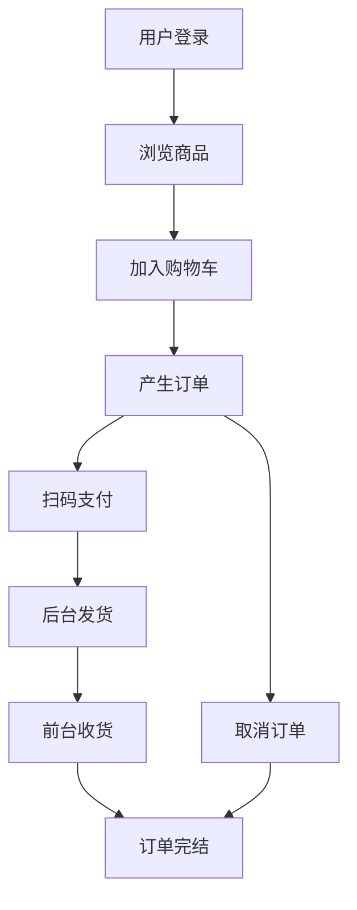

#### 1 Spring Boot

##### 1.1 优点

目前新的 java 项目基本都是采用 spring boot 去开发，这已经成为了 java 开发领域的一个事实标准，为什么会造成这种现象呢？当然是因为 spring boot 拥有诸多的优点

1. 简化项目配置

   在以往用 spring 开发时，虽然 spring 是个很好的框架，但是却需要编写大量的配置文件，其实每个 spring 项目编写的配置文件都是差不多的，这就导致了大量的重复性工作，降低了开发效率

   spring boot 就是致力于解决这个重复编写配置的问题，提高项目的开发效率，spring boot 是提倡约定大于配置的，只要按照 spring boot 的约定去做，对于一些约定俗成的重复配置就可以不用去单独配置了，spring boot 将大家的一些常用配置，比如端口、数据库、超时时间等等进行了默认配置，一般而言是没有必要去修改的，实在有这个需要再去修改，没有需要就直接使用默认的，省去了配置，很方便

2. 起步式依赖

   安装依赖时，只需要指明需要的某个依赖，这个依赖所需要的其他的依赖以及对应的依赖版本，我们不需要关心，spring boot 会自动为我们下载安装合适的依赖版本

3. 独立的 spring 项目

   在以往开发项目时，我们需要单独使用 tomcat 做容器，然后把项目打包成 war 包，最后把 war 包放到 tomcat 容器中去运行，但是如果使用 spring boot，spring boot 会内嵌一个 tomcat，可以直接运行项目，不再需要我们去单独启动 tomcat 和做环境配置，这给项目的运行部署带来了莫大的便利

4. 监控能力强

   自带强大的监控能力，只需少量配置，就能了解系统的运行情况

那我们说，spring boot 这么好，它是一个新框架吗，不是，看名称就能知道，它也是建立在 spring 框架的基础之上的，最大的进步是解决了 spring 开发繁琐的痛点

##### 1.2 版本

打开 [spring boot](https://spring.io/projects/spring-boot#learn) 的官网，会发现有 CURRENT、GA、SNAPSHOT 版本，CURRENT 是当前版本，GA 是稳定版本，SNAPSHOT 是快照版本，一般而言，选择 GA 版本就好，spring boot 2.0 版本的重要更新包括支持 http 2.0，jdk 要求最低 8 等等

#### 2 新建 spring boot 项目

##### 2.1 通过 idea 新建

spring boot 项目的新建可以通过 spring 官网，也可以通过 idea，一般我们都是通过 idea 去新建

打开 idea，不同版本的 idea 可能会有所不同，这里使用的是 2024 版

点击新建项目，选择生成器，选择 spring boot，依次填写项目名称、项目位置、git 仓库、开发语言（java）、项目类型（maven）、组名（反转的域名，用于唯一标识项目）、工件（通常为项目名称）、jdk、打包（jar 或 war）

> 使用 idea 2024 创建时发现只能选 java 17，原因是 spring boot 3.0 发布时，宣布 java 17将成为主流版本，默认不支持 8 了，可以把服务器 url 从 `start.spring.io` 改为阿里的 `start.aliyun.com`

点击下一步，选择 spring boot 版本为 2.6.13，勾选依赖项，找到 web  =>  spring web，然后点击创建，就成功创建了 spring boot 项目，项目会自动下载加载 maven 依赖，项目目录如下：

```text
│  pom.xml
├─.idea
└─src
    ├─main
    │  ├─java
    │  │  └─com
    │  │      └─example
    │  │          └─startboot
    │  │              │  StartBootApplication.java       
    │  └─resources
    │      │  application.properties
    │      └─static
    │              index.html      
    └─test
```

这是标准的 maven 项目的目录结构，`pom.xml` 是项目配置和 maven 依赖列表，`main/java` 存放 java 源代码，`main/resources` 存放其他资源和项目配置文件，`test` 是测试目录，一般用不到

##### 2.2 体验接口

先来复习一下 web 开发的三层结构，一般分为三层 Controller、Service、DAO

- Controller：负责对外提供接口，处理路由，参数校验
- Service：处理具体的业务逻辑
- DAO：直接和数据库交互

首先建立 Controller，在 java 目录下的包 `com.example.startboot` 下新建包 controller 再新建 controller 类 `ParaController`

```java
package com.example.startboot.controller;

import org.springframework.web.bind.annotation.GetMapping;
import org.springframework.web.bind.annotation.RestController;

@RestController
public class ParaController {

    @GetMapping("/firstrequest")
    public String firstRequest() {
        return "Hello Spring Boot!";
    }
}
```

这里用到了两个注解 `@RestController` 和 `@GetMapping`，分别解释一下

1. @RestController

   相当于两个注解的组合： `@Controller` + `@ResponseBody`

   - `@Controller`：标识该类为 Spring MVC 控制器
   - `@ResponseBody`：将方法返回值直接序列化为 HTTP 响应体（如 JSON/XML），而非视图跳转

   适用于构建前后端分离的 Web 服务，返回数据（如 JSON）而非 HTML 页面

2. @GetMapping

   相当于 `@RequestMapping(method = RequestMethod.GET)` 的简写，`@GetMapping` 是 Spring MVC 中的一个注解，用于将 **HTTP GET 请求** 映射到特定的控制器方法，专门用于简化 GET 请求的处理

定义好之后在主类 `StartBootApplication.java` 中启动项目

这时在浏览器中访问 `http://localhost:8080/firstrequest` 就能得到响应 `Hello Spring Boot!`

##### 2.3  接收参数

前面实现的 `ParaController` ，里面的路由路径是写死的，没有办法接收前端传递过来的参数，其实要接收 get 参数很简单，再加一个参数注解即可

```java
package com.example.startboot.controller;

import org.springframework.web.bind.annotation.GetMapping;
import org.springframework.web.bind.annotation.RequestParam;
import org.springframework.web.bind.annotation.RestController;

@RestController
public class ParaController {

    @GetMapping("/firstrequest")
    public String firstRequest() {
        return "Hello Spring Boot!";
    }

    @GetMapping("/para")
    public String requestPara(@RequestParam Integer num) {
        num = num + 1;
        return "reveived param: " + num;
    }
}
```

`@RequestParam`：声明参数注解，用于获取 param 参数

前端通过 url 地址传参`http://localhost:8080/para?num=10`

那么 post 请求又怎么做呢，当然也是有相关注解的：

```java
package com.example.startboot.controller;

import com.example.startboot.pojo.Student;
import org.springframework.web.bind.annotation.*;

@RestController
public class ParaController {

    @GetMapping("/firstrequest")
    public String firstRequest() {
        return "Hello Spring Boot!";
    }

    @GetMapping("/para")
    public String requestPara(@RequestParam Integer num) {
        num = num + 1;
        return "reveived param: " + num;
    }

    @PostMapping("/post")
    public String postRequest(@RequestBody Student student) {
        return "reveived body param: " + student;
    }
}
```

`@RequestBody`：表明接收的是 post 的 body 参数，一般前端传递过来的都是一个 json 对象

我们还需要建立一个 pojo 对象去接收 json 形式的参数

> 什么是 pojo 呢，pojo 就是 Plain Old Java Object 的缩写，普通 Java 对象，是指一个简单的 Java 类，这是与框架无关的普通类，只有私有的属性、公有的 Getter/Setter 和基本的构造方法，pojo 类不写业务逻辑，只负责对数据进行描述和存储
>
> 同一个 pojo 可以在不同场景使用：
>
> - **Web 层**：接收 HTTP 请求参数（如 `@RequestBody Student student`）
> - **Service 层**：作为业务方法的参数或返回值
> - **DAO 层**：与数据库表映射（如 JPA/Hibernate 的 `@Entity`）

新建 pojo 包，再新建 `Student` 的 pojo 类

> 注意，一定要写 Getter/Setter 和 无参/有参构造方法，可以通过 idea 快捷键 `alt + ins` 快速生成

```java
package com.example.startboot.pojo;

/**
 * 学生实体类
 */
public class Student {
    private Integer id;
    private String name;

    public Student() {
    }

    public Student(Integer id, String name) {
        this.id = id;
        this.name = name;
    }

    public Integer getId() {
        return id;
    }

    public void setId(Integer id) {
        this.id = id;
    }

    public String getName() {
        return name;
    }

    public void setName(String name) {
        this.name = name;
    }

    @Override
    public String toString() {
        return "Student{" +
                "id=" + id +
                ", name='" + name + '\'' +
                '}';
    }
}
```

这时打开 postman 或者 apifox 等模拟请求的软件，建立 post 请求，发送方式选择 body raw，content-type 设置为 `application/json`，填写 json，就会得到接口响应

```sh
地址：http://localhost:8080/post

请求：
{
    "id": 666,
    "name": "好学生"
}

响应：
reveived body param: Student{id=666, name='好学生'}
```

#### 3 配置文件

虽然 spring boot 配置很少，但是仍然是有配置的，在 spring boot 中有两种配置文件，一种是 properties 后缀的配置文件，另一种是 yml 后缀的配置文件，它们的主要区别在于书写风格上，作用是一模一样的

properties：

```properties
server.port=8080
```

yml:

```yaml
server:
	port: 8080
```

选择自己喜欢的风格即可，比如如下配置

```properties
server.port=8081  # 配置项目启动端口号
spring.application.name=first-spring-boot  # 配置项目名称
server.servlet.context-path=/first  # 配置统一路由 url 前缀
```

有时候我们有些参数不想写死在代码里，而是希望写在配置文件中，以方便后续的修改维护，这时可以利用自定义配置实现

我们先实现写死的情况，新建一个 `PropertiesController`

```java
package com.example.startboot.controller;

import org.springframework.web.bind.annotation.GetMapping;
import org.springframework.web.bind.annotation.RestController;

/**
 * 配置相关
 */
@RestController
public class PropertiesController {
    Integer grade = 5;
    Integer classNum = 9;

    @GetMapping("/gradeclass")
    public String gradeClass() {
        return "年级：" + grade + " 班级：" + classNum;
    }
}
```

此时 grade 和 classNum 是写死的，如果想再修改的话，就必须修改源代码

现在我们可以把它做成配置的，首先为需要配置的属性添加注解 `@Value`

```java
package com.example.startboot.controller;

import org.springframework.beans.factory.annotation.Value;
import org.springframework.web.bind.annotation.GetMapping;
import org.springframework.web.bind.annotation.RestController;

/**
 * 配置相关
 */
@RestController
public class PropertiesController {
    @Value("${school.grade}")
    Integer grade;
    @Value("${school.classNum}")
    Integer classNum;

    @GetMapping("/gradeclass")
    public String gradeClass() {
        return "年级：" + grade + " 班级：" + classNum;
    }
}

```

然后到配置文件 `application.properties` 中进行自定义配置

```properties
server.port=8080

school.grade=6
school.classNum=9
```

这样就能成功读取到配置，并赋值给配置属性了，后续想要修改可以直接修改配置文件

如果属性是静态的，则必须通过 setter 去注入

```java
package com.example.startboot.controller;

import org.springframework.beans.factory.annotation.Value;
import org.springframework.web.bind.annotation.GetMapping;
import org.springframework.web.bind.annotation.RestController;

/**
 * 配置相关
 */
@RestController
public class PropertiesController {
    @Value("${school.grade}")
    Integer grade;
    @Value("${school.classNum}")
    Integer classNum;
    @Value("${school.age}")
    static Integer age;

    @GetMapping("/gradeclass")
    public String gradeClass() {
        return "年级：" + grade + " 班级：" + classNum + " 年龄：" + age;
    }
}
```

如上，如果和普通成员变量一样进行注解，age 的打印将会是 null
下面编写 setter 函数，将注解移动到 setter 函数上，需要注意 setter 函数不能是静态函数

```java
package com.example.startboot.controller;

import org.springframework.beans.factory.annotation.Value;
import org.springframework.web.bind.annotation.GetMapping;
import org.springframework.web.bind.annotation.RestController;

/**
 * 配置相关
 */
@RestController
public class PropertiesController {
    @Value("${school.grade}")
    Integer grade;
    @Value("${school.classNum}")
    Integer classNum;

    static Integer age;

    @Value("${school.age}")
    public void setAge(Integer age) {
        PropertiesController.age = age;
    }

    @GetMapping("/gradeclass")
    public String gradeClass() {
        return "年级：" + grade + " 班级：" + classNum + " 年龄：" + age;
    }
}
```

这样就能成功打印 age 了

#### 4 业务开发

##### 4.1 连通数据库

接下来打通数据库链路，首先引入数据库的相关依赖，分别是 mybatis、mysql

```xml
 <dependency>
     <groupId>org.mybatis.spring.boot</groupId>
     <artifactId>mybatis-spring-boot-starter</artifactId>
     <version>2.1.1</version>
</dependency>
<dependency>
    <groupId>mysql</groupId>
    <artifactId>mysql-connector-java</artifactId>
</dependency>
```

然后编写配置文件 `application.properties` ，配置数据库连接相关的配置，指定驱动名称，配置数据库连接地址、数据库用户名、数据库密码

```properties
server.port=8080

school.grade=6
school.classNum=9
school.age=18

spring.datasource.driver-class-name=com.mysql.cj.jdbc.Driver
spring.datasource.url=jdbc:mysql://localhost:3306/interview?serverTimezone=UTC&useUnicode=true&characterEncoding=utf-8&useSSL=true
spring.datasource.username=root
spring.datasource.password=123456
```

##### 4.2 service & mapper

新建一个 service 包，新建 `StudentService` 类，添加 `@Service` 注解

```java
package com.example.startboot.service;

import com.example.startboot.pojo.Student;
import org.springframework.stereotype.Service;

@Service
public class StudentService {
    public Student getStudent(Integer id) {
        
    }
}
```

再新建一个 mapper 包，新建 `StudentMapper` 接口，添加 `@Mapper` 和 `@Repository` 注解，这样就能被 spring 框架识别到

> 为什么需要 mapper 呢？在传统的 jdbc 开发中，sql 语句和 java 业务代码是混合在一起的，如有修改会导致难以维护，且修改源码需要重新编译，而 mapper 的方式将 sql 与业务代码进行了解耦，修改 sql 只需调整注解或 XML 文件就行了，更方便维护，而且得益于 mapper 标准，还可以自动生成 sql，减少重复代码

```java
package com.example.startboot.mapper;

import com.example.startboot.pojo.Student;
import org.apache.ibatis.annotations.Mapper;
import org.apache.ibatis.annotations.Select;
import org.springframework.stereotype.Repository;

@Mapper
@Repository
public interface StudentMapper {
    @Select("SELECT * FROM students WHERE id = #{id}")
    Student findById(long id);
}
```

回到 `StudentService` ， 导入 mapper，使用 mapper 查询数据并在 service 方法中返回查询结果

```java
package com.example.startboot.service;

import com.example.startboot.mapper.StudentMapper;
import com.example.startboot.pojo.Student;
import org.springframework.beans.factory.annotation.Autowired;
import org.springframework.stereotype.Service;

@Service
public class StudentService {

    @Autowired
    StudentMapper studentMapper;

    public Student getStudent(Integer id) {
        return studentMapper.findById(id);
    }
}
```

最后在 controller 包下新建 `StudentController` 类

```java
package com.example.startboot.controller;

import com.example.startboot.service.StudentService;
import org.springframework.beans.factory.annotation.Autowired;
import org.springframework.web.bind.annotation.GetMapping;
import org.springframework.web.bind.annotation.RequestParam;
import org.springframework.web.bind.annotation.RestController;

@RestController
public class StudentController {
    @Autowired
    StudentService studentService;

    @GetMapping("/student")
    public String requestPara(@RequestParam Integer id) {
        return studentService.getStudent(id).toString();
    }
}
```

这时再访问 `http://localhost:8080/student?id=1` 就能得到返回结果 `Student{id=1, name='张三'}`

> `@Autowired` 是 Spring 框架的核心注解，用于 **依赖注入（DI, Dependency Injection）**。它的主要功能是让 Spring 容器自动将合适的 Bean 注入到目标位置（如字段、构造方法、Setter 方法等），无需手动通过 `new` 去创建对象

#### 5 电商项目初始化

有了前面的章节知识铺垫，从本章开始，我们将会使用 spring boot 创建一个电商项目，为什么选择电商呢，主要从以下几点考虑：

1. 项目规模比一般的项目规模大，比如相比图书管理系统而言，电商项目拥有更多业务场景
2. 电商项目涉及到的技术点是通用的，可以复制到别的项目
3. 电商项目的需求量大，网上商城是很多企业都会涉及到的业务

首先安装两个 idea 插件，有助于提高开发效率，分别是 maven helper 和 free mybatis tool，可以更好的管理 maven 和自动生成 mapper

##### 5.1 数据库设计

项目开发的第一步，自然是需求分析，而需求分析完成后，就开始数据库的设计，这是项目开发中最开始，也是最核心的一步，有关数据库设计的部分，可以参考数据库笔记，这里只展示设计结果，项目共有 6 张表，分别是：

用户表

```sql
CREATE TABLE `users` (
  `id` int(64) NOT NULL AUTO_INCREMENT COMMENT '用户id',
  `name` varchar(32) NOT NULL COMMENT '用户名',
  `password` varchar(50) NOT NULL COMMENT '用户密码，MD5加密',
  `signature` varchar(255) DEFAULT NULL COMMENT '用户签名',
  `role` int(4) NOT NULL DEFAULT '1' COMMENT '用户角色，1-普通用户，2-管理员',
  `create_time` timestamp NOT NULL DEFAULT CURRENT_TIMESTAMP COMMENT '创建时间',
  `update_time` timestamp NOT NULL DEFAULT CURRENT_TIMESTAMP ON UPDATE CURRENT_TIMESTAMP COMMENT '更新时间',
  PRIMARY KEY (`id`)
) ENGINE=InnoDB DEFAULT CHARSET=utf8mb4;
```

分类表

```sql
CREATE TABLE `categories` (
  `id` int(11) NOT NULL AUTO_INCREMENT COMMENT '分类id',
  `name` varchar(32) NOT NULL COMMENT '分类名称',
  `rank` int(11) NOT NULL COMMENT '分类等级',
  `order` int(11) NOT NULL COMMENT '分类排序',
  `parent_id` int(11) NOT NULL COMMENT '父分类id',
  `create_time` timestamp NOT NULL DEFAULT CURRENT_TIMESTAMP COMMENT '创建时间',
  `update_time` timestamp NOT NULL DEFAULT CURRENT_TIMESTAMP ON UPDATE CURRENT_TIMESTAMP COMMENT '更新时间',
  PRIMARY KEY (`id`)
) ENGINE=InnoDB DEFAULT CHARSET=utf8mb4;
```

商品表

```sql
CREATE TABLE `goods` (
  `id` int(64) NOT NULL AUTO_INCREMENT COMMENT '商品id',
  `name` varchar(100) NOT NULL COMMENT '商品名称',
  `image` varchar(500) NOT NULL COMMENT '商品图片',
  `detail` varchar(500) NOT NULL COMMENT '商品详情',
  `category_id` int(11) NOT NULL COMMENT '分类id',
  `price` int(11) NOT NULL COMMENT '价格，单位-分',
  `stock` int(11) NOT NULL COMMENT '库存数量',
  `status` int(6) NOT NULL COMMENT '商品状态，0-下架，1-上架',
  `create_time` timestamp NOT NULL DEFAULT CURRENT_TIMESTAMP COMMENT '创建时间',
  `update_time` timestamp NOT NULL DEFAULT CURRENT_TIMESTAMP ON UPDATE CURRENT_TIMESTAMP COMMENT '更新时间',
  PRIMARY KEY (`id`)
) ENGINE=InnoDB DEFAULT CHARSET=utf8mb4;
```

购物车表

```sql
CREATE TABLE `carts` (
  `id` int(64) NOT NULL AUTO_INCREMENT COMMENT '购物车id',
  `users_id` int(11) NOT NULL COMMENT '用户id',
  `goods_id` int(11) NOT NULL COMMENT '商品id',
  `quantity` int(11) NOT NULL COMMENT '商品数量',
  `selected` int(6) NOT NULL COMMENT '是否已勾选，0-未勾选，1-已勾选',
  `create_time` timestamp NOT NULL DEFAULT CURRENT_TIMESTAMP COMMENT '创建时间',
  `update_time` timestamp NOT NULL DEFAULT CURRENT_TIMESTAMP ON UPDATE CURRENT_TIMESTAMP COMMENT '更新时间',
  PRIMARY KEY (`id`)
) ENGINE=InnoDB DEFAULT CHARSET=utf8mb4;
```

订单表

```sql
CREATE TABLE `orders` (
  `id` int(64) NOT NULL AUTO_INCREMENT COMMENT '订单id',
  `users_id` int(11) NOT NULL COMMENT '用户id',
  `order_no` varchar(128) NOT NULL COMMENT '订单编号',
  `order_status` int(10) NOT NULL COMMENT '订单状态，0-已取消，10-未付款，20-已付款，30-已发货，40-已完成',
  `total_price` int(64) NOT NULL COMMENT '订单总价',
  `receiver_name` varchar(32) NOT NULL COMMENT '收货人姓名快照',
  `receiver_phone` varchar(32) NOT NULL COMMENT '收货人手机号快照',
  `receiver_address` varchar(128) NOT NULL COMMENT '收货人地址快照',
  `postage` int(11) NOT NULL DEFAULT '0' COMMENT '运费',
  `payment_type` int(4) NOT NULL DEFAULT '1' COMMENT '支付类型，1-在线支付',
  `delivery_time` timestamp NULL DEFAULT NULL COMMENT '发货时间',
  `pay_time` timestamp NULL DEFAULT NULL COMMENT '支付时间',
  `end_time` timestamp NULL DEFAULT NULL COMMENT '完成时间',
  `create_time` timestamp NOT NULL DEFAULT CURRENT_TIMESTAMP COMMENT '创建时间',
  `update_time` timestamp NOT NULL DEFAULT CURRENT_TIMESTAMP ON UPDATE CURRENT_TIMESTAMP COMMENT '更新时间',
  PRIMARY KEY (`id`)
) ENGINE=InnoDB DEFAULT CHARSET=utf8mb4;
```

订单物品表

```sql
CREATE TABLE `order_items` (
  `id` int(64) NOT NULL AUTO_INCREMENT COMMENT '订单物品id',
  `order_no` varchar(128) NOT NULL COMMENT '归属订单编号',
  `goods_id` int(11) NOT NULL COMMENT '商品id',
  `goods_name` varchar(100) NOT NULL COMMENT '商品名称',
  `goods_image` varchar(128) NOT NULL COMMENT '商品图片',
  `unit_price` int(11) NOT NULL COMMENT '商品单价快照',
  `quantity` int(11) NOT NULL COMMENT '商品数量',
  `total_price` int(11) NOT NULL COMMENT '商品总价快照',
  `create_time` timestamp NOT NULL DEFAULT CURRENT_TIMESTAMP COMMENT '创建时间',
  `update_time` timestamp NOT NULL DEFAULT CURRENT_TIMESTAMP ON UPDATE CURRENT_TIMESTAMP COMMENT '更新时间',
  PRIMARY KEY (`id`)
) ENGINE=InnoDB DEFAULT CHARSET=utf8mb4;
```

数据库的表设计不是一蹴而就的，可能一开始没有考虑得很全面，没关系，做项目的过程中，需要增删字段的话，直接增删就可以了

##### 5.2 初始化项目

项目初始化和前面的示例是一样的，完成项目的创建后，我们添加 `mybatis-generator-maven-plugin` 插件依赖

```xml
<plugin>
    <groupId>org.mybatis.generator</groupId>
    <artifactId>mybatis-generator-maven-plugin</artifactId>
    <version>1.3.7</version>
    <configuration>
        <verbose>true</verbose>
        <overwrite>true</overwrite>
    </configuration>
</plugin>
```

然后在 `resources` 资源目录，新建配置文件 `generatorConfig.xml`

> 配置数据库驱动的位置：`classPathEntry` 的 `location` 需要指定本地电脑上的 `mysql-connector-java` 的依赖 jar 包

```xml
<?xml version="1.0" encoding="UTF-8"?>
<!DOCTYPE generatorConfiguration
  PUBLIC "-//mybatis.org//DTD MyBatis Generator Configuration 1.0//EN"
  "http://mybatis.org/dtd/mybatis-generator-config_1_0.dtd">
<generatorConfiguration>
  <!-- 数据库驱动配置 -->
  <classPathEntry location="D:\Develop\apache-maven-3.2.5\local-repository\mysql\mysql-connector-java\8.0.27\mysql-connector-java-8.0.27.jar"/>
  <context id="MysqlTables" targetRuntime="MyBatis3">
    <property name="autoDelimitKeywords" value="true"/>
    <!-- 可以使用``包括字段名，避免字段名与sql保留字冲突报错 -->
    <property name="beginningDelimiter" value="`"/>
    <property name="endingDelimiter" value="`"/>
    <!-- 可选，旨在创建class时，对注释进行控制 -->
    <commentGenerator>
      <property name="suppressDate" value="true"/>
      <property name="suppressAllComments" value="true"/>
    </commentGenerator>
    <!-- 数据库链接地址账号密码 -->
    <jdbcConnection driverClass="com.mysql.cj.jdbc.Driver"
      connectionURL="jdbc:mysql://127.0.0.1:3306/boot_mall?useUnicode=true&amp;characterEncoding=UTF-8&amp;zeroDateTimeBehavior=convertToNull"
      userId="root"
      password="123456">
      <property name="nullCatalogMeansCurrent" value="true"/>
    </jdbcConnection>
    <!-- 可选，类型处理器，在数据库类型和java类型之间的转换控制 -->
    <javaTypeResolver>
      <property name="forceBigDecimals" value="false"/>
    </javaTypeResolver>
    <!-- 生成Model类存放位置 -->
    <javaModelGenerator targetPackage="com.mall.bootmall.model.pojo"
      targetProject="src/main/java">
      <!-- 是否允许子包，即targetPackage.schemaName.tableName -->
      <property name="enableSubPackages" value="true"/>
      <!-- 是否对类CHAR类型的列的数据进行trim操作 -->
      <property name="trimStrings" value="true"/>
      <!-- 建立的Model对象是否不可改变，即生成的Model对象不会有setter方法，只有构造方法 -->
      <property name="immutable" value="false"/>
    </javaModelGenerator>
    <!-- 生成mapper映射文件存放位置 -->
    <sqlMapGenerator targetPackage="mappers" targetProject="src/main/resources">
      <property name="enableSubPackages" value="true"/>
    </sqlMapGenerator>
    <!-- 生成mapper类存放位置 -->
    <javaClientGenerator type="XMLMAPPER" targetPackage="com.mall.bootmall.model.mapper"
      targetProject="src/main/java">
      <property name="enableSubPackages" value="true"/>
    </javaClientGenerator>
    <!-- 生成对应表及类名 -->
    <table tableName="users" domainObjectName="Users"
       enableCountByExample="false"
       enableUpdateByExample="false"
       enableDeleteByExample="false"
       enableSelectByExample="false"
       selectByExampleQueryId="false">
    </table>
    <table tableName="categories" domainObjectName="Categories"
       enableCountByExample="false"
       enableUpdateByExample="false"
       enableDeleteByExample="false"
       enableSelectByExample="false"
       selectByExampleQueryId="false">
    </table>
    <table tableName="goods" domainObjectName="Goods"
       enableCountByExample="false"
       enableUpdateByExample="false"
       enableDeleteByExample="false"
       enableSelectByExample="false"
       selectByExampleQueryId="false">
    </table>
    <table tableName="carts" domainObjectName="Carts"
       enableCountByExample="false"
       enableUpdateByExample="false"
       enableDeleteByExample="false"
       enableSelectByExample="false"
       selectByExampleQueryId="false">
    </table>
    <table tableName="orders" domainObjectName="Orders"
       enableCountByExample="false"
       enableUpdateByExample="false"
       enableDeleteByExample="false"
       enableSelectByExample="false"
       selectByExampleQueryId="false">
    </table>
    <table tableName="order_items" domainObjectName="OrderItems"
       enableCountByExample="false"
       enableUpdateByExample="false"
       enableDeleteByExample="false"
       enableSelectByExample="false"
       selectByExampleQueryId="false">
    </table>
  </context>
</generatorConfiguration>
```

使用 maven 重新加载依赖，然后打开 maven 的插件选项，找到 `mybatis-generator`，继续点开菜单，双击 `mybatis-generator:generate`，如果终端打印 `BUILD SUCCESS`，则 pojo 和 mapper 类生成成功，resources 目录下也成功生成了对应的 xml 文件，用于存放 sql 语句

>DAO 和 Mapper：
>
>- **DAO 和 Mapper 本质相同**，都是用来操作数据库的接口
>- **DAO 是通用术语，Mapper 是 MyBatis 的特定叫法**
>- **现代 MyBatis 项目推荐用 `Mapper`**，更贴合框架设计
>
>DAO 是标准名称，Mapper 是 MyBatis 的实现方式
>
>就像「手机」和「iPhone」的关系 —— iPhone 也是手机，但 iPhone 特指苹果的实现

##### 5.3 连通数据库

新建 controller 包，新建 `UserController` 类

```java
package com.mall.bootmall.controller;

import com.mall.bootmall.model.pojo.Users;
import org.springframework.stereotype.Controller;

@Controller
public class UserController {

    public Users personalPage() {}
}
```

可以看到我们首先定义了一个个人主页 controller，用于返回个人信息，返回值是 Users pojo 对象，根据后端三层开发理论，controller 需要调用 service 去实现业务逻辑，现在去新建 service，再新建 `UserService` 接口

> 这里注意，service 被新建成了接口，接口只定义需要实现的方法，调用方比如 controller 不关心具体实现，更灵活，实现了功能上的解耦

```java
package com.mall.bootmall.service;

import com.mall.bootmall.model.pojo.Users;
import org.springframework.stereotype.Service;

@Service
public interface UserService {
    Users getUserById(Integer id);
}
```

接下来在 service 包下新建 impl 包，用于存放 service 接口的实现类，新建 `UserServiceImpl` 实现类

```java
package com.mall.bootmall.service.impl;

import com.mall.bootmall.model.pojo.Users;
import com.mall.bootmall.service.UserService;

@Service
public class UserServiceImpl implements UserService {
    @Override
    public Users getUserById(Long id) {
        return null;
    }
}
```

有了 service 实现类，接下来就连接数据库，查询数据，我们前面实现的 mapper 类，这时就派上用场了，注入 mapper 的依赖，使用 mapper 查询数据

```java
package com.mall.bootmall.service.impl;

import com.mall.bootmall.model.mapper.UsersMapper;
import com.mall.bootmall.model.pojo.Users;
import com.mall.bootmall.service.UserService;
import org.springframework.beans.factory.annotation.Autowired;
import org.springframework.stereotype.Service;

@Service
public class UserServiceImpl implements UserService {

    @Autowired
    UsersMapper usersMapper;

    @Override
    public Users getUserById(Integer id) {
        return usersMapper.selectByPrimaryKey(id);
    }
}

```

> 这里 `@Autowired` 会报错：必须在有效 Spring Bean 中定义自动装配成员，依赖注入是 spring 的核心功能，但是被注入的对象必须由 spring 管理，不能是普通的对象，所以 UsersMapper 的写法是有问题的，没有声明成 spring 的 bean
>
> 给生成的 mapper 接口加上 `@Repository` 注解
>
> ```java
> package com.mall.bootmall.model.mapper;
> 
> import com.mall.bootmall.model.pojo.Users;
> import org.springframework.stereotype.Repository;
> 
> @Repository
> public interface UsersMapper {
>     int deleteByPrimaryKey(Integer id);
> 
>     int insert(Users record);
> 
>     int insertSelective(Users record);
> 
>     Users selectByPrimaryKey(Integer id);
> 
>     int updateByPrimaryKeySelective(Users record);
> 
>     int updateByPrimaryKey(Users record);
> }
> ```

在主应用文件中，添加 mapper 文件夹的 `@MapperScan` 注解，目的是告诉 mybatis mapper 接口文件在哪儿

```java
package com.mall.bootmall;

import org.mybatis.spring.annotation.MapperScan;
import org.springframework.boot.SpringApplication;
import org.springframework.boot.autoconfigure.SpringBootApplication;

@SpringBootApplication
@MapperScan(basePackages = "com.mall.bootmall.model.mapper")
public class BootMallApplication {

    public static void main(String[] args) {
        SpringApplication.run(BootMallApplication.class, args);
    }

}
```

此时还有配置工作需要完成，打开 `application.properties` 配置 mapper 目录，目的是告诉 mybatis mapper 接口对应的 xml 文件在哪儿

```properties
server.port=8080

spring.datasource.driver-class-name=com.mysql.cj.jdbc.Driver
spring.datasource.url=jdbc:mysql://localhost:3306/boot_mall?serverTimezone=UTC&useUnicode=true&characterEncoding=utf-8&useSSL=true
spring.datasource.username=root
spring.datasource.password=123456

mybatis.mapper-locations=classpath:mappers/*.xml
```

继续完善 `UserController` 类

```java
package com.mall.bootmall.controller;

import com.mall.bootmall.model.pojo.Users;
import com.mall.bootmall.service.UserService;
import org.springframework.beans.factory.annotation.Autowired;
import org.springframework.stereotype.Controller;
import org.springframework.web.bind.annotation.GetMapping;
import org.springframework.web.bind.annotation.ResponseBody;

@Controller
public class UserController {
    @Autowired
    UserService userService;

    @GetMapping("/test")
    @ResponseBody
    public Users personalPage() {
        return userService.getUserById(1);
    }
}
```

这时访问 `http://localhost:8080/test` 就能得到用户 id 为 1 的用户数据返回了：

```json
{
    "id": 1,
    "name": "张三",
    "password": "123456",
    "signature": "你好",
    "role": 1,
    "createTime": "2025-04-03T11:24:07.000+00:00",
    "updateTime": "2025-04-03T11:24:07.000+00:00"
}
```

##### 5.4 log4j2 日志

日志是项目中必不可少的关键部分，系统一旦发生问题，我们需要借助日志去排查问题，也可以通过日志去监控系统的运行状态，日志级别从高到低有 error、warn、info、debug、trace 等级别

- **error：**系统已经发生了错误，需要人工去干预修复的级别
- **warn：**一般较少使用
- **info：**用于记录系统运行状态，以便后续排查问题，比如记录用户的请求
- **debug：**开发阶段常用
- **trace：**繁杂的日志，比如框架日志，普通开发一般也用不到

可见我们常用的就 3 种级别：error、info、debug

首先我们需要排除自带的 logback 依赖，来到 `pom.xml`，找到 `spring-boot-starter-web` 依赖，添加排除项排除 `spring-boot-starter-logging`

```xml
<dependency>
    <groupId>org.springframework.boot</groupId>
    <artifactId>spring-boot-starter-web</artifactId>
    <exclusions>
        <exclusion>
            <groupId>org.springframework.boot</groupId>
            <artifactId>spring-boot-starter-logging</artifactId>
        </exclusion>
    </exclusions>
</dependency>
```

这时重新启动项目，会发现之前打印的 info 级别的日志都不见了，我们添加 log4j2 的日志依赖：

```xml
<dependency>
    <groupId>org.springframework.boot</groupId>
    <artifactId>spring-boot-starter-log4j2</artifactId>
</dependency>
```

重新加载 maven 依赖，下面进行日志的配置，在 `resources` 目录下新建 `log4j2.xml` 日志配置文件

```xml
<?xml version="1.0" encoding="UTF-8"?>
<Configuration status="fatal">
  <Properties>
    <Property name="baseDir" value="${sys:user.home}/logs"/>
  </Properties>

  <Appenders>
    <Console name="Console" target="SYSTEM_OUT">
      <!--控制台只输出level及以上级别的信息（onMatch），其他的直接拒绝（onMismatch） -->
      <ThresholdFilter level="info" onMatch="ACCEPT" onMismatch="DENY"/>
      <PatternLayout
        pattern="[%d{MM:dd HH:mm:ss.SSS}] [%level] [%logger{36}] - %msg%n"/>
    </Console>

    <!--debug级别日志文件输出-->
    <RollingFile name="debug_appender" fileName="${baseDir}/debug.log"
      filePattern="${baseDir}/debug_%i.log.%d{yyyy-MM-dd}">
      <!-- 过滤器 -->
      <Filters>
        <!-- 限制日志级别在debug及以上在info以下 -->
        <ThresholdFilter level="debug"/>
        <ThresholdFilter level="info" onMatch="DENY" onMismatch="NEUTRAL"/>
      </Filters>
      <!-- 日志格式 -->
      <PatternLayout pattern="[%d{HH:mm:ss:SSS}] [%p] - %l - %m%n"/>
      <!-- 策略 -->
      <Policies>
        <!-- 每隔一天转存 -->
        <TimeBasedTriggeringPolicy interval="1" modulate="true"/>
        <!-- 文件大小 -->
        <SizeBasedTriggeringPolicy size="100 MB"/>
      </Policies>
    </RollingFile>

    <!-- info级别日志文件输出 -->
    <RollingFile name="info_appender" fileName="${baseDir}/info.log"
      filePattern="${baseDir}/info_%i.log.%d{yyyy-MM-dd}">
      <!-- 过滤器 -->
      <Filters>
        <!-- 限制日志级别在info及以上在error以下 -->
        <ThresholdFilter level="info"/>
        <ThresholdFilter level="error" onMatch="DENY" onMismatch="NEUTRAL"/>
      </Filters>
      <!-- 日志格式 -->
      <PatternLayout pattern="[%d{HH:mm:ss:SSS}] [%p] - %l - %m%n"/>
      <!-- 策略 -->
      <Policies>
        <!-- 每隔一天转存 -->
        <TimeBasedTriggeringPolicy interval="1" modulate="true"/>
        <!-- 文件大小 -->
        <SizeBasedTriggeringPolicy size="100 MB"/>
      </Policies>
    </RollingFile>

    <!-- error级别日志文件输出 -->
    <RollingFile name="error_appender" fileName="${baseDir}/error.log"
      filePattern="${baseDir}/error_%i.log.%d{yyyy-MM-dd}">
      <!-- 过滤器 -->
      <Filters>
        <!-- 限制日志级别在error及以上 -->
        <ThresholdFilter level="error"/>
      </Filters>
      <!-- 日志格式 -->
      <PatternLayout pattern="[%d{HH:mm:ss:SSS}] [%p] - %l - %m%n"/>
      <Policies>
        <!-- 每隔一天转存 -->
        <TimeBasedTriggeringPolicy interval="1" modulate="true"/>
        <!-- 文件大小 -->
        <SizeBasedTriggeringPolicy size="100 MB"/>
      </Policies>
    </RollingFile>
  </Appenders>
  <Loggers>
    <Root level="debug">
      <AppenderRef ref="Console"/>
      <AppenderRef ref="debug_appender"/>
      <AppenderRef ref="info_appender"/>
      <AppenderRef ref="error_appender"/>
    </Root>
  </Loggers>
</Configuration>
```

这时重新运行项目，项目就会重新输出 info 级别日志了，打开 c 盘下的用户文件夹，会生成一个 logs 文件夹，里面存放了项目日志文件，如有需要，将来可打开日志文件用于排查项目问题

#### 6 用户模块

##### 6.1 封装统一返回对象

一般前后端会约定一个通用的返回对象格式，这样有利于前端封装请求接口，后端也能统一规范返回标准

首先成功和错误的状态码有很多，每次都自己去写，麻烦且容易出错，这里也是统一封装状态码成枚举值，直接调用枚举值，方便易维护，新建 `exception` 包，新建一个新的枚举类 `ExceptionEnum`

```java
package com.mall.bootmall.exception;

/**
 * 异常枚举
 */
public enum ExceptionEnum {
    NEED_USER_NAME(10001, "用户名不能为空");

    Integer code;
    String msg;

    ExceptionEnum(Integer code, String msg) {
        this.code = code;
        this.msg = msg;
    }

    public Integer getCode() {
        return code;
    }

    public void setCode(Integer code) {
        this.code = code;
    }

    public String getMsg() {
        return msg;
    }

    public void setMsg(String msg) {
        this.msg = msg;
    }
}
```

然后新建 common 包，这个包用于存放一些公共的封装，新建 `ApiRestResponse` 类

```java
package com.mall.bootmall.common;

import com.mall.bootmall.exception.ExceptionEnum;

/**
 * 统一返回对象
 */
public class ApiRestResponse<T> {
    private Integer code;
    private String msg;
    private T data;
    private static final int OK_CODE = 200;
    private static final String OK_MSG = "SUCCESS";

    public ApiRestResponse(Integer code, String msg, T data) {
        this.code = code;
        this.msg = msg;
        this.data = data;
    }

    public ApiRestResponse(Integer code, String msg) {
        this.code = code;
        this.msg = msg;
    }

    /**
     * 默认请求成功
     */
    public ApiRestResponse() {
        this(OK_CODE, OK_MSG);
    }

    /**
     * 静态成功方法
     * @return 成功响应对象
     * @param <T>
     */
    public static <T> ApiRestResponse<T> success() {
        return new ApiRestResponse<>();
    }

    /**
     * 重载的静态成功方法
     * @param result 处理结果
     * @return 包含处理结果的成功响应对象
     * @param <T>
     */
    public static <T> ApiRestResponse<T> success(T result) {
        ApiRestResponse<T> response = new ApiRestResponse<T>();
        response.setData(result);
        return response;
    }

    public static <T> ApiRestResponse<T> error(ExceptionEnum ex) {
        return new ApiRestResponse<>(ex.getCode(), ex.getMsg());
    }

    public Integer getCode() {
        return code;
    }

    public void setCode(Integer code) {
        this.code = code;
    }

    public String getMsg() {
        return msg;
    }

    public void setMsg(String msg) {
        this.msg = msg;
    }

    public T getData() {
        return data;
    }

    public void setData(T data) {
        this.data = data;
    }

    @Override
    public String toString() {
        return "ApiRestResponse{" +
                "code=" + code +
                ", msg='" + msg + '\'' +
                ", data=" + data +
                '}';
    }
}
```

##### 6.2 注册接口

###### 6.2.1 controller 校验参数

在 `UserController` 中新建注册方法 `register`：

```java
package com.mall.bootmall.controller;

import ...

@Controller
public class UserController {
    @Autowired
    UserService userService;

    @GetMapping("/test")
    @ResponseBody
    public Users personalPage() {
        return userService.getUserById(1);
    }

    @PostMapping("/register")
    @ResponseBody
    public ApiRestResponse register(@RequestParam("userName") String userName, @RequestParam("password") String password) {
        if (!StringUtils.hasText(userName)) {
            return ApiRestResponse.error(ExceptionEnum.NEED_USER_NAME);
        }
        if (!StringUtils.hasText(password)) {
            return ApiRestResponse.error(ExceptionEnum.NEED_PASSWORD);
        }
        if (password.length() < 6) {
            return ApiRestResponse.error(ExceptionEnum.PASSWORD_TOO_SHORT);
        }

    }
}
```

在注册方法中对用户名和密码做了非空校验和返回错误响应

###### 6.2.2 service 注册业务

接着我们来到 `UserService` 接口，定义注册方法，实现注册业务

```java
package com.mall.bootmall.service;

import com.mall.bootmall.model.pojo.Users;
import org.springframework.stereotype.Service;

@Service
public interface UserService {

    Users getUserById(Integer id);

    void register(String userName, String password);
}
```

然后来到实现类 `UserServiceImpl`，对注册方法进行实现，首先实现重名校验，注册时用户名自然是不允许和数据库中的用户名重复的，但是此时 mapper 类中没有检查重名的 sql 查询，因此我们得自己去实现一个查询重名的方法，来到 `UsersMapper` 接口，定义查询重名的方法 `selectByUserName`，作用是根据用户名去查询用户，如果查到了，就证明重名了

```java
package com.mall.bootmall.model.mapper;

import com.mall.bootmall.model.pojo.Users;
import org.springframework.stereotype.Repository;

@Repository
public interface UsersMapper {
    int deleteByPrimaryKey(Integer id);

    int insert(Users record);

    int insertSelective(Users record);

    Users selectByPrimaryKey(Integer id);

    int updateByPrimaryKeySelective(Users record);

    int updateByPrimaryKey(Users record);

    Users selectByUserName(String userName);
}
```

定义好 mapper 接口后来到 mapper 接口对应的 xml 文件，实现 sql 语句

```xml
<select id="selectByUserName" parameterType="java.lang.String" resultMap="BaseResultMap">
    select
    <include refid="Base_Column_List" />
    from users
    where name = #{username, jdbcType=VARCHAR}
</select>
```

> `<include refid="Base_Column_List" />` 是自己自定义的列名列表，将常用列名做了封装，自定义如下：
>
> ```xml
> <sql id="Base_Column_List">
>     id, `name`, `password`, signature, `role`, create_time, update_time
> </sql>
> ```
>
> 好处是省去了重复书写列名的麻烦，以及提高了后续的可维护性

回到 service 的实现类 `UserServiceImpl`，调用 mapper 实现查询：

```java
package com.mall.bootmall.service.impl;

import ...

@Service
public class UserServiceImpl implements UserService {

    @Autowired
    UsersMapper usersMapper;

    @Override
    public Users getUserById(Integer id) {
        return usersMapper.selectByPrimaryKey(id);
    }

    @Override
    public void register(String userName, String password) {
        Users user = usersMapper.selectByUserName(userName);
        if (user != null) {

        }
    }
}
```

这里如果查到了重名，我们想的肯定是把异常返回给前端，但是这里是 service 层，不能把 controller 要做的事抢过来做，所以这里我们可以定义自定义异常，通过自定义异常将异常返回给 controller

###### 6.2.3 自定义异常处理

在 exception 包下定义自定义异常 `CustomException` 类，自定义异常类继承了 `Exception` 类，通过传入异常枚举值，构建自定义异常

```java
package com.mall.bootmall.exception;

public class CustomException extends Exception {
    private final Integer code;
    private final String msg;

    public CustomException(Integer code, String msg) {
        this.code = code;
        this.msg = msg;
    }

    public CustomException(ExceptionEnum exceptionEnum) {
        this(exceptionEnum.getCode(), exceptionEnum.getMsg());
    }

    public Integer getCode() {
        return code;
    }

    public String getMsg() {
        return msg;
    }
}
```

返回 `UserServiceImpl` 实现类，使用自定义异常抛出错误

```java
package com.mall.bootmall.service.impl;

import ...

@Service
public class UserServiceImpl implements UserService {

    @Autowired
    UsersMapper usersMapper;

    @Override
    public Users getUserById(Integer id) {
        return usersMapper.selectByPrimaryKey(id);
    }

    @Override
    public void register(String userName, String password) throws CustomException {
        Users user = usersMapper.selectByUserName(userName);
        if (user != null) {
            throw new CustomException(ExceptionEnum.USER_NAME_EXISTED);
        }
    }
}
```

service 接口需要同步抛出异常

```java
package com.mall.bootmall.service;

import ...

@Service
public interface UserService {

    Users getUserById(Integer id);

    void register(String userName, String password) throws CustomException;
}
```

返回 `UserController` 中，继续编写注册方法 `register`：

```java
package com.mall.bootmall.controller;

import ...

@Controller
public class UserController {
    @Autowired
    UserService userService;

    @GetMapping("/test")
    @ResponseBody
    public Users personalPage() {
        return userService.getUserById(1);
    }

    @PostMapping("/register")
    @ResponseBody
    public ApiRestResponse register(@RequestParam("userName") String userName, @RequestParam("password") String password) throws CustomException {
        if (!StringUtils.hasText(userName)) {
            return ApiRestResponse.error(ExceptionEnum.NEED_USER_NAME);
        }
        if (!StringUtils.hasText(password)) {
            return ApiRestResponse.error(ExceptionEnum.NEED_PASSWORD);
        }
        if (password.length() < 6) {
            return ApiRestResponse.error(ExceptionEnum.PASSWORD_TOO_SHORT);
        }
        userService.register(userName, password);
        return ApiRestResponse.success();
    }
}
```

这里同步抛出了自定义异常，调用 service 的 `register` 方法，如果发生自定义异常中的错误，则会抛出自定义异常，如果没有发生错误，则正常返回成功的响应

###### 6.2.4 全局异常处理

接下来对注册接口进行测试：

- 正常注册 - 成功
- 不填用户名 - 返回自定义错误响应
- 不填密码 - 返回自定义错误响应
- 密码小于6位 - 返回自定义错误响应

这些测试都没有问题，但是当填写重复用户名，就会触发 service 中的自定义异常抛出，结果是：

前台获得返回的系统异常 500：

```json
{
    "timestamp": "2025-04-03T19:05:39.169+00:00",
    "status": 500,
    "error": "Internal Server Error",
    "path": "/register"
}
```

后台控制台报错：

```sh
com.mall.bootmall.exception.CustomException: 用户名已存在
```

虽然这确实如我们所望，触发了自定义异常，但是前台获得的返回响应是不友好的，直接暴露系统错误给前台对于系统安全来说也是隐患，为了避免这种情况发生，我们需要对抛出的自定义异常进行全局处理，在 exception 包下新建 `GlobalExceptionHandler` 类，并且引入日志，记录错误日志到日志文件中

```java
package com.mall.bootmall.exception;

import com.mall.bootmall.common.ApiRestResponse;
import org.slf4j.Logger;
import org.slf4j.LoggerFactory;
import org.springframework.web.bind.annotation.ControllerAdvice;
import org.springframework.web.bind.annotation.ExceptionHandler;
import org.springframework.web.bind.annotation.ResponseBody;

@ControllerAdvice
public class GlobalExceptionHandler {
    private final Logger log = LoggerFactory.getLogger(GlobalExceptionHandler.class);

    @ExceptionHandler(Exception.class)
    @ResponseBody
    public Object handleException(Exception ex){
        log.error("Default Exception", ex);
        return ApiRestResponse.error(ExceptionEnum.SYSTEM_ERROR);
    }

    @ExceptionHandler(CustomException.class)
    @ResponseBody
    public Object handleCustomException(CustomException ex){
        log.error("Custom Exception", ex);
        return ApiRestResponse.error(ex.getCode(), ex.getMessage());
    }
}
```

> `@ControllerAdvice` 和 `@ExceptionHandler` 是 Spring MVC 中用于全局异常处理的两个核心注解，它们能优雅地捕获并处理控制器层抛出的异常，避免向客户端暴露不友好的错误信息
>
> `@ControllerAdvice`：定义全局异常处理类，可拦截所有 `@Controller` 或 `@RestController` 抛出的异常
>
> `@ExceptionHandler`：标注具体的异常处理方法，指定要捕获的异常类型

##### 6.3 MD5 加密

到目前为止，用户的密码是以明文的形式存储到数据库中的，这给黑客攻击数据库获取密码带来了机会，需要杜绝此种情况的发生，因此我们需要引入 MD5 对密码进行加密存储，这样数据库里保存的就是加密后的密码，而且就算拿到了加密密码，也是无法直接使用加密密码登录的

这里使用三方库实现 MD5 加密，新建包 `util` ，再建一个工具类 `MD5Utils`

```java
package com.mall.bootmall.util;

import com.mall.bootmall.common.Constant;
import org.apache.tomcat.util.codec.binary.Base64;

import java.security.MessageDigest;
import java.security.NoSuchAlgorithmException;

public class MD5Utils {
    public static String getMD5(String str) throws NoSuchAlgorithmException {
         MessageDigest md5 = MessageDigest.getInstance("MD5");
         return Base64.encodeBase64String(md5.digest(str.getBytes()));
    }
}
```

MD5是一种哈希算法，无法通过加密后的字符串反推原始字符串，但也存在安全性隐患，比如可以用彩虹表破解，所谓彩虹表就是把常见的密码的 MD5 值给存起来形成一张对照表，这样虽然无法反推密码，但是可以查表得到常见密码的哈希值，为了防止这种破解方式，我们可以自定义一个无规则的字符串常量，叫做盐值，生成 MD5 哈希值时，加上这个盐值进行加密，这样即使有了彩虹表，也很难反推原始密码

```java
package com.mall.bootmall.util;

import com.mall.bootmall.common.Constant;
import org.apache.tomcat.util.codec.binary.Base64;

import java.security.MessageDigest;
import java.security.NoSuchAlgorithmException;

public class MD5Utils {
    public static String getMD5(String str) throws NoSuchAlgorithmException {
         MessageDigest md5 = MessageDigest.getInstance("MD5");
         return Base64.encodeBase64String(md5.digest((str + Constant.SALT).getBytes()));
    }
}
```

写好 MD5 加密工具类后，在用户服务类 `UserServiceImpl`  中存储注册密码时，调用该工具类对密码进行加密即可

```java
package com.mall.bootmall.service.impl;

import com.mall.bootmall.exception.CustomException;
import com.mall.bootmall.exception.ExceptionEnum;
import com.mall.bootmall.model.mapper.UsersMapper;
import com.mall.bootmall.model.pojo.Users;
import com.mall.bootmall.service.UserService;
import com.mall.bootmall.util.MD5Utils;
import org.springframework.beans.factory.annotation.Autowired;
import org.springframework.stereotype.Service;

import java.security.NoSuchAlgorithmException;

@Service
public class UserServiceImpl implements UserService {

    @Autowired
    UsersMapper usersMapper;

    @Override
    public Users getUserById(Integer id) {
        return usersMapper.selectByPrimaryKey(id);
    }

    @Override
    public void register(String userName, String password) throws CustomException {
        Users dbUser = usersMapper.selectByUserName(userName);
        if (dbUser != null) {
            throw new CustomException(ExceptionEnum.USER_NAME_EXISTED);
        }
        Users user = new Users();
        user.setName(userName);
        try {
            user.setPassword(MD5Utils.getMD5(password));
        } catch (NoSuchAlgorithmException e) {
            throw new RuntimeException(e);
        }
        int count = usersMapper.insertSelective(user);
        if (count != 1) {
            throw new CustomException(ExceptionEnum.INSERT_FAILED);
        }
    }
}
```

重新访问注册接口，新注册的用户的密码就是加密后的密码了，因为盐值固定，相同密码输入，生成的哈希值是一样的

##### 6.4 登录接口

登录是一种状态，用户登录后，登录状态会保存一段时间，所以服务端需要将用户的登录状态给保存下来，这里先使用 session 去保存用户的登录状态，后续会换成 token

登录接口的开发流程和注册接口一样，从上往下写，先写 controller，我们先来到 `UserController`

```java
package com.mall.bootmall.controller;

import com.mall.bootmall.common.ApiRestResponse;
import com.mall.bootmall.exception.CustomException;
import com.mall.bootmall.exception.ExceptionEnum;
import com.mall.bootmall.model.pojo.Users;
import com.mall.bootmall.service.UserService;
import org.springframework.beans.factory.annotation.Autowired;
import org.springframework.stereotype.Controller;
import org.springframework.util.StringUtils;
import org.springframework.web.bind.annotation.GetMapping;
import org.springframework.web.bind.annotation.PostMapping;
import org.springframework.web.bind.annotation.RequestParam;
import org.springframework.web.bind.annotation.ResponseBody;

import javax.servlet.http.HttpSession;

@Controller
public class UserController {
    @Autowired
    UserService userService;

    /**
     * 登录接口
     */
    @PostMapping("/login")
    @ResponseBody
    public ApiRestResponse login(
            @RequestParam("userName") String userName,
            @RequestParam("password") String password,
            HttpSession session
    ) throws CustomException {
        if (!StringUtils.hasText(userName)) {
            return ApiRestResponse.error(ExceptionEnum.NEED_USER_NAME);
        }
        if (!StringUtils.hasText(password)) {
            return ApiRestResponse.error(ExceptionEnum.NEED_PASSWORD);
        }
        if (password.length() < 6) {
            return ApiRestResponse.error(ExceptionEnum.PASSWORD_TOO_SHORT);
        }
        userService.login(userName, password);
        return ApiRestResponse.success();
    }
}
```

登录方法与注册方法一样，不同的是会多一个 session 参数，这就是用来存储登录状态的，具体的登录逻辑是放在业务层 `UserService` 中的，目前还没有 `login` 方法，我们来到 `UserService` 中定义登录方法，然后在 `UserServiceImpl` 中实现登录方法

> 这里也可以不用先在 `UserService` 中定义接口登录方法，而是直接在实现类中编写登录方法，编写完成后添加 `@Override` 注解，此时 idea 会报错，解决报错，idea 会自动在 `UserService` 中生成接口方法，这样也是很方便的

```java
package com.mall.bootmall.service.impl;

import com.mall.bootmall.exception.CustomException;
import com.mall.bootmall.exception.ExceptionEnum;
import com.mall.bootmall.model.mapper.UsersMapper;
import com.mall.bootmall.model.pojo.Users;
import com.mall.bootmall.service.UserService;
import com.mall.bootmall.util.MD5Utils;
import org.springframework.beans.factory.annotation.Autowired;
import org.springframework.stereotype.Service;

import java.security.NoSuchAlgorithmException;

@Service
public class UserServiceImpl implements UserService {

    @Autowired
    UsersMapper usersMapper;

    @Override
    public Users login(String userName, String password) throws CustomException {
        String md5Password = null;
        try {
            md5Password = MD5Utils.getMD5(password);
        } catch (NoSuchAlgorithmException e) {
            throw new RuntimeException(e);
        }
        return null;
    }
}
```

首先获取输入密码的 MD5 哈希值，然后用输入的用户名和哈希值去数据库中查找对应用户，找到说明登录成功，否则登录失败，此时还没有通过用户名和密码查找用户的方法，我们去 `UsersMapper` 中定义查找方法 `selectByLogin`，传入用户名和密码

> mybatis 的 mapper 中参数大于两个时，需要加 `@Param` 注解

```java
package com.mall.bootmall.model.mapper;

import com.mall.bootmall.model.pojo.Users;
import org.apache.ibatis.annotations.Param;
import org.springframework.stereotype.Repository;

@Repository
public interface UsersMapper {
    int deleteByPrimaryKey(Integer id);

    int insert(Users record);

    int insertSelective(Users record);

    Users selectByPrimaryKey(Integer id);

    int updateByPrimaryKeySelective(Users record);

    int updateByPrimaryKey(Users record);

    Users selectByUserName(String userName);

    Users selectByLogin(@Param("userName") String userName, @Param("password") String password);
}
```

然后去 mapper 对应的 xml 文件 `UsersMapper.xml` 中实现 `selectByLogin` 方法

>parameterType 改为 map，表示不止一个参数

```xml
<select id="selectByUserName" parameterType="java.lang.String" resultMap="BaseResultMap">
    select
    <include refid="Base_Column_List" />
    from users
    where name = #{username, jdbcType=VARCHAR}
</select>
<select id="selectByLogin" parameterType="map" resultMap="BaseResultMap">
    select
    <include refid="Base_Column_List" />
    from users
    where name = #{username, jdbcType=VARCHAR}
    and password = #{password, jdbcType=VARCHAR}
</select>
```

定义好了数据库查找方法，我们返回 `UserServiceImpl` 继续实现登录业务，通过用户名和输入的加密密码查找用户，没有找到即报错登录失败，找到就返回找到的用户，返回到 controller 层处理成功返回

```java
package com.mall.bootmall.service.impl;

import com.mall.bootmall.exception.CustomException;
import com.mall.bootmall.exception.ExceptionEnum;
import com.mall.bootmall.model.mapper.UsersMapper;
import com.mall.bootmall.model.pojo.Users;
import com.mall.bootmall.service.UserService;
import com.mall.bootmall.util.MD5Utils;
import org.springframework.beans.factory.annotation.Autowired;
import org.springframework.stereotype.Service;

import java.security.NoSuchAlgorithmException;

@Service
public class UserServiceImpl implements UserService {

    @Autowired
    UsersMapper usersMapper;

    @Override
    public Users login(String userName, String password) throws CustomException {
        String md5Password = null;
        try {
            md5Password = MD5Utils.getMD5(password);
        } catch (NoSuchAlgorithmException e) {
            throw new RuntimeException(e);
        }
        Users user = usersMapper.selectByLogin(userName, md5Password);
        if (user == null) {
            throw new CustomException(ExceptionEnum.WRONG_PASSWORD);
        }
        return user;
    }
}
```

回到 `UserController`，完成登录接口的开发，在返回用户信息到前台之前，先把密码重置为 null，这样更安全，然后将用户信息存到 session 里面，最后将用户信息保存到成功响应的 data 里面返回给前台

```java
package com.mall.bootmall.controller;

import ...;

@Controller
public class UserController {
    @Autowired
    UserService userService;

    /**
     * 登录接口
     */
    @PostMapping("/login")
    @ResponseBody
    public ApiRestResponse login(
            @RequestParam("userName") String userName,
            @RequestParam("password") String password,
            HttpSession session
    ) throws CustomException {
        if (!StringUtils.hasText(userName)) {
            return ApiRestResponse.error(ExceptionEnum.NEED_USER_NAME);
        }
        if (!StringUtils.hasText(password)) {
            return ApiRestResponse.error(ExceptionEnum.NEED_PASSWORD);
        }
        if (password.length() < 6) {
            return ApiRestResponse.error(ExceptionEnum.PASSWORD_TOO_SHORT);
        }
        Users user = userService.login(userName, password);
        user.setPassword(null);
        session.setAttribute(Constant.SESSION_USER, user);
        return ApiRestResponse.success(user);
    }
}
```

##### 6.5 更新用户

继续在 `UserController` 中实现更新用户个人信息的方法，首先从 session 中获取已登录用户信息，然后通过已登录用户的id去查找对应的用户，部分更新对应的字段

```java
package com.mall.bootmall.controller;

import ...;

    /**
     * 更新用户
     */
    @PostMapping("/user/update")
    @ResponseBody
    public ApiRestResponse updateUserInfo(HttpSession session, @RequestParam String signature) throws CustomException {
        Users loggedUser = (Users) session.getAttribute(Constant.SESSION_USER);
        if (loggedUser == null) {
            throw new CustomException(ExceptionEnum.NOT_LOGGED);
        }
        Users user = new Users();
        user.setId(loggedUser.getId());
        user.setSignature(signature);
        userService.updateUserInfo(user);
        return ApiRestResponse.success();
    }
}
```

`UserServiceImpl` 中实现的更新方法，直接调用 mapper 方法更新对应用户

```java
package com.mall.bootmall.service.impl;

import ...;

@Service
public class UserServiceImpl implements UserService {

    @Autowired
    UsersMapper usersMapper;

    @Override
    public void updateUserInfo(Users user) throws CustomException {
        int updateCount = usersMapper.updateByPrimaryKeySelective(user);
        if (updateCount != 1) {
            throw new CustomException(ExceptionEnum.UPDATE_FAILED);
        }
    }
}
```

##### 6.6 退出登录

要做退出登录，首先需要知道登录的原理，我们目前做的是使用 session 保存登录信息，所以只需要将 session 中的登录信息清除，就可以实现退出登录了

```java
package com.mall.bootmall.controller;

import ...;

@Controller
public class UserController {
    @Autowired
    UserService userService;
    
    /**
     * 退出登录
     */
    @PostMapping("/logout")
    @ResponseBody
    public ApiRestResponse logout(HttpSession session) throws CustomException {
        session.removeAttribute(Constant.SESSION_USER);
        return ApiRestResponse.success();
    }
}
```

##### 6.7 管理员登录

管理员登录和用户登录本质是一样的，所以可以复制登录方法调整一下，变成管理员登录方法，来到 `UserController`，编写管理员登录方法，获取登录用户信息，判断是否是管理员，是就执行正常登录逻辑，否则报错提醒非管理员无权限

> 编码技巧，快速打出 if 语句，表达式后输入 `.if` 可出现 if 语句提示

```java
package com.mall.bootmall.controller;

import ...;

import javax.servlet.http.HttpSession;

@Controller
public class UserController {
    @Autowired
    UserService userService;

    /**
     * 管理员登录
     */
    @PostMapping("/adminLogin")
    @ResponseBody
    public ApiRestResponse adminLogin(
            @RequestParam("userName") String userName,
            @RequestParam("password") String password,
            HttpSession session
    ) throws CustomException {
        if (!StringUtils.hasText(userName)) {
            return ApiRestResponse.error(ExceptionEnum.NEED_USER_NAME);
        }
        if (!StringUtils.hasText(password)) {
            return ApiRestResponse.error(ExceptionEnum.NEED_PASSWORD);
        }
        if (password.length() < 6) {
            return ApiRestResponse.error(ExceptionEnum.PASSWORD_TOO_SHORT);
        }
        Users user = userService.login(userName, password);
        if (userService.checkIsAdmin(user)) {
            user.setPassword(null);
            session.setAttribute(Constant.SESSION_USER, user);
            return ApiRestResponse.success(user);
        } else {
            return ApiRestResponse.error(ExceptionEnum.NOT_ADMIN);
        }
    }
}
```

`UserServiceImpl` 实现判断管理员方法

```java
package com.mall.bootmall.service.impl;

import ...;

@Service
public class UserServiceImpl implements UserService {

    @Autowired
    UsersMapper usersMapper;

    @Override
    public boolean checkIsAdmin(Users user) throws CustomException {
        return user.getRole().equals(2);
    }
}
```

至此，用户模块编写完成

#### 7 商品分类模块

商品众多，需要进行归类，因此开发商品分类模块，对于这个模块，主要要实现两个功能：

1. 商品分类的 crud
2. 商品分类的父子目录、递归查找

##### 7.1 添加分类

首先开发后台的添加分类接口，来到 `controller` 包，新建 `CategoryController` 类，因为是后台接口，所以要接收 session 参数，用于判断登录身份

```java
package com.mall.bootmall.controller;

import com.mall.bootmall.common.ApiRestResponse;
import org.springframework.stereotype.Controller;

import javax.servlet.http.HttpSession;

@Controller
public class CategoryController {
    public ApiRestResponse addCategory(HttpSession session) {}
}
```

添加分类必然要接收分类的各个参数，这些参数我们已经知道会有四五个左右，是比较多的，直接写在函数参数里面进行接收，会导致代码混乱难以维护，因此我们需要封装一个专门的请求类，用来封装请求参数，使得参数列表变得简洁，来到 `model` 包下新建 `request` 包，然后新建 `AddCategoryReq` 类

```java
package com.mall.bootmall.model.request;

public class AddCategoryReq {
    private String name;
    private Integer rank;
    private Integer order;
    private Integer parentId;
    
    // getter and setter
}
```

> 到这里你也许会问，这个请求类和 pojo 类如此相似，都是对应数据库中表的字段，为什么不直接使用 pojo 类，而是要新建一个请求类呢？好问题，下面进行回答：
>
> 1. 首先，类的指责应该单一，不应该同时负责好几件事情，pojo 类的职责就是和数据库表的字段一一对应，只负责作为映射数据库表的实体而存在；
> 2. 其次是基于系统安全考虑，假设直接用 pojo 类，那么会有好几个字段是多余的，比如 id、createTime、updateTime 等，假如黑客攻击系统，传入了这些参数，那么由于 sql 是自动生成的，就会执行一些不必要的查询，为系统带来安全隐患
>
> 基于上诉两点原因，需要另外封装单独的请求类

回到 `CategoryController` 类，继续编写，这里对参数进行了校验，然后获取登录用户判断用户权限是否是管理员，如果是管理员则执行添加分类的业务

```java
package com.mall.bootmall.controller;

import com.mall.bootmall.common.ApiRestResponse;
import com.mall.bootmall.common.Constant;
import com.mall.bootmall.exception.CustomException;
import com.mall.bootmall.exception.ExceptionEnum;
import com.mall.bootmall.model.pojo.Users;
import com.mall.bootmall.model.request.AddCategoryReq;
import com.mall.bootmall.service.UserService;
import org.springframework.beans.factory.annotation.Autowired;
import org.springframework.stereotype.Controller;
import org.springframework.web.bind.annotation.PostMapping;
import org.springframework.web.bind.annotation.ResponseBody;

import javax.servlet.http.HttpSession;

@Controller
public class CategoryController {
    @Autowired
    UserService userService;

    @PostMapping("/admin/category/add")
    @ResponseBody
    public ApiRestResponse addCategory(HttpSession session, AddCategoryReq addCategoryReq) throws CustomException {
        if (
            addCategoryReq.getName() == null ||
            addCategoryReq.getRank() == null ||
            addCategoryReq.getOrder() == null ||
            addCategoryReq.getParentId() == null
        ) {
            return ApiRestResponse.error(ExceptionEnum.NEED_PARA);
        }
        Users loggedUser = (Users) session.getAttribute(Constant.SESSION_USER);
        if (loggedUser == null) {
            return ApiRestResponse.error(ExceptionEnum.NEED_LOGGED);
        }
        boolean isAdmin = userService.checkIsAdmin(loggedUser);
        if (isAdmin) {
            
        } else {
            return ApiRestResponse.error(ExceptionEnum.NEED_ADMIN);
        }
    }
}
```

此时还没有添加分类的业务，我们来到 `service` 包下，新建 `CategoryService` 接口和其实现类 `CategoryServiceImpl`

```java
package com.mall.bootmall.service.impl;

import com.mall.bootmall.model.mapper.CategoriesMapper;
import com.mall.bootmall.model.pojo.Categories;
import com.mall.bootmall.model.request.AddCategoryReq;
import com.mall.bootmall.service.CategoryService;
import org.springframework.beans.BeanUtils;
import org.springframework.beans.factory.annotation.Autowired;
import org.springframework.stereotype.Service;

@Service
public class CategoryServiceImpl implements CategoryService {

    @Autowired
    CategoriesMapper categoriesMapper;

    public void add(AddCategoryReq addCategoryReq) {
        Categories category = new Categories();
        BeanUtils.copyProperties(addCategoryReq, category);
    }
}
```

> 这里有个快速 copy 属性的办法是 `BeanUtils.copyProperties` ，这是 spring 提供的工具类，将源对象的属性拷贝到目标对象里面

既然是添加分类，那肯定不允许添加重名的分类，所以这里需要利用 `CategoriesMapper` 去查找是否有同名的分类，此时还没有这个 sql，需要自己去编写，来到 `CategoriesMapper`

```java
package com.mall.bootmall.model.mapper;

import com.mall.bootmall.model.pojo.Categories;
import org.springframework.stereotype.Repository;

@Repository
public interface CategoriesMapper {
    int deleteByPrimaryKey(Integer id);

    int insert(Categories record);

    int insertSelective(Categories record);

    Categories selectByPrimaryKey(Integer id);

    int updateByPrimaryKeySelective(Categories record);

    int updateByPrimaryKey(Categories record);

    Categories selectByName(String name);
}
```

来到对应的 xml 实现

```xml
<select id="selectByName" parameterType="java.lang.String" resultMap="BaseResultMap">
    select
    <include refid="Base_Column_List" />
    from categories
    where name = #{name,jdbcType=INTEGER}
</select>
```

回到 `CategoryServiceImpl`，继续实现查询重名分类业务，如果没有重名，则执行新增操作

```java
package com.mall.bootmall.service.impl;

import com.mall.bootmall.exception.CustomException;
import com.mall.bootmall.exception.ExceptionEnum;
import com.mall.bootmall.model.mapper.CategoriesMapper;
import com.mall.bootmall.model.pojo.Categories;
import com.mall.bootmall.model.request.AddCategoryReq;
import com.mall.bootmall.service.CategoryService;
import org.springframework.beans.BeanUtils;
import org.springframework.beans.factory.annotation.Autowired;
import org.springframework.stereotype.Service;

@Service
public class CategoryServiceImpl implements CategoryService {

    @Autowired
    CategoriesMapper categoriesMapper;

    @Override
    public void add(AddCategoryReq addCategoryReq) {
        Categories category = new Categories();
        BeanUtils.copyProperties(addCategoryReq, category);
        Categories dbCategory = categoriesMapper.selectByName(addCategoryReq.getName());
        if (dbCategory != null) {
            throw new CustomException(ExceptionEnum.NAME_EXISTED);
        }
        int count = categoriesMapper.insertSelective(category);
        if (count == 0) {
            throw new CustomException(ExceptionEnum.INSERT_FAILED);
        }
    }
}
```

回到 `CategoryController` 中调用 `categoryService` 实现添加分类的业务

> 因为这次的传参和以往一个一个的传不一样，这次传的是一个对象，因此需要在参数上增加 `@RequestBody` 注解，表明传递的参数是一个对象，需要从 http 请求的请求体中获取参数

```java
package com.mall.bootmall.controller;

import com.mall.bootmall.common.ApiRestResponse;
import com.mall.bootmall.common.Constant;
import com.mall.bootmall.exception.CustomException;
import com.mall.bootmall.exception.ExceptionEnum;
import com.mall.bootmall.model.pojo.Users;
import com.mall.bootmall.model.request.AddCategoryReq;
import com.mall.bootmall.service.CategoryService;
import com.mall.bootmall.service.UserService;
import org.springframework.beans.factory.annotation.Autowired;
import org.springframework.stereotype.Controller;
import org.springframework.web.bind.annotation.PostMapping;
import org.springframework.web.bind.annotation.RequestBody;
import org.springframework.web.bind.annotation.ResponseBody;

import javax.servlet.http.HttpSession;

@Controller
public class CategoryController {
    @Autowired
    UserService userService;
    @Autowired
    CategoryService categoryService;

    @PostMapping("/admin/category/add")
    @ResponseBody
    public ApiRestResponse addCategory(HttpSession session, @RequestBody AddCategoryReq addCategoryReq) throws CustomException {
        if (
            addCategoryReq.getName() == null ||
            addCategoryReq.getRank() == null ||
            addCategoryReq.getOrder() == null ||
            addCategoryReq.getParentId() == null
        ) {
            return ApiRestResponse.error(ExceptionEnum.NEED_PARA);
        }
        Users loggedUser = (Users) session.getAttribute(Constant.SESSION_USER);
        if (loggedUser == null) {
            return ApiRestResponse.error(ExceptionEnum.NEED_LOGGED);
        }
        boolean isAdmin = userService.checkIsAdmin(loggedUser);
        if (isAdmin) {
            categoryService.add(addCategoryReq);
            return ApiRestResponse.success();
        } else {
            return ApiRestResponse.error(ExceptionEnum.NEED_ADMIN);
        }
    }
}
```

到这里就完成了添加分类的编写

##### 7.2 参数校验

在开发添加分类接口时，我们对请求类 `AddCategoryReq` 的参数进行了校验，这里只有 4 个参数还好，万一参数多了，岂不是很麻烦，我们需要简单的校验方法，恰好 spring 为我们提供了不少方便使用的注解用于参数校验

|       注解        |    作用    |
| :---------------: | :--------: |
|     `@Valid`      |  需要验证  |
|    `@NotNull`     |    非空    |
|   `@Max(value)`   |   最大值   |
| `@Size(min, max)` | 字符串长度 |

`@Valid` 注解是加到 controller 函数的参数上的，表面哪些参数需要开启参数校验，直接以这里的 `AddCategoryReq` 参数校验为例

> 这里使用注解时报错：无法解析符号 'Valid'，本来这个注解是 `import javax.validation.Valid;` 里面的，网上查找资料发现和 boot 版本有关，需要单独添加依赖，来到 `pom.xml`
>
> ```xml
> <dependency>
>     <groupId>org.springframework.boot</groupId>
>     <artifactId>spring-boot-starter-validation</artifactId>
> </dependency>
> ```
>
> 重新添加 `@Valid` 注解，成功导入了 `import javax.validation.Valid;`

```java
package com.mall.bootmall.controller;

import ...;

import javax.servlet.http.HttpSession;
import javax.validation.Valid;

@Controller
public class CategoryController {
    @Autowired
    UserService userService;
    @Autowired
    CategoryService categoryService;

    @PostMapping("/admin/category/add")
    @ResponseBody
    public ApiRestResponse addCategory(HttpSession session, @Valid @RequestBody AddCategoryReq addCategoryReq) throws CustomException {
        Users loggedUser = (Users) session.getAttribute(Constant.SESSION_USER);
        if (loggedUser == null) {
            return ApiRestResponse.error(ExceptionEnum.NEED_LOGGED);
        }
        boolean isAdmin = userService.checkIsAdmin(loggedUser);
        if (isAdmin) {
            categoryService.add(addCategoryReq);
            return ApiRestResponse.success();
        } else {
            return ApiRestResponse.error(ExceptionEnum.NEED_ADMIN);
        }
    }
}
```

我们对 `AddCategoryReq` 开启了参数校验，来到 `AddCategoryReq`，对请求属性进行校验

>这里也能看出另一点单独封装请求类而不是直接使用 pojo 类的好处，可以方便地对参数进行校验，而不是破坏 pojo 类的纯粹，而且不同的请求类可以封装不同的校验方法，比如添加和更新时的校验方法肯定是不一样的，封装不同的请求类就显得更加灵活了

```java
package com.mall.bootmall.model.request;

import javax.validation.constraints.Max;
import javax.validation.constraints.Min;
import javax.validation.constraints.NotNull;
import javax.validation.constraints.Size;

public class AddCategoryReq {
    @Size(min=2, max=6)
    @NotNull
    private String name;

    @Min(3)
    @NotNull
    private Integer rank;

    @NotNull
    private Integer order;

    @NotNull
    private Integer parentId;

    // getter and setter
}
```

重启后端，验证是否校验成功，输入分类名为一个字的分类，控制台报错：

```sh
default message [个数必须在2和6之间]
```

返回的接口报错：

```json
{
    "code": 20000,
    "msg": "系统异常",
    "data": null
}
```

说明校验成功了，但是这样对前台来说是不友好的，一旦校验失败，返回统统都是 “系统异常”，我们需要将控制台信息返回给前台，来到我们之前编写的统一异常处理类 `GlobalExceptionHandler`，编写一个新的专门用于处理参数校验异常的方法 `handleParamsNotValidException`

```java
package com.mall.bootmall.exception;

import com.mall.bootmall.common.ApiRestResponse;
import org.slf4j.Logger;
import org.slf4j.LoggerFactory;
import org.springframework.validation.BindingResult;
import org.springframework.validation.ObjectError;
import org.springframework.web.bind.MethodArgumentNotValidException;
import org.springframework.web.bind.annotation.ControllerAdvice;
import org.springframework.web.bind.annotation.ExceptionHandler;
import org.springframework.web.bind.annotation.ResponseBody;

import java.util.ArrayList;
import java.util.List;

@ControllerAdvice
public class GlobalExceptionHandler {
    private final Logger log = LoggerFactory.getLogger(GlobalExceptionHandler.class);

    @ExceptionHandler(MethodArgumentNotValidException.class)
    @ResponseBody
    public Object handleParamsNotValidException(MethodArgumentNotValidException ex){
        log.error("MethodArgumentNotValidException: ", ex);
        // 处理参数校验异常信息
        BindingResult bindingResult = ex.getBindingResult();
        List<String> list = new ArrayList<>();
        if (bindingResult.hasErrors()) {
            List<ObjectError> allErrors = bindingResult.getAllErrors();
            for (ObjectError objectError : allErrors) {
                String defaultMessage = objectError.getDefaultMessage();
                list.add(defaultMessage);
            }
        }
        if (list.isEmpty()) {
            return ApiRestResponse.error(ExceptionEnum.WRONG_PARA);
        }
        return ApiRestResponse.error(ExceptionEnum.WRONG_PARA.getCode(), String.join("; ", list));
    }
}
```

然后再去测试，发现可以给出控制台的友好提示了

```json
{
    "code": 10011,
    "msg": "个数必须在2和6之间; 最大不能超过3; 不能为null",
    "data": null
}
```

可是这样的提示还是不够完美，比如 **不能为null**，具体是哪一个参数不能为 null 呢？我们需要自己去编写更加友好的提示，来到请求封装类 `AddCategoryReq`

```java
package com.mall.bootmall.model.request;

import javax.validation.constraints.Max;
import javax.validation.constraints.NotNull;
import javax.validation.constraints.Size;

public class AddCategoryReq {
    @Size(min=2, max=6)
    @NotNull(message = "name不能为null")
    private String name;

    @Max(3)
    @NotNull(message = "rank不能为null")
    private Integer rank;

    @NotNull(message = "order不能为null")
    private Integer order;

    @NotNull(message = "parentId不能为null")
    private Integer parentId;
    
    // getter and setter
}
```

这样在没有传递相应参数的时候，就会显示是哪个参数不能为 null 了

但是这样还是很麻烦，虽然消息提示友好了，但是需要在每次添加参数校验时都去 **手动编写** 一次提示消息，有没有更方便的方法呢？有的，肯定有的，我们可以继续改造参数校验异常的方法 `handleParamsNotValidException`，通过获取参数字段名称，自动添加到错误消息上面的方式，去统一处理参数校验异常，这样就不用每次都去手动填写了，而且前台能知道是哪个参数传递出了问题

```java
package com.mall.bootmall.exception;

import com.mall.bootmall.common.ApiRestResponse;
import org.slf4j.Logger;
import org.slf4j.LoggerFactory;
import org.springframework.validation.BindingResult;
import org.springframework.validation.FieldError;
import org.springframework.validation.ObjectError;
import org.springframework.web.bind.MethodArgumentNotValidException;
import org.springframework.web.bind.annotation.ControllerAdvice;
import org.springframework.web.bind.annotation.ExceptionHandler;
import org.springframework.web.bind.annotation.ResponseBody;

import java.util.ArrayList;
import java.util.List;

@ControllerAdvice
public class GlobalExceptionHandler {
    private final Logger log = LoggerFactory.getLogger(GlobalExceptionHandler.class);

    @ExceptionHandler(MethodArgumentNotValidException.class)
    @ResponseBody
    public Object handleParamsNotValidException(MethodArgumentNotValidException ex){
        log.error("MethodArgumentNotValidException: ", ex);
        // 处理参数校验异常信息
        BindingResult bindingResult = ex.getBindingResult();
        List<String> list = new ArrayList<>();
        if (bindingResult.hasErrors()) {
            List<ObjectError> allErrors = bindingResult.getAllErrors();
            for (ObjectError objectError : allErrors) {
                // 获取参数字段名称
                String fieldName = (objectError instanceof FieldError)
                    ? ((FieldError) objectError).getField()
                    : "";
                String errorMessage = fieldName + objectError.getDefaultMessage();
                list.add(errorMessage);
            }
        }
        if (list.isEmpty()) {
            return ApiRestResponse.error(ExceptionEnum.WRONG_PARA);
        }
        return ApiRestResponse.error(ExceptionEnum.WRONG_PARA.getCode(), String.join("; ", list));
    }
}
```

然后把之前手动添加的错误提示 message 删掉，现在再次测试，返回的响应如下，显然，提示非常友好

```json
{
    "code": 10011,
    "msg": "name个数必须在2和6之间; parentId不能为null; rank最大不能超过3",
    "data": null
}
```

##### 7.3 swagger 文档

###### 7.3.1 SpringFox

当 controller 中的方法比较多的时候，我们会给这些方法添加注释，说明方法的用途，以及参数和返回值，但是这样添加的注释只有后端人员可以看到，前端是看不到的，有没有办法通过这些注释，自动生成一份 api 文档给前端，解放后端的生产力呢，答案是肯定的，我们可以利用 swagger 生成

首先在 `pom.xml` 中引入 swagger 的依赖

```xml
<dependency>
    <groupId>io.springfox</groupId>
    <artifactId>springfox-swagger2</artifactId>
    <version>2.9.2</version>
</dependency>
<dependency>
    <groupId>io.springfox</groupId>
    <artifactId>springfox-swagger-ui</artifactId>
    <version>2.9.2</version>
</dependency>
```

在主程序入口类 `BootMallApplication` 上加上 `@EnableSwagger2` 注解，表示开启 swagger 生成文档的功能

```java
package com.mall.bootmall;

import org.mybatis.spring.annotation.MapperScan;
import org.springframework.boot.SpringApplication;
import org.springframework.boot.autoconfigure.SpringBootApplication;
import springfox.documentation.swagger2.annotations.EnableSwagger2;

@SpringBootApplication
@MapperScan(basePackages = "com.mall.bootmall.model.mapper")
@EnableSwagger2
public class BootMallApplication {

    public static void main(String[] args) {
        SpringApplication.run(BootMallApplication.class, args);
    }

}
```

接下来在项目根目录新建一个 `config` 包，专门用于存放配置文件，新建 `SpringFoxConfig` 配置类

```java
package com.mall.bootmall.config;

import org.springframework.context.annotation.Bean;
import org.springframework.context.annotation.Configuration;
import org.springframework.web.context.request.WebRequest;
import springfox.documentation.builders.ApiInfoBuilder;
import springfox.documentation.builders.PathSelectors;
import springfox.documentation.builders.RequestHandlerSelectors;
import springfox.documentation.service.ApiInfo;
import springfox.documentation.spi.DocumentationType;
import springfox.documentation.spring.web.plugins.Docket;

import javax.servlet.ServletContext;
import javax.servlet.http.HttpServletRequest;
import javax.servlet.http.HttpServletResponse;

/**
 * swagger 配置
 */
@Configuration
public class SpringFoxConfig {

    // http://localhost:8083/swagger-ui.html
    @Bean
    public Docket api() {
        return new Docket(DocumentationType.SWAGGER_2)
            .apiInfo(apiInfo())
            .select()
            // 指定扫描的 controller 包
            .apis(RequestHandlerSelectors.basePackage("com.mall.bootmall.controller"))
            .paths(PathSelectors.any())
            .build();
    }

    private ApiInfo apiInfo() {
        return new ApiInfoBuilder()
            .title("boot商城api文档")
            .description("boot商城系统接口文档")
            .termsOfServiceUrl("")
            .build();
    }
}
```

然后新建 `WebMvcConfig` 配置类，用于配置地址映射

```java
package com.mall.bootmall.config;

import org.springframework.context.annotation.Configuration;
import org.springframework.web.servlet.config.annotation.ResourceHandlerRegistry;
import org.springframework.web.servlet.config.annotation.WebMvcConfigurer;

/**
 * swagger 地址映射
 */
@Configuration
public class WebMvcConfig implements WebMvcConfigurer {
    @Override
    public void addResourceHandlers(ResourceHandlerRegistry registry) {
        registry.addResourceHandler("swagger-ui.html")
            .addResourceLocations("classpath:/META-INF/resources/");
        registry.addResourceHandler("/webjars/**")
            .addResourceLocations("classpath:/META-INF/resources/webjars/");
    }
}
```

到这里就配置完成了，如果想给 controller 方法生成文档，只需要添加 swagger 的注解 `@ApiOperation` 即可，给整个 controller 生成文档，则添加 `@Api` 注解

```java
package com.mall.bootmall.controller;

import ...;
import io.swagger.annotations.Api;
import io.swagger.annotations.ApiOperation;

import javax.servlet.http.HttpSession;
import javax.validation.Valid;

@Api(tags = "分类模块")
@Controller
public class CategoryController {
    @Autowired
    UserService userService;
    @Autowired
    CategoryService categoryService;

    @ApiOperation("添加分类")
    @PostMapping("/admin/category/add")
    @ResponseBody
    public ApiRestResponse addCategory(HttpSession session, @Valid @RequestBody AddCategoryReq addCategoryReq) throws CustomException {
        Users loggedUser = (Users) session.getAttribute(Constant.SESSION_USER);
        if (loggedUser == null) {
            return ApiRestResponse.error(ExceptionEnum.NEED_LOGGED);
        }
        boolean isAdmin = userService.checkIsAdmin(loggedUser);
        if (isAdmin) {
            categoryService.add(addCategoryReq);
            return ApiRestResponse.success();
        } else {
            return ApiRestResponse.error(ExceptionEnum.NEED_ADMIN);
        }
    }
}
```

现在就可以访问 [http://localhost:8080/swagger-ui.html](http://localhost:8080/swagger-ui.html) 获取生成的 api 文档了

>由于我使用的 spring boot 版本是 2.6.13
>
>```xml
><spring-boot.version>2.6.13</spring-boot.version>
>```
>
>而 swagger 的版本是 2.9.2，存在兼容问题，因此报了空指针错误：
>
>```sh
>Failed to start bean 'documentationPluginsBootstrapper'; nested exception is java.lang.NullPointerException
>```
>
>这是因为 Springfox 假设 [Spring MVC](https://so.csdn.net/so/search?q=Spring MVC&spm=1001.2101.3001.7020) 的路径匹配策略是 ant-path-matcher，而 Spring Boot 2.6 以上版本的默认匹配策略是 path-pattern-matcher，这就造成了上面的报错，所以我们需要手动修正路径匹配策略，打开配置文件 `application.properties` 添加修正配置
>
>```properties
>spring.mvc.pathmatch.matching-strategy=ant_path_matcher
>```
>
>重新启动，报错消失

###### 7.3.2 SpringDoc

SpringFox 虽好，但是其从 2020年7月14号 起就不再更新了，不支持 spring boot 3，而且如上所诉，spring boot 2.6 版本之后还存在兼容性问题，所以业界都在不断的转向另一个库 SpringDoc，新项目一般就使用 SpringDoc，下面将项目的文档生成转成 SpringDoc

首先去除原本的 SpringFox

- 删除 `pom.xml` 依赖
- 删除主程序入口文件的 swagger 注解
- 删除配置类
- 删除 controller 类中的 swagger 注解
- 删除 `application.properties` 中的修正配置

重新运行项目，发现没有报错，不能访问 swagger 文档了，则去除成功

然后开始集成 SpringDoc，SpringDoc 的集成比 SpringFox 简单，在 `pom.xml` 中引入依赖

```xml
<dependency>
    <groupId>org.springdoc</groupId>
    <artifactId>springdoc-openapi-ui</artifactId>
    <version>1.7.0</version>
</dependency>
```

然后恭喜成功集成了 SpringDoc，直接访问 `http://localhost:8080/swagger-ui/index.html` 访问 swagger 文档吧，然后我们发现新版的 SpringDoc 的页面 UI 更好看，然后接口参数也比较智能，没有多余的系统参数显示，非常棒

你也许会问，这也太简单了，不需要配置文件，但是我们说默认可以直接生成使用，只不过也是有缺点的，默认的文档是全英文的，而且由于没有自定义配置，文档会显示所有的 controller，因此，我们还是可以新建配置文件去做一些自定义配置的，就在 config 包下新建 `SpringDocConfig` 配置文件，描述了文档标题和文档描述以及文档版本

```java
package com.mall.bootmall.config;

import io.swagger.v3.oas.models.OpenAPI;
import io.swagger.v3.oas.models.info.Info;
import org.springframework.context.annotation.Bean;
import org.springframework.context.annotation.Configuration;

@Configuration
public class SpringDocConfig {
    @Bean
    public OpenAPI myOpenAPI() {
        return new OpenAPI()
            .info(new Info()
                .title("boot商城api文档")
                .description("boot商城系统接口文档")
                .version("v1.0.0")
            );
    }
}
```

SpringDoc 还可以配置文档分组，比如你有两个种类的 controller，一类是以 `/api` 为前缀，一类以 `/admin` 为前缀，就可以将其配置为两个分组，很多时候我们只有一个分组，所以不需要下面的配置，这里做个记录，修改配置文件

```java
package com.mall.bootmall.config;

import io.swagger.v3.oas.models.OpenAPI;
import io.swagger.v3.oas.models.info.Info;
import org.springdoc.core.GroupedOpenApi;
import org.springframework.context.annotation.Bean;
import org.springframework.context.annotation.Configuration;

@Configuration
public class SpringDocConfig {
    @Bean
    public OpenAPI myOpenAPI() {
        return new OpenAPI()
            .info(new Info()
                .title("boot商城api文档")
                .description("boot商城系统接口文档")
                .version("v1.0.0")
            );
    }

    @Bean
    public GroupedOpenApi publicApi() {
        return GroupedOpenApi.builder()
            .group("api")
            .pathsToMatch("/api/**")
            .build();
    }

    @Bean
    public GroupedOpenApi adminApi() {
        return GroupedOpenApi.builder()
            .group("admin")
            .pathsToMatch("/admin/**")
            .build();
    }
}
```

配置完成后，文档页面的顶部就会出现 **Select a definition** 的分类选择框，提供给用户选择分类 api 了

想要文档看起来更加完善，了解注解是很有必要的，下面是 SpringDoc 的注解分类：

|     注解      |                       作用                        |
| :-----------: | :-----------------------------------------------: |
|     @Tag      |  用在 controller 类上，描述此 controller 的信息   |
|  @Operation   |  用在 controller 的方法上，描述此 api 方法的信息  |
|  @Parameter   |   用在 controller 的方法的参数上，描述参数信息    |
|  @Parameters  |                       同上                        |
|    @Schema    | 用于 Entity，以及 Entity 的属性上，比如 dao、pojo |
| @ApiResponse  |         用在 controller 的方法的返回值上          |
| @ApiResponses |                       同上                        |
|    @Hidden    |           用在各种地方，用于隐藏其 api            |

通过例子来了解如何使用注解，在 controller 上使用：

```java
package com.mall.bootmall.controller;

import ...;
import io.swagger.v3.oas.annotations.Operation;
import io.swagger.v3.oas.annotations.tags.Tag;

import javax.servlet.http.HttpSession;
import javax.validation.Valid;

@Tag(name = "分类模块", description = "商品分类模块")
@Controller
public class CategoryController {
    @Autowired
    UserService userService;
    @Autowired
    CategoryService categoryService;

    @Operation(summary = "添加分类", description = "添加商品分类")
    @PostMapping("/admin/category/add")
    @ResponseBody
    public ApiRestResponse addCategory(HttpSession session, @Valid @RequestBody AddCategoryReq addCategoryReq) throws CustomException {
        Users loggedUser = (Users) session.getAttribute(Constant.SESSION_USER);
        if (loggedUser == null) {
            return ApiRestResponse.error(ExceptionEnum.NEED_LOGGED);
        }
        boolean isAdmin = userService.checkIsAdmin(loggedUser);
        if (isAdmin) {
            categoryService.add(addCategoryReq);
            return ApiRestResponse.success();
        } else {
            return ApiRestResponse.error(ExceptionEnum.NEED_ADMIN);
        }
    }
}
```

在请求参数类上使用：

```java
package com.mall.bootmall.model.request;

import io.swagger.v3.oas.annotations.media.Schema;

import javax.validation.constraints.Max;
import javax.validation.constraints.NotNull;
import javax.validation.constraints.Size;

@Schema(description = "添加分类参数")
public class AddCategoryReq {

    @Schema(description = "分类名称", example = "水果")
    @Size(min=2, max=6)
    @NotNull
    private String name;

    @Schema(description = "分类等级", example = "1")
    @Max(3)
    @NotNull
    private Integer rank;

    @Schema(description = "分类排序", example = "1")
    @NotNull
    private Integer order;

    @Schema(description = "分类父id", example = "1")
    @NotNull
    private Integer parentId;

    // getter and setter
}
```

目前 swagger 文档生成的 api 文档默认扫描了所有的 controller，可以配置只扫描指定路径下的 controller，打开 `application.properties` 进行配置，还能配置文档的 schema 的展开层次，defaultModelsExpandDepth 指定展开 schema，defaultModelExpandDepth 指定展开 schema 的属性

```properties
springdoc.packages-to-scan=com.mall.bootmall.controller
springdoc.swagger-ui.defaultModelsExpandDepth=-1
springdoc.swagger-ui.defaultModelExpandDepth=10
```

##### 7.4 统一校验用户身份

在之前的编码中，相信你也发现了，只要是需要校验后台接口操作权限，也就是校验用户是不是管理员的时候，我们都需要单独重复去调用封装好的判断管理员身份的函数，虽然可以实现功能，但是未免过于麻烦，假设后台接口有很多，那岂不是得调用很多遍判断函数，而且这样做，后期维护起来也是灾难，需要修改几十处判断的地方，因此对管理员身份可以进行统一校验，减轻工作量，增加可维护性

对于这样的工作，可以使用拦截器实现，新建一个 `filter` 包，再新建一个 `AdminRoleFilter` 拦截过滤类

```java
package com.mall.bootmall.filter;

import com.mall.bootmall.common.Constant;
import com.mall.bootmall.model.pojo.Users;
import com.mall.bootmall.service.UserService;
import org.springframework.beans.factory.annotation.Autowired;

import javax.servlet.*;
import javax.servlet.http.HttpServletRequest;
import javax.servlet.http.HttpServletResponse;
import javax.servlet.http.HttpServletResponseWrapper;
import javax.servlet.http.HttpSession;
import java.io.IOException;
import java.io.PrintWriter;

/**
 * 管理员角色过滤器
 */
public class AdminRoleFilter implements Filter {
    @Autowired
    UserService userService;

    @Override
    public void init(FilterConfig filterConfig) throws ServletException {
        Filter.super.init(filterConfig);
    }

    @Override
    public void doFilter(ServletRequest servletRequest, ServletResponse servletResponse, FilterChain filterChain) throws IOException, ServletException {
        HttpServletResponse response = (HttpServletResponse) servletResponse;
        // 设置响应编码，防止中文乱码
        response.setContentType("application/json;charset=utf-8");
        HttpServletRequest request = (HttpServletRequest) servletRequest;
        HttpSession session = request.getSession();
        Users loggedUser = (Users) session.getAttribute(Constant.SESSION_USER);
        if (loggedUser == null) {
            // 未登录
            PrintWriter writer = new HttpServletResponseWrapper((HttpServletResponse) servletResponse).getWriter();
            writer.write("{\n" +
                "\"code\": 10007,\n" +
                "\"msg\": \"用户未登录\",\n" +
                "\"data\": null\n" +
                "}");
            writer.flush();
            writer.close();
            return;
        }
        boolean isAdmin = userService.checkIsAdmin(loggedUser);
        if (isAdmin) {
            // 已登录且是管理员，放行
            filterChain.doFilter(servletRequest, servletResponse);
        } else {
            // 非管理员
            PrintWriter writer = new HttpServletResponseWrapper((HttpServletResponse) servletResponse).getWriter();
            writer.write("{\n" +
                "\"code\": 10009,\n" +
                "\"msg\": \"无管理员权限\",\n" +
                "\"data\": null\n" +
                "}");
            writer.flush();
            writer.close();
        }
    }

    @Override
    public void destroy() {
        Filter.super.destroy();
    }
}
```

有了拦截过滤类，还需要进行配置，使用 `AdminRoleFilter` 去拦截特定的 url

```java
package com.mall.bootmall.config;

import com.mall.bootmall.filter.AdminRoleFilter;
import org.springframework.boot.web.servlet.FilterRegistrationBean;
import org.springframework.context.annotation.Bean;
import org.springframework.context.annotation.Configuration;

@Configuration
public class AdminRoleFilterConfig {

    @Bean
    public AdminRoleFilter adminRoleFilter() {
        return new AdminRoleFilter();
    }

    @Bean(name = "adminRoleFilterConfigBean")
    public FilterRegistrationBean adminRoleFilterConfig() {
        FilterRegistrationBean filterRegistrationBean = new FilterRegistrationBean();
        filterRegistrationBean.setFilter(adminRoleFilter());
        filterRegistrationBean.addUrlPatterns("/admin/category/*");
        filterRegistrationBean.addUrlPatterns("/admin/product/*");
        filterRegistrationBean.addUrlPatterns("/admin/order/*");
        filterRegistrationBean.setName("adminRoleFilterConfig");
        return filterRegistrationBean;
    }
}
```

这样就完成了过滤器的配置，新编写一个删除分类的接口进行测试，这里进行简化，不做具体实现，只为测试登录和管理员角色功能，经测试，未登录和非管理员登录均能正常拦截返回相应错误提示

```java
package com.mall.bootmall.controller;

import ...;

@Tag(name = "分类模块", description = "商品分类模块")
@Controller
public class CategoryController {
    @Autowired
    UserService userService;
    @Autowired
    CategoryService categoryService;

    @Operation(summary = "删除分类", description = "删除商品分类")
    @PostMapping("/admin/category/delete")
    @ResponseBody
    public ApiRestResponse deleteCategory() {
        return null;
    }
}
```

##### 7.5 删除分类

删除分类接口较为简单，只需要注意传入 id 不存在时，不允许删除，这里不考虑父子级删除问题

`CategoryController`：

```java
package com.mall.bootmall.controller;

import ...;

import javax.validation.Valid;

@Tag(name = "分类模块", description = "商品分类模块")
@Controller
public class CategoryController {
    @Autowired
    UserService userService;
    @Autowired
    CategoryService categoryService;

    @Operation(summary = "删除分类", description = "删除商品分类")
    @PostMapping("/admin/category/delete")
    @ResponseBody
    public ApiRestResponse deleteCategory(@RequestParam Integer id) {
        categoryService.delete(id);
        return ApiRestResponse.success();
    }
}
```

`CategoryServiceImpl`：

```java
package com.mall.bootmall.service.impl;

import ...;

@Service
public class CategoryServiceImpl implements CategoryService {

    @Autowired
    CategoriesMapper categoriesMapper;

    @Override
    public void delete(Integer id) {
        Categories dbCategory = categoriesMapper.selectByPrimaryKey(id);
        if (dbCategory != null) {
            throw new CustomException(ExceptionEnum.DELETE_FAILED);
        }
        int count = categoriesMapper.deleteByPrimaryKey(id);
        if (count == 0) {
            throw new CustomException(ExceptionEnum.DELETE_FAILED);
        }
    }
}
```

##### 7.6 后台分类列表

后台查询分类列表时，和前台的三层结构是不一样的，应该是查出来平铺的结构，不论是几级分类目录，查出来都是属于列表的同一层

###### 7.6.1 VO 对象

在编程和软件开发中，**VO（Value Object，值对象）** 是一种常见的设计模式，主要用于封装数据和简化系统架构，核心作用如下：

1. 封装数据

   将一组相关联的属性打包成一个不可变的独立对象，避免分散的零散数据，比如 `OrderVO` = 订单数据 + 商品详情 + 用户信息

2. 简化传输

   作为数据载体，在不同层（如Controller → Service）之间传递，减少重复参数，提高代码可读性

VO 通常设计为不可变的（final字段 + 无setter），以确保数据一致性

后台查询分类列表时，返回的应该是一个列表，列表元素是 分类VO，新建一个 vo 包，然后新建 `CategoryVO` 类

```java
package com.mall.bootmall.model.vo;

import java.util.ArrayList;
import java.util.Date;
import java.util.List;

public class CategoriesVO {
    private Integer id;

    private String name;

    private Integer rank;

    private Integer order;

    private Integer parentId;

    private Date createTime;

    private Date updateTime;

    private List<CategoriesVO> childrenCategory = new ArrayList<CategoriesVO>();
    
    // getter and setter
}
```

这里是直接把 pojo 类复制过来了，新增了一个 list，list 元素就是 `CategoriesVO`

###### 7.6.2 分页查询

这里我们查询出来的分类可能有很多个，形成了一个列表，数量太多的话，就需要分页去查询，减轻服务器负担，对前端来说一次性请求全部数据也不现实，一次请求一部分数据才是合理的，我们可以利用三方依赖轻松实现分页查询功能

首先在 `pom.xml` 中引入 pagehelper 的依赖

```xml
<dependency>
    <groupId>com.github.pagehelper</groupId>
    <artifactId>pagehelper-spring-boot-starter</artifactId>
    <version>1.4.6</version>
</dependency>
```

然后就集成成功了，如果需要自定义配置，就打开 `application.properties` 进行配置，比如下面的配置是指定分页数据库为 mysql，开启合理的分页参数

```properties
pagehelper.helper-dialect = mysql
pagehelper.reasonable = true
```

然后就可以使用了，来到 service 层的 `CategoryServiceImpl`，利用 pagehelper 实现分页

首先使用分页页数 pageNum 和 分页大小 pageSize 初始化 pagehelper，指定排序规则

然后使用 mapper 执行设定好的 **分页查询** 查出指定分页的分类数据

最后将分页数据传入 pageInfo 中，生成新的 pageInfo 返回给 controller

> 需要注意，由于之前将分类表的排序字段命名为 order 了，而 order 是 sql 语句的关键字，这里直接写上 order 会报 sql 语法错误，需要手动转义

service 层：

```java
package com.mall.bootmall.service.impl;

import com.github.pagehelper.PageHelper;
import com.github.pagehelper.PageInfo;

import java.util.List;

@Service
public class CategoryServiceImpl implements CategoryService {

    @Autowired
    CategoriesMapper categoriesMapper;

    @Override
    public PageInfo getListForAdmin(Integer pageNum, Integer pageSize) {
        PageHelper.startPage(pageNum, pageSize, "rank, `order`");
        List<Categories> categoryList = categoriesMapper.selectList();
        PageInfo pageInfo = new PageInfo(categoryList);
        return pageInfo;
    }
}
```

xml 实现：

> 看到 xml 的实现你也许会感到疑惑，这里的 sql 语句不是查询所有的分类数据吗，而且直接查询所有的数据，在数据量大的时候是会导致性能问题的，为什么这里写的是查询所有的数据呢
>
> 其实原因是这样的，虽然这里看似是查询所有数据，但实际执行的是分页查询
>
> 这是因为 PageHelper 通过 MyBatis 拦截器机制在运行时动态修改了 sql 语句，在执行 sql 前进行拦截，将原始的 sql 改写为分页查询，先查数据总数，再查分页数据

```xml
<select id="selectList" resultMap="BaseResultMap">
    select
    <include refid="Base_Column_List" />
    from categories
</select>
```

controller 层做的事情也很简单，将查询到的 pageInfo 当做成功响应数据中的 data 返回给前台即可

```java
package com.mall.bootmall.controller;

import com.github.pagehelper.PageInfo;

@Tag(name = "分类模块", description = "商品分类模块")
@Controller
public class CategoryController {
    @Autowired
    UserService userService;
    @Autowired
    CategoryService categoryService;

    @Operation(summary = "查询分类列表", description = "后台查询商品分类列表")
    @PostMapping("/admin/category/list")
    @ResponseBody
    public ApiRestResponse getCategoryListForAdmin(
        @Parameter(description = "分页页数") @RequestParam Integer pageNum,
        @Parameter(description = "分页大小") @RequestParam Integer pageSize
    ) {
        PageInfo pageInfo = categoryService.getListForAdmin(pageNum, pageSize);
        return ApiRestResponse.success(pageInfo);
    }
}
```

经过测试，得到返回响应如下，可以看到 pageInfo 包含了本次分页查询的各种参数，包括总数据条数，分页页码，分页大小等，信息十分友好

```json
{
    "code": 200,
    "msg": "SUCCESS",
    "data": {
        "total": 11,
        "list": [
            {
                "id": 1,
                "name": "鸭货",
                "rank": 1,
                "order": 1,
                "parentId": 0,
                "createTime": "2025-04-11T16:45:36.000+00:00",
                "updateTime": "2025-04-11T16:45:36.000+00:00"
            },
            {
                "id": 2,
                "name": "鸭货2",
                "rank": 1,
                "order": 2,
                "parentId": 0,
                "createTime": "2025-04-11T16:45:36.000+00:00",
                "updateTime": "2025-04-12T16:48:27.000+00:00"
            },
            {
                "id": 3,
                "name": "鸭货3",
                "rank": 1,
                "order": 3,
                "parentId": 0,
                "createTime": "2025-04-11T16:45:36.000+00:00",
                "updateTime": "2025-04-12T16:48:31.000+00:00"
            },
            {
                "id": 4,
                "name": "鸭货4",
                "rank": 1,
                "order": 4,
                "parentId": 0,
                "createTime": "2025-04-11T16:45:36.000+00:00",
                "updateTime": "2025-04-12T16:48:27.000+00:00"
            },
            {
                "id": 5,
                "name": "鸭货5",
                "rank": 1,
                "order": 5,
                "parentId": 0,
                "createTime": "2025-04-11T16:45:36.000+00:00",
                "updateTime": "2025-04-12T16:48:27.000+00:00"
            }
        ],
        "pageNum": 1,
        "pageSize": 5,
        "size": 5,
        "startRow": 1,
        "endRow": 5,
        "pages": 3,
        "prePage": 0,
        "nextPage": 2,
        "isFirstPage": true,
        "isLastPage": false,
        "hasPreviousPage": false,
        "hasNextPage": true,
        "navigatePages": 8,
        "navigatepageNums": [
            1,
            2,
            3
        ],
        "navigateFirstPage": 1,
        "navigateLastPage": 3
    }
}
```

##### 7.7 前台分类列表

前台查询到的分类列表是拥有父子关系的，前台获取分类列表不需要传递分页参数，因为是拼装好的数据结构，返回所有的分类，对于这种父子数据结构需要递归实现，这里就能用到前面定义的 VO 对象了

`CategoryServiceImpl` 业务层实现如下

```java
package com.mall.bootmall.service.impl;

import org.springframework.beans.BeanUtils;
import org.springframework.util.CollectionUtils;

import java.util.ArrayList;
import java.util.List;

@Service
public class CategoryServiceImpl implements CategoryService {

    @Autowired
    CategoriesMapper categoriesMapper;

    @Override
    public List<CategoriesVO> getListForUser() {
        ArrayList<CategoriesVO> categoryVOList = new ArrayList<>();
        recursiveFindCategories(categoryVOList, 0);
        return categoryVOList;
    }

    private void recursiveFindCategories(List<CategoriesVO> categoryVOList, Integer parentId) {
        // 获取所有父id相同的分类
        List<Categories> categoriesList = categoriesMapper.selectListByParentId(parentId);
        // 转换为 VO 对象添加到分类列表
        if (!CollectionUtils.isEmpty(categoriesList)) {
            for (Categories categories : categoriesList) {
                CategoriesVO categoriesVO = new CategoriesVO();
                BeanUtils.copyProperties(categories, categoriesVO);
                categoryVOList.add(categoriesVO);
                // 递归查找子分类，添加到子分类列表
                recursiveFindCategories(categoriesVO.getChildrenCategory(), categoriesVO.getId());
            }
        }
    }
}
```

经过测试，获取到的分类列表如下：

```json
{
    "code": 200,
    "msg": "SUCCESS",
    "data": [
        {
            "id": 1,
            "name": "新鲜水果",
            "rank": 1,
            "order": 1,
            "parentId": 0,
            "createTime": "2025-04-11T16:45:36.000+00:00",
            "updateTime": "2025-04-12T19:04:24.000+00:00",
            "childrenCategory": [
                {
                    "id": 2,
                    "name": "苹果",
                    "rank": 2,
                    "order": 2,
                    "parentId": 1,
                    "createTime": "2025-04-11T16:45:36.000+00:00",
                    "updateTime": "2025-04-12T19:05:12.000+00:00",
                    "childrenCategory": [
                        {
                            "id": 4,
                            "name": "红富士苹果",
                            "rank": 3,
                            "order": 4,
                            "parentId": 2,
                            "createTime": "2025-04-11T16:45:36.000+00:00",
                            "updateTime": "2025-04-12T19:05:42.000+00:00",
                            "childrenCategory": []
                        },
                        {
                            "id": 5,
                            "name": "红星苹果",
                            "rank": 3,
                            "order": 5,
                            "parentId": 2,
                            "createTime": "2025-04-11T16:45:36.000+00:00",
                            "updateTime": "2025-04-12T19:06:43.000+00:00",
                            "childrenCategory": []
                        }
                    ]
                },
                {
                    "id": 3,
                    "name": "梨子",
                    "rank": 2,
                    "order": 3,
                    "parentId": 1,
                    "createTime": "2025-04-11T16:45:36.000+00:00",
                    "updateTime": "2025-04-12T19:05:15.000+00:00",
                    "childrenCategory": [
                        {
                            "id": 6,
                            "name": "鸭梨",
                            "rank": 3,
                            "order": 6,
                            "parentId": 3,
                            "createTime": "2025-04-11T16:45:36.000+00:00",
                            "updateTime": "2025-04-12T19:07:26.000+00:00",
                            "childrenCategory": []
                        },
                        {
                            "id": 7,
                            "name": "秋月梨",
                            "rank": 3,
                            "order": 7,
                            "parentId": 3,
                            "createTime": "2025-04-11T16:45:36.000+00:00",
                            "updateTime": "2025-04-12T19:07:45.000+00:00",
                            "childrenCategory": []
                        }
                    ]
                }
            ]
        },
        {
            "id": 8,
            "name": "蔬菜",
            "rank": 1,
            "order": 8,
            "parentId": 0,
            "createTime": "2025-04-11T16:45:36.000+00:00",
            "updateTime": "2025-04-12T19:08:28.000+00:00",
            "childrenCategory": [
                {
                    "id": 9,
                    "name": "白菜",
                    "rank": 2,
                    "order": 9,
                    "parentId": 8,
                    "createTime": "2025-04-11T16:45:36.000+00:00",
                    "updateTime": "2025-04-12T19:08:50.000+00:00",
                    "childrenCategory": []
                },
                {
                    "id": 10,
                    "name": "蒜叶",
                    "rank": 2,
                    "order": 10,
                    "parentId": 8,
                    "createTime": "2025-04-11T16:45:36.000+00:00",
                    "updateTime": "2025-04-12T19:09:11.000+00:00",
                    "childrenCategory": []
                },
                {
                    "id": 11,
                    "name": "茄子",
                    "rank": 2,
                    "order": 11,
                    "parentId": 8,
                    "createTime": "2025-04-11T16:45:36.000+00:00",
                    "updateTime": "2025-04-12T19:09:28.000+00:00",
                    "childrenCategory": []
                }
            ]
        }
    ]
}
```

##### 7.8 redis 缓存

对于像分类目录这样，不会经常改动而且查询略微复杂的数据，我们可以将其缓存在 redis 中，以提高查询速度，第一次查询后就会把数据缓存在 redis 中，后面缓存存在时，直接返回缓存中的查询结果，速度非常快

首先在 `pom.xml` 中引入 redis 相关的依赖

```xml
<dependency>
    <groupId>org.springframework.boot</groupId>
    <artifactId>spring-boot-starter-data-redis</artifactId>
</dependency>
<dependency>
    <groupId>org.springframework.boot</groupId>
    <artifactId>spring-boot-starter-cache</artifactId>
</dependency>
```

然后在 `application.properties` 中配置 redis 

```properties
spring.redis.host=localhost
spring.redis.port=6379
spring.redis.password=123456
```

在 config 包下编写配置类 `CachingConfig` 

```java
package com.mall.bootmall.config;

import org.springframework.cache.annotation.EnableCaching;
import org.springframework.context.annotation.Bean;
import org.springframework.context.annotation.Configuration;
import org.springframework.data.redis.cache.RedisCacheConfiguration;
import org.springframework.data.redis.cache.RedisCacheManager;
import org.springframework.data.redis.cache.RedisCacheWriter;
import org.springframework.data.redis.connection.RedisConnectionFactory;

import java.time.Duration;

@Configuration
@EnableCaching
public class CachingConfig {

    @Bean
    public RedisCacheManager redisCacheManager(RedisConnectionFactory redisConnectionFactory) {
        RedisCacheWriter redisCacheWriter = RedisCacheWriter.lockingRedisCacheWriter(redisConnectionFactory);
        RedisCacheConfiguration redisCacheConfiguration = RedisCacheConfiguration.defaultCacheConfig();
        // 配置 redis 缓存的超时时间
        redisCacheConfiguration = redisCacheConfiguration.entryTtl(Duration.ofSeconds(180));
        return new RedisCacheManager(redisCacheWriter, redisCacheConfiguration);
    }
}
```

在主程序入口类上开启 `@EnableCaching` 注解，开启缓存功能

```java
package com.mall.bootmall;

import org.mybatis.spring.annotation.MapperScan;
import org.springframework.boot.SpringApplication;
import org.springframework.boot.autoconfigure.SpringBootApplication;
import org.springframework.cache.annotation.EnableCaching;

@SpringBootApplication
@MapperScan(basePackages = "com.mall.bootmall.model.mapper")
@EnableCaching
public class BootMallApplication {

    public static void main(String[] args) {
        SpringApplication.run(BootMallApplication.class, args);
    }

}
```

给希望做缓存的方法加上缓存注解 `@Cacheable`，value 是 key 值

```java
package com.mall.bootmall.service.impl;

import ...;

@Service
public class CategoryServiceImpl implements CategoryService {

    @Autowired
    CategoriesMapper categoriesMapper;

    @Override
    @Cacheable(value = "getListForUser")
    public List<CategoriesVO> getListForUser() {
        ArrayList<CategoriesVO> categoryVOList = new ArrayList<>();
        recursiveFindCategories(categoryVOList, 0);
        return categoryVOList;
    }

    private void recursiveFindCategories(List<CategoriesVO> categoryVOList, Integer parentId) {
        // 获取所有父id相同的分类
        List<Categories> categoriesList = categoriesMapper.selectListByParentId(parentId);
        // 转换为 VO 对象添加到分类列表
        if (!CollectionUtils.isEmpty(categoriesList)) {
            for (Categories categories : categoriesList) {
                CategoriesVO categoriesVO = new CategoriesVO();
                BeanUtils.copyProperties(categories, categoriesVO);
                categoryVOList.add(categoriesVO);
                // 递归查找子分类，添加到子分类列表
                recursiveFindCategories(categoriesVO.getChildrenCategory(), categoriesVO.getId());
            }
        }
    }
}
```

此时去测试，报错如下

```sh
Cannot serialize; nested exception is java.io.NotSerializableException: com.mall.bootmall.model.vo.CategoriesVO
```

报错显示不能序列化 `CategoriesVO`，我们去让其实现 `Serializable` 接口

```java
package com.mall.bootmall.model.vo;

import java.io.Serializable;
import java.util.ArrayList;
import java.util.Date;
import java.util.List;

public class CategoriesVO implements Serializable {
    private Integer id;

    private String name;

    private Integer rank;

    private Integer order;

    private Integer parentId;

    private Date createTime;

    private Date updateTime;

    private List<CategoriesVO> childrenCategory = new ArrayList<CategoriesVO>();

    // getter and setter
}
```

再次去测试，成功，打开 another redis 软件刷新数据库，发现多了一条 `getListForUser` 的缓存数据

#### 8 商品模块

##### 8.1 添加商品 & 图片上传

###### 8.1.1 添加商品

在 controller 包下新建 `GoodsController` 类

```java
package com.mall.bootmall.controller;

import com.mall.bootmall.common.ApiRestResponse;
import com.mall.bootmall.model.request.AddGoodsReq;
import com.mall.bootmall.service.GoodsService;
import io.swagger.v3.oas.annotations.Operation;
import io.swagger.v3.oas.annotations.tags.Tag;
import org.springframework.beans.factory.annotation.Autowired;
import org.springframework.stereotype.Controller;
import org.springframework.web.bind.annotation.PostMapping;
import org.springframework.web.bind.annotation.RequestBody;

import javax.validation.Valid;

@Tag(name = "商品模块", description = "商品模块")
@Controller
public class GoodsController {

    @Autowired
    GoodsService goodsService;

    @Operation(summary = "添加商品", description = "添加商品")
    @PostMapping("admin/goods/add")
    public ApiRestResponse addGoods(@Valid @RequestBody AddGoodsReq addGoodsReq) {
        goodsService.add(addGoodsReq);
        return ApiRestResponse.success();
    }
}
```

然后对于添加商品，和添加分类一样，也需要一个请求类，复制 pojo 类到 request 包中，重命名为 `AddGoodsReq`，去除 id、time 相关的属性，做好 swagger 的注释，参数校验等工作

```java
package com.mall.bootmall.model.request;

import io.swagger.v3.oas.annotations.media.Schema;

import javax.validation.constraints.Max;
import javax.validation.constraints.Min;
import javax.validation.constraints.NotNull;
import javax.validation.constraints.Size;

@Schema(description = "添加商品参数")
public class AddGoodsReq {

    @Schema(description = "商品名称", example = "苹果")
    @Size(min=2, max=6)
    @NotNull
    private String name;

    @Schema(description = "商品图片", example = "")
    @NotNull
    private String image;

    @Schema(description = "商品详情", example = "好吃的红苹果")
    private String detail;

    @Schema(description = "商品分类id", example = "1")
    private Integer categoryId;

    @Schema(description = "商品价格", example = "1")
    @NotNull
    @Min(1)
    private Integer price;

    @Schema(description = "商品库存", example = "1")
    @NotNull
    @Min(1)
    @Max(10000)
    private Integer stock;

    @Schema(description = "商品状态", example = "1")
    @NotNull
    private Integer status;
    
    // getter and setter
}
```

添加商品和添加分类的逻辑差不多，通过名称查找重名商品，判断是否重名，然后执行添加

`GoodsServiceImpl`：

```java
package com.mall.bootmall.service.impl;

import com.mall.bootmall.exception.CustomException;
import com.mall.bootmall.exception.ExceptionEnum;
import com.mall.bootmall.model.mapper.GoodsMapper;
import com.mall.bootmall.model.pojo.Goods;
import com.mall.bootmall.model.request.AddGoodsReq;
import com.mall.bootmall.service.GoodsService;
import org.springframework.beans.BeanUtils;
import org.springframework.beans.factory.annotation.Autowired;
import org.springframework.stereotype.Service;

@Service
public class GoodsServiceImpl implements GoodsService {

    @Autowired
    GoodsMapper goodsMapper;

    @Override
    public void add(AddGoodsReq addGoodsReq) {
        Goods goods = new Goods();
        BeanUtils.copyProperties(addGoodsReq, goods);
        Goods dbGoods = goodsMapper.selectByName(addGoodsReq.getName());
        if (dbGoods != null) {
            throw new CustomException(ExceptionEnum.NAME_EXISTED);
        }
        int count = goodsMapper.insertSelective(goods);
        if (count != 1) {
            throw new CustomException(ExceptionEnum.INSERT_FAILED);
        }
    }
}
```

到这里，看似完成了添加商品的接口，但是还有一个重要功能没有完成，那就是商品图片应该传什么参数呢，图片是不能直接存储在 mysql 里面的，我们只能将图片地址传给数据库保存，要获取图片地址，就要先将图片上传到后端，下面，我们一起来实现图片上传功能

###### 8.1.2 图片上传

实现图片上传功能前，先来介绍一下 uuid，我们上传的图片的名称可能是重复的，这是不允许的，而且如果图片名称有规律，也有利于别人爬取我们的网站图片，所以我们利用 uuid 生成不规则的图片文件名，排除了重名风险，也降低了被爬取的风险

在 `GoodsController` 中实现上传接口

```java
package com.mall.bootmall.controller;

import com.mall.bootmall.common.ApiRestResponse;
import com.mall.bootmall.common.Constant;
import com.mall.bootmall.exception.CustomException;
import com.mall.bootmall.exception.ExceptionEnum;
import com.mall.bootmall.model.request.AddGoodsReq;
import com.mall.bootmall.service.GoodsService;
import io.swagger.v3.oas.annotations.Operation;
import io.swagger.v3.oas.annotations.tags.Tag;
import org.springframework.beans.factory.annotation.Autowired;
import org.springframework.web.bind.annotation.PostMapping;
import org.springframework.web.bind.annotation.RequestBody;
import org.springframework.web.bind.annotation.RequestParam;
import org.springframework.web.bind.annotation.RestController;
import org.springframework.web.multipart.MultipartFile;

import javax.servlet.http.HttpServletRequest;
import javax.validation.Valid;
import java.io.File;
import java.io.IOException;
import java.net.URI;
import java.net.URISyntaxException;
import java.util.UUID;

@Tag(name = "商品模块", description = "商品模块")
@RestController
public class GoodsController {

    @Autowired
    GoodsService goodsService;

    @Operation(summary = "文件上传", description = "图片上传")
    @PostMapping("file/upload")
    public ApiRestResponse upload(HttpServletRequest httpServletRequest, @Valid @RequestParam("file") MultipartFile file) throws IOException {
        // 获取文件名 以及 文件后缀名
        String originalFilename = file.getOriginalFilename();
        String suffixName = originalFilename.substring(originalFilename.lastIndexOf(".") + 1);
        // 生成 uuid 随机文件名字
        UUID uuid = UUID.randomUUID();
        String newFileName = uuid.toString() + "." + suffixName;
        // 创建文件夹
        File fileDirectory = new File(Constant.UPLOAD_FILE_PATH);
        // 创建目标文件
        File targetFile = new File(Constant.UPLOAD_FILE_PATH + newFileName);
        if (!fileDirectory.exists()) {
            if (!fileDirectory.mkdirs()) {
                throw new CustomException(ExceptionEnum.MKDIR_FAILED);
            }
        }
        // 将上传的文件传输给目标文件
        file.transferTo(targetFile);
        try {
            return ApiRestResponse.success(getHOST(new URI(httpServletRequest.getRequestURL() + "")) + "/images/" + newFileName);
        } catch (URISyntaxException e) {
            throw new CustomException(ExceptionEnum.UPLOAD_FAILED);
        }
    }

    private URI getHOST(URI uri) {
        URI effectiveUri;
        try {
            effectiveUri = new URI(uri.getScheme(), uri.getUserInfo(), uri.getHost(), uri.getPort(), null, null,null);
        } catch (URISyntaxException e) {
            effectiveUri = null;
        }
        return effectiveUri;
    }
}
```

文件上传的路径一般是配置成常量，来到 common 包的 `Constant` 类，配置文件上传路径常量 `UPLOAD_FILE_PATH`

```java
package com.mall.bootmall.common;

import org.springframework.beans.factory.annotation.Value;
import org.springframework.stereotype.Component;

@Component
public class Constant {
    public static final String SESSION_USER = "session_user";
    public static final String SALT = "dHaVAAVj;oYD]";

    public static String UPLOAD_FILE_PATH;

    @Value("${upload.file.path}")
    public void setUploadFilePath(String uploadFilePath) {
        UPLOAD_FILE_PATH = uploadFilePath;
    }
}

```

这里用了配置注解的方式，由于变量是静态变量，因此配置注解加到了 setter 上面

> 注意这里的 setter 函数不能是静态方法

然后打开 `application.properties` 进行配置，这里指定了绝对路径，D 盘下的 File 文件夹

> 注意文件夹最后要加 /

```properties
upload.file.path=D:/File/
```

接下来就可以进行文件上传测试了，我们发现成功上传了文件到 D 盘的 File 文件夹下，并且返回了图片地址

```json
{
    "code": 200,
    "msg": "SUCCESS",
    "data": "http://127.0.0.1:8080/images/c920781a-c30d-4b14-b2a1-fe7271466e23.jpg"
}
```

但是当我们去访问图片地址时，却得到了 404 的返回，这是怎么回事呢？原来是我们还没有配置 **自定义静态资源目录**，还记得之前配置 SpringFox 的时候配置过静态资源目录吗，这里是差不多的，由于之前换成了 SpringDoc，所以现在得重新在 config 包下新建 `WebMvcConfig` 配置类，配置访问路径为 `/images/**` 的文件的静态目录文件为文件的上传目录

```java
package com.mall.bootmall.config;

import com.mall.bootmall.common.Constant;
import org.springframework.context.annotation.Configuration;
import org.springframework.web.servlet.config.annotation.ResourceHandlerRegistry;
import org.springframework.web.servlet.config.annotation.WebMvcConfigurer;

/**
 * 配置地址映射
 */
@Configuration
public class WebMvcConfig implements WebMvcConfigurer {

    @Override
    public void addResourceHandlers(ResourceHandlerRegistry registry) {
        registry.addResourceHandler("/images/**")
                .addResourceLocations("file:" + Constant.UPLOAD_FILE_PATH);
    }
}
```

重新访问图片地址，就能访问到图片了

但是这里还是存在一个问题，那就是图片的上传路径是电脑上的绝对路径，这里是 D 盘的 File 文件夹，那如果项目移植到别的电脑，要是没有 D 盘，岂不是就玩不成了，因此这里得想办法把文件的上传路径做成相对于项目目录的相对路径，这里选择在项目根目录下新建 upload 文件夹当成上传文件的目录

> 这里不建议使用项目的 `resources` 目录，因为 `resources` 目录下的文件通常是只读的（特别是在打包为JAR后），上传的文件应该存放在项目可写的目录中，而不是类路径下

首先把上传目录配置改为相对目录，这是相对于项目根目录而言的

```properties
upload.file.path=./upload/
```

然后改写上传文件的接口，改为获取相对路径的绝对路径

```java
package com.mall.bootmall.controller;

import ...;
import java.io.IOException;
import java.net.URI;
import java.net.URISyntaxException;
import java.nio.file.Path;
import java.nio.file.Paths;
import java.util.UUID;

@Tag(name = "商品模块", description = "商品模块")
@RestController
public class GoodsController {

    @Autowired
    GoodsService goodsService;

    @Operation(summary = "文件上传", description = "文件上传")
    @PostMapping("admin/file/upload")
    public ApiRestResponse upload(HttpServletRequest httpServletRequest, @Valid @RequestParam("file") MultipartFile file) throws IOException {
        // 获取文件名 以及 文件后缀名
        String originalFilename = file.getOriginalFilename();
        String suffixName = originalFilename.substring(originalFilename.lastIndexOf(".") + 1);
        // 生成 uuid 随机文件名字
        UUID uuid = UUID.randomUUID();
        String newFileName = uuid.toString() + "." + suffixName;
        // 获取绝对路径，创建文件夹
        String projectRoot = System.getProperty("user.dir");
        Path uploadPath = Paths.get(projectRoot, Constant.UPLOAD_FILE_PATH).toAbsolutePath().normalize();
        File fileDirectory = new File(uploadPath.toString());
        // 创建目标文件
        File targetFile = new File(uploadPath.toString() + "/" + newFileName);
        if (!fileDirectory.exists()) {
            if (!fileDirectory.mkdirs()) {
                throw new CustomException(ExceptionEnum.MKDIR_FAILED);
            }
        }
        // 将上传的文件传输给目标文件
        file.transferTo(targetFile);
        try {
            return ApiRestResponse.success(getHOST(new URI(httpServletRequest.getRequestURL() + "")) + "/images/" + newFileName);
        } catch (URISyntaxException e) {
            throw new CustomException(ExceptionEnum.UPLOAD_FAILED);
        }
    }

    private URI getHOST(URI uri) {
        URI effectiveUri;
        try {
            effectiveUri = new URI(uri.getScheme(), uri.getUserInfo(), uri.getHost(), uri.getPort(), null, null,null);
        } catch (URISyntaxException e) {
            effectiveUri = null;
        }
        return effectiveUri;
    }
}
```

最后修改 `WebMvcConfig` 静态资源映射配置文件，一样的方法，获取绝对路径

```java
package com.mall.bootmall.config;

import com.mall.bootmall.common.Constant;
import org.springframework.context.annotation.Configuration;
import org.springframework.web.servlet.config.annotation.ResourceHandlerRegistry;
import org.springframework.web.servlet.config.annotation.WebMvcConfigurer;

import java.nio.file.Path;
import java.nio.file.Paths;

/**
 * 配置地址映射
 */
@Configuration
public class WebMvcConfig implements WebMvcConfigurer {

    @Override
    public void addResourceHandlers(ResourceHandlerRegistry registry) {
        String projectRoot = System.getProperty("user.dir");
        Path uploadPath = Paths.get(projectRoot, Constant.UPLOAD_FILE_PATH).toAbsolutePath().normalize();
        registry.addResourceHandler("/images/**")
                .addResourceLocations("file:" + uploadPath.toString() + "/");
    }
}
```

事实上，对于数据库中存储的图片地址，更推荐存储为相对路径，因此可以去掉 getHOST 函数，前端在获取图片链接时，可以自行拼装完整的图片地址

```java
package com.mall.bootmall.controller;

import ...;

@Tag(name = "商品模块", description = "商品模块")
@RestController
public class GoodsController {

    @Autowired
    GoodsService goodsService;

    @Operation(summary = "文件上传", description = "图片上传")
    @PostMapping("admin/file/upload")
    public ApiRestResponse upload(@Valid @RequestParam("file") MultipartFile file) throws IOException {
        // 获取文件名 以及 文件后缀名
        String originalFilename = file.getOriginalFilename();
        String suffixName = originalFilename.substring(originalFilename.lastIndexOf(".") + 1);
        // 生成 uuid 随机文件名字
        UUID uuid = UUID.randomUUID();
        String newFileName = uuid.toString() + "." + suffixName;
        // 获取绝对路径，创建文件夹
        String projectRoot = System.getProperty("user.dir");
        Path uploadPath = Paths.get(projectRoot, Constant.UPLOAD_FILE_PATH).toAbsolutePath().normalize();
        File fileDirectory = new File(uploadPath.toString());
        // 创建目标文件
        File targetFile = new File(uploadPath.toString() + "/" + newFileName);
        if (!fileDirectory.exists()) {
            if (!fileDirectory.mkdirs()) {
                throw new CustomException(ExceptionEnum.MKDIR_FAILED);
            }
        }
        // 将上传的文件传输给目标文件
        file.transferTo(targetFile);
        return ApiRestResponse.success( "/images/" + newFileName);
    }
}
```

至此，图片上传接口完成

###### 8.1.3 提取文件上传模块

文件上传功能，事实上不止商品模块可以使用，其他所有需要文件上传或者图片上传的模块都能使用这个功能，因此这里将文件上传功能单独抽取出来做成一个模块，并且区分文件上传和图片上传两种上传接口

在 controller 包下新建 `FileController` 控制类，将文件上传接口和图片上传接口提取出来进行实现

```java
package com.mall.bootmall.controller;

import com.mall.bootmall.common.ApiRestResponse;
import com.mall.bootmall.common.Constant;
import com.mall.bootmall.exception.CustomException;
import com.mall.bootmall.exception.ExceptionEnum;
import io.swagger.v3.oas.annotations.Operation;
import io.swagger.v3.oas.annotations.Parameter;
import io.swagger.v3.oas.annotations.tags.Tag;
import org.springframework.web.bind.annotation.PostMapping;
import org.springframework.web.bind.annotation.RequestParam;
import org.springframework.web.bind.annotation.RestController;
import org.springframework.web.multipart.MultipartFile;

import javax.validation.Valid;
import java.io.File;
import java.io.IOException;
import java.nio.file.Path;
import java.nio.file.Paths;
import java.util.UUID;

@Tag(name = "文件模块", description = "文件模块")
@RestController
public class FileController {
    @Operation(summary = "文件上传", description = "文件上传")
    @PostMapping("admin/file/upload")
    public ApiRestResponse uploadFile(@Parameter(description = "上传文件") @Valid @RequestParam("file") MultipartFile file) {
        // 获取文件名 以及 文件后缀名
        String originalFilename = file.getOriginalFilename();
        // 获取绝对路径，创建文件夹
        String projectRoot = System.getProperty("user.dir");
        Path uploadPath = Paths.get(projectRoot, Constant.UPLOAD_FILE_PATH).toAbsolutePath().normalize();
        File fileDirectory = new File(uploadPath.toString());
        // 创建目标文件
        File targetFile = new File(uploadPath.toString() + "/" + originalFilename);
        if (!fileDirectory.exists()) {
            if (!fileDirectory.mkdirs()) {
                throw new CustomException(ExceptionEnum.MKDIR_FAILED);
            }
        }
        // 将上传的文件传输给目标文件
        try {
            file.transferTo(targetFile);
        } catch (IOException e) {
            throw new CustomException(ExceptionEnum.FILE_UPLOAD_FAILED);
        }
        return ApiRestResponse.success( "/files/" + originalFilename);
    }

    @Operation(summary = "图片上传", description = "图片上传")
    @PostMapping("admin/image/upload")
    public ApiRestResponse uploadImage(@Parameter(description = "上传图片") @Valid @RequestParam("file") MultipartFile file) {
        // 获取文件名 以及 文件后缀名
        String originalFilename = file.getOriginalFilename();
        String suffixName = originalFilename.substring(originalFilename.lastIndexOf(".") + 1);
        // 只允许上传图片
        if (!Constant.ALLOWED_IMAGE_EXTENSIONS.contains(suffixName)) {
            throw new CustomException(ExceptionEnum.ONLY_IMAGE_ALLOWED);
        }
        // 生成 uuid 随机文件名字
        UUID uuid = UUID.randomUUID();
        String newFileName = uuid.toString() + "." + suffixName;
        // 获取绝对路径，创建文件夹
        String projectRoot = System.getProperty("user.dir");
        Path uploadPath = Paths.get(projectRoot, Constant.UPLOAD_IMAGE_PATH).toAbsolutePath().normalize();
        File fileDirectory = new File(uploadPath.toString());
        // 创建目标文件
        File targetFile = new File(uploadPath.toString() + "/" + newFileName);
        if (!fileDirectory.exists()) {
            if (!fileDirectory.mkdirs()) {
                throw new CustomException(ExceptionEnum.MKDIR_FAILED);
            }
        }
        // 将上传的文件传输给目标文件
        try {
            file.transferTo(targetFile);
        } catch (IOException e) {
            throw new CustomException(ExceptionEnum.IMAGE_UPLOAD_FAILED);
        }
        return ApiRestResponse.success( "/images/" + newFileName);
    }
}
```

这里对图片上传格式进行了校验，图片格式定义成了常量，并且文件上传路径和图片上传路径也进行了配置注入：

```java
package com.mall.bootmall.common;

import org.springframework.beans.factory.annotation.Value;
import org.springframework.stereotype.Component;

import java.util.Arrays;
import java.util.List;

@Component
public class Constant {
    public static final String SESSION_USER = "session_user";
    public static final String SALT = "dHaVAAVj;oYD]";

    public static String UPLOAD_FILE_PATH;
    public static String UPLOAD_IMAGE_PATH;

    public static final List<String> ALLOWED_IMAGE_EXTENSIONS = Arrays.asList(
        "jpg", "jpeg", "png", "gif", "bmp", "webp"
    );

    @Value("${upload.file.path}")
    public void setUploadFilePath(String uploadFilePath) {
        UPLOAD_FILE_PATH = uploadFilePath;
    }

    @Value("${upload.image.path}")
    public void setUploadImagePath(String uploadImagePath) {
        UPLOAD_IMAGE_PATH = uploadImagePath;
    }
}
```

路径配置：

```properties
upload.file.path=./upload/files/
upload.image.path=./upload/images/
```

自定义静态资源映射：

```java
package com.mall.bootmall.config;

import com.mall.bootmall.common.Constant;
import org.springframework.context.annotation.Configuration;
import org.springframework.web.servlet.config.annotation.ResourceHandlerRegistry;
import org.springframework.web.servlet.config.annotation.WebMvcConfigurer;

import java.nio.file.Path;
import java.nio.file.Paths;

/**
 * 配置地址映射
 */
@Configuration
public class WebMvcConfig implements WebMvcConfigurer {

    @Override
    public void addResourceHandlers(ResourceHandlerRegistry registry) {
        String projectRoot = System.getProperty("user.dir");
        Path uploadFilePath = Paths.get(projectRoot, Constant.UPLOAD_FILE_PATH).toAbsolutePath().normalize();
        Path uploadImagePath = Paths.get(projectRoot, Constant.UPLOAD_IMAGE_PATH).toAbsolutePath().normalize();
        registry.addResourceHandler("/files/**")
                .addResourceLocations("file:" + uploadFilePath.toString() + "/");
        registry.addResourceHandler("/images/**")
                .addResourceLocations("file:" + uploadImagePath.toString() + "/");
    }
}
```

##### 8.2 更新商品 & 删除商品

`GoodsController`：

```java
package com.mall.bootmall.controller;

import ...;

@Tag(name = "商品模块", description = "商品模块")
@RestController
public class GoodsController {

    @Autowired
    GoodsService goodsService;

    @Operation(summary = "更新商品", description = "更新商品")
    @PostMapping("admin/goods/update")
    public ApiRestResponse updateGoods(@Valid @RequestBody UpdateGoodsReq updateGoodsReq) {
        goodsService.update(updateGoodsReq);
        return ApiRestResponse.success();
    }

    @Operation(summary = "删除商品", description = "删除商品")
    @PostMapping("admin/goods/delete")
    public ApiRestResponse deleteGoods(@Parameter(description = "商品id") @Valid @RequestParam Integer id) {
        goodsService.delete(id);
        return ApiRestResponse.success();
    }
}
```

`UpdateGoodsReq`：

```java
package com.mall.bootmall.model.request;

import io.swagger.v3.oas.annotations.media.Schema;

import javax.validation.constraints.Max;
import javax.validation.constraints.Min;
import javax.validation.constraints.NotNull;
import javax.validation.constraints.Size;

@Schema(description = "更新商品参数")
public class UpdateGoodsReq {

    @Schema(description = "商品id", example = "1")
    @NotNull
    private Integer id;

    @Schema(description = "商品名称", example = "苹果")
    @Size(min=2, max=6)
    @NotNull
    private String name;

    @Schema(description = "商品图片", example = "")
    @NotNull
    private String image;

    @Schema(description = "商品详情", example = "好吃的红苹果")
    private String detail;

    @Schema(description = "商品分类id", example = "1")
    @NotNull
    private Integer categoryId;

    @Schema(description = "商品价格", example = "1")
    @NotNull
    @Min(1)
    private Integer price;

    @Schema(description = "商品库存", example = "1")
    @NotNull
    @Min(1)
    @Max(10000)
    private Integer stock;

    @Schema(description = "商品状态", example = "1")
    @NotNull
    private Integer status;
    
    // getter and setter
}
```

`GoodsServiceImpl`：

```java
package com.mall.bootmall.service.impl;

import ...;

@Service
public class GoodsServiceImpl implements GoodsService {

    @Autowired
    GoodsMapper goodsMapper;

    @Override
    public void update(UpdateGoodsReq updateGoodsReq) {
        Goods goods = new Goods();
        BeanUtils.copyProperties(updateGoodsReq, goods);
        Goods dbGoods = goodsMapper.selectByName(updateGoodsReq.getName());
        if (dbGoods != null && !dbGoods.getId().equals(goods.getId())) {
            throw new CustomException(ExceptionEnum.UPDATE_FAILED);
        }
        int count = goodsMapper.updateByPrimaryKeySelective(goods);
        if (count != 1) {
            throw new CustomException(ExceptionEnum.UPDATE_FAILED);
        }
    }

    @Override
    public void delete(Integer id) {
        Goods dbGoods = goodsMapper.selectByPrimaryKey(id);
        if (dbGoods == null) {
            throw new CustomException(ExceptionEnum.DELETE_FAILED);
        }
        int count = goodsMapper.deleteByPrimaryKey(id);
        if (count != 1) {
            throw new CustomException(ExceptionEnum.DELETE_FAILED);
        }
    }
}
```

##### 8.3 上下架商品

商品可以设置上下架，而不是简单的直接删除商品，以后想上架商品的时候可以重新上架，批量上下架功能的实现的关键在于 sql 语句的编写

controller 层：

```java
package com.mall.bootmall.controller;

import ...;

@Tag(name = "商品模块", description = "商品模块")
@RestController
public class GoodsController {

    @Autowired
    GoodsService goodsService;

    @Operation(summary = "批量上下架商品", description = "批量上下架商品")
    @PostMapping("admin/goods/batchUpdateStatus")
    public ApiRestResponse deleteGoods(
        @Parameter(description = "批量上下架商品ids数组") @Valid @RequestParam Integer[] ids,
        @Parameter(description = "商品状态，1-上架，0-下架") @Valid @RequestParam Integer status
    ) {
        goodsService.batchUpdateStatus(ids, status);
        return ApiRestResponse.success();
    }
}
```

service 层：

```java
package com.mall.bootmall.service.impl;

import ...;

@Service
public class GoodsServiceImpl implements GoodsService {

    @Autowired
    GoodsMapper goodsMapper;

    @Override
    public void batchUpdateStatus(Integer[] ids, Integer status) {
        int count = goodsMapper.batchUpdateStatus(ids, status);
        if (count == 0) {
            throw new CustomException(ExceptionEnum.UPDATE_FAILED);
        }
    }
}
```

mapper 接口：

```java
package com.mall.bootmall.model.mapper;

import com.mall.bootmall.model.pojo.Goods;
import org.apache.ibatis.annotations.Param;
import org.springframework.stereotype.Repository;

@Repository
public interface GoodsMapper {
    int batchUpdateStatus(@Param("ids") Integer[] ids, @Param("status") Integer status);
}
```

mapper xml 的实现如下，经过约束查询范围，实现范围批量更新商品的 status 状态

```xml
<update id="batchUpdateStatus">
    update goods
    set `status` = #{status,jdbcType=INTEGER}
    where id in
    <foreach collection="ids" open="(" close=")" item="id" separator=",">
        #{id}
    </foreach>
</update>
```

##### 8.4 商品详情

商品详情查询接口非常简单，传入商品 id 查询返回结果即可，查询接口做成 get 请求，且无需登录

controller 层：

```java
package com.mall.bootmall.controller;

import ...;

@Tag(name = "商品模块", description = "商品模块")
@RestController
public class GoodsController {

    @Autowired
    GoodsService goodsService;

    @Operation(summary = "商品详情", description = "商品详情")
    @GetMapping("goods/detail")
    public ApiRestResponse goodsDetail(@Parameter(description = "商品id") @Valid @RequestParam Integer id) {
        Goods goods = goodsService.goodsDetail(id);
        return ApiRestResponse.success(goods);
    }
}
```

service 层：

```java
package com.mall.bootmall.service.impl;

import ...;

@Service
public class GoodsServiceImpl implements GoodsService {

    @Autowired
    GoodsMapper goodsMapper;

    @Override
    public Goods goodsDetail(Integer id) {
        return goodsMapper.selectByPrimaryKey(id);
    }
}
```

##### 8.5 后台商品列表

后台查询的商品列表和后台查询分类列表是类似的，利用 pagehelper 可以轻松实现分页查询

controller 层：

```java
package com.mall.bootmall.controller;

import ...;

@Tag(name = "商品模块", description = "商品模块")
@RestController
public class GoodsController {

    @Autowired
    GoodsService goodsService;

    @Operation(summary = "后台查询商品列表", description = "后台查询商品列表")
    @PostMapping("/admin/goods/list")
    @ResponseBody
    public ApiRestResponse getGoodsListForAdmin(
            @Parameter(description = "分页页数") @RequestParam Integer pageNum,
            @Parameter(description = "分页大小") @RequestParam Integer pageSize
    ) {
        PageInfo pageInfo = goodsService.getListForAdmin(pageNum, pageSize);
        return ApiRestResponse.success(pageInfo);
    }
}
```

service 层：

```java
package com.mall.bootmall.service.impl;

import ...;

@Service
public class GoodsServiceImpl implements GoodsService {

    @Autowired
    GoodsMapper goodsMapper;

    @Override
    public PageInfo getListForAdmin(Integer pageNum, Integer pageSize) {
        PageHelper.startPage(pageNum, pageSize);
        List<Goods> goodsList = goodsMapper.selectList();
        PageInfo pageInfo = new PageInfo(goodsList);
        return pageInfo;
    }
}
```

xml 实现：

```xml
<select id="selectList" resultMap="BaseResultMap">
    select
    <include refid="Base_Column_List" />
    from goods
    order by update_time desc
</select>
```

##### 8.6 前台商品列表

前台商品列表需要的功能是比后台商品列表多的，前台需要实现搜索商品、价格排序、商品分类查询等功能

由于传递的查询参数比较多，可以新建一个查询请求类 `GoodsListReq`

```java
package com.mall.bootmall.model.request;

import io.swagger.v3.oas.annotations.media.Schema;

import javax.validation.constraints.Size;

@Schema(description = "商品列表参数")
public class GoodsListReq {

    @Schema(description = "商品名称关键字", example = "苹果")
    @Size(min=1, max=6)
    private String keyword;

    @Schema(description = "商品分类id", example = "1")
    private Integer categoryId;

    @Schema(description = "商品排序", example = "1")
    private String orderBy;

    @Schema(description = "分页页数", example = "1")
    private Integer pageNum = 1;

    @Schema(description = "分页大小", example = "10")
    private Integer pageSize = 10;

    public @Size(min = 1, max = 6) String getKeyword() {
        return keyword;
    }
    
    // getter and setter
}
```

这里还有一个问题需要考虑，假设查询商品分类时，传递的商品分类 id 是一个一级目录的 id，那么是不是需要将这个一级目录下的二级以及三级目录的商品也给一起查出来，才会比较合理呢

答案是肯定的，要实现这种查询效果，我们就不能直接使用查询请求类 `GoodsListReq` 了，可以再新建一个专门用于查询的类，这样各个类的作用职责会更加单一，也更加方便后期的维护拓展

在 model 包下新建 query 包，再新建查询类 `GoodsListQuery`，`categoryIds` 用于存放构建的分类 id

```java
package com.mall.bootmall.model.query;

import java.util.List;

public class GoodsListQuery {

    private String keyword;

    private List<Integer> categoryIds;

    // getter and setter
}
```

在 controller 层使用 `GoodsListReq` 作为参数编写控制层方法，重点在于 service 层的实现

```java
package com.mall.bootmall.controller;

import ...;

@Tag(name = "商品模块", description = "商品模块")
@RestController
public class GoodsController {

    @Autowired
    GoodsService goodsService;

    @Operation(summary = "前台查询商品列表", description = "前台查询商品列表")
    @GetMapping("/goods/list")
    @ResponseBody
    public ApiRestResponse getGoodsListForUser(GoodsListReq goodsListReq) {
        PageInfo pageInfo = goodsService.getListForUser(goodsListReq);
        return ApiRestResponse.success(pageInfo);
    }
}
```

###### 8.6.1 搜索查询

对于搜索查询功能，可以获取关键字，给关键字添加上 `%` 实现 sql 的模糊查询，将构建好的查询字符串赋值给查询对象 `goodsListQuery`

```java
package com.mall.bootmall.service.impl;

import ...;
import org.apache.commons.lang3.StringUtils;

@Service
public class GoodsServiceImpl implements GoodsService {

    @Autowired
    GoodsMapper goodsMapper;

    @Override
    public PageInfo getListForUser(GoodsListReq goodsListReq) {
        GoodsListQuery goodsListQuery = new GoodsListQuery();
        // 搜索查询
        if (!StringUtils.isBlank(goodsListReq.getKeyword())) {
            String keyword = new StringBuilder().append("%").append(goodsListReq.getKeyword()).append("%").toString();
            goodsListQuery.setKeyword(keyword);
        }
        // ...
    }
}
```

###### 8.6.2 分类查询

对于分类查询，则略微复杂，还记得之前写的前台查询分类列表的功能吗，那个功能的 service 实现，正好可以查出所有的分类列表，这里我们可以复用这个功能，实现获取指定 id 下的所有子 id 的功能，不过之前这个功能传递的是固定的 id 为 0，可以先改造成灵活传参的形式

```java
package com.mall.bootmall.service.impl;

import ...;

@Service
public class CategoryServiceImpl implements CategoryService {

    @Autowired
    CategoriesMapper categoriesMapper;

    @Override
    @Cacheable(value = "getListForUser")
    public List<CategoriesVO> getListForUser(Integer parentId) {
        ArrayList<CategoriesVO> categoryVOList = new ArrayList<>();
        recursiveFindCategories(categoryVOList, parentId);
        return categoryVOList;
    }

    private void recursiveFindCategories(List<CategoriesVO> categoryVOList, Integer parentId) {
        // 获取所有父id相同的分类
        List<Categories> categoriesList = categoriesMapper.selectListByParentId(parentId);
        // 转换为 VO 对象添加到分类列表
        if (!CollectionUtils.isEmpty(categoriesList)) {
            for (Categories categories : categoriesList) {
                CategoriesVO categoriesVO = new CategoriesVO();
                BeanUtils.copyProperties(categories, categoriesVO);
                categoryVOList.add(categoriesVO);
                // 递归查找子分类，添加到子分类列表
                recursiveFindCategories(categoriesVO.getChildrenCategory(), categoriesVO.getId());
            }
        }
    }
}
```

然后同步修改 `CategoryController`，这里还是直接传 0

```java
package com.mall.bootmall.controller;

import ...;

@Tag(name = "分类模块", description = "商品分类模块")
@Controller
public class CategoryController {
    @Autowired
    UserService userService;
    @Autowired
    CategoryService categoryService;

    @Operation(summary = "前台查询分类列表", description = "前台查询商品分类列表")
    @PostMapping("/category/list")
    @ResponseBody
    public ApiRestResponse getCategoryListForUser() {
        List<CategoriesVO> categoriesVOList = categoryService.getListForUser(0);
        return ApiRestResponse.success(categoriesVOList);
    }
}
```

在商品服务类 `GoodsServiceImpl` 中注入 `CategoryService`，使用查询分类列表的方法，获取以 **当前传递的分类 id 为根节点** 的分类目录，这里先添加查询的分类根目录 id，再递归查找所有的分类子 id，添加到 id 数组中，最后将构建好的分类 id 数组赋值给查询对象 `goodsListQuery`

```java
package com.mall.bootmall.service.impl;

import ...;

@Service
public class GoodsServiceImpl implements GoodsService {

    @Autowired
    GoodsMapper goodsMapper;

    @Autowired
    CategoryService categoryService;

    @Override
    public PageInfo getListForUser(GoodsListReq goodsListReq) {
        GoodsListQuery goodsListQuery = new GoodsListQuery();
        // 搜索查询
        if (!StringUtils.isBlank(goodsListReq.getKeyword())) {
            String keyword = new StringBuilder().append("%").append(goodsListReq.getKeyword()).append("%").toString();
            goodsListQuery.setKeyword(keyword);
        }
        // 分类查询，查出某分类下所有的商品
        if (goodsListReq.getCategoryId() != null) {
            // 获取分类 id 数组
            List<CategoriesVO> categoriesVOList = categoryService.getListForUser(goodsListReq.getCategoryId());
            ArrayList<Integer> categoryIdList = new ArrayList<>();
            categoryIdList.add(goodsListReq.getCategoryId());
            getCategoryIdList(categoriesVOList, categoryIdList);
            goodsListQuery.setCategoryIds(categoryIdList);
        }
        // ...
    }

    private void getCategoryIdList(List<CategoriesVO> categoriesVOList, ArrayList<Integer> categoryIdList) {
        for (CategoriesVO categoriesVO : categoriesVOList) {
            if (categoriesVO != null) {
                categoryIdList.add(categoriesVO.getId());
                getCategoryIdList(categoriesVO.getChildrenCategory(), categoryIdList);
            }
        }
    }
}
```

###### 8.6.3 排序查询

对于排序查询，第一感觉可能是前端传什么字段，就用什么字段来排序，但是这样是不安全的，不应该信任前端的传值，因此这里可以对排序字段做限制，可以到 `Constant` 类中定义允许的排序字段

```java
package com.mall.bootmall.common;

import org.springframework.beans.factory.annotation.Value;
import org.springframework.stereotype.Component;

import java.util.*;

@Component
public class Constant {
    
    public interface GoodsListOrderBy {
        Set<String> PRICE_ASC_DESC = Collections.unmodifiableSet(
            new HashSet<>(Arrays.asList("price asc", "price desc"))
        ) ;
    }
}
```

然后判断前端传递的排序字段，是否包含在排序字段常量中，包含则执行排序，否则不进行排序

```java
package com.mall.bootmall.service.impl;

import ...;

@Service
public class GoodsServiceImpl implements GoodsService {

    @Autowired
    GoodsMapper goodsMapper;

    @Autowired
    CategoryService categoryService;

    @Override
    public PageInfo getListForUser(GoodsListReq goodsListReq) {
        GoodsListQuery goodsListQuery = new GoodsListQuery();
        // 搜索查询
        if (!StringUtils.isBlank(goodsListReq.getKeyword())) {
            String keyword = new StringBuilder().append("%").append(goodsListReq.getKeyword()).append("%").toString();
            goodsListQuery.setKeyword(keyword);
        }
        // 分类查询，查出某分类下所有的商品
        if (goodsListReq.getCategoryId() != null) {
            // 获取分类 id 数组
            List<CategoriesVO> categoriesVOList = categoryService.getListForUser(goodsListReq.getCategoryId());
            ArrayList<Integer> categoryIdList = new ArrayList<>();
            categoryIdList.add(goodsListReq.getCategoryId());
            getCategoryIdList(categoriesVOList, categoryIdList);
            goodsListQuery.setCategoryIds(categoryIdList);
        }
        // 排序查询
        String orderBy = goodsListReq.getOrderBy();
        if (Constant.GoodsListOrderBy.PRICE_ASC_DESC.contains(orderBy)) {
            PageHelper.startPage(goodsListReq.getPageNum(), goodsListReq.getPageSize(), orderBy);
        } else {
            PageHelper.startPage(goodsListReq.getPageNum(), goodsListReq.getPageSize());
        }
    }

    private void getCategoryIdList(List<CategoriesVO> categoriesVOList, ArrayList<Integer> categoryIdList) {
        for (CategoriesVO categoriesVO : categoriesVOList) {
            if (categoriesVO != null) {
                categoryIdList.add(categoriesVO.getId());
                getCategoryIdList(categoriesVO.getChildrenCategory(), categoryIdList);
            }
        }
    }
}
```

至此，查询类已构建完毕，接下来编写 mapper 实现数据库查询，首先在 mapper 接口中定义查找方法，将我们辛苦构建的查询对象当做查询参数

```java
package com.mall.bootmall.model.mapper;

import com.mall.bootmall.model.pojo.Goods;
import com.mall.bootmall.model.query.GoodsListQuery;
import org.apache.ibatis.annotations.Param;
import org.springframework.stereotype.Repository;

import java.util.List;

@Repository
public interface GoodsMapper {
    List<Goods> selectListForUser(@Param("query") GoodsListQuery goodsListQuery);
}
```

然后去 xml 中实现查询，这里注意前台只查询已上架的商品

```xml
<select id="selectListForUser" parameterType="com.mall.bootmall.model.query.GoodsListQuery" resultMap="BaseResultMap">
    select
    <include refid="Base_Column_List" />
    from goods
    <where>
        <if test="query.keyword != null">
            and `name` like #{query.keyword,jdbcType=VARCHAR}
        </if>
        <if test="query.categoryIds != null">
            and category_id in
            <foreach collection="query.categoryIds" open="(" close=")" item="id" separator=",">
                #{id}
            </foreach>
        </if>
        and `status` = 1
    </where>
    order by update_time desc
</select>
```

最后，我们就能调用 mapper 方法实现查询返回商品列表了

```java
package com.mall.bootmall.service.impl;

import ...;

@Service
public class GoodsServiceImpl implements GoodsService {

    @Autowired
    GoodsMapper goodsMapper;

    @Autowired
    CategoryService categoryService;

    @Override
    public PageInfo getListForUser(GoodsListReq goodsListReq) {
        GoodsListQuery goodsListQuery = new GoodsListQuery();
        // 搜索查询
        if (!StringUtils.isBlank(goodsListReq.getKeyword())) {
            String keyword = new StringBuilder().append("%").append(goodsListReq.getKeyword()).append("%").toString();
            goodsListQuery.setKeyword(keyword);
        }
        // 分类查询，查出某分类下所有的商品
        if (goodsListReq.getCategoryId() != null) {
            // 获取分类 id 数组
            List<CategoriesVO> categoriesVOList = categoryService.getListForUser(goodsListReq.getCategoryId());
            ArrayList<Integer> categoryIdList = new ArrayList<>();
            categoryIdList.add(goodsListReq.getCategoryId());
            getCategoryIdList(categoriesVOList, categoryIdList);
            goodsListQuery.setCategoryIds(categoryIdList);
        }
        // 排序查询
        String orderBy = goodsListReq.getOrderBy();
        if (Constant.GoodsListOrderBy.PRICE_ASC_DESC.contains(orderBy)) {
            PageHelper.startPage(goodsListReq.getPageNum(), goodsListReq.getPageSize(), orderBy);
        } else {
            PageHelper.startPage(goodsListReq.getPageNum(), goodsListReq.getPageSize());
        }
        List<Goods> goodsList = goodsMapper.selectListForUser(goodsListQuery);
        return new PageInfo(goodsList);
    }

    private void getCategoryIdList(List<CategoriesVO> categoriesVOList, ArrayList<Integer> categoryIdList) {
        for (CategoriesVO categoriesVO : categoriesVOList) {
            if (categoriesVO != null) {
                categoryIdList.add(categoriesVO.getId());
                getCategoryIdList(categoriesVO.getChildrenCategory(), categoryIdList);
            }
        }
    }
}
```

经过测试，可以正常进行搜索、分类、排序查询

#### 9 购物车模块

购物车在电商网站中不是必须的，比如拼多多就没有购物车，但是传统的电商都是有购物车的，比如淘宝、京东

##### 9.1 统一校验用户身份

对于购物车的各项操作，肯定得用户登录之后才能操作，购物车操作众多，如果每个接口都去单独验证用户身份，就太麻烦了。回想之前的商品分类模块中，就做过统一校验用户身份去校验是否是管理员身份，这里可以做类似的用户过滤器，统一校验用户身份，复制 `AdminRoleFilter` 重命名为 `UserRoleFilter`，用户过滤器不需要校验管理员身份，只需要校验是否登录，然后将用户信息保存到静态属性中，以方便后续获取

```java
package com.mall.bootmall.filter;

import com.mall.bootmall.common.Constant;
import com.mall.bootmall.model.pojo.Users;
import com.mall.bootmall.service.UserService;
import org.springframework.beans.factory.annotation.Autowired;

import javax.servlet.*;
import javax.servlet.http.HttpServletRequest;
import javax.servlet.http.HttpServletResponse;
import javax.servlet.http.HttpServletResponseWrapper;
import javax.servlet.http.HttpSession;
import java.io.IOException;
import java.io.PrintWriter;

/**
 * 用户过滤器
 */
public class UserRoleFilter implements Filter {

    private static Users currentUser;

    @Autowired
    UserService userService;

    @Override
    public void init(FilterConfig filterConfig) throws ServletException {
        Filter.super.init(filterConfig);
    }

    @Override
    public void doFilter(ServletRequest servletRequest, ServletResponse servletResponse, FilterChain filterChain) throws IOException, ServletException {
        HttpServletResponse response = (HttpServletResponse) servletResponse;
        // 设置响应编码，防止中文乱码
        response.setContentType("application/json;charset=utf-8");
        HttpServletRequest request = (HttpServletRequest) servletRequest;
        HttpSession session = request.getSession();
        currentUser = (Users) session.getAttribute(Constant.SESSION_USER);
        if (currentUser == null) {
            // 未登录
            PrintWriter writer = new HttpServletResponseWrapper((HttpServletResponse) servletResponse).getWriter();
            writer.write("{\n" +
                "\"code\": 10007,\n" +
                "\"msg\": \"用户未登录\",\n" +
                "\"data\": null\n" +
                "}");
            writer.flush();
            writer.close();
            return;
        }
        filterChain.doFilter(servletRequest, servletResponse);
    }

    @Override
    public void destroy() {
        Filter.super.destroy();
    }
}
```

然后编写配置类 `UserRoleFilterConfig` 配置过滤器，这里主要针对购物车和订单模块进行过滤校验

```java
package com.mall.bootmall.config;

import com.mall.bootmall.filter.UserRoleFilter;
import org.springframework.boot.web.servlet.FilterRegistrationBean;
import org.springframework.context.annotation.Bean;
import org.springframework.context.annotation.Configuration;

@Configuration
public class UserRoleFilterConfig {

    @Bean
    public UserRoleFilter userRoleFilter() {
        return new UserRoleFilter();
    }

    @Bean(name = "userRoleFilterConfigBean")
    public FilterRegistrationBean userRoleFilterConfig() {
        FilterRegistrationBean filterRegistrationBean = new FilterRegistrationBean();
        filterRegistrationBean.setFilter(userRoleFilter());
        filterRegistrationBean.addUrlPatterns("/cart/*");
        filterRegistrationBean.addUrlPatterns("/order/*");
        filterRegistrationBean.setName("userRoleFilterConfig");
        return filterRegistrationBean;
    }
}
```

##### 9.2 统一添加路由路径

在购物车模块中，每个购物车接口，按照我们的预计，都会添加 `/cart` 这样的请求路由路径，如果每个接口都单独添加，也是很麻烦的，这里可以利用 `@RequestMapping` 注解将统一的路由路径添加到 Controller 类上，这样Controller 类下的每个接口都会自动添加上该路由路径

```java
package com.mall.bootmall.controller;

import com.mall.bootmall.common.ApiRestResponse;
import io.swagger.v3.oas.annotations.Operation;
import io.swagger.v3.oas.annotations.tags.Tag;
import org.springframework.web.bind.annotation.PostMapping;
import org.springframework.web.bind.annotation.RequestMapping;
import org.springframework.web.bind.annotation.RestController;

@Tag(name = "购物车模块", description = "商品购物车模块")
@RestController
@RequestMapping("/cart")
public class CartController {

    @Operation(summary = "添加商品", description = "添加商品进购物车")
    @PostMapping("/add")
    public ApiRestResponse add(Integer goodsId, Integer count) {
        return ApiRestResponse.success();
    }
}
```

##### 9.3 添加购物车

首先我们来实现添加商品进购物车的功能，添加功能返回一个购物车信息列表

###### 9.3.1 VO对象

> 这里我们可以思考一下，列表中包含的是什么呢？你可能会说，当然是购物车信息啊，对，但是一般而言，购物车中的购物车列表信息，是不止只包含有购物车信息的，还包含了别的信息比如商品信息、商品单价、商品总价、用户信息等等，而我们目前系统中没有这样的对象可以提供，考虑到这个对象是直接提供给前端进行展示的，像这种情况就非常适合新建一个 VO 对象去做信息展示

在 `model.vo` 包下新建一个 `CartVO` VO 对象

```java
package com.mall.bootmall.model.vo;

import java.io.Serializable;

public class CartVO implements Serializable {
    private Integer id;

    private Integer usersId;

    private Integer goodsId;

    private String goodsName;

    private String goodsImage;

    private Integer quantity;

    private Integer price;

    private Integer totalPrice;

    private Integer selected;

    // getter and setter
}
```

然后在 `CartServiceImpl` 中引用 VO 对象，首先判断商品是否存在和上下架状态，

```java
package com.mall.bootmall.service.impl;

import ...;

import java.util.List;

@Service
public class CartServiceImpl implements CartService {

    @Autowired
    GoodsMapper goodsMapper;

    public List<CartVO> add(Integer userId, Integer goodsId, Integer count) {
        validGoods(goodsId, count);
    }

    private void validGoods(Integer goodsId, Integer count) {
        Goods dbGoods = goodsMapper.selectByPrimaryKey(goodsId);
        // 商品不存在或未上架
        if (dbGoods == null || dbGoods.getStatus() != 1) {
            throw new CustomException(ExceptionEnum.GOODS_STATUS_UNUSUAL);
        }
    }
}
```

###### 9.3.2 魔法数字

类似于魔法字符串，商品上下架状态是 0 和 1，如果直接在代码中判断 0 和 1，功能上是能实现的，但是这样做代码不够直观，也不便于维护，这样的数字叫做魔法数字，假设还有别的字段被定义成了 0 和 1 （是非常常用的方式），那么后期维护时，直接搜索 0 和 1 是难以匹配正确的搜索结果的，导致难以维护，因此我们可以定义常量去维护上下架状态

```java
package com.mall.bootmall.common;

import org.springframework.beans.factory.annotation.Value;
import org.springframework.stereotype.Component;

import java.util.*;

@Component
public class Constant {
    public interface GoodsStatus {
        int NOT_SALE = 0;
        int SALE = 1;
    }
}
```

重新改写 `CartServiceImpl`：

```java
package com.mall.bootmall.service.impl;

import ...;

import java.util.List;

@Service
public class CartServiceImpl implements CartService {

    @Autowired
    GoodsMapper goodsMapper;

    public List<CartVO> add(Integer userId, Integer goodsId, Integer count) {
        validGoods(goodsId, count);
    }

    private void validGoods(Integer goodsId, Integer count) {
        Goods dbGoods = goodsMapper.selectByPrimaryKey(goodsId);
        // 商品不存在或未上架
        if (dbGoods == null || dbGoods.getStatus() != Constant.GoodsStatus.SALE) {
            throw new CustomException(ExceptionEnum.GOODS_STATUS_UNUSUAL);
        }
    }
}
```

接下来判断商品库存是否有剩余

```java
package com.mall.bootmall.service.impl;

import ...;

@Service
public class CartServiceImpl implements CartService {

    @Autowired
    GoodsMapper goodsMapper;

    public List<CartVO> add(Integer userId, Integer goodsId, Integer count) {
        validGoods(goodsId, count);
    }

    /**
     * 校验商品状态
     * @param goodsId 商品id
     * @param count 商品数量
     */
    private void validGoods(Integer goodsId, Integer count) {
        Goods dbGoods = goodsMapper.selectByPrimaryKey(goodsId);
        // 商品不存在或未上架
        if (dbGoods == null || dbGoods.getStatus() != Constant.GoodsStatus.SALE) {
            throw new CustomException(ExceptionEnum.GOODS_STATUS_UNUSUAL);
        }
        // 判断库存
        if (count > dbGoods.getStock()) {
            throw new CustomException(ExceptionEnum.GOODS_STOCK_NOT_ENOUGH);
        }
    }
}
```

###### 9.3.3 商品存在与否

添加商品进购物车前需要判断一下商品是否已经存在于购物车中了，如果已经存在，则只需要添加商品的数量，如果不存在，则改为新增商品

首先需要查出购物车记录，根据 用户id 和 商品id 可以唯一确定一条购物车记录，来到 `CartsMapper` 编写相应的查找方法

```java
package com.mall.bootmall.model.mapper;

import com.mall.bootmall.model.pojo.Carts;
import org.apache.ibatis.annotations.Param;
import org.springframework.stereotype.Repository;

@Repository
public interface CartsMapper {
    Carts selectByUserIdAndGoodsId(@Param("userId") Integer userId, @Param("goodsId") Integer goodsId);
}
```

xml 实现

```xml
<select id="selectByUserIdAndGoodsId" parameterType="map" resultMap="BaseResultMap">
    select
    <include refid="Base_Column_List" />
    from carts
    where users_id = #{userId,jdbcType=INTEGER}
    and goods_id = #{goodsId,jdbcType=INTEGER}
</select>
```

然后在 `CartServiceImpl` 调用 mapper 方法实现查询

```java
package com.mall.bootmall.service.impl;

import ...;
@Service
public class CartServiceImpl implements CartService {

    @Autowired
    GoodsMapper goodsMapper;
    @Autowired
    CartsMapper cartsMapper;

    @Override
    public List<CartVO> add(Integer userId, Integer goodsId, Integer count) {
        validGoods(goodsId, count);
        Carts dbCart = cartsMapper.selectByUserIdAndGoodsId(userId, goodsId);
        if (dbCart == null) {
            // 新增
            Carts cart = new Carts();
            cart.setUsersId(userId);
            cart.setGoodsId(goodsId);
            cart.setQuantity(count);
            cart.setSelected(Constant.CartsSelected.SELECTED);
            cartsMapper.insertSelective(cart);
        } else {
            // 增加数量
            count = count + dbCart.getQuantity();
            Carts cart = new Carts();
            cart.setId(dbCart.getId());
            cart.setUsersId(dbCart.getUsersId());
            cart.setGoodsId(dbCart.getGoodsId());
            cart.setQuantity(count);
            cart.setSelected(Constant.CartsSelected.SELECTED);
            cartsMapper.updateByPrimaryKeySelective(cart);
        }
        return null;
    }

    /**
     * 校验商品状态
     * @param goodsId 商品id
     * @param count 商品数量
     */
    private void validGoods(Integer goodsId, Integer count) {
        Goods dbGoods = goodsMapper.selectByPrimaryKey(goodsId);
        // 商品不存在或未上架
        if (dbGoods == null || dbGoods.getStatus() != Constant.GoodsStatus.SALE) {
            throw new CustomException(ExceptionEnum.GOODS_STATUS_UNUSUAL);
        }
        // 判断库存
        if (count > dbGoods.getStock()) {
            throw new CustomException(ExceptionEnum.GOODS_STOCK_NOT_ENOUGH);
        }
    }
}
```

##### 9.4 购物车记录列表

一般而言购物车列表记录不会很多，即使有几十条购物车记录，一次性返回也不影响性能，因此这里不做分页查询

还记得之前建立的 `CartVO` 对象吗，这个对象需要购物车和商品两个表的信息联合起来组成，所以这里编写 sql 语句时需要用到多表联查，在 mapper 中传入 用户id

```java
package com.mall.bootmall.model.mapper;

import com.mall.bootmall.model.pojo.Carts;
import com.mall.bootmall.model.vo.CartVO;
import org.apache.ibatis.annotations.Param;
import org.springframework.stereotype.Repository;

import java.util.List;

@Repository
public interface CartsMapper {
    List<CartVO> selectList(@Param("userId") Integer userId);
}
```

xml 实现：

> 需要注意，这里 VO 的对应属性应该改为 type，即 `resultType`

```xml
<select id="selectList" parameterType="java.lang.Integer" resultType="com.mall.bootmall.model.vo.CartVO">
    select
    c.id as id,
    g.id as goodsId,
    c.users_id as userId,
    c.quantity as quantity,
    c.selected as selected,
    g.price as price,
    g.name as goodsName,
    g.image as goodsImage
    from carts c
    left join goods g on g.id = c.goods_id
    where c.users_id = #{userId,jdbcType=INTEGER}
    and g.status = 1
</select>
```

在 `CartServiceImpl` 中实现返回购物车列表方法，写完之后也可以给添加购物车方法进行复用

```java
package com.mall.bootmall.service.impl;

import ...;

@Service
public class CartServiceImpl implements CartService {

    @Autowired
    GoodsMapper goodsMapper;
    @Autowired
    CartsMapper cartsMapper;

    @Override
    public List<CartVO> list(Integer userId) {
        List<CartVO> cartVOList = cartsMapper.selectList(userId);
        for (CartVO cartVO : cartVOList) {
            cartVO.setTotalPrice(cartVO.getPrice() * cartVO.getQuantity());
        }
        return cartVOList;
    }

    @Override
    public List<CartVO> add(Integer userId, Integer goodsId, Integer count) {
        validGoods(goodsId, count);
        Carts dbCart = cartsMapper.selectByUserIdAndGoodsId(userId, goodsId);
        if (dbCart == null) {
            // 新增
            Carts cart = new Carts();
            cart.setUsersId(userId);
            cart.setGoodsId(goodsId);
            cart.setQuantity(count);
            cart.setSelected(Constant.CartsSelected.SELECTED);
            cartsMapper.insertSelective(cart);
        } else {
            // 增加数量
            count = count + dbCart.getQuantity();
            Carts cart = new Carts();
            cart.setId(dbCart.getId());
            cart.setUsersId(dbCart.getUsersId());
            cart.setGoodsId(dbCart.getGoodsId());
            cart.setQuantity(count);
            cart.setSelected(Constant.CartsSelected.SELECTED);
            cartsMapper.updateByPrimaryKeySelective(cart);
        }
        return this.list(userId);
    }

    /**
     * 校验商品状态
     * @param goodsId 商品id
     * @param count 商品数量
     */
    private void validGoods(Integer goodsId, Integer count) {
        Goods dbGoods = goodsMapper.selectByPrimaryKey(goodsId);
        // 商品不存在或未上架
        if (dbGoods == null || dbGoods.getStatus() != Constant.GoodsStatus.SALE) {
            throw new CustomException(ExceptionEnum.GOODS_STATUS_UNUSUAL);
        }
        // 判断库存
        if (count > dbGoods.getStock()) {
            throw new CustomException(ExceptionEnum.GOODS_STOCK_NOT_ENOUGH);
        }
    }
}
```

在 Controller 中实现查询列表接口

```java
package com.mall.bootmall.controller;

import ...;

@Tag(name = "购物车模块", description = "商品购物车模块")
@RestController
@RequestMapping("/cart")
public class CartController {

    @Autowired
    CartService cartService;

    @Operation(summary = "购物车列表", description = "查询购物车列表")
    @GetMapping("/list")
    public ApiRestResponse list() {
        // 内部获取用户id，不允许前端传递
        List<CartVO> cartVOList = cartService.list(UserRoleFilter.currentUser.getId());
        return ApiRestResponse.success(cartVOList);
    }

    @Operation(summary = "添加购物车", description = "添加商品进购物车")
    @PostMapping("/add")
    public ApiRestResponse add(
        @Parameter(description = "商品id") @RequestParam Integer goodsId,
        @Parameter(description = "商品数量") @RequestParam Integer count
    ) {
        List<CartVO> cartVOList = cartService.add(UserRoleFilter.currentUser.getId(), goodsId, count);
        return ApiRestResponse.success(cartVOList);
    }
}
```

##### 9.5 更新 & 删除购物车

更新和删除购物车功能，相对简单

controller 层：

```java
package com.mall.bootmall.controller;

import ...;

@Tag(name = "购物车模块", description = "商品购物车模块")
@RestController
@RequestMapping("/cart")
public class CartController {

    @Autowired
    CartService cartService;

    @Operation(summary = "更新购物车", description = "更新购物车中的商品")
    @PostMapping("/update")
    public ApiRestResponse update(
        @Parameter(description = "商品id") @RequestParam Integer goodsId,
        @Parameter(description = "商品数量") @RequestParam Integer count
    ) {
        List<CartVO> cartVOList = cartService.update(UserRoleFilter.currentUser.getId(), goodsId, count);
        return ApiRestResponse.success(cartVOList);
    }

    @Operation(summary = "删除购物车", description = "删除购物车中的商品")
    @PostMapping("/delete")
    public ApiRestResponse delete(@Parameter(description = "商品id") @RequestParam Integer goodsId) {
        List<CartVO> cartVOList = cartService.delete(UserRoleFilter.currentUser.getId(), goodsId);
        return ApiRestResponse.success(cartVOList);
    }
}
```

service 层：

```java
package com.mall.bootmall.service.impl;

import ...;

@Service
public class CartServiceImpl implements CartService {

    @Autowired
    GoodsMapper goodsMapper;
    @Autowired
    CartsMapper cartsMapper;

    @Override
    public List<CartVO> list(Integer userId) {
        List<CartVO> cartVOList = cartsMapper.selectList(userId);
        for (CartVO cartVO : cartVOList) {
            cartVO.setTotalPrice(cartVO.getPrice() * cartVO.getQuantity());
        }
        return cartVOList;
    }

    @Override
    public List<CartVO> update(Integer userId, Integer goodsId, Integer count) {
        validGoods(goodsId, count);
        Carts dbCart = cartsMapper.selectByUserIdAndGoodsId(userId, goodsId);
        if (dbCart == null) {
            // 购物车记录不存在
            throw new CustomException(ExceptionEnum.UPDATE_FAILED);
        } else {
            // 更新数量
            Carts cart = new Carts();
            cart.setId(dbCart.getId());
            cart.setUsersId(dbCart.getUsersId());
            cart.setGoodsId(dbCart.getGoodsId());
            cart.setQuantity(count);
            cart.setSelected(Constant.CartsSelected.SELECTED);
            cartsMapper.updateByPrimaryKeySelective(cart);
        }
        return this.list(userId);
    }

    @Override
    public List<CartVO> delete(Integer userId, Integer goodsId) {
        Carts dbCart = cartsMapper.selectByUserIdAndGoodsId(userId, goodsId);
        if (dbCart == null) {
            // 购物车记录不存在
            throw new CustomException(ExceptionEnum.DELETE_FAILED);
        } else {
            // 删除购物车
            cartsMapper.deleteByPrimaryKey(dbCart.getId());
        }
        return this.list(userId);
    }

    /**
     * 校验商品状态
     * @param goodsId 商品id
     * @param count 商品数量
     */
    private void validGoods(Integer goodsId, Integer count) {
        Goods dbGoods = goodsMapper.selectByPrimaryKey(goodsId);
        // 商品不存在或未上架
        if (dbGoods == null || dbGoods.getStatus() != Constant.GoodsStatus.SALE) {
            throw new CustomException(ExceptionEnum.GOODS_STATUS_UNUSUAL);
        }
        // 判断库存
        if (count > dbGoods.getStock()) {
            throw new CustomException(ExceptionEnum.GOODS_STOCK_NOT_ENOUGH);
        }
    }
}
```

9.6 选中购物车

选中购物车分为全选和单选，不管全选还是单选，选择的这个动作是固定的，可以封装为一个函数作为复用

controller 层：

```java
package com.mall.bootmall.controller;

import ...;

@Tag(name = "购物车模块", description = "商品购物车模块")
@RestController
@RequestMapping("/cart")
public class CartController {

    @Autowired
    CartService cartService;

    @Operation(summary = "选中购物车", description = "选中购物车中的商品")
    @PostMapping("/select")
    public ApiRestResponse select(
        @Parameter(description = "商品id") @RequestParam Integer goodsId,
        @Parameter(description = "是否选中") @RequestParam Integer selected
    ) {
        List<CartVO> cartVOList = cartService.selectOrNot(UserRoleFilter.currentUser.getId(), goodsId, selected);
        return ApiRestResponse.success(cartVOList);
    }

    @Operation(summary = "全选购物车", description = "全选购物车中的商品")
    @PostMapping("/selectAll")
    public ApiRestResponse selectAll(@Parameter(description = "是否选中") @RequestParam Integer selected) {
        List<CartVO> cartVOList = cartService.selectAllOrNot(UserRoleFilter.currentUser.getId(), selected);
        return ApiRestResponse.success(cartVOList);
    }
}
```

service 层：

```java
package com.mall.bootmall.service.impl;

import ...;

@Service
public class CartServiceImpl implements CartService {

    @Autowired
    GoodsMapper goodsMapper;
    @Autowired
    CartsMapper cartsMapper;

    @Override
    public List<CartVO> list(Integer userId) {
        List<CartVO> cartVOList = cartsMapper.selectList(userId);
        for (CartVO cartVO : cartVOList) {
            cartVO.setTotalPrice(cartVO.getPrice() * cartVO.getQuantity());
        }
        return cartVOList;
    }

    @Override
    public List<CartVO> selectOrNot(Integer userId, Integer goodsId, Integer selected) {
        Carts dbCart = cartsMapper.selectByUserIdAndGoodsId(userId, goodsId);
        if (dbCart == null) {
            throw new CustomException(ExceptionEnum.UPDATE_FAILED);
        } else {
            cartsMapper.selectOrNot(userId, goodsId, selected);
        }
        return this.list(userId);
    }

    @Override
    public List<CartVO> selectAllOrNot(Integer userId, Integer selected) {
        cartsMapper.selectOrNot(userId, null, selected);
        return this.list(userId);
    }
}
```

xml 实现：

```xml
<update id="selectOrNot" parameterType="map">
    update carts
    set selected = #{selected}
    where users_id = #{userId}
    <if test="goodsId != null">
        and goods_id = #{goodsId}
    </if>
</update>
```

#### 10 订单模块

订单模块难的是业务流程，以及需要多表关联，首先我们来理清订单模块的流程：



可以发现，用户登录、浏览商品、加入购物车等流程步骤我们在前面已经做完了，现在需要做后面的流程，首先我们来做产生订单的流程

##### 10.1 创建订单

创建订单接口算是最复杂的一个接口，不过不经一番寒彻骨，怎得梅花扑鼻香，首先我们来新建 `OrderController`

```java
package com.mall.bootmall.controller;

import ...;

@Tag(name = "订单模块", description = "商品订单模块")
@RestController
@RequestMapping("/order")
public class OrderController {
    @Operation(summary = "创建订单", description = "创建商品订单")
    @PostMapping("/create")
    public ApiRestResponse create() {
        return ApiRestResponse.success();
    }
}
```

由于创建订单需要的参数有很多，因此可以创建一个创建订单请求类，新建 `CreateOrderReq` 类，这里只需要传入收货人信息和默认的邮费和支付方式，别的信息可以通过别的途径获取

```java
package com.mall.bootmall.model.request;

import io.swagger.v3.oas.annotations.media.Schema;

import javax.validation.constraints.NotNull;

@Schema(description = "创建订单参数")
public class CreateOrderReq {

    @Schema(description = "收货人姓名")
    @NotNull
    private String receiverName;

    @Schema(description = "收货人手机号")
    @NotNull
    private String receiverPhone;

    @Schema(description = "收货人地址")
    @NotNull
    private String receiverAddress;

    @Schema(description = "邮费")
    private Integer postage = 0;

    @Schema(description = "支付方式")
    private Integer paymentType = 1;

    // getter and setter
}
```

在 controller 中使用这个请求类

```java
package com.mall.bootmall.controller;

import ...;

@Tag(name = "订单模块", description = "商品订单模块")
@RestController
@RequestMapping("/order")
public class OrderController {
    @Operation(summary = "创建订单", description = "创建商品订单")
    @PostMapping("/create")
    public ApiRestResponse create(@Valid @RequestBody CreateOrderReq createOrderReq) {
        return ApiRestResponse.success();
    }
}
```

接下来进行 service 实现，创建 `OrderServiceImpl`，创建订单前，需要进行各种条件判断，只有符合条件，才能创建订单，具体步骤如代码中的注释

> 因为商品可能会被修改，所以需要记录当时的信息，记录商品快照

```java
package com.mall.bootmall.service.impl;

import ...;

@Service
public class OrderServiceImpl implements OrderService {

    @Autowired
    CartService cartService;
    @Autowired
    GoodsMapper goodsMapper;
    @Autowired
    CartsMapper cartsMapper;
    @Autowired
    OrdersMapper ordersMapper;
    @Autowired
    OrderItemsMapper orderItemsMapper;

    /**
     * 创建订单
     * @param createOrderReq 创建订单请求
     * @return 订单号
     */
    @Override
    public String create(CreateOrderReq createOrderReq) {
        // 1 获取用户id，查找购物车中对应的已勾选的商品
        Integer currentUserId = UserRoleFilter.currentUser.getId();
        List<CartVO> cartVOList = cartService.list(currentUserId);
        List<CartVO> selectedCartVOList = cartVOList.stream()
                .filter(item -> item.getSelected().equals(Constant.CartsSelected.SELECTED))
                .collect(Collectors.toList());
        if (CollectionUtils.isEmpty(selectedCartVOList)) {
            throw new CustomException(ExceptionEnum.CART_NOT_SELECTED);
        }
        // 2 判断商品合理性，包括是否存在、上下架状态、库存
        validGoods(selectedCartVOList);
        // 3 创建订单项
        List<OrderItems> orderItemsList = cartVOListToOrderItemsList(selectedCartVOList);
        // 4 扣减商品库存
        for (OrderItems orderItem : orderItemsList) {
            Goods dbOrderItemGoods = goodsMapper.selectByPrimaryKey(orderItem.getGoodsId());
            int remainingStock = dbOrderItemGoods.getStock() - orderItem.getQuantity();
            if (remainingStock < 0) {
                throw new CustomException(ExceptionEnum.GOODS_STOCK_NOT_ENOUGH);
            }
            dbOrderItemGoods.setStock(remainingStock);
            goodsMapper.updateByPrimaryKeySelective(dbOrderItemGoods);
        }
        // 5 从购物车中删除已勾选商品
        clearCart(selectedCartVOList);
        // 6 生成订单号，创建订单
        Orders order = new Orders();
        String orderNo = OrderNoFactory.getOrderNo();
        order.setOrderNo(orderNo);
        order.setUsersId(currentUserId);
        order.setTotalPrice(getTotalPrice(orderItemsList));
        order.setReceiverName(createOrderReq.getReceiverName());
        order.setReceiverPhone(createOrderReq.getReceiverPhone());
        order.setReceiverAddress(createOrderReq.getReceiverAddress());
        order.setOrderStatus(Constant.OrderStatusEnum.UNPAID.getCode());
        order.setPostage(0);
        order.setPaymentType(1);
        ordersMapper.insertSelective(order);
        // 7 保存订单项
        for (OrderItems orderItem : orderItemsList) {
            orderItem.setOrderNo(orderNo);
            orderItemsMapper.insertSelective(orderItem);
        }
        return orderNo;
    }

    /**
     * 购物车信息转为订单项
     * @param cartVOList 购物车信息
     * @return 订单项
     */
    private List<OrderItems> cartVOListToOrderItemsList(List<CartVO> cartVOList) {
        ArrayList<OrderItems> orderItemList = new ArrayList<>();
        for (CartVO cartVO : cartVOList) {
            OrderItems orderItem = new OrderItems();
            orderItem.setGoodsId(cartVO.getGoodsId());
            // 记录订单项快照
            orderItem.setGoodsName(cartVO.getGoodsName());
            orderItem.setGoodsImage(cartVO.getGoodsImage());
            orderItem.setUnitPrice(cartVO.getPrice());
            orderItem.setQuantity(cartVO.getQuantity());
            orderItem.setTotalPrice(cartVO.getTotalPrice());
            orderItemList.add(orderItem);
        }
        return orderItemList;
    }

    /**
     * 获取订单总价
     * @param orderItemsList 订单项列表
     * @return 订单总价
     */
    private int getTotalPrice(List<OrderItems> orderItemsList) {
        int totalPrice = 0;
        for (OrderItems orderItems : orderItemsList) {
            totalPrice += orderItems.getTotalPrice();
        }
        return totalPrice;
    }

    /**
     * 清空购物车
     * @param cartVOList 购物车列表
     */
    private void clearCart(List<CartVO> cartVOList) {
        for (CartVO cartVO : cartVOList) {
            cartsMapper.deleteByPrimaryKey(cartVO.getId());
        }
    }

    /**
     * 校验商品状态
     * @param cartVOList 购物车列表
     */
    private void validGoods(List<CartVO> cartVOList) {
        for (CartVO cartVO : cartVOList) {
            Goods dbGoods = goodsMapper.selectByPrimaryKey(cartVO.getId());
            // 商品不存在或未上架
            if (dbGoods == null || dbGoods.getStatus() != Constant.GoodsStatus.SALE) {
                throw new CustomException(ExceptionEnum.GOODS_STATUS_UNUSUAL);
            }
            // 判断库存
            if (cartVO.getQuantity() > dbGoods.getStock()) {
                throw new CustomException(ExceptionEnum.GOODS_STOCK_NOT_ENOUGH);
            }
        }
    }
}
```

封装的订单状态枚举：

```java
package com.mall.bootmall.common;

@Component
public class Constant {
    public enum OrderStatusEnum {
        cancelled(0, "用户已取消"),
        UNPAID(10, "未付款"),
        PAID(20, "已付款"),
        SHIPPED(30, "已发货"),
        DONE(40, "订单完成");

        private int code;
        private String value;

        OrderStatusEnum(int code, String value) {
            this.code = code;
            this.value = value;
        }

        public static OrderStatusEnum getByCode(int code) {
            for (OrderStatusEnum orderStatusEnum : OrderStatusEnum.values()) {
                if (orderStatusEnum.getCode() == code) {
                    return orderStatusEnum;
                }
            }
            throw new CustomException(ExceptionEnum.NO_ENUM);
        }

        public int getCode() {
            return code;
        }

        public void setCode(int code) {
            this.code = code;
        }

        public String getValue() {
            return value;
        }

        public void setValue(String value) {
            this.value = value;
        }
    }
}
```

产生订单号的工厂类，时间加随机数的方式：

```java
package com.mall.bootmall.util;

import java.text.DateFormat;
import java.text.SimpleDateFormat;
import java.util.Date;
import java.util.Random;

public class OrderNoFactory {
    private static String getDateTime() {
        DateFormat dateFormat = new SimpleDateFormat("yyyyMMddHHmmss");
        return dateFormat.format(new Date());
    }

    private static int getRandomNum() {
        Random random = new Random();
        return (int) (random.nextDouble() * 90000) + 10000;
    }

    public static String getOrderNo() {
        return "NO" + getDateTime() + getRandomNum();
    }
}
```

##### 10.2 数据库事务

从创建订单的流程中可以看出，流程是比较长的，万一中间出错了，但是数据库中此时已经更新了一些数据，但是由于创建订单的过程中断了，所以这些数据也没有用了，变成了数据库中的脏数据，为了防止这种情况的发生，我们需要利用数据库的事务能力，只有全部操作都成功时，才能判定成功，否则回滚所有操作

在 spring boot 中开启数据库事务也很简单，加上 `@Transactional` 注解即可

```java
package com.mall.bootmall.service.impl;

import ...;
import org.springframework.transaction.annotation.Transactional;

@Service
public class OrderServiceImpl implements OrderService {
    /**
     * 创建订单
     * @param createOrderReq 创建订单请求
     * @return 订单号
     */
    @Transactional(rollbackFor = Exception.class)
    @Override
    public String create(CreateOrderReq createOrderReq) {
        // ...
        return orderNo;
    }
}
```

这样假如执行过程中间报错抛出异常了，不管是自定义异常还是系统异常，那么对于之前已经执行的数据库操作会统统回滚，相当于没有发生过

##### 10.3 订单详情

订单详情需要整合的信息也有点多，同时因为是直接给前台展示用的，因此我们新建一个 `orderVO` 对象

```java
package com.mall.bootmall.model.vo;

import java.util.Date;
import java.util.List;

public class OrderVO {

    private Integer usersId;

    private String orderNo;

    private Integer orderStatus;

    private String orderStatusName;

    private Integer totalPrice;

    private String receiverName;

    private String receiverPhone;

    private String receiverAddress;

    private Integer postage;

    private Integer paymentType;

    private Date deliveryTime;

    private Date payTime;

    private Date endTime;

    private Date createTime;

    private Date updateTime;

    private List<OrderItemVO> orderItemVOList;

    // getter and setter
}
```

继续新建 `OrderItemVO`

```java
package com.mall.bootmall.model.vo;

import java.util.Date;

public class OrderItemVO {

    private String orderNo;

    private Integer goodsId;

    private String goodsName;

    private String goodsImage;

    private Integer unitPrice;

    private Integer quantity;

    private Integer totalPrice;

    // getter and setter
}
```

controller 层：

```java
package com.mall.bootmall.controller;

import ...;

@Tag(name = "订单模块", description = "商品订单模块")
@RestController
@RequestMapping("/order")
public class OrderController {

    @Autowired
    OrderService orderService;

    @Operation(summary = "订单详情", description = "查看订单详情")
    @GetMapping("/detail")
    public ApiRestResponse detail(@Parameter(description = "订单号") @RequestParam String orderNo) {
        OrderVO orderVO = orderService.detail(orderNo);
        return ApiRestResponse.success(orderVO);
    }
}
```

service 层：

```java
package com.mall.bootmall.service.impl;

import ...;

@Service
public class OrderServiceImpl implements OrderService {

    @Autowired
    CartService cartService;
    @Autowired
    GoodsMapper goodsMapper;
    @Autowired
    CartsMapper cartsMapper;
    @Autowired
    OrdersMapper ordersMapper;
    @Autowired
    OrderItemsMapper orderItemsMapper;

    @Override
    public OrderVO detail(String orderNo) {
        Orders order = ordersMapper.selectByOrderNo(orderNo);
        if (order == null) {
            throw new CustomException(ExceptionEnum.NO_ORDER);
        }
        Integer currentUserId = UserRoleFilter.currentUser.getId();
        if (!order.getUsersId().equals(currentUserId)) {
            throw new CustomException(ExceptionEnum.NOT_YOUR_ORDER);
        }
        return getOrderVO(order);
    }

    private OrderVO getOrderVO(Orders order) {
        OrderVO orderVO = new OrderVO();
        BeanUtils.copyProperties(order, orderVO);
        List<OrderItems> orderItemList = orderItemsMapper.selectByOrderNo(order.getOrderNo());
        ArrayList<OrderItemVO> orderItemVOList = new ArrayList<>();
        for (OrderItems orderItem : orderItemList) {
            OrderItemVO orderItemVO = new OrderItemVO();
            BeanUtils.copyProperties(orderItem, orderItemVO);
            orderItemVOList.add(orderItemVO);
        }
        orderVO.setOrderItemVOList(orderItemVOList);
        orderVO.setOrderStatusName(Constant.OrderStatusEnum.getByCode(orderVO.getOrderStatus()).getValue());
        return orderVO;
    }
}
```

然后数据库查询 xml 实现了两个，都是通过订单号去查询

查订单：

```xml
<select id="selectByOrderNo" parameterType="java.lang.String" resultMap="BaseResultMap">
    select
    <include refid="Base_Column_List" />
    from orders
    where order_no = #{orderNo,jdbcType=VARCHAR}
</select>
```

查订单项：

```java
<select id="selectByOrderNo" parameterType="java.lang.String" resultMap="BaseResultMap">
    select
    <include refid="Base_Column_List" />
    from order_items
    where order_no = #{orderNo,jdbcType=VARCHAR}
</select>
```

##### 10.4 取消订单

取消订单需要传入订单号，首先校验订单是否存在，然后校验订单是否属于当前用户，订单状态是否处于未付款状态，只有未付款可以取消，订单取消后，应该设置完成时间，应该取消订单后，订单就完结了

```java
package com.mall.bootmall.service.impl;

import ...;

@Service
public class OrderServiceImpl implements OrderService {
    @Override
    public void cancel(String orderNo) {
        Orders order = ordersMapper.selectByOrderNo(orderNo);
        if (order == null) {
            throw new CustomException(ExceptionEnum.NO_ORDER);
        }
        Integer currentUserId = UserRoleFilter.currentUser.getId();
        if (!order.getUsersId().equals(currentUserId)) {
            throw new CustomException(ExceptionEnum.NOT_YOUR_ORDER);
        }
        if (order.getOrderStatus().equals(Constant.OrderStatusEnum.UNPAID.getCode())) {
            order.setOrderStatus(Constant.OrderStatusEnum.CANCELLED.getCode());
            order.setEndTime(new Date());
            ordersMapper.updateByPrimaryKeySelective(order);
        } else {
            throw new CustomException(ExceptionEnum.WRONG_ORDER_STATUS);
        }
    }
}
```

##### 10.5 支付二维码

我们可以利用订单号生成一个支付二维码，首先引入生成二维码的依赖

```xml
<dependency>
    <groupId>com.google.zxing</groupId>
    <artifactId>javase</artifactId>
    <version>3.3.0</version>
</dependency>
```

controller 层：调用 service 获得生成的 qrcode 访问地址，返回给前台

```java
package com.mall.bootmall.controller;

import ...;

@Tag(name = "订单模块", description = "商品订单模块")
@RestController
@RequestMapping("/order")
public class OrderController {

    @Autowired
    OrderService orderService;

    @Operation(summary = "支付二维码", description = "订单支付二维码")
    @PostMapping("/qrcode")
    public ApiRestResponse qrcode(@Parameter(description = "订单号") @RequestParam String orderNo) {
        String qrcodeAddress = orderService.qrcode(orderNo);
        return ApiRestResponse.success(qrcodeAddress);
    }
}
```

在 util 包下编写生成 qrcode 的方法类 `QRCodeGenerator`

```java
package com.mall.bootmall.util;

import com.google.zxing.BarcodeFormat;
import com.google.zxing.WriterException;
import com.google.zxing.client.j2se.MatrixToImageWriter;
import com.google.zxing.common.BitMatrix;
import com.google.zxing.qrcode.QRCodeWriter;
import com.mall.bootmall.common.Constant;

import java.io.IOException;
import java.nio.file.FileSystems;
import java.nio.file.Path;
import java.nio.file.Paths;

public class QRCodeGenerator {
    public static String generateQRCode(String text, int width, int height, String fileName) throws WriterException, IOException {
        QRCodeWriter qrCodeWriter = new QRCodeWriter();
        BitMatrix bitMatrix = qrCodeWriter.encode(text, BarcodeFormat.QR_CODE, width, height);
        String projectRoot = System.getProperty("user.dir");
        Path generatePath = Paths.get(projectRoot, Constant.QRCODE_GENERATE_PATH).toAbsolutePath().normalize();
        String filePath = generatePath.toString() + "/" + fileName + ".png";
        Path path = FileSystems.getDefault().getPath(filePath);
        MatrixToImageWriter.writeToPath(bitMatrix, "PNG", path);
        return fileName + ".png";
    }
}
```

和之前定义文件上传路径一样，定义 qrcode 生成路径

> 再次注意，静态类型的属性，使用 `@Value` 注解 setter 方法时，方法 **不能是静态方法**

```java
package com.mall.bootmall.common;

import com.mall.bootmall.exception.CustomException;
import com.mall.bootmall.exception.ExceptionEnum;
import org.springframework.beans.factory.annotation.Value;
import org.springframework.stereotype.Component;

import java.util.*;

@Component
public class Constant {
    public static String QRCODE_GENERATE_PATH;

    @Value("${qrcode.generate.path}")
    public void setQrcodeGeneratePath(String qrcodeGeneratePath) {
        QRCODE_GENERATE_PATH = qrcodeGeneratePath;
    }
}
```

service 中调用 qrcode 生成方法，生成 qrcode 访问地址

```java
package com.mall.bootmall.service.impl;

import ...;

@Service
public class OrderServiceImpl implements OrderService {
    @Value("${qrcode.generate.ip}")
    String ip;

    @Override
    public String qrcode(String orderNo) {
        ServletRequestAttributes requestAttributes = (ServletRequestAttributes) RequestContextHolder.getRequestAttributes();
        HttpServletRequest request = requestAttributes.getRequest();
        String payUrl = "http://" + ip + ":" + request.getLocalPort() + "/pay?orderNo=" + orderNo;
        String qrCode = null;
        try {
            qrCode = QRCodeGenerator.generateQRCode(payUrl, 350, 350, orderNo);
        } catch (WriterException | IOException e) {
            throw new RuntimeException(e);
        }
        String qrCodeAddress = "http://" + ip + ":" + request.getLocalPort() + "/qrcode/" + qrCode;
        return qrCodeAddress;
    }
}
```

最后配置自定义静态资源访问

```java
package com.mall.bootmall.config;

import com.mall.bootmall.common.Constant;
import org.springframework.context.annotation.Configuration;
import org.springframework.web.servlet.config.annotation.ResourceHandlerRegistry;
import org.springframework.web.servlet.config.annotation.WebMvcConfigurer;

import java.nio.file.Path;
import java.nio.file.Paths;

/**
 * 配置地址映射
 */
@Configuration
public class WebMvcConfig implements WebMvcConfigurer {

    @Override
    public void addResourceHandlers(ResourceHandlerRegistry registry) {
        String projectRoot = System.getProperty("user.dir");
        Path uploadFilePath = Paths.get(projectRoot, Constant.UPLOAD_FILE_PATH).toAbsolutePath().normalize();
        Path uploadImagePath = Paths.get(projectRoot, Constant.UPLOAD_IMAGE_PATH).toAbsolutePath().normalize();
        Path qrcodeGeneratePath = Paths.get(projectRoot, Constant.QRCODE_GENERATE_PATH).toAbsolutePath().normalize();
        registry.addResourceHandler("/files/**")
                .addResourceLocations("file:" + uploadFilePath.toString() + "/");
        registry.addResourceHandler("/images/**")
                .addResourceLocations("file:" + uploadImagePath.toString() + "/");
        registry.addResourceHandler("/qrcode/**")
                .addResourceLocations("file:" + qrcodeGeneratePath.toString() + "/");
    }
}
```

传入订单号，即可生成 qrcode 二维码图片，并返回 qrcode 访问地址

```json
{
    "code": 200,
    "msg": "SUCCESS",
    "data": "http://127.0.0.1:8080/qrcode/NO2025041614002567427.png"
}
```

##### 10.6 订单列表

订单列表也分前后台，区别是前台订单列表只查询当前用户的订单，而后台是查询出平台所有的订单

controller：

```java
@Operation(summary = "前台订单列表", description = "前台订单列表")
@GetMapping("/order/list")
public ApiRestResponse listForUser(
    @Parameter(description = "分页页数") @RequestParam Integer pageNum,
    @Parameter(description = "分页大小") @RequestParam Integer pageSize
) {
    PageInfo pageInfo = orderService.listForUser(pageNum, pageSize);
    return ApiRestResponse.success(pageInfo);
}

@Operation(summary = "后台订单列表", description = "后台订单列表")
@GetMapping("/admin/order/list")
public ApiRestResponse adminList(
    @Parameter(description = "分页页数") @RequestParam Integer pageNum,
    @Parameter(description = "分页大小") @RequestParam Integer pageSize
) {
    PageInfo pageInfo = orderService.listForAdmin(pageNum, pageSize);
    return ApiRestResponse.success(pageInfo);
}
```

service：

```java
@Override
public PageInfo listForUser(Integer pageNum, Integer pageSize) {
    Integer currentUserId = UserRoleFilter.currentUser.getId();
    PageHelper.startPage(pageNum, pageSize);
    List<Orders> orderList = ordersMapper.listForUser(currentUserId);
    List<OrderVO> orderVOList = orderListToOrderVOList(orderList);
    // 传入 orderList 是为了确保分页元数据正确
    PageInfo pageInfo = new PageInfo<>(orderList);
    pageInfo.setList(orderVOList);
    return pageInfo;
}

@Override
public PageInfo listForAdmin(Integer pageNum, Integer pageSize) {
    PageHelper.startPage(pageNum, pageSize);
    List<Orders> orderList = ordersMapper.listForAdmin();
    List<OrderVO> orderVOList = orderListToOrderVOList(orderList);
    PageInfo pageInfo = new PageInfo<>(orderList);
    pageInfo.setList(orderVOList);
    return pageInfo;
}

private List<OrderVO> orderListToOrderVOList(List<Orders> orderList) {
    ArrayList<OrderVO> orderVOList = new ArrayList<>();
    for (Orders order : orderList) {
        OrderVO orderVO = getOrderVO(order);
        orderVOList.add(orderVO);
    }
    return orderVOList;
}
```

xml：

```xml
<select id="listForUser" parameterType="java.lang.Integer" resultMap="BaseResultMap">
    select
    <include refid="Base_Column_List" />
    from orders
    where users_id = #{userId,jdbcType=INTEGER}
    order by create_time desc
</select>
<select id="listForAdmin" resultMap="BaseResultMap">
    select
    <include refid="Base_Column_List" />
    from orders
    order by create_time desc
</select>
```

##### 10.7 订单支付

我们在之前生成了支付二维码图片，二维码图片其实保存的就是我们提前定义好的支付链接，扫码其实就是访问这个支付链接，这里我们做成模拟支付，当我们访问支付链接时，就认为用户支付成功了，更改订单的状态，当然，在支付之前，需要校验订单是否存在、订单状态等

controller：

```java
@Operation(summary = "扫码支付", description = "扫描二维码支付")
@GetMapping("/pay")
public ApiRestResponse pay(@Parameter(description = "订单号") @RequestParam String orderNo) {
    orderService.pay(orderNo);
    return ApiRestResponse.success();
}
```

service：

```java
@Override
public void pay(String orderNo) {
    Orders order = ordersMapper.selectByOrderNo(orderNo);
    if (order == null) {
        throw new CustomException(ExceptionEnum.NO_ORDER);
    }
    if (order.getOrderStatus().equals(Constant.OrderStatusEnum.UNPAID.getCode())) {
        order.setOrderStatus(Constant.OrderStatusEnum.PAID.getCode());
        order.setPayTime(new Date());
        ordersMapper.updateByPrimaryKeySelective(order);
    } else {
        throw new CustomException(ExceptionEnum.WRONG_ORDER_STATUS);
    }
}
```

##### 10.8 订单管理

###### 10.8.1 后台发货

只有订单是已付款的状态，后台才能发货

controller：

```java
@Operation(summary = "后台发货", description = "后台订单发货")
@PostMapping("/admin/order/shipped")
public ApiRestResponse shipped(@Parameter(description = "订单号") @RequestParam String orderNo) {
    orderService.shipped(orderNo);
    return ApiRestResponse.success();
}
```

service：

```java
@Override
public void shipped(String orderNo) {
    Orders order = ordersMapper.selectByOrderNo(orderNo);
    if (order == null) {
        throw new CustomException(ExceptionEnum.NO_ORDER);
    }
    if (order.getOrderStatus().equals(Constant.OrderStatusEnum.PAID.getCode())) {
        order.setOrderStatus(Constant.OrderStatusEnum.SHIPPED.getCode());
        order.setDeliveryTime(new Date());
        ordersMapper.updateByPrimaryKeySelective(order);
    } else {
        throw new CustomException(ExceptionEnum.WRONG_ORDER_STATUS);
    }
}
```

###### 10.8.2 订单完结

这里区分前台和后台，区别在于前台只能完结自己的订单，后台可以完结任意的订单

controller：

```java
@Operation(summary = "订单完结", description = "订单完结")
@PostMapping("/order/done")
public ApiRestResponse done(@Parameter(description = "订单号") @RequestParam String orderNo) {
    orderService.done(orderNo);
    return ApiRestResponse.success();
}
```

service：

```java
@Override
public void done(String orderNo) {
    Orders order = ordersMapper.selectByOrderNo(orderNo);
    if (order == null) {
        throw new CustomException(ExceptionEnum.NO_ORDER);
    }
    Users currentUser = UserRoleFilter.currentUser;
    if (
        !userService.checkIsAdmin(currentUser) &&
        !order.getUsersId().equals(currentUser.getId())
    ) {
        throw new CustomException(ExceptionEnum.NOT_YOUR_ORDER);
    }
    if (order.getOrderStatus().equals(Constant.OrderStatusEnum.SHIPPED.getCode())) {
        order.setOrderStatus(Constant.OrderStatusEnum.DONE.getCode());
        order.setEndTime(new Date());
        ordersMapper.updateByPrimaryKeySelective(order);
    } else {
        throw new CustomException(ExceptionEnum.WRONG_ORDER_STATUS);
    }
}
```

#### 11 Session 升级 JWT

在升级前我们需要了解为什么需要升级，JWT 是一种更新的登录状态保持方式

http 请求是独立无状态的，因此需要每次请求都携带认证信息

##### 11.1 Cookie 和 Session

用户发送账号密码登录之后，后端会将用户信息保存在 session 中，然后告知前端保存 cookie，cookie 中记录下 session id，后续每次发送请求，都携带这个 cookie，后端通过 cookie 拿到 session id，获取保存的用户信息，从而实现登录状态的保持

session 可以保存在 redis，也可以保存到内存，还可以保存到数据库，保存位置不影响 session 的功能

session 保存用户登录状态主要有以下缺点：

1. 安全方面有被劫持 cookie 的风险
2. 不容易拓展，用户量增大时，假如采用分布式服务器集群，则 session 在服务器间的同步成为问题
3. 同样的，用户量增大时，session 如何存储成为问题

##### 11.2 Token 和 JWT

JWT 是 json web tokens 的缩写，是新一代的用户登录验证的方式，主要由 3 个部分组成

- header：声明加密方式、加密算法等
- payload：携带用户信息
- signature：签名，校验 token 是否被更改

> token 采用的加密算法都是公开的，可以加解密出需要的用户信息，你也许会想，那我修改用户信息，再加密，不就可以欺骗服务器了，我们说，要是能的话，token 也不会成为新一代的验证方式了，假如修改再加密，签名就会检测出有修改，从而校验不通过，token 也就失效了

用户发送账号密码登录之后，后端会使用用户信息加一些算法生成 token，然后将 token 通过登录接口的响应返回给前端进行保存，后续每次发送请求，都携带这个 token，后端拿到 token 后进行校验解密，获取保存的用户信息，从而实现登录状态的保持

可以发现，jwt 和 session 最大的区别就是，用户信息的保存地点不同，session 是保存在服务端，而 jwt 是保存在客户端，而这个最大的区别，恰好解决了 session 的不容易保存和拓展的问题，而且，cookie 是在浏览器中使用的，而 token 没有这个限制，在 app 中也可以使用，因此，jwt 的验证方式渐渐地流行起来

但是我们说，token 也是有缺点的，主要缺点如下：

1. 由于算法公开，可以方便地解密，所以不适合保存用户的敏感信息到 token 里面
2. 无法临时废止 token，一旦拿到 token，就等于拿到了用户身份，虽然可以设置有效时间，但是有效多久较难评估
3. token 的网络开销相比只需要传递一个 session id 的 cookie 来说是更高的

##### 11.3 升级成 JWT

对于 token 的生成，我们不必亲自编写算法，早已有三方机构帮我们开发好了由于生成 token 的工具依赖，我们直接使用就行，首先引入相关依赖

```xml
<dependency>
    <groupId>com.auth0</groupId>
    <artifactId>java-jwt</artifactId>
    <version>3.14.0</version>
</dependency>
```

然后在 util 包下新建 `TokenUtils` 工具类

```java
package com.mall.bootmall.util;

import com.auth0.jwt.JWT;
import com.auth0.jwt.JWTVerifier;
import com.auth0.jwt.algorithms.Algorithm;
import com.auth0.jwt.exceptions.JWTDecodeException;
import com.auth0.jwt.exceptions.TokenExpiredException;
import com.auth0.jwt.interfaces.DecodedJWT;
import com.mall.bootmall.common.Constant;
import com.mall.bootmall.exception.CustomException;
import com.mall.bootmall.exception.ExceptionEnum;
import com.mall.bootmall.model.pojo.Users;

import javax.servlet.http.HttpServletRequest;
import java.util.Date;

/**
 * Token 工具类
 */
public class TokenUtils {

    /**
     * 生成 token
     * @param user 用户实体类
     * @return token
     */
    public static String generateToken(Users user) {
        Algorithm algorithm = Algorithm.HMAC256(Constant.JWT_KEY);
        return JWT.create()
            .withClaim(Constant.USER_ID, user.getId())
            .withClaim(Constant.USER_NAME, user.getName())
            .withClaim(Constant.USER_ROLE, user.getRole())
            .withExpiresAt(new Date(System.currentTimeMillis() + Constant.EXPIRE_TIME))
            .sign(algorithm);
    }

    /**
     * 获取真实 token
     * @param request HttpServletRequest
     * @return token
     */
    public static String getToken(HttpServletRequest request) {
        String token = null;
        String authToken = request.getHeader("Authorization");
        if (authToken != null && authToken.startsWith("Bearer ")) {
            token = authToken.substring(7);
        }
        return token;
    }

    /**
     * 验证 token
     * @param token token
     * @return 用户实体类
     */
    public static Users verifyToken(String token) {
        Algorithm algorithm = Algorithm.HMAC256(Constant.JWT_KEY);
        JWTVerifier jwtVerifier = JWT.require(algorithm).build();
        try {
            DecodedJWT jwt = jwtVerifier.verify(token);
            Users user = new Users();
            user.setId(jwt.getClaim(Constant.USER_ID).asInt());
            user.setName(jwt.getClaim(Constant.USER_NAME).asString());
            user.setRole(jwt.getClaim(Constant.USER_ROLE).asInt());
            return user;
        } catch (TokenExpiredException e) {
            throw new CustomException(ExceptionEnum.TOKEN_EXPIRED);
        } catch (JWTDecodeException e) {
            throw new CustomException(ExceptionEnum.TOKEN_WRONG);
        }
    }
}
```

接下来改造登录方法，使用用户信息生成 token 字符串返回给前端

```java
package com.mall.bootmall.controller;

import ...;

@Tag(name = "用户模块")
@Controller
public class UserController {

    private final UserService userService;

    public UserController(UserService userService) {
        this.userService = userService;
    }

    @Operation(summary = "登录", description = "用户登录")
    @PostMapping("/login")
    @ResponseBody
    public ApiRestResponse<Object> login(
        @Parameter(description = "用户名") @RequestParam("userName") String userName,
        @Parameter(description = "用户密码") @RequestParam("password") String password
    ) {
        verifyUserParam(userName, password);
        Users user = userService.login(userName, password);
        user.setPassword(null);
        String token = TokenUtils.generateToken(user);
        return ApiRestResponse.success(token);
    }

    @Operation(summary = "管理员登录", description = "管理员登录")
    @PostMapping("/admin/login")
    @ResponseBody
    public ApiRestResponse<Object> adminLogin(
        @Parameter(description = "用户名") @RequestParam("userName") String userName,
        @Parameter(description = "用户密码") @RequestParam("password") String password
    ) {
        verifyUserParam(userName, password);
        Users user = userService.login(userName, password);
        if (userService.checkIsAdmin(user)) {
            user.setPassword(null);
            String token = TokenUtils.generateToken(user);
            return ApiRestResponse.success(token);
        } else {
            return ApiRestResponse.error(ExceptionEnum.NEED_ADMIN);
        }
    }

    /**
     * 验证用户参数
     * @param userName 用户名
     * @param password 密码
     */
    private void verifyUserParam(String userName, String password) {
        if (!StringUtils.hasText(userName)) {
            throw new CustomException(ExceptionEnum.NEED_USER_NAME);
        }
        if (!StringUtils.hasText(password)) {
            throw new CustomException(ExceptionEnum.NEED_PASSWORD);
        }
        if (password.length() < 6) {
            throw new CustomException(ExceptionEnum.PASSWORD_TOO_SHORT);
        }
    }
}
```

有了 token，接下来需要改造管理员角色过滤器

```java
package com.mall.bootmall.filter;

import com.mall.bootmall.common.Constant;
import com.mall.bootmall.model.pojo.Users;
import com.mall.bootmall.service.UserService;
import com.mall.bootmall.util.TokenUtils;

import javax.servlet.*;
import javax.servlet.http.HttpServletRequest;
import javax.servlet.http.HttpServletResponse;
import javax.servlet.http.HttpServletResponseWrapper;
import javax.servlet.http.HttpSession;
import java.io.IOException;
import java.io.PrintWriter;

/**
 * 管理员角色过滤器
 */
public class AdminRoleFilter implements Filter {

    private final UserService userService;

    public AdminRoleFilter(UserService userService) {
        this.userService = userService;
    }

    @Override
    public void init(FilterConfig filterConfig) throws ServletException {
        Filter.super.init(filterConfig);
    }

    @Override
    public void doFilter(ServletRequest servletRequest, ServletResponse servletResponse, FilterChain filterChain) throws IOException, ServletException {
        // 设置响应编码，防止中文乱码
        HttpServletResponse response = (HttpServletResponse) servletResponse;
        response.setContentType("application/json;charset=utf-8");
        HttpServletRequest request = (HttpServletRequest) servletRequest;
        String token = TokenUtils.getToken(request);
        Users currentUser = TokenUtils.verifyToken(token);
        if (token == null) {
            // 未登录
            PrintWriter writer = new HttpServletResponseWrapper((HttpServletResponse) servletResponse).getWriter();
            writer.write("{\n" +
                "\"code\": 10007,\n" +
                "\"msg\": \"用户未登录\",\n" +
                "\"data\": null\n" +
                "}");
            writer.flush();
            writer.close();
            return;
        }
        boolean isAdmin = userService.checkIsAdmin(currentUser);
        if (isAdmin) {
            // 已登录且是管理员，放行
            filterChain.doFilter(servletRequest, servletResponse);
        } else {
            // 非管理员
            PrintWriter writer = new HttpServletResponseWrapper((HttpServletResponse) servletResponse).getWriter();
            writer.write("{\n" +
                "\"code\": 10009,\n" +
                "\"msg\": \"无管理员权限\",\n" +
                "\"data\": null\n" +
                "}");
            writer.flush();
            writer.close();
        }
    }

    @Override
    public void destroy() {
        Filter.super.destroy();
    }
}
```

同步修改管理员过滤器的配置类，主要是引入 `UserService`

```java
package com.mall.bootmall.config;

import com.mall.bootmall.filter.AdminRoleFilter;
import com.mall.bootmall.service.UserService;
import org.springframework.boot.web.servlet.FilterRegistrationBean;
import org.springframework.context.annotation.Bean;
import org.springframework.context.annotation.Configuration;

@Configuration
public class AdminRoleFilterConfig {

    private final UserService userService;

    public AdminRoleFilterConfig(UserService userService) {
        this.userService = userService;
    }

    @Bean
    public AdminRoleFilter adminRoleFilter() {
        return new AdminRoleFilter(userService);
    }

    @Bean(name = "adminRoleFilterConfigBean")
    public FilterRegistrationBean adminRoleFilterConfig() {
        FilterRegistrationBean filterRegistrationBean = new FilterRegistrationBean();
        filterRegistrationBean.setFilter(adminRoleFilter());
        filterRegistrationBean.addUrlPatterns("/admin/category/*");
        filterRegistrationBean.addUrlPatterns("/admin/goods/*");
        filterRegistrationBean.addUrlPatterns("/admin/file/*");
        filterRegistrationBean.addUrlPatterns("/admin/order/*");
        filterRegistrationBean.setName("adminRoleFilterConfig");
        return filterRegistrationBean;
    }
}
```

然后改造用户过滤器，校验 token 成功后，将校验出的用户信息保存到 `currentUser`，以方便后续用到了用户过滤器的接口获取用户信息，这里使用了 `ThreadLocal`，以确保线程安全

```java
package com.mall.bootmall.filter;

import com.mall.bootmall.model.pojo.Users;
import com.mall.bootmall.util.TokenUtils;
import org.springframework.beans.factory.annotation.Autowired;

import javax.servlet.*;
import javax.servlet.http.HttpServletRequest;
import javax.servlet.http.HttpServletResponse;
import javax.servlet.http.HttpServletResponseWrapper;
import java.io.IOException;
import java.io.PrintWriter;

/**
 * 用户过滤器
 */
public class UserRoleFilter implements Filter {

    public static final ThreadLocal<Users> currentUser = new ThreadLocal<>();

    public static Users getCurrentUser() {
        return currentUser.get();
    }

    @Override
    public void init(FilterConfig filterConfig) throws ServletException {
        Filter.super.init(filterConfig);
    }

    @Override
    public void doFilter(ServletRequest servletRequest, ServletResponse servletResponse, FilterChain filterChain) throws IOException, ServletException {
        // 设置响应编码，防止中文乱码
        HttpServletResponse response = (HttpServletResponse) servletResponse;
        response.setContentType("application/json;charset=utf-8");
        HttpServletRequest request = (HttpServletRequest) servletRequest;
        try {
            String token = TokenUtils.getToken(request);
            if (token == null) {
                // 未登录
                PrintWriter writer = new HttpServletResponseWrapper((HttpServletResponse) servletResponse).getWriter();
                writer.write("{\n" +
                    "\"code\": 10007,\n" +
                    "\"msg\": \"用户未登录\",\n" +
                    "\"data\": null\n" +
                    "}");
                writer.flush();
                writer.close();
                return;
            }
            Users user = TokenUtils.verifyToken(token);
            currentUser.set(user);
            filterChain.doFilter(servletRequest, servletResponse);
        } finally {
            currentUser.remove();
        }
    }

    @Override
    public void destroy() {
        Filter.super.destroy();
    }
}
```

后续如果用户过滤器过滤的接口需要获取用户信息，可以直接通过如下代码获取：

```java
Users currentUser = UserRoleFilter.getCurrentUser();
```

修改之前通过 session 获取用户信息的地方，全局搜索，进行替换，替换成新的获取方式

最后是改造退出登录接口，由于采用的是 token 登录，后端不能主动使 token 失效，只能等待有效时间失效，因此这里采用简单的方式，退出登录由前端控制，后端不需要维护退出登录接口，可以直接将退出登录接口删除

#### 12 跨域配置

前后端分离的开发模式中，容易发生跨域问题，这个问题，前后端都能解决，我们来看看后端是如何解决的，新建一个跨域配置类 `CorsConfig`

```java
package com.mall.bootmall.config;

import org.springframework.context.annotation.Configuration;
import org.springframework.web.servlet.config.annotation.CorsRegistry;
import org.springframework.web.servlet.config.annotation.WebMvcConfigurer;

@Configuration
public class CorsConfig implements WebMvcConfigurer {

    @Override
    public void addCorsMappings(CorsRegistry registry) {
        registry.addMapping("/**")
                .allowedOriginPatterns("*")
                .allowCredentials(true)
                .maxAge(3600)
                .allowedHeaders("*")
                .allowedMethods("*");
    }
}
```

这将会配置所有类型的请求都允许跨域，仅开发阶段使用，生产阶段不要使用

#### 13 自动热重载

项目每次修改过后，都需要重新启动，这样是比较费时的，可以使用 **Spring Boot DevTools**，这是官方提供的开发期工具

1. 添加依赖，无需指定版本，会自动匹配 boot 的版本

   ```xml
   <dependency>
       <groupId>org.springframework.boot</groupId>
       <artifactId>spring-boot-devtools</artifactId>
       <scope>runtime</scope>
       <optional>true</optional>
   </dependency>
   ```

2. 确认 idea 已开启自动编译

   打开 `设置`，点击 `构建、执行、部署`，点击 `编译器`，勾选 `自动构建项目`，然后应用、确定

3. 配置 `application.properties`，指定哪些路径需要热重载

   ```properties
   spring.devtools.restart.enabled=true
   spring.devtools.restart.additional-paths=src/main/java
   spring.devtools.restart.exclude=static/**,public/**
   ```

> 热重载不一定会生效，如果不生效还是得手动重启，只是方便了大部分场景的调试


