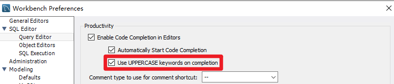
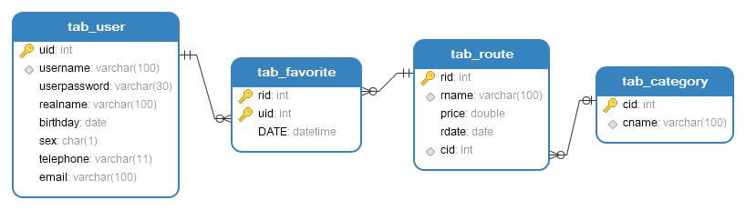
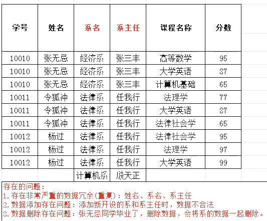
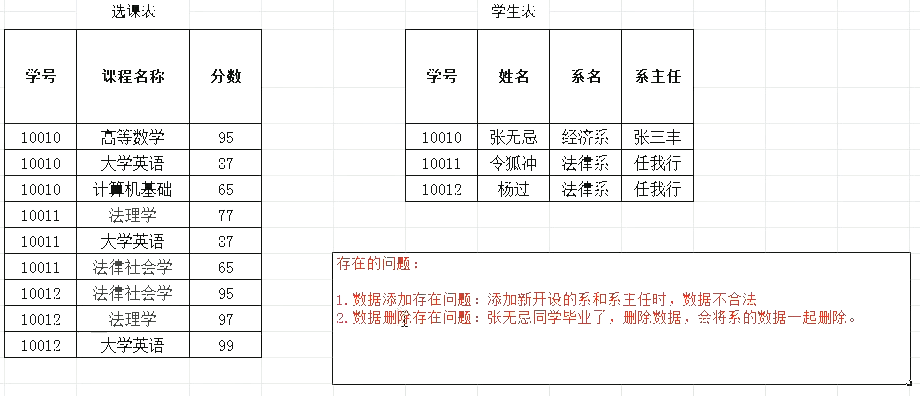
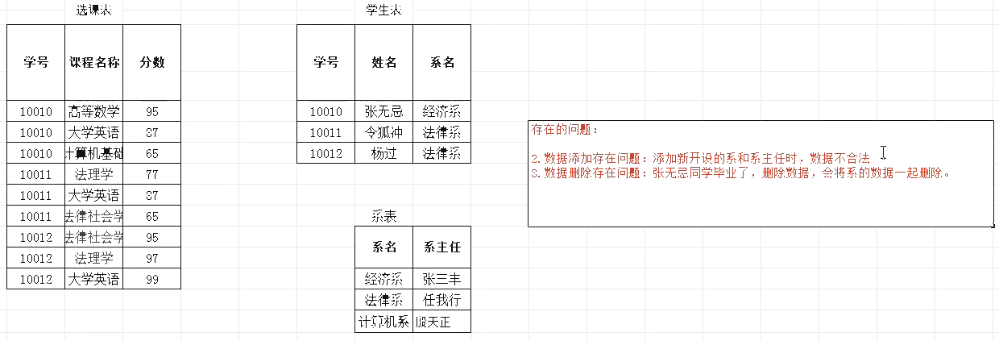
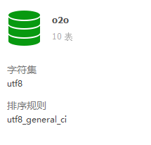

#### 1 数据库基础

数据库就是用来组织管理存储数据的仓库，是专门对数据进行管理的软件

##### 1.1 mysql 安装

1. 从 [mysql官网](https://dev.mysql.com/downloads/mysql/) 下载社区版解压到指定目录

1. 添加安装目录下的 bin 目录到系统环境变量 path 中

2. 在安装目录下创建 data 目录以及创建配置文件 my.ini

3. 将下面的内容写入配置文件 my.ini，注意目录的路径

   ```ini
   [mysqld]
   -- 设置3306端口
   port=3306
   -- 设置mysql的安装目录
   basedir=C:\Software\mysql-8.0.20-winx64
   -- 设置mysql数据库的数据的存放目录
   datadir=C:\Software\mysql-8.0.20-winx64\data
   -- 允许最大连接数
   max_connections=200
   -- 允许连接失败的次数
   max_connect_errors=10
   -- 服务端使用的字符集默认为utf8
   character-set-server=utf8
   -- 创建新表时将使用的默认存储引擎
   default-storage-engine=INNODB
   -- 默认使用“mysql_native_password”插件认证
   --mysql_native_password
   default_authentication_plugin=mysql_native_password
   [mysql]
   -- 设置mysql客户端默认字符集
   default-character-set=utf8
   [client]
   -- 设置mysql客户端连接服务端时默认使用的端口
   port=3306
   default-character-set=utf8
   ```

4. 在安装目录下打开命令行执行如下命令

   ```sh
   mysqld -- initialize -- console
   ```

   初始化 mysql，将命令行中生成的 root 密码临时记录下来

5. 安装 mysql

   ```sh
   mysqld install
   ```

6. 启动 mysql 服务

   ```sh
   net start mysql
   ```

   关闭 mysql 服务

   ```sh
   net stop mysql
   ```

7. 输入 root 密码登录到 mysql

   ```sh
   mysql -u root -p
   ```

8. 修改加密规则

   ```sh
   ALTER USER 'root'@'localhost' IDENTIFIED BY 'password' PASSWORD EXPIRE NEVER;
   ```

9. 修改root密码为 xxx

   ```sh
   ALTER USER 'root'@'localhost' IDENTIFIED WITH mysql_native_password BY 'xxx';
   ```

10. 检查字符编码是否是 `utf8`

    ```sh
    SHOW VARIABLES LIKE '%char%';
    ```

11. 查看是否开启 autocommit，innodb 引擎是默认开启的，不用手动 commit

    ```sh
    SHOW VARIABLES LIKE '%autocommit%';
    ```

##### 1.2 mysql 免安装版

mysql 也可以免安装使用，这样可以方便地在不同的机器上进行移植

1. 首先在 mysql 官网下载免安装版本的 [zip archive](https://downloads.mysql.com/archives/community/)

2. 解压 archive 到指定目录

3. 打开解压目录的 bin 目录，调用命令行执行如下命令初始化 mysql

   ```sh
   mysqld --initialize-insecure --console
   ```

4. 继续执行命令运行 mysql

   ```sh
   mysqld --console
   ```

5. 登录到 mysql

   ```sh
   mysql -u root
   ```

6. 修改 root 用户密码

   ```sh
   alter user 'root'@'localhost' identified by '123456'
   ```

##### 1.3 用户及权限

> **规范：** 命令用大写字母，数据库名、表名等用小写字母
> **注意：** 在命令行里的mysql命令敲错不能回滚修改，只能`\c`清空当前输入
> 如果想方便修改命令可以自己编写sql脚本，用`\. *.sql`执行脚本文件
>
> 在文件里面就可以修改命令了，或者使用图形化工具 MySQL Workbench 等

DCL (Data Control Language 数据控制语句)

- `localhost`表示只能在本地登录数据库
- ` %`是通配符，表示可以在任意主机登录数据库

```mysql
SELECT * FROM USER;  -- 查询用户，在自带的“mysql”数据库里查询
CREATE USER 'username'@'host' IDENTIFIED BY 'password'; -- 添加用户
DROP USER ‘username’@'host’; -- 删除用户

-- 设置用户密码（mysql5.6及之前）
SET PASSWORD FOR 'username'@'host' = PASSWORD('newpassword');
-- 设置用户密码（mysql5.6及之前）
UPDATE USER SET PASSWORD = PASSWORD('newpassword') WHERE USER = 'username';
-- 设置当前用户密码（mysql5.6及之前）
SET PASSWORD = PASSWORD("newpassword");
-- 设置用户密码（mysql5.7及之后）
ALTER USER 'username'@'host' IDENTIFIED BY 'newpassword';

SHOW GRANTS FOR 'username'@'host';  -- 查询用户权限
GRANT PRIVILEGES ON db_name.tb_name TO 'username'@'host'; -- 给用户授权
GRANT ALL ON *.* TO 'username'@'host';  -- 给用户授予全部权限
GRANT PRIVILEGES ON db_name.tb_name TO 'username'@'host' WITH GRANT OPTION; -- 给用户授权的同时授权用户授权权限
REVOKE PRIVILEGES ON db_name.tb_name FROM 'username'@'host'; -- 撤销用户授权
FLUSH PRIVILEGES; -- 刷新权限
```
常见错误：
- `Error Code: 1044. Access denied for user 'xxx'@'%' to database 'xxx'`
用户没有创建数据库xxx的权限
```mysql
GRANT ALL PRIVILEGES ON db.* TO 'xxx'@'%'; -- 将db数据库的所有权限给予xxx，db由root创建
--或者
GRANT ALL ON *.* TO 'xxx'@'%'; --给予xxx用户所有数据库的所有权限 
```
- `ERROR 1410 (42000): You are not allowed to create a user with GRANT`
用户不允许使用 grant 创建用户（即授权）
```mysql
USE mysql; --使用mysql数据库
UPDATE USER SET HOST='%' WHERE USER='root'; --修改root用户的连接方式为所有 
UPDATE USER SET HOST='%' WHERE USER='xxx'; --修改xxx用户的连接方式为所有
```
忘记 root 密码解决办法
1. 管理员身份运行 cmd
	```sh
	net stop mysql
	```
	
2. 使用无验证方式启动 mysql 服务
	```sh
	mysqld --skip-grant-tables
	```
	
3. 打开新的 cmd 窗口
	```sh
	mysql
	```
	
4. 登录成功，修改 root 密码
	```mysql
	USE mysql;
	UPDATE USER SET PASSWORD = PASSWORD ( 'newpassword' ) WHEREUSER ='root';
	```
	
5. 关闭两个 cmd 窗口

6. 打开任务管理器，结束 mysqld 进程

7. 打开 cmd 窗口，启动 mysql 服务
	```sh
	net start mysql
	```
	
8. 使用新密码登录

   ```sh
   mysql -u root -p newpassword
   ```

##### 1.4 Workbench

- 快捷键

  `ctrl` + `enter` 执行当前行
  `ctrl` + `shift` + `enter` 执行整个sql脚本
  `ctrl` + `b` 格式化sql语句

- SQL关键字自动大写设置

  
  
- 查询的结果表格是只读的不允许修改，原因：表没有设置主键，添加主键后即可修改

#### 2 常用命令
##### 2.1 登录及管理

###### 2.1.1 登录

```mysql
mysql -u user_name -p  -- 输入 password 登录 mysql
mysql  -h 127.0.0.1 -u user_name -p  -- 登录本地的 mysql
\q -- 退出登录
```

###### 2.1.2 管理

DDL(Data Definition Language 数据定义语言)

```mysql
help ? \? ? SHOW  --  mysql 命令帮助，SHOW 命令帮助

CREATE DATABASE db_name; --  创建数据库
CREATE DATABASE IF NOT EXISTS db_name; --  如果不存在数据库则创建数据库，否则不创建
CREATE DATABASE db_name CHARACTER SET gbk; --  创建数据库，指定字符集
ALTER DATABASE db_name CHARACTER SET gbk; -- 修改数据库的字符集
DROP DATABASE db_name; --  删除数据库
DROP DATABASE IF EXISTS db_name; --  如果存在数据库则删除数据库
SELECT DATABASE(); -- 显示当前正在使用的数据库
USE db_name;  --  使用数据库
SHOW DATABASES;  --  显示当前用户使用的数据库
SHOW CREATE DATABASE db_name;  --  显示创建数据库的语句，查看使用的字符集

CREATE TABLE tb_name(  -- 创建数据表
    id int primary key auto_increment,  -- no 号，int 类型，定义为主键，自增 
    name varchar(10),  -- 名字 
    sal double  -- 工资，double 类型
);

CREATE TABLE tb_name1 LIKE tb_name;  -- 创建一个表的复制表
SHOW TABLES;  -- 显示当前数据库中的表
SHOW CREATE TABLE tb_name;  -- 查看创建表的 SQL 语句
DESC tb_name;  -- 查看数据表结构
DROP TABLE tb_name;  -- 删除表
DROP TABLE IF EXISTS tb_name;  -- 如果存在表则删除表
ALTER TABLE tb_name RENAME TO tb_name1; -- 修改表名为 tb_name1
SHOW CREATE TABLE tb_name;  --  显示创建表的语句，查看使用的字符集
ALTER TABLE tb_name CHARACTER SET utf8; -- 修改表的字符集为 utf-8
ALTER TABLE tb_name ADD col_name data_type;  -- 给表增加一列数据
ALTER TABLE tb_name CHANGE col_name new_col_name new_data_type;  -- 修改列名及列类型
ALTER TABLE tb_name MODIFY col_name new_col_name new_data_type;  -- 修改列名及列类型
ALTER TABLE tb_name DROP col_name;  -- 给表删除一列数据
```

##### 2.3 增删改查

DML(Data Manipulation Language 数据操控语言)

###### 2.3.1 增


```mysql
-- 插入一条新记录，先列举字段名称，然后在 VALUES 中写出对应字段的值
INSERT INTO student (class_id, name, gender, score) VALUES (2, '大牛', 'M', 80);

--  一次性添加多条新记录
INSERT INTO student (class_id, name, gender, score) VALUES
  (1, '大宝', 'M', 87),
  (2, '二宝', 'M', 81);

-- 不列举字段名称则默认添加全部字段，注意值的顺序和字段要一一对应
INSERT INTO student VALUES(3, '三宝', 'F', 88);
```

>示例没有列出 id 字段，也没有列出 id 字段对应的值，这是因为 id 字段是一个自增主键，它的值可以由数据库自己推算

###### 2.3.2 删

```mysql
-- 删除 student 表中 id=1 的记录
DELETE FROM student WHERE id=1;
-- 删除 id=5,6,7 的记录
DELETE FROM student WHERE id>=5 AND id<=7;
-- 删除 id 为 null 的记录
DELETE FROM student WHERE id IS NULL;
-- 删除表中所有的记录，但是会执行很多次 delete 语句，效率不高
DELETE FROM student；
-- 更快的方法，原理是直接删除表，再创建一个一样的表来代替
TRUNCATE TABLE student;
```

###### 2.3.3 改

```mysql
-- 修改 id 为 1 的学生信息
UPDATE student SET name='大牛', score=66 WHERE id=1;
```

###### 2.3.4 查

DQL(Data Query Language 数据查询语言)
```mysql
-- 查珣所有的记录
SELECT * FROM student;
-- 查询姓名和年龄
SELECT name, age FROM student;
-- 如果查询到的结果集中有重复，可以添加 distinct 去除重复的查询结果
SELECT DISTINCT address FROM student;

-- 分数 >=80，并且是男生，AND 可以替换为 &&，但推荐用 AND，语义更清晰，而且在多种数据库之间也更加通用
SELECT * FROM student WHERE score >= 80 AND gender = 'M';
-- 分数 >=80，或者是男生，OR 可以替换为 ||
SELECT * FROM student WHERE score >= 80 OR gender = 'M';
-- 不是 2 班的学生,<> 可以替换为 !=，或者使用 where not class_id = 2，not 起到取反的作用
SELECT * FROM student WHERE class_id <> 2;
-- 分数在 80 以下或者 90 以上，并且是男生
SELECT * FROM student WHERE (score < 80 OR score > 90) AND gender = 'M';

-- 查询可进行简单数值运算
-- 例如给所有的数学字段加 5 分
SELECT math+5 FROM student;
-- 查询 math + english 的和，并且给结果起别名为总成绩，AS 可以省略为空格
-- IFNULL() 函数用于处理值为 null 的情况，将 null 值替换为传入的参数
SELECT *,(math+IFNULL(english,0)) AS 总成绩 FROM student;
-- 查询 id 是 1 或 3 或 5 的学生
SELECT * FROM student WHERE id IN(1,3,5);
-- 查询 id 不是 1 或 3 或 5 的学生
SELECT * FROM student WHERE id NOT IN(1,3,5);
-- 查询数学分数在 75~90 之间的学生，分数包含 75 和 90
SELECT * FROM student WHERE math BETWEEN 75 AND 90;

-- 可使用 like 进行模糊查询
-- MySQL 通配符
-- %：匹配 0 或多个字符
-- _：匹配单个字符
-- 查询姓马的学生
SELECT * FROM student WHERE name LIKE '马%';
-- 查询姓马但名字只有两个字的学生
SELECT * FROM student WHERE name LIKE '马_';
-- 查询名字有三个字的学生
SELECT * FROM student WHERE name LIKE '___';
-- 查询姓名包含德字的学生
SELECT * FROM student WHERE name LIKE '%德%';

-- 排序

-- ASC，升序（ascend）
-- DESC，降序（descend）
-- 不写排序则默认升序
SELECT * FROM student ORDER BY math;
SELECT * FROM student ORDER BY math ASC;
SELECT * FROM student ORDER BY math DESC;

-- 排序可以设定多种条件查询，当前面的记录一样时，会根据后面的字段排序条件进行排序
-- 前后条件不一样时，优先计算前面的条件
-- 找出数学成绩一样，但是英语成绩更高的学生
SELECT * FROM student ORDER BY math DESC, english DESC;

-- 聚合函数：将整列数据作为运算的范围，注意会排除数据为 null 的值
-- count：计算整列的数量，一般选择非空的列，比如主键或者全选 *，但全选 * 一般是不推荐的
-- 非要选择一般的列，可以采用 IFNULL() 函数解决值为 null 问题
SELECT COUNT(id) FROM student;
SELECT COUNT(*) FROM student;
SELECT COUNT(IFNULL(english,0)) FROM student;
-- max：计算最大值
SELECT MAX(math) FROM student;
-- min：计算最小值
SELECT MIN(math) FROM student;
-- sum：计算和
SELECT SUM(math) FROM student;
-- avg：计算平均值
SELECT AVG(math) FROM student;

-- 分组查询：以某个特征作为分组依据，对记录进行分组查询，比如按照性别进行分组查询
-- 一般分组之后查询的字段：分组字段和聚合函数
-- 因为分组查询的目的一般都是为了统计，如果查询其他的字段，查出来的结果会没有什么意义
-- 查询分组字段是为了看到查询结果是属于哪个组的
SELECT sex, AVG(math) FROM student GROUP BY sex;
-- 限制分组范围有 where 和 having 关键字，区别如下：
-- 1. 使用前后位置顺序区别，where 用在分组之前，不满足 where 条件的记录不参与后续的分组
-- having 会在分组之后对结果进行限制，满足 having 条件的才会最终显示结果
-- 2. where 不能判断聚合函数，而 having 可以
-- 查询年龄 >25 岁，按性别分组，统计每组的人数，且只显示性别人数大于 2 的数据
SELECT sex, COUNT(id) FROM student WHERE age > 25 GROUP BY sex HAVING COUNT(*) >2;

-- 分页查询：比如网页的分页，由于内容太多，一页展示不完，需要分成很多页进行展示
-- 数据库也是一样，当查询结果过多无法展示时，可以考虑分页，与 web 技术配合可以开发出网页分页效果
-- LIMIT 开始的索引（索引从0开始）, 每页查询的条数
-- 分页查询公式：开始的索引 =（当前页码 - 1） * 每页查询的条数
-- 当前页码可由前端传过来，进而动态地计算出索引
-- 每页显示3条记录
SELECT * FROM student LIMIT 0,3;  -- 第 1 页
SELECT * FROM student LIMIT 3,3;  -- 第 2 页
SELECT * FROM student LIMIT 6,3;  -- 第 3 页

-- 多表查询
-- 当我们要查询的信息分别位于多张表里面的时候，就需要使用多表查询
-- 数据准备
# 创建部门表
CREATE TABLE dept (
	id INT PRIMARY KEY auto_increment,
	dname VARCHAR ( 20 )
);

INSERT INTO dept ( dname ) VALUES( '开发部' ), ( '市场部' ), ( '财务部' );

# 创建员工表
CREATE TABLE emp (
	id INT PRIMARY KEY auto_increment,
	ename VARCHAR ( 10 ),
	gender CHAR ( 1 ),  -- 性别
	salary DOUBLE,  -- 工资
	join_date date,  -- 入职日期
	dept_id INT,
	FOREIGN KEY ( dept_id ) REFERENCES dept ( id ) -- 外键，关联部门表(部门表的主键)
);

INSERT INTO emp ( ename, gender, salary, join_date, dept_id )
VALUES ( '孙悟空', '男', 7200, '2013-02-24', 1 );
INSERT INTO emp ( ename, gender, salary, join_date, dept_id )
VALUES ( '猪八戒', '男', 3600, '2010-12-02', 2 );
INSERT INTO emp ( ename, gender, salary, join_date, dept_id )
VALUES ( '唐僧', '男', 9000, '2008-08-08', 2 );
INSERT INTO emp ( ename, gender, salary, join_date, dept_id )
VALUES ( '白骨精', '女', 5000, '2015-10-07', 3 );
INSERT INTO emp ( ename, gender, salary, join_date, dept_id )
VALUES ( '蜘蛛精', '女', 4500, '2011-03-14', 1 );

-- 内连接查询
-- 隐式内连接（看不到 JOIN 关键字，条件使用 WHERE 指定）
-- 从员工和部门表里查询员工信息
-- 由于多表查询存在笛卡尔积的问题，结果集会有无效数据，所以需要通过条件过滤掉无效数据
SELECT * FROM emp e, dept d WHERE e.`dept_id` = d.`id`;

-- 显式内连接
-- INNER 可以省略
SELECT * FROM emp e [INNER] JOIN dept d ON e.`dept_id` = d.`id`;

-- 外连接查询
-- 左外连接（用左表（主表）的记录去匹配右表（从表）的记录，如果从表中有符合条件的则正常显示，否则显示为 NULL）
-- 左外连接在内连接的基础上保证主表的数据完全显示(左表部门，右表员工)
-- 可以和 WHERE 结合使用
SELECT * FROM emp e LEFT [OUTER] JOIN dept d ON d.`id` = e.`dept_id`;

-- 右外连接，与左外连接相反，某些数据库系统对左连接有更好的优化，因此建议使用左连接
SELECT * FROM dept d RIGHT [OUTER] JOIN emp e ON d.`id` = e.`dept_id`;

-- 子查询
-- 查询开发部中有哪些员工
-- 通过两条语句查询
SELECT id FROM dept WHERE dname = '开发部';
SELECT * FROM emp WHERE dept_id = 1;
-- 使用子查询，将第一条语句作为结果返回给第二条语句，合并为一条语句
SELECT * FROM emp WHERE dept_id = ( SELECT id FROM dept WHERE NAME = '开发部' );

-- 子查询的结果是单行单列的
-- 则子查询可以作为条件，可使用运算符去判断：> >= < <= =
-- 根据最高工资到员工表查询到对应的员工信息
SELECT* FROM emp WHERE salary = ( SELECT max( salary ) FROM emp );
-- 多行单列
-- 此时的结果集类似于一个数组集合，父查询使用in运算符
-- 查询工资大于5000的员工，来自于哪些部门
SELECT dname FROM dept WHERE id IN ( SELECT dept_id FROM emp WHERE salary > 5000 );
-- 多行多列
-- 子查询结果只要是多列，就要跟在from后面作为虚拟表
-- 子查询作为表需要取别名，否则这张表没有名称则无法访问表中的字段
-- 在员工表中查询2011-1-1以后入职的员工
SELECT * FROM dept d, ( SELECT * FROM emp WHERE join_date >= '2011-1-1' ) e WHERE d.`id` = e.dept_id;
```

#### 3 约束
概念：对表中的数据进行限定，保证数据的**正确性、有效性、完整性**

那么如何保证呢，从概念可知约束是为了让添加到表中的数据合法有效，而不是无意义的数据，所以应该在设计表的时候就对字段进行相应的约束限制，当然如果忘记后期再修改表添加也是可以的

mysql的约束分为四种，分别是
- 主键约束：primary key
- 外键约束：foreign key
- 非空约束：not null
- 唯一约束：unique

##### 3.1 非空约束

字段的值不能为null
1. 创建表时添加约束
```mysql
CREATE TABLE stu(
	id INT,
	name VARCHAR(20) NOT NULL -- name为非空
);
```
2. 创建表完成后，添加非空约束
```mysql
ALTER TABLE stu MODIFY name VARCHAR(20) NOT NULL;
```
3. 删除name的非空约束
```mysql
ALTER TABLE stu MODIFY name VARCHAR(20);
```
##### 3.2 唯一约束（唯一索引）

字段的值不能重复
1. 创建表时添加唯一约束
```mysql
CREATE TABLE stu(
	id INT,
	phone_number VARCHAR(20) UNIQUE -- 添加了唯一约束
);
```
>注意mysql中，唯一约束限定的列的值可以有多个null，null不视为重复
2. 创建表完成后，添加唯一约束
```mysql
ALTER TABLE stu MODIFY phone_number VARCHAR(20) UNIQUE;
```

3. 删除phone_number的唯一约束
```mysql
ALTER TABLE stu DROP INDEX phone_number;  -- 唯一约束也叫唯一索引
```
##### 3.3 主键约束

能够通过某个字段区分出唯一不同的记录，这个字段被称为主键

主键的特点：

- 非空且唯一
- 一张表只能有一个主键，允许两个或更多的字段一起设置为联合主键，但是不常用
- 主键就是表中记录的唯一标识
1. 创建表时添加主键约束
```mysql
CREATE TABLE stu (
    id INT PRIMARY KEY,  -- 给id添加主键约束
    name VARCHAR(20)
);
```
2. 创建表完成后，添加主键
```mysql
ALTER TABLE stu MODIFY id INT PRIMARY KEY;
-- 或者ALTER TABLE stu ADD PRIMARY KEY (id);
```
3. 删除表stu的主键
```mysql
ALTER TABLE stu DROP PRIMARY KEY;  -- 错误写法：ALTER TABLE stu MODIFY id INT;
```
4. 自动增长
如果某一列是数值类型的，可以使用auto_increment来添加自动增长属性，主键如果让我们自己添加很有可能重复,我们通常希望在每次插入新记录时,数据库自动生成主键字段的值
```mysql
-- 在创建表时，添加主键约束，并且添加自动增长
CREATE TABLE stu (
    id INT PRIMARY KEY AUTO_INCREMENT,
    name VARCHAR(20)
);
-- 创建表完成后，添加id字段的自动增长
ALTER TABLE stu MODIFY id INT AUTO_INCREMENT;
-- 删除id字段的自动增长，但是这样不能删除主键
ALTER TABLE stu MODIFY id INT;
```

> 如主键设置为自增类型，则插入数据时可以插入null，主键值会自动增长
>
> 如手动插入了自增主键值，则接下来自动增长的主键值会在手动插入的主键值的基础上增长

选取主键的基本原则：

- 尽量不使用任何业务相关的字段作为主键，主键最好是完全业务无关的字段，主键是给数据库和程序使用的，不是给最终的客户使用的，所以主键有没有含义没有关系，只要不重复，非空就行
- 通常自增类型的主键就能满足需求

##### 3.4 外键约束

在多张表中，通过某个字段，可以把某个字段与另一张表的某个字段关联起来，这个字段称为外键

外键约束让表和表之间产生关系，从而保证数据的正确性、完整性

一般是从表关联到主表，且是主表的主键

- 主表： 一方，用来约束别人的表
- 从表： 多方，被别人约束的表

1. 在创建表时，添加外键约束
```mysql
CREATE TABLE department (    -- 主表，id主键被从表employee的dep_id外键关联
    id INT PRIMARY KEY AUTO_INCREMENT,
    dep_name VARCHAR(20),
    dep_location VARCHAR(20)
);

CREATE TABLE employee (    -- 从表，dep_id字段为外键，关联主表department的主键id
    id INT PRIMARY KEY AUTO_INCREMENT,
    name VARCHAR(20),
    age INT,
    dep_id INT,
    CONSTRAINT emp_depid_fk FOREIGN KEY (dep_id)
        REFERENCES department (id)
);
```
2. 创建表完成后，添加外键
```mysql
ALTER TABLE employee ADD CONSTRAINT emp_depid_fk FOREIGN KEY (dep_id) REFERENCES department (id);
```
3. 删除外键
```mysql
ALTER TABLE employee DROP FOREIGN KEY emp_depid_fk;
```
4. 级联关系
在主键和外键之间添加级联关系后，主表的主键更新后，从表的外键会自动更新，删除同理，使用起来方便，但也更危险，设计表之间的关系时需谨慎处理
```mysql
-- 在创建表时，添加级联关系
CREATE TABLE employee (
	id INT PRIMARY KEY auto_increment,
	NAME VARCHAR ( 20 ),
	age INT,
	dep_id INT,-- 外键对应主表的主键
  CONSTRAINT emp_depid_fk FOREIGN KEY ( dep_id ) REFERENCES department ( id ) ON UPDATE CASCADE ON DELETE CASCADE  -- 创建外键约束，添加级联更新和级联删除，可只添加一个
)

-- 创建表完成后，添加级联操作
ALTER TABLE employee ADD CONSTRAINT emp_depid_fk FOREIGN KEY ( dep_id ) REFERENCES department ( id ) ON UPDATE CASCADE ON DELETE CASCADE;
```

#### 4 设计
##### 4.1 多表间的关系
###### 4.1.1 一对一
比如：人和身份证
>一个人只有一个身份证，一个身份证只能对应一个人
>建表方式：一对一关系实现，可以在任意一方添加唯一外键指向另一方的主键
>
>一对一用得不多，如果一对一直接融合在一张表里或许会更好
###### 4.1.2 一对多(多对一)
比如：部门和员工
>一个部门有多个员工，一个员工只能对应一个部门
建表方式：在多的一方建立外键，指向一的一方的主键
###### 4.1.3 多对多
比如：学生和课程
>一个学生可以选择很多门课程，一个课程也可以被很多学生选择
建表方式：多对多关系实现需要借助第三张中间表。中间表至少包含两个字段，这两个字段作为第三张表的外键，分别指向两张表的主键
###### 4.1.4 实际案例
```mysql
/*
 创建旅游线路分类表 tab_category
*/ 
CREATE TABLE tab_category ( 
	cid INT PRIMARY KEY AUTO_INCREMENT, -- cid 旅游线路分类主键
	cname VARCHAR ( 100 ) NOT NULL UNIQUE -- cname 旅游线路分类名称
);
/*
 创建旅游线路表 tab_route
*/
CREATE TABLE tab_route (
	rid INT PRIMARY KEY AUTO_INCREMENT,-- rid 旅游线路主键
	rname VARCHAR ( 100 ) NOT NULL UNIQUE,-- rname 旅游线路名称
	price DOUBLE,-- price 价格
	rdate DATE,-- rdate 上架时间
	cid INT,-- cid 外键，所属分类
	FOREIGN KEY ( cid ) REFERENCES tab_category ( cid ) 
);
/*
创建用户表 tab_user
*/
CREATE TABLE tab_user (
	uid INT PRIMARY KEY AUTO_INCREMENT,-- uid 用户主键
	username VARCHAR ( 100 ) UNIQUE NOT NULL,-- username 用户名
	userpassword VARCHAR ( 30 ) NOT NULL,-- userpassword 密码
	realname VARCHAR ( 100 ),-- realname 真实姓名
	birthday DATE,-- birthday 生日
	sex CHAR ( 1 ) DEFAULT '男',-- sex 性别，定长字符串 1
	telephone VARCHAR ( 11 ),-- telephone 手机号
	email VARCHAR ( 100 ) -- email 邮箱
	
);
/*
	创建收藏表 tab_favorite
	rid 和 uid 不能重复，设置复合主键，同一个用户不能收藏同一个线路两次
*/
CREATE TABLE tab_favorite (
	rid INT,-- 线路id
	uid INT,-- 用户id
	DATE DATETIME,-- 收藏时间
	PRIMARY KEY ( rid, uid ),-- 联合主键
	FOREIGN KEY ( rid ) REFERENCES tab_route ( rid ),-- 外键
	FOREIGN KEY ( uid ) REFERENCES tab_user ( uid ) -- 外键
);
```
ER图如图所示：


##### 4.2 范式
数据库规范化，又称正规化、标准化，目的是减少数据库中的数据冗余，增进数据的一致性

设计关系数据库时，需要遵从不同的规范要求，设计出合理的关系型数据库，这些不同的规范要求被称为不同的范式，要遵循后边的范式要求，必须先遵循前边的范式要求，越高的范式数据库冗余越小

目前关系数据库有六种范式：第一范式（1NF）、第二范式（2NF）、第三范式（3NF）、巴斯-科德范式（BCNF）、第四范式(4NF）和第五范式（5NF，又称完美范式）

现在数据库设计最多满足3NF，普遍认为范式过高，虽然具有对数据关系更好的约束性，但也导致数据关系表增加而令数据库IO更易繁忙，原来交由数据库处理的关系约束现更多在数据库使用程序中完成

我们通过一张表的设计来说明三个问题：



随后通过范式的学习解决问题

###### 4.2.1 第一范式（1NF）
数据库表的每一列都是不可分割的原子数据项，不能是集合、数组等非原子数据项。即表中的某个列有多个值时，必须拆分为不同的列。简而言之，**第一范式每一列不可再拆分，称为原子性**
###### 4.2.2 第二范式（2NF）
在1NF的基础上，非码属性必须完全依赖于码，或者说在1NF基础上消除非主属性对主码的部分函数依赖
相关概念：

1. **函数依赖：**
	
	> 函数是数学上的概念，对于X的每个值，Y都有唯一的一个值与之对应，反过来则不一定不成立，这叫做X函数决定Y，Y函数依赖X，对应到数据库上，X往往是主键
	
	A --> B，如果通过A属性(属性组)的值，可以确定唯一B属性的值，则称B函数依赖于A
	
	例如：学号 --> 姓名，（学号，课程名称） -->  分数，分数函数依赖于**（学号，课程名称）**这个属性组
	
2. **完全函数依赖：**

   A-->B，如果A是一个属性组，则B属性值的确定需要依赖于A属性组中**所有的属性值**
   例如：（学号，课程名称） -->  分数

3. **部分函数依赖：**

   A-->B，如果A是一个属性组，则B属性值的确定只需要依赖于A属性组中**某一些值**
   例如：（学号，课程名称） -- >  姓名，这里只需要学号就可以确定姓名了

4. **传递函数依赖：**

   如果A --> B，B --> C，称C传递函数依赖于A
   例如：学号 --> 系名，系名 --> 系主任，称系主任传递函数依赖于学号

5. **码：**
    如果在一张表中，一个属性或属性组，被其他所有属性所完全依赖，则称这个属性(属性组)为该表的码
    例如：（学号，课程名称）
  - 主属性：码属性组中的所有属性
  - 非主属性：除了码属性组之外的所有属性

由上面的概念可知，第二范式就是在满足第一范式的前提下，表中的每一个字段都完全依赖于主键，若不满足第二范式，一般解决办法是将表拆分为几张符合第二范式的表：



拆分为两张表后，数据冗余的问题得到解决

###### 4.2.3 第三范式（3NF）
在2NF基础上，任何非主属性不依赖于其它非主属性，或者说在2NF基础上**消除传递依赖**，表中的每一列应该直接依赖于主键，而不是通过其它的列来间接依赖于主键

例如：得知学号要判断系主任，必须先通过学号得知系名，再通过系名得知系主任，那么系主任传递依赖于学号

要消除传递依赖，一般解决办法是继续拆分表：



这样数据添加删除的问题也得到了解决

##### 4.3 索引

#### 5 事务
如果一个包含多个步骤的业务操作，被事务管理，那么这些操作会被当做一个整体，要么全部成功，要么全部失败
##### 5.1 使用事务
```mysql
CREATE TABLE account (
	id INT PRIMARY KEY AUTO_INCREMENT,
	acname VARCHAR(10),
	balance DOUBLE
);

INSERT INTO account (NAME, balance) VALUES ('zhangsan', 1000), ('lisi', 1000);  -- 添加数据

START TRANSACTION;  -- 开启事务
UPDATE account SET balance = balance - 500 WHERE acname = 'zhangsan';
UPDATE account SET balance = balance + 500 WHERE acname = 'lisi';
COMMIT;  -- 提交事务
ROLLBACK;  -- 回滚
```
事务提交的两种方式：
- 自动提交：MySQL默认事务自动提交,一条DML(增删改)语句会自动提交一次事务。
- 手动提交：Oracle默认事务手动提交，需要先开启事务，再提交

修改事务的默认提交方式：
```mysql
-- 查看默认提交方式
-- 1 代表自动提交
-- 0 代表手动提交
SELECT @@autocommit;
-- 修改默认提交方式
SET @@autocommit = 0;
```
##### 5.2 事务的四大特征
1. **原子性：**是不可分割的最小操作单位，要么同时成功，要么同时失败
2. **持久性：**当事务提交或回滚后，数据库会持久化的保存数据。
3. **隔离性：**多个事务之间。相互独立
4. **一致性：**事务操作前后，数据总量不变
##### 5.3 事务的隔离级别（了解）
多个事务之间隔离的，相互独立的。但是如果多个事务操作同一批数据，则会引发一些问题，设置不同的隔离级别就可以解决这些问题

存在的问题：

不同的隔离级别：
- **read uncommitted：**读未提交，产生的问题：脏读、不可重复读、幻读
- **read committed：**读已提交 （Oracle默认），产生的问题：不可重复读、幻读
- **repeatable read：**可重复读 （MySQL默认），产生的问题：幻读
- **serializable：**串行化，可以解决所有的问题

>隔离级别从小到大安全性越来越高，但是效率越来越低

```mysql
-- 数据库查询隔离级别
SELECT @@tx_isolation;
-- 数据库设置隔离级别
SET GLOBAL TRANSACTION ISOLATION LEVEL READ COMMITTED;
```

#### 6 备份与还原

1. 命令行：

   - 备份：
   
   ```sh
   mysqldump -u user_name -p password db_name > C://db_name.sql
   ```
   
   - 还原：
   
   ```mysql
   CREATE DATABASE db_name;  -- 创建数据库
   USE db_name;  -- 使用数据库
   SOURCE C://db_name.sql;  -- 导入并执行sql文件
   ```
   
2. 图形化工具：

   可以使用navicat、workbench等图形化工具点击备份还原，都是生成sql文件
   
   注意mysql8版本导出的sql不能直接拿到mysql5的版本使用，因为字符集和排序规则可能不一样，比如下面两个数据库就不一样，需要根据目标数据库的信息进行替换
   
    
   
    
   
   ```mysql
   utf8mb4 替换为 utf8 或者保持不变
   
   utf8mb4_0900_ai_ci 替换为 utf8_general_ci 或者 utf8mb4_general_cli
   ```

#### 7 数据库安全

#### 8 建表规范
1. 表名一般采用单数，不用复数
2. 表名加上项目前缀

#### 9 phpstudy 启动失败

phpstudy 是一款安装启动 MySQL 数据库的图形化软件，数据库的安装和启动都很方便，但有时安装后启动数据库会启动之后又马上停止

可能原因一：端口号占用冲突，修改端口号就行

可能原因二：和之前安装的数据库冲突，对于这种情况，需要卸载之前安装的数据库

搜索 cmd 以管理员身份打开 cmd，输入命令删除数据库服务，删除之前可以先暂停数据库服务

```sh
net stop mysql
sc delete mysql
```

然后重新安装 phpstudy 里的数据库，重新启动即可


