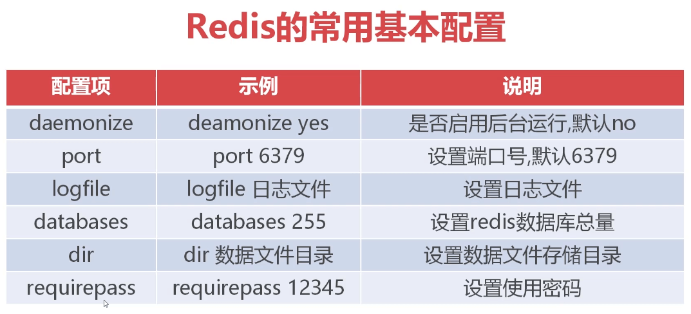
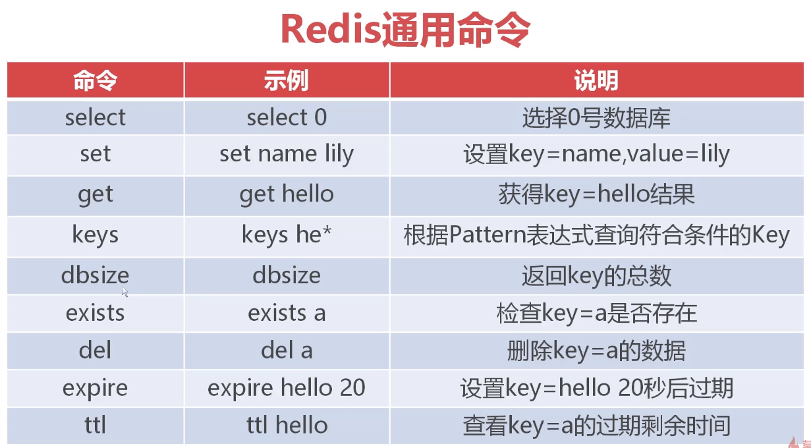
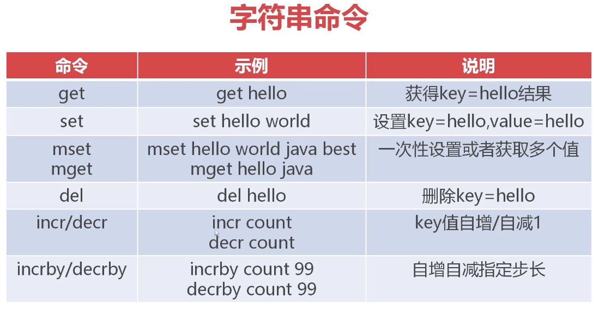
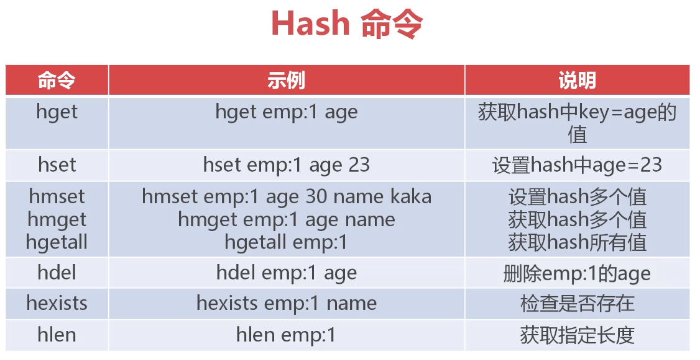
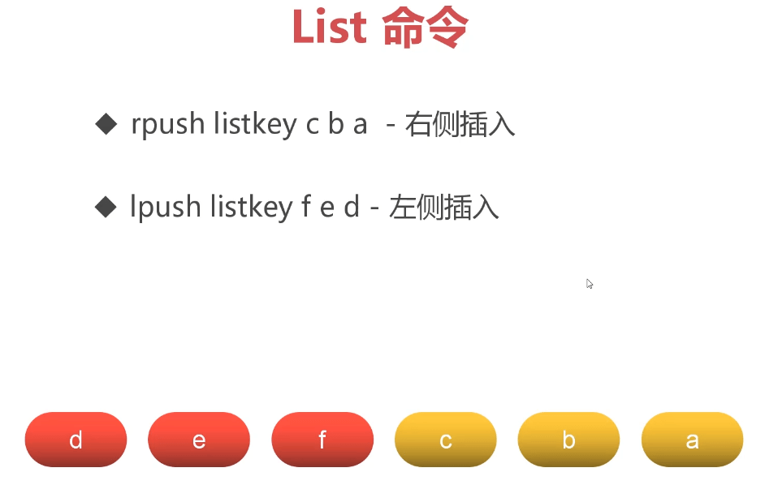
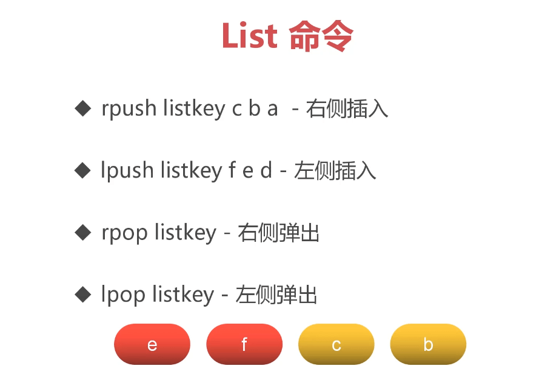

#### 1 简介

redis 是 key-value 型的 nosql 数据库，not only sql，不仅仅是 sql，作为非关系型数据库，不需要预定义严格的表结构（如行和列），数据可以以键值对、文档、图等形式存储，非常适合动态或不确定的数据模型

redis 的数据是存储在内存中的，这意味着读取速度是非常快的，同时也能将数据持久化地存储到磁盘上

综合以上优点，redis 常被用作系统中的缓存，充分利用内存的读取高效性提高数据的处理速度

#### 2 安装

##### 2.1 Linux

提前安装好 gcc 编译器，然后执行如下命令

```sh
wget https://download.redis.io/releases/redis-6.2.1.tar.gz
tar xzf redis-6.2.1.tar.gz
cd redis-6.2.1
make
```
之后可以在 redis 安装目录下使用命令启动

```sh
./src/redis-server redis.conf
```

##### 2.2 Windows

###### 2.2.1 微软安装包

redis 本身不支持 windows 系统的，但是微软为其提供了支持，只是已经很久没有更新了，但是不影响，生产环境一般都是使用 linux，[windows 版本](https://github.com/MicrosoftArchive/redis/releases) 可以用来学习，下载好后解压，双击`redis-server.exe`就可以运行了

如果想在运行时加载指定的配置文件，可以在解压的 redis 目录下使用如下命令启动

```cmd
redis-server redis.windows.conf
```

###### 2.2.2 开源仓库

redis 的另一个 [开源仓库](https://github.com/tporadowski/redis/releases)，下载安装后到安装目录找到 `redis.windows.conf` 文件，查找 `requirepass foobared`  在其后设置密码

```conf
################################## SECURITY ###################################

# Require clients to issue AUTH <PASSWORD> before processing any other
# commands.  This might be useful in environments in which you do not trust
# others with access to the host running redis-server.
#
# This should stay commented out for backward compatibility and because most
# people do not need auth (e.g. they run their own servers).
#
# Warning: since Redis is pretty fast an outside user can try up to
# 150k passwords per second against a good box. This means that you should
# use a very strong password otherwise it will be very easy to break.
#
# requirepass foobared

requirepass 123456
```

在安装目录下执行命令指定配置文件启动 redis（后续可以编写成 bat 脚本文件方便启动）

```sh
redis-server redis.windows.conf
```

直接点击 `redis-cli.exe` 运行，或者在安装目录下执行命令启动 redis 命令行工具

```sh
redis-cli
```

如果出现 `127.0.0.1:6379>` 的命令符提示，则安装成功，继续测试密码设置，输出 OK 则为成功

```sh
127.0.0.1:6379> auth 123456
OK
```

设置一个 key-value 值，然后获取值，成功输出 hello redis 则为成功

```sh
set key "hello redis"
get key
```

接下来就可以安装 Another redis desktop manager 通过图形界面与 redis 进行交互了

#### 3 守护进程

由于直接用命令启动 redis，redis 是在命令行的前台运行的，退出命令行后 redis 就停止运行了，这样是不方便的，如果需要让 redis 在后台运行的话，可以进行如下步骤开启守护进程

1. 编辑 redis 的配置文件 `redis.conf`

   ```sh
   vim redis.conf
   ```

   找到守护进程的设置，将其改为 yes，变成开启状态

   ```config
   ################################# GENERAL #####################################
   
   # By default Redis does not run as a daemon. Use 'yes' if you need it.
   # Note that Redis will write a pid file in /var/run/redis.pid when daemonized.
   # When Redis is supervised by upstart or systemd, this parameter has no impact.
   daemonize no
   ```

2. 此时再用命令启动，redis 就会在后台运行了，不会随着退出命令行而结束运行

   ```sh
   ./src/redis-server redis.conf
   ```
3. redis 安装目录的 src 目录下有 redis 客户端 `redis-cli`，可以运行它与 redis 进行交互，输入 exit 命令退出

   ```sh
   ./src/redis-cli
   ```

   可以输入 ping 检查 redis 服务是否正常，返回 PONG 代表正常

   ```sh
   127.0.0.1:6379> ping
   PONG
   ```
   
   可以利用客户端关闭 redis 服务

   ```sh
   ./src/redis-cli shutdown
   ```

#### 4 基本配置



修改 `redis.conf` 配置文件可以修改常用配置
- port

  port 默认端口是 6379，不过不建议使用默认端口，容易受到黑客攻击

  ```sh
  port 6379
  ```
  修改端口后 redis 的客户端访问时需要指定修改的端口，否则会不能访问，因为默认访问的是 6379 端口
  ```sh
  ./src/redis-cli -p 6380
  ```
  
- logfile

  logfile 默认是空的，可以修改为

  ```sh
  logfile "redis.log"
  ```

  这时启动 redis 后就会在 redis 安装目录下生成 `redis.log` 日志文件

- databases

  redis默认有16个数据库，名字是数字，从0开始，可以用select命令选择想用的数据库，超过15会报越界错误，如果觉得16个不够用，可以修改配置文件进行扩展，最多255个，选择范围就是 0 ~ 254

  ```sh
  databases 16
  ```

- dir

  指定数据文件存储目录，默认是`./`，即当前redis安装目录，一般不用修改

- requirepass

  可以给redis设置密码，把requirepass取消注释，修改密码

  ```sh
  requirepass 123456
  ```

  然后正常启动redis服务，通过客户端交互时，先输入密码认证，然后才可以交互

  ```sh
  ./src/redis-cli -p 6380
  127.0.0.1:6380> auth 123456
  OK
  ```

#### 5 通用命令



- 不同编号的数据库保存的数据彼此独立

- set 重复设置会覆盖以前的值

- keys 查询结果只显示 key 不显示 value

  ```sh
  keys * # 查询所有的key
  ```
  
- expire 设置 key 的过期时间，从 expire 命令生效的时间开始计算，单位 s

  ```sh
  expire name 30
  ```

  结合 ttl 来使用，ttl 查看剩余过期时间

  ```sh
  ttl name # (integer) 22
  ttl name # (integer) 18
  ttl name # (integer) 9
  ```
#### 6 数据类型

redis有5种数据类型，String、Hash、List、Set、Zset，下面分别讲解

- String 字符串

  

  > incr/decr/incrby/decrby只能对数字类型的字符串使用，对不是数字类型的字符串使用会报错

- Hash 哈希

  hash类型用于存储结构化类型的数据，它的值可以存储键值对

  

  > hdel只能删除哈希类型的值里面的指定键值，不能删除整个哈希类型的键值，需要整个删除使用del
  >
  > hlen返回哈希类型里面有多少个属性

- List 集合列表

  
  从右或左插入元素

  
  从右或左删除元素，一次删一个

  > list按插入的顺序排序，最大长度是2的32次方-1，约为40亿
  >
  > 可以用lrange查看list
  >
  > ```sh
  > lrange list 0 -1 # 0为开始位置，-1表示结尾位置
  > ```

- Set 集合和Zset有序集合

  set集合是字符串的无序集合，zset是有序集合，它们的元素都不可重复，set不常用

  ```sh
  sadd set1 a # 创建set1集合，添加元素a
  smembers set1 # 查询set1集合中的元素
  sinter set1 set2 # 查询两个集合的交集
  sunion set1 set2 # 查询两个集合的并集
  sdiff set1 set2 # 查询两个集合的差集，set1有set2无
  
  zadd zset1 100 a # 创建zset1集合，添加100作为分数进行排序
  zadd zset1 101 b
  zadd zset1 99 c
  zrange zset1 0 -1 # c a b
  zrange zset1 0 -1 withscores # c 99 a 100 b 101
  zrangebyscore zset1 100 101 # a b
  ```

#### 7 Jedis

实际应用中，不管是 mysql、oracle 还是 redis，都不会 **直接使用命令** 的方式和数据库进行交互，而是通过与编程语言结合的方式，通过编程语言去操作数据库，java 里面操作 redis 的工具库名为 jedis，jedis 是用 java 开发的 redis 客户端工具包，只是对 redis 命令的封装

1. 默认情况下，redis 出于安全考虑，只允许本地访问，为了可以远程访问，需要修改redis配置文件

   ```sh
   vim redis.conf
   ```

   关闭保护模式，yes 改为 no

   ```sh
   protected-mode no
   ```

   修改绑定的本地 ip 地址，`127.0.0.1` 改为 `0.0.0.0`，表示所有 ip 的主机都可以访问 redis，但是生产环境不要这样写，应该填写特定的 ip 地址，防止其他机器连进来

   ```sh
   bind 0.0.0.0
   ```

2. 修改防火墙，放开 6379 端口

   ```sh
   firewall-cmd --zone=public --permanent --add-port=6379/tcp
   firewall-cmd --reload
   ```

3. 访问 redis 官网，找到 client，选择 java，访问 jedis 在 github 上的项目，找到 maven 坐标，就可以在maven 项目中添加 jedis 库了

4. 打开 idea 创建 maven 项目，引入 jedis 的坐标，就可以编写java代码了，jedis的方法名和redis命令名几乎是一样的

   ```java
   package com.heeh.jedis;
   
   import redis.clients.jedis.Jedis;
   
   import java.util.HashMap;
   import java.util.List;
   import java.util.Map;
   
   public class JedisTestor {
       public static void main(String[] args) {
           try (Jedis jedis = new Jedis("192.168.74.130", 6379)) {
               jedis.select(2);
               System.out.println("redis连接成功");  //redis连接成功
               //字符串
               jedis.set("sn", "7788-2299");
               String sn = jedis.get("sn");
               System.out.println(sn);  //7788-2299
               jedis.mset(new String[]{"title", "奶粉", "num", "20"});
               List<String> list = jedis.mget(new String[]{"sn", "title", "num"});
               System.out.println(list);  //[7788-2299, 奶粉, 20]
               Long num = jedis.incr("num");
               System.out.println(num);  //21
               //Hash
               jedis.hset("student:3312", "name", "张三");
               String name = jedis.hget("student:3312", "name");
               System.out.println(name);  //张三
               Map<String, String> studentMap = new HashMap<>();
               studentMap.put("name", "李四");
               studentMap.put("age", "18");
               studentMap.put("id", "3313");
               jedis.hmset("student:3313", studentMap);
               Map<String, String> smap = jedis.hgetAll("student:3313");
               System.out.println(smap);  //{name=李四, age=18, id=3313}
               //List
               jedis.del("letter");
               jedis.rpush("letter", new String[]{"d", "e", "f"});
               jedis.lpush("letter", new String[]{"c", "b", "a"});
               List<String> letter = jedis.lrange("letter", 0, -1);
               System.out.println(letter);  //[a, b, c, d, e, f]
               jedis.rpop("letter");
               jedis.lpop("letter");
               letter = jedis.lrange("letter", 0, -1);
               System.out.println(letter);  //[b, c, d, e]
           } catch (Exception e) {
               e.printStackTrace();
           }
       }
   }
   ```
   >redis 保存中文及特殊符号采用 Unicode 编码进行存储，底层默认使用 utf-8，utf-8 中一个中文使用 3 个字节表达，所以在`redis-cli`中查询时中文的结果是 Unicode 编码，形如`"\xe5\xbc\xa0\xe4\xb8\x89"`，中文意思是`张三`，`\xe5`表示一个字节，这样存储可以避免中文乱码，jedis 从 redis 中取出数据时会把 Unicode 转换为中文


#### 8 利用Redis缓存数据

1. 创建实体类`Goods`，添加数据模拟从数据库中取出了数据

2. 将对象序列化为json，保存到redis，取出时再反序列化为对象，在`pom.xml`中添加fastjson用于处理json，fastjson 是一个java库，可以将java对象转换为json格式，当然它也可以将json字符串转换为java对象

   ```java
   package com.heeh.jedis;
   
   import com.alibaba.fastjson.JSON;
   import com.heeh.entity.Goods;
   import redis.clients.jedis.Jedis;
   
   import java.util.ArrayList;
   import java.util.List;
   import java.util.Scanner;
   
   public class CacheSample {
       public CacheSample() {
           Jedis jedis = new Jedis("192.168.74.130", 6379);
           try {
               List<Goods> goodsList = new ArrayList<>();
               goodsList.add(new Goods(8818, "红富士苹果", "", 3.5f));
               goodsList.add(new Goods(8819, "广东芒果", "", 3.5f));
               goodsList.add(new Goods(8820, "进口荔枝", "", 3.5f));
               jedis.select(3);
               for (Goods goods : goodsList) {
                   String json = JSON.toJSONString(goods);
                   System.out.println(json);
                   String key = "goods:" + goods.getGoodsId();
                   jedis.set(key, json);
               }
           } catch (Exception e) {
               e.printStackTrace();
           } finally {
               jedis.close();
           }
       }
   
       public static void main(String[] args) {
           new CacheSample();
           System.out.println("请输入要查询的商品编号：");
           String goodsId = new Scanner(System.in).next();
           Jedis jedis = new Jedis("192.168.74.130", 6379);
           try {
               jedis.select(3);
               String key = "goods:" + goodsId;
               if (jedis.exists(key)) {
                   String json = jedis.get(key);
                   System.out.println(json);
                   Goods goods = JSON.parseObject(json, Goods.class);
                   System.out.println(goods.getGoodsId());
                   System.out.println(goods.getGoodsName());
                   System.out.println(goods.getDescription());
                   System.out.println(goods.getPrice());
               } else {
                   System.out.println("您输入的商品编号不存在，请重新输入！");
               }
           } catch (Exception e) {
               e.printStackTrace();
           } finally {
               jedis.close();
           }
       }
   }
   ```