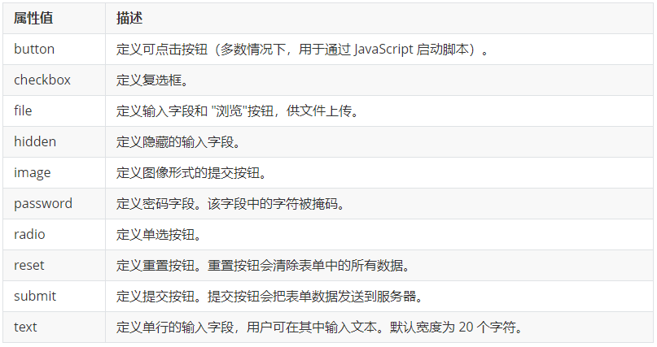

HTML，全称Hyper Text Markup Language，即超文本标记语言，是一门 **标签语言**，用于页面的内容展示<!-- more -->不仅只有文本，而且有图片、视频、声音，超越了文本，另外可以通过超级链接跳转到别的页面。

#### 1 网页结构
**元素：** 一对标签**及其标记的内容**叫做一个元素，元素是一个整体，比如`<p>整体是一个元素</p>`，html有两种元素，一般元素和空元素，常见空元素有`<br> `，空元素无需标记内容，起功能性的作用，比如换行或者显示内容

```html
<!--声明文档格式为html5-->
<!DOCTYPE HTML>

<html>

<!--头部元素的标签，对整体起作用的标签 <title> <style> <script> <link> <meta> 等放在这里 -->
<head></head>
    
<!-- <progress> <article>  等标签放在这里，用于版式段落的编排，网页内容显示在这里 -->
<body></body>
    
</html>
```

#### 2 HEAD标签
##### 2.1 标题

title：用于浏览器的标题栏显示，用户和搜索引擎通过这个来判断网页内容，每个页面有唯一的title

```html
<title></title>
```
headline：从<h1>~<h6>依次减小，一般用于标记网站名称
分级子标题：下一级是上一级的子标题，h3是h2的子标题，需要避免标题跳级，比如直接从h2跳到h4，不要用h标记副标题，h只用于标记独立的标题

```html
<h1></h1>
```
base：用于设置页面内所有链接的打开方式

```html
<base target="_blank" />
```

#### 3 BODY标签
##### 3.1 主页

包含页面的主体内容，一个页面只能使用一次，通常要加上role属性，<main role="main"></main>，添加role属性的目的是便于无障碍阅读

```html
<main></main>
```
用于包含独立、可再分配的内容项，不局限于文章、评论或工具等等，article可以嵌套article
```html
<article></article>
```
section包含相似主题的一组内容，是页面中的特定区域，而div不传达任何语义，如果只是想添加样式，则应该使用div
```html
<section></section>
```
包含与主体内容相关性不强的内容，侧栏，可嵌套在主要内容里，也可以是外面
```html
<aside></aside>
```
##### 3.2 段落

paragraph：段落，块级标签

```html
<p></p>
```
division：划分，划分版块，是通用的容器，本身无语义，用于单独设置样式，`id`：给`div`添加标记，div是块级标签，独占一行
```html
<div></div>
<div id="id"></div>
```
span：跨度，无语义，用于单独设置样式，是一个**行内标签**，用于行内布局，div和span无语义，**主要用来布局网页**
```html
<span></span>
```
emphasized：**斜体强调**，强调内容的着重点，重点在于强调，行内标签
strong：**粗体强调**，强调内容的重要性、重要程度，行内标签

```html
<em></em>
<strong></strong>
```
bold：粗体
italic：斜体
表示出于实用目的提醒读者的一块文字，不表达重要性或者强调，比如专业名词、技术术语，更推荐使用strong或者em，语义化更强，行内标签

```html
<b></b>
<i></i>
```
##### 3.3 引用

quote：引用
blockquote：块文本、长文本引用，左右缩进，可以添加cite属性，表明引述来源，cite属性对搜索引擎有用

```html
<q></q>
<blockquote cite="url"></blockquote>
```
cite：引用，通常是对电影、图书等的引用

```html
<cite></cite>
```
figure：图，figcaption可选，填写对图的描述，图可以是图表、照片、代码等类似独立的内容

```html
<figure><figcaption></figcaption></figure>
```
包含时间，datetime属性可选，必须填写标准格式 
```html
<time datetime=""></time>
```
abbreviation：缩写，`title`属性可选，expansion是全称，考虑到使用触摸屏设备用户的不便，最好将expansion写在括号里进行提示
```html
<abbr title="expansion"></abbr>
```

defines a definition term：定义术语
```html
<dfn></dfn>
```

superscripted：上标
subscripted：下标

```html
<sup></sup>
<sub></sub>
```

break：换行，html5里面不用加“ /”，不过推荐加上，另外不要轻易使用，因为这是表现，是css负责的事情，在诗歌、地址等接连短行的地方可以使用
```html
<br />
```

horizontal rule：水平尺，水平线
```html
<hr />
```

空格
```html
&nbsp;
```

address：通讯信息
```html
<address></address>
```

inserted：添加的内容
deleted：删除的内容
strikethrough：不再准确不再相关的内容

```html
<ins></ins>
<del></del>
<s></s>
```

标记，黄色背景突出显示
```html
<mark></mark>
```

完成度，进度条，可通过js修改value值动态更新
```html
<meter></meter>
<progress max="100" value="35"></progress>
```

code：单行代码
preformatted：预格式化，对需要保留格式显示的内容都可以用`pre`，如果需要使用`<`和`>`，则使用代码`&lt;`和`&gt;`

```html
<code></code>
<pre></pre>
```

##### 3.4 链接
网页中看到的标签，可以是文本、图片，html5里面a标签几乎可以包含所有非互动式元素，避免使用“点击这里”这样的需要上下文判断的提示

```html
<a href="#" title="标题" target="_blank" rel="external">此处可以是文本、图片、音视频等等非互动式元素</a>
```

- anchor，锚

- href即hypertext reference，超文本引用，即超级链接，等于#表示当前页面

- 相对路径：

  当前文件夹：什么都不写或者用 `./ `就表示当前文件夹，比如`images/g.gif` 与 `./images/g.gif`等价
  父文件夹：`../` 表示父文件夹，指向站内文件用相对路径，站外用绝对路径

- title：鼠标滑过链接会显示的内容

- target 目标，表示链接的打开方式

  _blank：在新窗口打开

  self：为默认值，在当前窗口打开

  _parent：在父窗口打开_

  top：在当前窗口打开，替换整个框架页

  不过不推荐使用target，因为这样支配了用户的行为

- rel：relationship，与链接目标之间的关系，可提升语义化程度

- 锚点链接：可以通过id属性创建指向其它网页特定位置的锚，可以快速定位到网页中的特定位置，如果是当前页面，url就不写

  ```html
  <a href="url#id">跳转到特定位置</a>
  <h1 id="id">这里是特定位置</h1>
  ```

- mailto: 邮件功能，只有冒号没有斜杠，多个地址用` ; `隔开，用` ? `隔开选项，后面全部用 `&` 隔开

  ```html
  <a href="mailto:wencaili1993@gmail.com?subject=邮件主题&body=邮件内容">发送邮件</a>
  ```

图片标签：

```html

```

- alter 改变，图片下载失败显示此文本
- title，鼠标放到图片上显示的文本

##### 3.5 表格

主要用于展示数据而非布局网页

```html
<table summary="摘要">
  <caption>
    table
  </caption>
  <thead>
    <tr>
      <th>name</th>
      <th>sex</th>
      <th>age</th>
    </tr>
  </thead>
  <tbody>
    <tr>
      <td>todd</td>
      <td>male</td>
      <td>6</td>
    </tr>
  </tbody>
</table>
```
table 表格
summary 摘要，不在浏览器中显示，目的在于增加表格可读性，方便搜索引擎
caption 标题
table head 表头，内容默认加粗显示
table row 表格行
table data 表格数据单元

表格结构标签，为了更好的表示表格语义，可使用thead和tbody将表格分割为表格头部和表格主体两个部分

合并单元格：

- 跨行合并：rowspan，同一列的上下单元格合并属于跨行合并
- 跨列合并：colspan，同一行的左右单元格合并属于跨列合并

合并步骤：

1. 确定合并的起始单元格，顺序是先上后下，先左后右

2. 为起始单元格添加属性，包括起始单元格在内合并多少个就填写多少个

3. 删除多余的合并掉的单元格

```html
<!-- 同列跨行合并3个单元格 -->
<td rowspan="3"><td>
```

##### 3.6 列表

列表最大的特点是整齐有序，适合用来布局，无序列表用得最多

- unordered list，无序列表

  list item：列表项目，将`li`放在`ul`或者`ol`的中间表示列表中的一行

```html
<ul>
  <li>列表项1</li>
  <li>列表项2</li>
</ul>
```
- ordered list，有序列表

```html
<ol>
  <li>列表项1</li>
  <li>列表项2</li>
</ol>
```
- 自定义列表
自定义列表通常用来**对术语或者名词进行解释描述**，常用于网站底部的描述部分
dl：自定义列表
dt：项目 
dd：项目的解释描述

```html
<dl>
	<dt>关于小米</dt>
  	<dd>了解小米</dd>
  	<dd>加入小米</dd>
  	<dd>投资者关系</dd>
</dl>
```
##### 3.7 表单

表单的作用通常是为了收集用户信息，或者向服务器传递数据

###### 3.7.1 表单域
```html
<form action="www.baidu.com/" method="GET" name="表单域名称"></form>
```
用户通过表单域与网站的服务器进行交互，用户在表单域里面的输入将会全部提交到服务器处理，各种表单控件放在表单域里面

`action`：用于处理传输数据的某个具体的服务器地址

`method`：

  - GET：
    1. 请求参数会在地址栏中显示。会封装到请求行中(HTTP协议后讲解)
    2. 请求参数大小是有限制的
    3. 不太安全
  - POST：
    1. 请求参数不会再地址栏中显示。会封装在请求体中(HTTP协议后讲解)
    2. 请求参数的大小没有限制
    3. 较为安全

`name`：给表单域起的名字，用于区分同一个页面中的不同的表单域

###### 3.7.2 表单控件

- `input`

  输入框控件，用type来指定不同的输入框类型，是单标签

  ```html
  <input type="text" value="文本" name="名称" maxlength="20" />
  <input type="radio" value="数值" name="名称" check="checked" />
  <input type="submit" value="提交" name="名称"/>
  ```

  

  `value`：提交到服务器的数据值，可以提前写好，作为控件的默认值，用户修改之后将会变为用户修改的值

  `name`：控件的名字，供后台程序使用，也用于区别不同的输入控件，同一组单选框设置相同的name值可以让用户只能选一个，同一组多选框也要设置相同的name值

- `label`

  为了改善用户体验，label标签与相关联的表单控件联系在一起，当点击label标签中的内容时，鼠标光标自动聚焦到（或者自动选中）与该label标签相关联的表单控件上，而不用一定要鼠标点到表单控件上，label标签和控件之间使用 label 的 for 属性与表单控件的 id 属性关联 （for id）

  ```html
  <label for="sex">男</label>
  <input type="radio" name="sex" id="sex" />
  ```

##### 3.8下拉列表

用于用户在多个选项中进行选择，可以节约页面空间

```html
<select multiple="multiple">
  <option value="1" selected="selected">选项1</option>
  <option value="2" selected="selected">选项2</option>
</select>
```

`value`：提交到服务器的值
`selected`：默认是否被选中
`multiple`：是否多选，按住ctrl可多选（应该不常用吧 =_=||）

一般最少要包含一对option


##### 3.9 文本域

用于用户输入文字较多的情况

可以用rows和cols属性来定义行列大小，但是一般不用，样式属于css的范围，应该用css来进行控制

```html
<textarea rows="50" cols="30">默认显示的文字</textarea>
```
#### 4 FOOT

创建页脚，通常包含版权声明、隐私政策等等，最近的祖先元素是body时，才是整个页面的页脚

```html
<footer></footer>
```

设置地标：只能对页面级页脚使用，且每个页面只能使用一次

```html
<footer role="contentinfo">
```
#### 5 HTML5

- 语义化标签

  这种语义化主要是针对搜索引擎的

  ```html
  <!-- 头部标签 -->
  <header></header>
  <!-- 导航标签 -->
  <nav></nav>
  <!-- 内容标签 -->
  <article></article>
  <!-- 定义文档某个区域 -->
  <section></section>
  <!-- 侧边栏标签 -->
  <aside></aside>
  <!-- 尾部标签 -->
  <footer></footer>
  ```
  
- 音视频标签

  视频格式mp4是各个浏览器支持最好的

  音频的使用和视频差不多，mp3支持最好，谷歌浏览器禁止了音频自动播放

  ```html
  <video
    class="video"
    src="/video2.mp4"
    autoplay="autoplay"  /* 自动播放 */
    muted="muted"  /* 谷歌浏览器设置了才能自动播放 */
    controls="controls"  /* 显示视频控件 */
    loop="loop"  /* 循环播放 */
    ></video>
  <audio src=""></audio>
  ```

- input新增类型和属性

  ```html
  <form action="">
    <ul>
      <li>邮箱: <input type="email" /></li>
      <li>网址: <input type="url" /></li>
      <li>日期: <input type="date" /></li>
      <li>时间: <input type="time" /></li>
      <li>数量: <input type="number" /></li>
      <li>手机号码: <input type="tel" /></li>
      <li>搜索: <input type="search" /></li>
      <li>颜色: <input type="color" /></li>
      <li><input type="submit" value="提交" /></li>
    </ul>
  </form>
  
  <form action="">
    <input
      type="search"
      required="required"
      placeholder="输入搜索关键字"
      autofocus="autofocus"
      autocomplete="off"
      />
    <input type="file" name="" id="" multiple="multiple" />
    <input type="submit" value="提交" />
  </form>
  ```


#### 6 HTML开发规范
导航栏通常采用`li + a`的做法，这样导航栏的列表才会更有条理，也不会被搜索引擎识别为链接堆砌而导致降权，有利于SEO优化