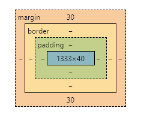

CSS，全称是cascading style sheets，层叠样式表，用来定义网页的样式及外观布局...<!-- more -->，比如文字大小、颜色，元素之间的页面布局大小宽度位置等等

#### 1 css引用方式
##### 1.1 内联式
直接将CSS代码写在HTML标签中就叫做内联式

不推荐这种html和css混写的做法

```html
<p style="color:red; font-size:16px;">red paragraph</p>
```

##### 1.2 嵌入式
将css写在style标签里面，style标签一般放在head标签里面，这里的type是可以省略的

同样是不推荐的，因为仍然是在html里面写css

```html
<head>
  <style type="text/css">
    p {
      color: red;
      font-size: 16px;
    }
  </style>
</head>
```

##### 1.3 外部式
外部式，顾名思义就是将css写在单独的外部文件里面，然后在html文件中进行引入，在需要引入的地方使用link标签引入即可，通常在head标签里面引入

推荐使用这种方式，这样html和css各司其职，功能分离，网页编写也是渐进增强的，更容易维护

```html
<head>
	<link href="css.css" rel="stylesheet" type="text/css" />
</head>
```

#### 2 css组成结构
css由选择器和声明块组成

选择器即需要去修饰的网页元素

声明块即修饰的内容，是用大括号包括起来的部分，修饰内容由一条一条的声明（属性和对应的值）组成

每一条声明末尾需要添加分号，最后一条声明可以不加分号，不过最好加上，更符合规范

```css
/* 我是css注释 */
p {
    color: red;
    font-size: 12px;
}
```

#### 3 css选择器
##### 3.1 基础选择器
###### 3.1.1 标签选择器
直接用标签作为选择器，比如h1、p等等，优点是可以快速选出所有的同类型标签，但是优点同时也是缺点，只能全部选择不能进行差异化选择

###### 3.1.2 类选择器
类选择器就可以进行差异化选择了，因为类名是由我们自定义的（以点号开头），你可以将类放到想要改变样式的标签上从而实现差异化选择，同时类选择器一次定义可以多处使用，很方便复用，**非常常用**

定义：

```css
.red {
	color: red;
}

.big_size {
	font-size: 25px;
} 
```
使用：
```html
<span class="red big_size">大字号红色字体</span>
```
一个标签内部只能有一个class属性，但是class属性里面可以有多个类名，多个类名之间用空格隔开

这样做的好处在于可以将公共样式抽离到一个单独的类里面，然后不同的元素调用公共样式之后还可以调用自己单独的样式，以后需要修改公共样式的时候只需要修改公共类就行了，方便了维护，同时公共样式的抽离也减少了整体代码量，代码更加简洁

###### 3.1.3 id选择器
和类选择器相似的定义方式，不同的是id选择器是以`#`开头，而不是`.`，注意 id **不要重复调用**，一个标签元素调用id之后，别的元素不要再次调用，这是一种规范
>实际上可以再次调用，但是由于id一般是和js一起搭配使用的，比如js是通过id来选择元素的，所以要求id具有唯一性
>
>id起到标识、识别作用，而class是共性，一类共同的属性的集合体
>
>在页面布局中多用class，**网页布局里面**一般不用id选择器，因为这样会降低灵活性，不利于代码重用

定义：
```css
#unique {
	color: red;
} 
```
使用：
```html
<div id="unique">红色字体</div>
```

###### 3.1.4 通配符选择器
使用通配符*作为选择器，作用是选择页面上**所有的元素**，但这会让加载网页变慢，应该尽量少用，一般特殊情况下会使用，比如清除所有元素的内外边距

```css
* {
  margin: 0;
  padding: 0;
}
```

##### 3.2 复合选择器
###### 3.2.1 后代选择器
选择某个元素的后代元素，后代元素写在父元素的后面，用空格隔开，最终选择到的只有排在最后的**一个类型的元素**，前面的父元素不会被选择，很常用
```css
/* ul元素中的所有li元素被选中 */
ul li {
	border: 1px solid red;
}

/* ol元素中的所有li元素被选中 */
ol li {
	border: 1px solid green;
}

/* ol元素中的所有li元素的所有a元素被选中 */
ol li a {
	text-decoration: none;
}
```
在后代选择器中出现的选择器可以是任意的基础选择器，比如类、id选择器
```css
.nav ul li {
	color: red;
}
```

###### 3.2.2 子选择器
子选择器只选择距离父元素最近一代子元素，所以也叫亲儿子选择器
```css
div>strong {
	color: red;
}
```

###### 3.2.3 并集选择器
并集选择器可以同时选择出一组选择器，为它们同时设置样式，选择器之间用`,`隔开，任何形式的选择器都可以作为并集选择器的一部分
```css
div,
p,
.pig li {
  color: pink;
}
```

###### 3.2.4 交集选择器
交集选择器由两个选择器共同选择，中间不能有空格
```css
p.pig {
  color: pink;
}
```

###### 3.2.5 伪类选择器
伪类选择器通常用于给元素添加特效
- 链接伪类选择器
  
  ```css
  a:link      /* 选择所有未被访问的链接 */
  a:visited   /* 选择所有已被访问的链接 */
  a:hover     /* 鼠标移动到链接上的时候 */
  a:active    /* 选择活动的链接（鼠标按下还未弹起时） */
  ```
  >按照 lvha 的顺序书写（lv包包就是hao），不要改变顺序 ，否则可能引起错误，实际开发中往往只需要写hover就行了，看具体情况增加
  
- 聚焦伪类选择器
  用于给获得焦点的表单元素添加效果
  
  ```css
  input:focus {
    background-color: yellow; /* 输入框被选中时输入框的背景颜色变为黄色 */
  }
  ```
  新增选择器参见本文中的 [13.5 新增选择器](#)

#### 5 文字处理
##### 5.1 指定字体
使用 `font-family` 指定字体，可以指定任何字体，不过用户只能看到他们系统里安装的字体，除非字体是加载的网页web字体

```css
p {
	font-family: Geneva;
}

p {
	font-family: "Gill Sans", "微软雅黑", "Microsoft YaHei", sans-serif;
}
```
>如果字体名称中间有空格或者是中文字体，应该加引号，单双引号都可以

可以指定多种字体作为备选，中间以 `,` 隔开，系统会依次判断用户是否安装了所指定的字体，最后一个字体应是表示类别的字体，以保证字体正常显示，中文名称字体最好转换成 Unicode 字体，以保证兼容性，推荐使用系统默认字体

##### 5.2 字体效果
###### 5.2.1 文字大小
使用像素单位指定：
```css
p {
	font-size: 16px;
}
```
>谷歌浏览器默认16px
>
>不同浏览器可能不同，所以要指定一个确定的像素大小，不要用默认的
>
>标题标签的文字大小不会继承父元素，需要单独指定

使用百分比指定：

用百分比指定文字大小，100%为默认字体大小，大部分系统的默认字体大小为16px

```css
p {
    font-size: 100%;
}
```

相对比例指定：

用相对比例指定文字大小，相对于**父元素**的字体大小，1.75em=28px/16px

```css
p {
    font-size: 1.75em;
}
```

css3 引入了新的比例：`rem`，即 root em，以根元素即 `<html>` 的字体大小作为参照，通常大小为 16px

使用 rem 简化了字体设置，因为父元素的字体大小一般是不确定的，而根元素的是唯一确定的

```css
p {
    font-size: 2rem;
}
```

###### 5.2.2 斜体与粗体
- 设置斜体：
  默认是 normal，italic 是斜体，很少去设置文字为斜体，反而通常将默认的斜体设置为普通样式更为常用
  
  ```css
  p {
  	font-style: italic;
  }
  
  /* 常用 */
  i,
  em {
      font-style: normal;
  }
  ```
- 设置粗体：
  值可以用单词或数字设置，700 相当于 bold，400 相当于 normal，更推荐使用数字，数字的范围是 100 ~ 900 中的 100 的倍数

  ```css
  p {
  	font-weight: 700;
  }
  ```

###### 5.2.3 行高（行间距）
用于设置行间的距离，由 `文字大小 + 上下距离` 组成

常用无单位的数字设置，也可以用 px 或 百分比 或 em

用纯数字设置时，计算公式：**行高 = 数字 * 当前元素的字体大小**

```css
p {
    line-height: 1.6;  /* 假设当前元素文字大小为 16px，则行高为 1.6 x 16px = 25.6px */
}
```
##### 5.3 复合属性
对于字体的样式设置可以使用复合属性的形式简写，使样式表保持简洁
```css
/* font: font-style font-weight font-size/line-height font-family; */
body {
	font: italic 700 .875em/1.2 "Palatino Linotype", Tahoma, serif, sans-serif;
}
```
>1. 注意顺序不能改变，否则会出错从而不生效
>2. 不必指出所有的字体属性，但是必须指定字体大小和字体系列
>3. 简记：样式字体大小行高

##### 5.4 颜色
用color属性设置，值可以用三种方式设置，分别是颜色名字、rgb和十六进制，推荐使用十六进制
```css
p {
	color: red;  /* 不推荐，颜色数量太少，除非刚好用到 */
}

p {
	color: rgb(136,156,223);  /* 0~255之间的整数 */
}

p {
	color: rgb(21%,39%,20%);  /* 百分比 */
}

p {
	color: #00ffff;
	/* 十六进制的本质和rgb一样，只是写法换成了十六进制，00-r ff-g ff-b */
	/* 如果由3对重复数字或字母组成，可缩写为`#0ff`，推荐这种写法 */
}
```

在 css3 中支持 alpha 透明度的颜色模式，rgba（常用）和 hsla
```css
p {
	color: rgba(23,34,56,0.75); /* a的值在0~1之间，0为完全透明，1为完全不透明 */
}

p {
	color: hsla(233,100%,28%,0.75);
	/* hue色相，范围0~360，0和360为红色，为色轮的起点和终点 */
	/* saturation饱和度，lightness亮度 */
}
```

##### 5.5 文本对齐
- 文本水平对齐

  也可以用于 **行内元素** 的水平居中

  ```css
  h1 {
      text-align: center;  /* left：左对齐 right：右对齐 justify：文字向两侧对齐，文字间距可能会被拉伸 */
  }
  ```

- 文本垂直居中
  方法是让行高等于盒子的高度，由于行高由文字大小和上下距离构成，当行高等于盒子高度时，上下空隙正好就把文字挤到了盒子的中间，实现了文字垂直居中的目的，又因为行高是顶着盒子顶部对齐的，由此也可知，当行高小于盒子高度时文字会偏上，反之会偏下

  ```css
  div {
      height: 40px;
      line-height: 40px;
  }
  ```
##### 5.6 文本装饰
所以如果想去掉a链接的下划线，可以主动指定文本装饰属性为none即可
```css
a {
    text-decoration: none;
}
```

| none         | 默认，无装饰线            |
| ------------ | ------------------------- |
| underline    | 下划线（a链接自带下划线） |
| overline     | 上划线                    |
| line-through | 删除线                    |

##### 5.7 文本缩进
用于指定文本的第一行缩进，通常是段落首行的缩进
```css
.project p {
	text-indent: 2em; /* 正好缩进两个字 */
}
```
>em是相对大小，相对于当前元素的字体大小的多少倍，1em是1倍，如果当前元素没有设置文字大小，则以父元素为准

##### 5.8 字间距与字偶距
字间距：单词之间的距离

```css
word-spacing: 1.5em;
```

字偶距：字母之间的距离

```css
letter-spacing: 1.5em;
```

#### 6 背景
给元素设置背景样式
##### 6.1 背景颜色
元素的背景颜色默认值是transparent，透明的，可以指定固定颜色
```css
body {
    background-color: #6f6;
}
```
##### 6.2 背景图片
使用背景图片的优点是相对于直接插入图片我们可以**更好地控制图片在盒子中的位置**，常用于logo、装饰性的小图片或大图片背景，默认是none，可以指定背景图片的地址
```css
body {
    background-image: url(url);
}
```

>当背景颜色和背景图片同时设置时，背景图片会压住背景颜色位于上层

##### 6.3 背景平铺
背景图片默认是水平和垂直方向都是平铺的，即repeat，我们可以改变它的值

```css
body {
    background-repeat: no-repeat;
}
```

| no-repeat | 不重复   |
| --------- | -------- |
| repeat-x  | 横向重复 |
| repeat-y  | 纵向重复 |

##### 6.4 背景固定
用于设置背景图片是固定的还是可以随着页面其余部分滚动，常用于做网页视差滚动效果

```css
  body {
      background-attachment: fixed;
  }
```

| scroll | 背景随页面滚动，默认值 |
| ------ | ---------------------- |
| local  | 背景随背景所在元素滚动 |
| fixed  | 背景固定在窗口上       |

##### 6.5 背景位置
背景位置用于设置背景图片在盒子中的位置，可以用方位名词和数值进行设置

- 方位名词：left center right  |  top center bottom

  1. 使用方位名词，不用考虑顺序，因为都可以识别看出来

  2. 只写一个值时，另一个默认是center

  ```css
  body {
      background-position: left top;
  }
  ```

- 数值：像素值

  有时候背景图片中我们需要的部分距离盒子边缘有一定的距离，这时可以直接指定像素值等精确数值
  
  1. 使用数值时，顺序必是**左上**，即左边的数值表示距离盒子左边边缘的距离，右边的数值表示距离盒子上面边缘的距离
  2. 只写一个值时，表示距离盒子左边边缘的距离，垂直方向默认为center
  
  ```css
  body {
      background-position: 20px 50px;
  }
  
  body {
      background-position: 20px;
  }
  ```
  
- 混合单位

  混合单位是方位名词和数值的混合使用，需要注意混合单位也是有顺序的，顺序和数值一样

  ```css
  body {
      background-position: center 20px;
  }
  ```


>默认值：left top 或者 0 0，表示背景图片默认位于盒子的左上角

##### 6.6 复合写法
可以像字体一样简写，节约代码量，推荐

1. 背景图片书写顺序没有要求，但约定为如下顺序
2. 不必指定所有属性，未指定的属性将会是默认值

```css
body {
    background: #ccc url('url') repeat-x fixed top center;
}
```

##### 6.7 透明背景色
css3提供了背景颜色半透明效果，可以用于设置阴影效果，很常用，给背景设置rgba透明色即可，小数的整数0可以省略
```css
div {
    background: rgba(0,0,0,.5);
}
```

##### 6.8 背景尺寸
```css
div {
    width: 500px;
    height: 500px;
    border: 2px solid red;
    background: url(images/dog.jpg) no-repeat;
    /* 1. 同时设置背景图片的宽度和高度 */
    background-size: 500px 200px;
    /* 2. 只写一个参数就是宽度，高度默认等比例缩放 */
    background-size: 500px;
    /* 3. 里面的单位可以是百分比，这是相对于父盒子来说的 */
    background-size: 50%;
    /* 4. cover 等比例拉伸 要完全覆盖div盒子，可能有部分背景图片显示不全 */
    background-size: cover;
    /* 4. contain 高度和宽度等比例拉伸，当宽度或者高度铺满div盒子就不再进行拉伸了，因此盒子可能不能被全覆盖有部分空白区域 */
    background-size: contain;
}
```

#### 7 CSS三大特性
css有3大特性，分别是层叠性、继承性和优先级
##### 7.1 层叠性
层叠性主要是解决css的样式冲突问题的，如果相同的选择器设置了相同的样式，但是值不一样，这时就会产生样式冲突，发生冲突时遵循**就近原则**
##### 7.2 继承性

子元素可以继承父元素的某些样式，比如文本颜色、字体大小，和文字相关的都可以继承（text-，font-，line-，color等），利用继承的特性可以简化代码

行高也可以继承，如果是不带单位的数字，则当前元素的行高等于数字乘以当前元素的文字大小，这样设置的优点是可以根据子元素的文字大小自动匹配合适的行高，比较灵活，而不是直接从父元素继承固定的行高

##### 7.3 优先级

当给同一个元素指定了多个选择器时，元素必须要决定哪些选择器生效，这时就会产生优先级问题

- 选择器相同，则问题变为层叠性问题

- 选择器不同，则看选择器权重来决定优先级

  |               选择器               |  权重   |
  | :--------------------------------: | :-----: |
  |              * / 继承              | 0,0,0,0 |
  |     标签选择器 / 伪元素选择器      | 0,0,0,1 |
  | 类选择器 / 伪类选择器 / 属性选择器 | 0,0,1,0 |
  |              id选择器              | 0,1,0,0 |
  |              行内样式              | 1,0,0,0 |
  |             !important             |    ∞    |

  1. 权重由四组数字组成，但是不会进位
  2. 后面的选择器的权重永远大于前面的选择器
  3. 权重判断从左到右，某位数字相等之后再判断下一位
  4. 标签 1，类 10，ID 100

>继承的优先级是最低的，即便父元素的样式优先级为无穷大，但是子元素继承过来之后由于是继承的所以依然是0，所以当单独选出了子元素设置样式之后，就会覆盖继承过来的父元素的样式

当使用复合选择器时，选择器之间的权重会进行叠加，这时权重需要计算，比如有如下html
```html
<ul class="nav">
    <li>巧克力</li>
    <li>冰淇淋</li>
    <li>奶茶</li>
</ul>
```
css设置为
```css
/* 权重：0,0,0,1，结果为1 */
li {
    color: red;
}

/* 权重：0,0,0,1 + 0,0,0,1 = 0,0,0,2，结果为2 */
ul li {
    color: green;
}

/* 权重：0,0,1,0 + 0,0,0,1 = 0,0,1,1，结果为11 */
.nav li {
    color: hotpink;
}
```
由权重的计算结果可知列表的颜色最终为粉色

#### 8 盒子模型
网页布局的三大核心，分别是盒子模型、浮动和定位，先来学习盒子模型

网页布局的本质其实可以划分为一个个的**盒子**，我们布局其实也就是在给盒子**设置样式**和**摆放位置**

盒子模型就是**将网页元素看做是一个盒子**，盒子由内容、边框和内外边距组成，如图所示



- 外边距（margin）：盒子的外边距，盒子与盒子之间的距离**通常**等于两个盒子的外边距之和
- 边框（border）：盒子的边框，默认无宽度，无样式，黑色
- 内边距（padding）：内容与盒子边框之间的距离
- 内容（content）：盒子里实际装的对象，图中的蓝色部分

>如果想单独指定盒子某一边的样式，可以加上方向进行设置，上下左右方向分别是 top bottom left right
>比如左外边距是margin-left，左内边距是padding-left，左边框是border-left，以此类推

##### 8.1 边框
边框可以指定样式和颜色
```css
div {
    border-width: 1px;
    border-style: solid; /* none: 默认 solid: 实线 dashed: 虚线 dotted: 点线 */
    border-color: pink;
}
```

边框可以采用复合写法，没有顺序要求，不过约定如下顺序

```css
div {
    border: 1px solid pink;
}
```

有时候两个**表格的边框**挨在一起会变得很粗，影响美观，这时可以设置边框重叠，这样表格的边框就会合并成一条了

```css
td {
    border-collapse: collapse;
}
```

>边框会影响盒子的大小，直接给盒子设置的宽高仅仅决定了盒子内容的宽高
>
>如果指定了盒子边框的宽度，那么盒子大小就是盒子内容大小加上边框宽度

##### 8.2 内边距
内边距通过数值设置，默认没有内边距，可以简写，外边距和内边距的简写方式是一样的

```css
div {
    padding: 6px;  /* 上下左右：6px */
}
   
div {
    padding: 6px 9px;  /* 上下：6px，左右：9px */
}
   
div {
    padding: 6px 9px 11px;  /* 上：6px 左右：9px 下：11px */
}
   
div {
    padding: 6px 9px 11px 0;  /* 上：6px 右：9px 下：11px 左：0 */
}
```

>内边距也会影响盒子大小！
>
>内边距也会影响盒子大小！
>
>内边距也会影响盒子大小！
>
>如果指定了内边距大小，那么盒子大小会加上内边距的大小，即内容大小加内边距大小
>
>如果想要内边距不影响盒子大小的效果，那么需要计算，用盒子的宽高减去内边距的大小的结果重新设置盒子的宽高，需要注意有时候需要减去两边的内边距的和才是正确的计算
>
>但是如果没有指定盒子的宽高，即盒子内容宽高没有指定，则内边距不会影响盒子大小，因为盒子内容的大小会跟随内边距动态变化

##### 8.3 外边距
外边距用于控制盒子之间的距离，默认没有外边距，但是浏览器的body一般默认有8px的外边距
- 外边距的典型应用
  **块级盒子水平居中**，盒子必须要指定宽度，然后设置左右外边距为auto
  
  ```css
  div {
      margin: 0 auto;
  }
  ```
  >这个方法只能用在块级盒子上，对于行内元素和行内块元素的水平居中只需要设置父元素的text-align属性为center就可以了
  
- 外边距合并（垂直方向上）
  1. 相邻元素的垂直外边距会出现合并的现象，在垂直方向上两个盒子间的距离不等于它们的外边距之和，而是取它们之中较大的外边距，小的那个外边距被合并掉了，这种现象只会在**垂直方向**出现

     解决办法：只给一个盒子添加外边距即可，另一个不需要添加

  2. 另一种现象是嵌套的两个元素，父元素与子元素同时有上外边距，这时父元素会塌陷较大的外边距值

     解决办法：给父元素设置上边框或者上内边距或者设置overflow属性为hidden

     > 浮动、固定定位和绝对定位的盒子不会外边距塌陷
     >
     > 对行内元素，尽量只设置左右内外边距，因为上下的设置了也不起作用

##### 8.4 清除默认内外边距
由于网页元素大多自带了默认的内外边距，不同的元素可能不一样，不同的浏览器也可能不一样，这会影响网页的布局，所以干脆将所有元素的内外边距都清除掉
```css
* {
	margin: 0;
    padding: 0;
}
```
css3盒子模型参见本文中的 [13.6 css3盒子模型](#)

#### 9 浮动
##### 9.1 布局方式

网页布局有3种排列方式，分别是标准流、浮动和定位

标准流就是标签按照规定好的默认方式排列

比如块级元素独占一行，从上到下排列，行内元素一行多排，从左到右排列

而往往很多常见的效果无法用标准流完成，比如块级元素紧挨着排列成一行，浮动可以改变元素的默认排列方式，可以轻松完成这些布局，水平布局里面浮动用得很多，垂直布局用标准流就可以了

用float属性声明浮动，元素会朝指定方向浮动过去，直到其边缘碰到包含块的边缘或者另一个浮动框的边缘为止

```css
div {
    float: left;
}
```
| none  | 默认值，没有浮动   |
| ----- | ------------------ |
| left  | 左浮动，向左边浮动 |
| right | 右浮动，向右边浮动 |

##### 9.2 浮动特性

1. 浮动元素会脱离标准流，俗称脱标

   添加浮动属性后，元素脱离标准流的控制（浮），移动到指定位置（动），**原来的位置不会保留**，留给别的元素占领，所以如果有两个标准流的div盒子，只给第一个div加浮动，那么第二个div会移动上去占领第一个div的位置，浮动元素不会影响前面的标准流元素，只会影响后面的标准流元素

2. 浮动元素会在一行内显示并且**顶部对齐**

   如果给多个盒子添加浮动，那么它们是以顶部为标准来对齐的，不同高度的盒子的顶部是对齐的

   如果父元素一行装不下了，多出的浮动盒子会另起一行在一行内排列

3. 浮动元素具有**行内块特性**

   - 任何元素都可以添加浮动，添加浮动之后就具有了行内块元素的相似特性
   
     为什么是相似呢，因为浮动元素不像行内块元素，**浮动元素的中间是没有缝隙的**，行内块元素之间会有默认的空白缝隙
   
   - 块级元素添加浮动后，默认宽度不再是父元素的100%，独占一行了，宽度变成其内容的宽度

##### 9.3 浮动应用
浮动的元素通常和标准流的父元素一起搭配使用，因为浮动元素不是浮到最左就是最右，所以为了约束浮动元素的位置，通常是先用标准流元素进行垂直排列布局，然后再在标准流元素的内部让浮动元素进行水平排列

##### 9.4 清除浮动

某些情况下，比如浮动子元素的个数不确定，未来可能会增减浮动子元素的个数，这个时候就不方便将父元素的高度写死，然而不给父元素高度，当子元素浮动之后，父元素因为还是标准流，因此高度会直接归零，这种情况下就需要清除浮动了

清除浮动需要设置clear属性

```css
div {
	clear: both;
}
```

| left  | 不允许左侧有浮动元素，清除左侧浮动的影响 |
| ----- | ---------------------------------------- |
| right | 不允许右侧有浮动元素，清除右侧浮动的影响 |
| both  | 同时清除左右两侧的浮动影响，用得最多     |

有四种清除浮动的方法，分别介绍

1. 额外标签法（隔墙法）

   具体是在浮动元素的后面增加一个清除了浮动的空标签，且这个空标签**必须是块级标签**

   ```css
   .clear {
       clear: both;
   }
   ```

   ```html
   <div class="box">
       <div class="one">one</div>
       <div class="two">two</div>
       <div class="clear"></div>
   </div>
   ```

   优点：通俗易懂，书写方便

   缺点：添加无意义的标签，导致网页结构性变差

   虽然是W3C推荐的做法但是**不推荐使用**

2. overflow法

   直接给父元素添加overflow属性，值可以是hidden、auto或scroll，hidden最常用

   ```css
   .box {
       overflow: hidden;
   }
   ```

   优点：代码简洁

   缺点：无法显示溢出的部分

3. 伪元素法

   给父元素添加`::after`伪元素，然后给伪元素清除浮动，所以其本质上相当于额外标签法的升级版

   由于伪元素是行内标签，所以要更改显示模式为块级元素

   ```css
   .clearfix::after {
       content: "";
       display: block;
       height: 0;
       clear: both;
       visibility: hidden;
   }
   .clearfix {
       *zoom: 1; /* IE6、7专属属性，IE牛逼 */
   }
   ```
   优点：不需要添加无意义的标签，网页结构性良好

   缺点：不算通俗易懂，书写不方便，需要照顾低版本浏览器

   由于其优点的存在，这种方法用得挺多

4. 双伪元素法

   给父元素添加双伪元素，并且显示模式为table，也就是转换为块级元素并且在一行显示

   ```css
   .clearfix::before,
   .clearfix::after {
       content: "";
       display: table;
   }
   .clearfix::after {
       clear: both;
   }
   .clearfix {
       *zoom: 1;
   }
   ```

   优缺点和伪元素法一致，也用得挺多

#### 10 定位

有些时候标准流和浮动不能满足我们的要求，比如：要求一个盒子在另一个盒子里自由移动位置，且位于最上层，或者要求盒子固定在屏幕中的某个点上，即使屏幕滚动也不改变其固定的位置，要满足这种需求，就需要使用定位了

##### 10.1 定位组成
`定位 = 定位模式 + 边偏移`
定位模式常用的共有四种，通过position属性设置：

| static   | 静态定位（默认），没有定位，无边偏移，相当于标准流 |
| -------- | -------------------------------------------------- |
| relative | 相对定位                                           |
| absolute | 绝对定位                                           |
| fixed    | 固定定位                                           |

边偏移决定盒子最终的位置：

| top    | 顶端偏移量，元素距离父元素上边线的距离 |
| ------ | -------------------------------------- |
| right  | 右侧偏移量，元素距离父元素右边线的距离 |
| bottom | 底部偏移量，元素距离父元素下边线的距离 |
| left   | 左侧偏移量，元素距离父元素左边线的距离 |

##### 10.2 relative

相对定位，说到相对的话重点是相对于谁，那么这里的相对定位是相对于自己的，也就是相对于自己原来的位置进行定位，搭配边偏移改变自己的位置，**相对于自己原来的位置**移动多少距离（边偏移）

相对定位的盒子移动之后，**原来的位置会继续保留**，不会被其他标准流的盒子占领

但一般不用相对定位来定位盒子，相对定位的主要作用就是给绝对定位当爹（ ? ）

##### 10.3 absolute

绝对定位，虽然名字是绝对的，可是定位依然是相对的，不过绝对定位相对的对象是它的祖先元素

1. 如果绝对定位的盒子没有祖先元素，或者有祖先元素但是祖先元素没有定位属性，那么绝对定位的盒子就会相对于浏览器进行定位

   > 儿子（绝对定位的盒子）天生没爹（祖先元素），那就只能以天地为爹（浏览器）了，或者有爹，但爹没本事（无定位），那也只能出去靠天地创业了（不是）

2. 但是当我们的祖先元素变得有定位（相对、绝对、固定都可以）了，那么绝对定位的盒子就又会以祖先元素为准进行定位了，注意这里的祖先元素是距离绝对定位的盒子**最近的祖先元素**，也就是就近原则

   > 爹有本事了，那儿子就会重新跑回来听爹的话了，爹没本事，但是爷爷有本事，那儿子就跟爷爷更亲，爷爷和爹都有本事，那儿子就跟和自己离得更近的爹更亲，没错，儿子就是这样现实，总是要实现利益最大化（大雾）

3. 绝对定位的盒子移动之后，**原来的位置不会保留**，会被别的标准流盒子占领位置，而且绝对定位的盒子飘得比浮动的盒子还高，位于最上层

   > 儿子现实，那别人对儿子也会一样（哎哟，有道理哦）

##### 10.4 子绝父相

为了限制住子元素的绝对定位的位置，父元素需要有定位，固定定位不够灵活大部分情况下肯定不行

那是加相对还是绝对定位呢，如果是绝对定位，那么父元素会浮起来，后面的标准流元素会占据父元素原来的位置，导致布局错乱

相对定位就不会有这种问题，即便父元素移动了，原来的位置还是保留的，这样就很方便我们布局了，因此父元素的定位添加相对定位最为合适，这就是子绝父相的由来，当然这不是绝对的规则，如果父元素不需要保留位置，那么子绝父绝也是可以的

子绝父相的典型应用场景就是**给某个元素添加小图标**

##### 10.5 固定定位

固定定位可以固定到浏览器的**可视区域**的某个位置，不会随着页面的滚动而滚动

1. 固定定位是相对于浏览器的可视区域来定位的，可视区域是指我们可以看见的浏览器窗口的显示范围，不包括下面的看不见的网页部分，如果改变浏览器的窗口大小，可视区域大小也随之改变，固定定位依然是以当前的浏览器窗口可视区域作为参考的，注意固定定位和它的祖先元素没有任何关系

2. 固定定位浮起来之后，原来的位置不会保留

例子：让固定定位盒子紧贴版心盒子的右边

只需要先往右边定位浏览器窗口可视区域的50%，然后利用外边距，让外边距等于版心盒子宽度的一半，这样就实现效果了

```css
.back {
  position: fixed;
  bottom: 100px;
  left: 50%;
  margin-left: 600px;
}
```

##### 10.6 粘性定位
当我们需要一个盒子开始是相对定位的效果，随着浏览器页面的滚动又变成固定定位的效果，那么这种时候就可以采用粘性定位了，粘性定位同时具有相对定位和固定定位的特性

1. 粘性定位是以浏览器可视区域为参考的（固定定位特性）
2. 粘性定位原来的位置会保留（相对定位特性）
3. 必须至少添加一个边偏移属性才会变成粘性定位，否则会被当做相对定位处理

```css
.nav {
    position: sticky;
    top: 0;
    width: 800px;
    height: 60px;
    background-color: violet;
    margin: 100px auto;
}
```
在nav盒子没有滚到挨着浏览器窗口上边框的时候，nav盒子会被当做相对定位随着页面一起滚动，当top为0的条件满足之后，nav盒子会变成固定定位的盒子固定在浏览器窗口的上沿保持不动

> 粘性定位不兼容IE，故用得较少

##### 10.6 定位叠放次序
有时候定位的时候盒子之间难免发生重叠，而且不是我们需要的重叠顺序，这时可以利用z-index属性调整z轴距离，改变叠放次序，参数是整数数值，默认auto，数值越大越靠上
1. 默认情况下或者参数一致，后来者居上

2. 参数只能是整数，不能加单位

3. 只有有定位的盒子才有这个属性，标准流和浮动没有

##### 10.7 定位拓展
- 绝对定位的盒子居中

  可以先让盒子走浏览器宽度的50%，然后走回多走的部分，也就是盒子自身宽度的一半，利用外边距实现走回来

  ```css
  /* 水平居中 */
  .box {
    position: absolute;
    left: 50%;
    margin-left: -100px;
    width: 200px;
    height: 300px;
    background-color: violet;
  }
  
  /* 垂直居中 */
  .box {
    position: absolute;
    top: 50%;
    margin-top: -150px;
    width: 200px;
    height: 300px;
    background-color: violet;
  }
  ```
  如果是子绝父相，那么就走父盒子宽度的50%就可以了
  
- 行内元素加了绝对、固定定位可以设置宽高；块级元素加了绝对、固定定位不给宽高默认是内容的宽高

- 浮动的元素不会盖住升上来的元素的文字，而绝对和固定定位的元素会，因为浮动最初的目的就是用来做文字环绕效果的，这一个传统沿袭了下来

- 显示与隐藏

  1. display

     隐藏元素后，不再占用原来的位置，但是元素并没有被删除，还是存在的，只是隐藏了，可以搭配js做特效，很常用

     | none  | 隐藏元素                                   |
     | ----- | ------------------------------------------ |
     | block | 不仅仅是转换为块级元素显示，还有显示的意思 |

  2. visibility

     隐藏元素后，继续占有原来的位置，同样的，元素没有被删除

     | visible | 元素可见 |
     | ------- | -------- |
     | hidden  | 隐藏元素 |

  3. overflow

     overflow属性主要规定了当元素内容溢出时，溢出的部分如何显示的问题

     | visible | 默认，显示溢出的部分，不添加滚动条 |
     | ------- | ---------------------------------- |
     | hidden  | 隐藏溢出的部分                     |
     | scroll  | 添加滚动条，不管溢不溢出           |
     | auto    | 在需要的时候显示滚动条             |
     
     有定位的盒子慎用overflow hidden，因为可能会把我们故意超出的部分元素给隐藏了

#### 11 CSS高级技巧
##### 11.1 精灵图
一个网页中往往会应用很多的小图片作为图标或者背景图片，这样会造成发送很多次网络请求的现象，服务器压力增大，会降低网页加载速度，这个时候可以将这些小图片全部做到一张大图上，这样就只需要请求一次服务器，降低了服务器的压力，这张大图片就叫做精灵图

精灵图往往应用在图标或者是背景图片上，产品图或插入的图片不需要，这些图片可能会经常需要更换，不适合用精灵图来做

精灵图使用：

精灵图需要作为背景图片来使用，需要设置**元素的宽高**等于**精灵图中小图标的宽高**，然后通过调整背景图片位置属性定位到精灵图中的小图标的位置，这样元素就显示出了小图标，利用`background-position`属性调整位置，也可以简写到`background`属性里

```css
.box1 {
    width: 58px;
    height: 58px;
    background: url(images/sprites.png) no-repeat -183px 0;
    margin: 50px auto;
}
```

##### 11.2 字体图标
除了精灵图，对于简单的小图标还可以用字体图标来做，精灵图做小图标有如下缺点：

1. **放大缩小会失真**
2. **后期不容易修改**
3. 图片文件相比字体图标还是很大的
4. 不容易修改图标颜色

字体图标完全是字体，容易修改颜色，更换图标也更容易，放大缩小不会失真

但是字体图标某些情况下不能替代精灵图，因为**精灵图可以定制复杂的图标**，而字体图标往往只是简单的图标

因此是使用字体图标还是精灵图要根据具体情况来判定

常用的字体图标网站：国外的`icomoon.io`和国内的`iconfont.cn`

icomoon网站图标的使用方法：
1. 在网站上挑选喜欢的字体图标下载
2. 复制fonts文件夹到项目文件夹中
3. 在css中引用`@font-face`
4. 复制demo.html中的图标或者代码（代码前面要加反斜线转义）到html中，推荐使用代码

后期追加图标的方法：把下载文件夹中的`selection.json`上传到icomoon网站，重新添加图标下载即可

> 字体图标的原理和精灵图是差不多的，都是一次性请求服务器获得需要的文件（精灵图或者字体文件），然后浏览器将其缓存起来供网页调用，使用其中的图标

##### 11.3 css三角
三角图形直接用css也可以画出来，原理是利用颜色的叠加覆盖
```css
div {
    width: 0;
    height: 0;
    line-height: 0; /* 兼容性需要 */
    font-size: 0;  /* 兼容性需要 */
    border: 10px solid transparent;
    border-top-color: violet;
}
```
css三角配合定位可以做出消息框的效果

  ```css
  .box1 {
      width: 0;
      height: 0;
      border-style: solid;
      /* 只保留右边的边框有颜色 */
      border-color: transparent red transparent transparent;
      /* 上边框宽度要大，右边框宽度稍小，其余的边框为0 */
      border-width: 100px 50px 0 0;
  }
  ```

  应用制作京东价格效果

  ```css
  .price {
      width: 160px;
      height: 24px;
      line-height: 24px;
      border: 1px solid red;
      margin: 0 auto;
  }
  .miaosha {
      position: relative;
      float: left;
      width: 90px;
      height: 100%;
      background-color:red;
      text-align: center;
      color: #fff;
      font-weight: 700;
      margin-right: 8px;
  }
  .miaosha i {
      position: absolute;
      right: 0;
      top: 0;
      width: 0;
      height: 0;
      border-color: transparent #fff transparent transparent;
      border-style: solid;
      border-width: 24px 10px 0 0;
  }
  .origin {
      font-size: 12px;
      color: gray;
      text-decoration: line-through;
  }
  ```

##### 11.4 鼠标样式

通过cursor属性设置鼠标指针放在元素上显示的样式

| default     | 默认，平时的鼠标状态       |
| ----------- | -------------------------- |
| pointer     | 小手，点击链接             |
| move        | 移动，移动图片             |
| text        | 文本，复制文本             |
| not-allowed | 禁止，比如加减商品超出限制 |

##### 11.5 表单轮廓线和拖拽文本域

表单默认有轮廓线，比如`input`当鼠标点击的时候，边框会加粗显示，可以修改`outline`属性来把它去掉

```css
input {
    outline: none;  /* 0也可以 */
}
```

文本域默认在右下角有图标，鼠标按住图标可以拖拽放大缩小文本域，这会影响我们的布局，需要去掉，修改`resize`属性就可以了

```css
textarea {
    outline: none;
    resize: none;
}
```

##### 11.6 vertical-align

vertical-align 属性经常用于设置图片或者表单（表单是行内块元素）和文字垂直对齐，**该属性只对行内元素或行内块元素生效**

| baseline | 默认，元素放在父元素的基线上，也就是元素底部和基线对齐 |
| -------- | ------------------------------------------------------ |
| top      | 元素和行中最高元素的顶端对齐                           |
| middle   | 元素放在父元素中部                                     |
| bottom   | 元素和行中最低元素的顶端对齐                           |

所以只需要设置为middle就可以实现垂直居中了

有时候图片放在盒子中图片的底部会有一条小缝隙，因为图片是行内块元素，默认是基线对齐的，如果想去掉这种缝隙，将**图片的**vertical-align属性改为top、middle、bottom都是可以的，还可以更改图片显示模式为block，但是这样可能会影响整体布局，不推荐

##### 11.7 文字溢出省略号

- 单行文本省略号

  三行代码，让网页为我实现了效果

  ```css
  .ep {
      white-space: nowrap;  /* 不换行 */
  	overflow: hidden;  /* 不显示溢出部分 */
  	text-overflow: ellipsis;  /* 溢出部分显示省略号 */
  }
  ```

- 多行文本省略号

  这种写法有兼容性问题，只兼容webkit内核的浏览器，更推荐后台人员去做

  ```css
  .ep {
      /* 弹性伸缩盒子模型显示 */
      display: -webkit-box;
      /* 限制在一个块元素显示的文本的行数 */
      -webkit-line-clamp: 2;
      /* 设置或检索伸缩盒对象的子元素的排列方式 */
      -webkit-box-orient: vertical;
      overflow: hidden;
      text-overflow: ellipsis;
  }
  ```

##### 11.8 常见布局技巧
- margin负值

  两个盒子左浮动时，挨着的边框会变粗，可以利用margin负值盖住边框，这样就变细了

  但是此时如果想添加hover边框变粗改变颜色的效果，就会出现新问题，因为右边的边框被盖住了，这时可以给hover的盒子添加定位变为相对定位，因为相对定位会保留位置，又会浮起来脱离标准流，这就暂时解决了问题，但是由于布局需要，往往大家都加了相对定位，问题又复现了，这时我们只需要指定hover盒子的z-index值（只有有定位的盒子才有这个属性）就可以圆满解决问题了

- 浮动元素的文字围绕效果

  左边图片右边一段文字的效果，可以利用浮动元素的特性来做，让它干回老本行，给图片添加浮动，因为浮动元素不会压住标准流盒子里面的文字，这样就搞定了

- 行内块元素特性的运用

  利用行内块元素之间有空白缝隙的特性来制作翻页页码菜单，然后**给父元素**设置`text-align`水平居中就可以让页码水平居中了

##### 11.9 css初始化
不同浏览器对标签的默认值是不一样的，为了消除浏览器间的差异，需要进行css初始化

```css
/* 所有标签的内外边距清零 */
* {
    margin: 0;
    padding: 0
}

/* em 和 i 斜体的文字不倾斜 */
em,
i {
    font-style: normal
}

/* 去掉 li 的小圆点 */
li {
    list-style: none
}

img {
    /* border 0 照顾低版本浏览器 如果图片外面包含了链接会有边框的问题 */
    border: 0;
    /* 取消图片底侧有空白缝隙的问题，也就是取消基线对齐 */
    vertical-align: middle
}

button {
    /* 当我们鼠标经过button按钮时，鼠标变成小手 */
    cursor: pointer
}

a {
    color: #666;
    /* 去除a链接的默认样式 */
    text-decoration: none
}

a:hover {
    color: #c81623
}

button,
input {
    /* "\5B8B\4F53"是Unicode码，就是宋体的意思，Unicode的浏览器兼容性比较好 */
    font-family: Microsoft YaHei, Heiti SC, tahoma, arial, Hiragino Sans GB, "\5B8B\4F53", sans-serif
}

body {
    /* CSS3 抗锯齿形 让文字显示的更加清晰 */
    -webkit-font-smoothing: antialiased;
    background-color: #fff;
    font: 12px/1.5 Microsoft YaHei, Heiti SC, tahoma, arial, Hiragino Sans GB, "\5B8B\4F53", sans-serif;
    color: #666
}

.hide,
.none {
    display: none
}

/* 清除浮动 */
.clearfix:after {
    visibility: hidden;
    clear: both;
    display: block;
    content: ".";
    height: 0
}

.clearfix {
    *zoom: 1
}
```

##### 11.10 显示模式
网页中的各种元素有着不同的显示方式，一般分为块级元素和行内元素
- 块级元素
  常见的块级元素有h1、p、div、ul、ol、li等等，特点：
  
  1. 独占一行，可以改变宽高和内外边距，但是改变之后仍然独占一行
  2. 默认宽度是父元素宽度的100%
  3. 是一个容器盒子，里面可以放块级元素和行内元素
  >文字类的元素中不能使用块级元素，比如h1、p里面不能使用div
  
- 行内元素
  常见的行内元素有a、em、del、span等等，特点：
  
  1. 一行可以显示多个，不会独占一行
  2. 默认宽度就是内容的宽度，直接设置宽高是无效的
  3. 只能放文本或者行内元素
  >a里面不能再放a，a里面可以放块级元素，但是最好把a的显示模式转为块级模式
  
- 行内块元素
  行内块元素属于行内元素，但是又同时具有块级元素和行内元素的特点，故称行内块元素，常见的有img、input、td等等，特点：
  
  1. 一行可以显示多个，但是中间会有空白缝隙
  2. 默认宽度是内容的宽度，但是可以直接设置宽高和内外边距
  
- 转换显示模式
  当一种显示模式的元素需要另一种显示模式的特性的时候就可以转换显示模式了，比如想给a链接设置宽高

  ```css
  a {
    display: block;
    width: 200px;
    height: 100px;
    background-color: aqua;
  }
  ```
  比如将div转换为行内元素，需要注意此时宽高度设置将会失效
  
  ```css
  div {
    display: inline;
    /*
    width: 200px;
    height: 100px;
    */
    background-color: aqua;
  }
  ```
  span转换为行内块元素，就可以设置宽高度了
  
  ```css
  span {
    display: inline-block;
    width: 200px;
    height: 100px;
    background-color: aqua;
  }
  ```
  display的参数：
  `inline`：行内元素
  
  `inline-block`：行内块元素
  
  `block`：块级元素
  
  `none`：隐藏元素，这会将元素从文档树中移除
  
- 控制可见性：`visibility:hidden;`，但这种方式会在元素本来所在的地方留下空白，不会完全移除，可选参数：`visible`：显示元素
  
- 清除列表默认样式

  ```css
  li {
      list-style: none;
  }
  ```


##### 11.11 宽高度
不显式设置宽高度会默认参数`auto`
设置`min-height`，日后内容增加超出了设置的最小高度后元素高度会自动增加，而`height`则不会
设置`max-width: 100%;`，内容即使很大也不会超出最大宽度，最大宽度是由父元素建立的内容区域，如果父元素有水平方向的内边距，内容区域会变小
设置弹性布局可以对元素设置`width: 50%;`，50%是元素在水平方向上占据容器空间的比例

#### 12 媒体查询
1. link元素中的CSS媒体查询：
```html
<link rel="stylesheet" media="(max-width: 800px)" href="example.css" />
```
>媒体查询的结果为true或false，即使为false，link中的样式表也会被下载，但不会应用

2. 样式表中的CSS媒体查询：

   常用参数有all、print、screen，分别是所有设备、打印机、电子屏幕，常用screen
```css
@media screen and (max-width: 600px) {
  .facet_sidebar {
    display: none;
  }
}
```
可以使用逻辑操作符`and`、`,`、`not`、`only`构建复杂查询：
`and`：将多个媒体属性组合成一条媒体查询，每个媒体属性都为真时，媒体查询才为真

```css
/*仅在电视媒体并在可视区域宽度不小于700像素且在横屏时上时应用*/
@media tv and (min-width: 700px) and (orientation: landscape) { ... }
```
`,`：用多个逗号连接起来的媒体属性，只要有一个为真，媒体查询为真，相当于`or`

```css
/*在最小宽度为700像素或是横屏的手持设备上应用*/
@media (min-width: 700px), handheld and (orientation: landscape) { ... }
```
`not`：对媒体查询的结果取反，作用于整个媒体查询，必须指定一个媒体类型

```css
@media not all and (monochrome) { ... }
```
等价于
```css
@media not (all and (monochrome)) { ... }
```
`only`：防止老旧的浏览器不支持带媒体属性的查询而应用到给定的样式

```css
@media only screen and (color) { ... }
```
>媒体查询的大小写不敏感，包含未知媒体类型的查询返回假，表达式需要使用圆括号
[MDN文档 - 媒体查询](https://developer.mozilla.org/zh-CN/docs/Web/Guide/CSS/Media_queries)

#### 13 css3新特性
##### 13.1 圆角边框
单独设置，先写上下再写左右
```css
div {
    border-top-left-radius: 10px;  /* 左上角设置圆角半径10px */
}
```

简写形式
```css
div {
	border-radius: 10px;  /* 四个角的圆角半径都为10px */
}

div {
	border-radius: 10px 20px;  /* 左上和右下为10px，右上和左下为20px，形如X */
}

div {
	border-radius: 10px 20px 30px 40px;  /* 左上开始顺时针方向依次设置 */
}
```
获取圆形，先准备一个正方形，然后用数值或百分比设置圆角半径，推荐使用百分比，更灵活
```css
div {
    width: 200px;
    height: 200px;
    border-radius: 50%;  /* 或者100px */
}
```
获取圆角矩形，圆角半径设置为高度的一半
```css
div {
	width: 200px;
    height: 100px;
    border-radius: 50px;
}
```

##### 13.2 阴影
###### 13.2.1 文字阴影
```css
text-shadow: h-shadow v-shadow blur color;
```
`h-shadow`：必选，阴影的水平位置，可为负数
`v-shadow`：必选，阴影的垂直位置，可为负数
`blur`：可选，模糊距离
`color`：可选，阴影颜色
例如：

```css
.mdn-example {
    text-shadow: 1px 1px 2px red;
}
```

###### 13.2.2 盒子阴影
```css
box-shadow: h-shadow v-shadow blur spread color inset;
```
`h-shadow`：必选，阴影的水平位置，可为负数
`v-shadow`：必选，阴影的垂直位置，可为负数
`blur`：可选，模糊距离
`spread`：可选，阴影尺寸
`color`：可选，阴影颜色
`inset`：可选，默认outset

>默认为outset时不要把outset写出来，否则不会生效
>
>一般inset很少用
>
>盒子阴影不会占空间影响布局
```css
div:hover {
	box-shadow: 10px, 10px, 10px, 10px, rgba(0,0,0,.3) inset;
}
```

##### 13.3 背景色渐变
###### 13.3.1 线性渐变
```css
/* 起始方向默认从上到下，red yellow：用于渐变的颜色 */
background: linear-gradient(left, red, yellow);
```
###### 13.3.2 径向渐变
```css
/* 百分比是渐变的宽度和高度 */
background: radial-gradient(70% 90% at bottom left, yellow, red);
```

##### 13.4 透明度
```css
/* 值：0~1，0：完全透明，1：完全不透明，默认为1 */
opacity: .5;
/* 可以把图片模糊处理，数值越大越模糊，0为不模糊 */
filter: blur(5px);
```

##### 13.5 新增选择器
###### 13.5.1 属性选择器

  顾名思义，可以根据元素的属性来选择元素

  | div[box]        | 选择具有box属性的div元素              |
  | --------------- | ------------------------------------- |
  | div[box="val"]  | 选择具有box属性且值等于val的div元素   |
  | div[box^="val"] | 选择具有box属性且值以val开头的div元素 |
  | div[box$="val"] | 选择具有box属性且值以val结尾的div元素 |
  | div[box*="val"] | 选择具有box属性且值包含有val的div元素 |

  >类选择器、伪类选择器、属性选择器的权重都是 10

###### 13.5.2 结构伪类选择器

  结构伪类选择器主要**针对文档结构**来选择元素

| ul li:first-child  | 选择第一个li元素                           |
| ------------------ | ------------------------------------------ |
| ul li:last-child   | 选择最后一个li元素                         |
| ul li:nth-child(n) | 选择第n个li元素，n可以是数字、公式、关键字 |

  隔行变色：

  ```css
  /* 关键字 */
  /* 选出偶数行改变背景色 */
  ul li:nth-child(even) {
      background-color: violet;
  }
  
  /* 选出奇数行改变背景色 */
  ul li:nth-child(odd) {
      background-color: violet;
  }
  ```

  公式：公式中的n是从0开始的，计算的结果超出了选择范围会被忽略，所以可以发挥自己的想象创造公式

  ```css
  /* 选择所有的li，最开始的不存在的第0个li和超出的li被忽略 */
  ol li:nth-child(n) {
      color: violet;
  }
  
  /* 选出偶数行 */
  ol li:nth-child(2n) {
      color: violet;
  }
  
  /* 选出奇数行 */
  ol li:nth-child(2n + 1) {
      color: violet;
  }
  
  /* 选出5的倍数行，0,5,10,15...，0行被忽略 */
  ol li:nth-child(5n) {
      color: violet;
  }
  
  /* 从第5行开始，5,6,7,8... */
  ol li:nth-child(5 + n) {
      color: violet;
  }
  
  /* 前5个，5,4,3,2,1,0，从0个开始忽略 */
  ol li:nth-child(5 - n) {
      color: violet;
  }
  ```

除了`nth-child`还有`nth-of-type`，其使用方法和`nth-child`一样（在子元素只有一种类型时）

但是当子元素类型不同时就有区别了

比如这样写就不能选到第一个div，因为`nth-child`在选择时会先给所有子元素编号，再选元素，所以会选择编号为1的div元素，然而div的开始编号是2，没有编号为1的div，故无法匹配，选择失败

  ```html
  <section>
      <p>asus</p>
      <div>thinkpad</div>
      <div>dell</div>
  </section>
  ```

  ```css
  section div:nth-child(1) {
      background-color: violet;
  }
  ```

但是这样写就可以选到第一个div，顾名思义就是根据type来进行选择，在选择时会先**按照类型来给元素编号**，因此编号为1的div是存在的，可以选择

  ```css
  section div:nth-of-type(1) {
      background-color: violet;
  }
  ```

###### 13.5.3 伪元素选择器

利用伪**元素**选择器可以创建新的标签元素，而不需要真正地新建标签，从而简化网页结构，比如**添加小箭头**，**给视频添加遮罩层**等等**装饰性**的内容都可以用伪元素来做，能不破坏结构就尽量不要破坏，记住结构比样式更重要

|   语法   |             解释             |
| :------: | :--------------------------: |
| ::before | 在**元素内部**的前面插入内容 |
| ::after  | 在**元素内部**的后面插入内容 |

伪元素会创建一个**行内元素**，但是因为在文档树里是找不到的，所以叫做伪元素

伪元素必须包含content属性，伪元素选择器的权重和标签选择器一样为 1

> css2之前可以只写单冒号，但css3之后的规范是写双冒号

伪元素的常见应用：

- 伪元素配合字体图标创建小箭头

  先给元素生成后伪元素，然后在伪元素里添加字体图标，最后使用子绝父相定位调整伪元素的位置

  ```css
  div {
      position: relative;
      width: 200px;
      height: 35px;
      border: 1px solid red;
      margin: 0 auto;
  }
  div::after {
      position: absolute;
      top: 6px;
      right: 10px;
      font-family: 'icomoon';
      content: '\e900';
      color: red;
      font-size: 18px;
  }
  ```

- 伪元素创建视频遮罩层

  把原来的遮罩层标签选择器改为伪元素即可，把伪元素当成真正的元素来用就可以了

  ```css
  .tudou::before {
      /* 隐藏遮罩层 */
      display: none;
      position: absolute;
      top: 0;
      left: 0;
      content: '';
      width: 100%;
      height: 100%;
      background: rgba(0, 0, 0, .4) url(images/arr.png) no-repeat center;
  }
  
  /* 鼠标经过土豆盒子时更改display属性显示遮罩层 */
  .tudou:hover::before {
      display: block;
  }
  ```

##### 13.6 css3盒子模型
我们知道盒子模型的边框和内边距会影响盒子的大小，但是css3盒子模型的出现，改变了这一现状，可以通过指定`box-sizing`属性把盒子模型变为css3盒子模型

| 属性值      | 说明                                     |
| :---------- | ---------------------------------------- |
| content-box | 默认，就是以前的盒子模型                 |
| border-box  | css3盒子模型，盒子大小就是指定的盒子宽高 |

当变为css盒子模型之后，改变盒子的边框和内边距不会影响盒子的宽高

因为**边框和内边距的值是包含在宽高内的**，盒子内容的宽高会跟着边框和内边距的变化而变化，以使得**盒子的最终大小**等于**设置的宽高**

```css
div {
    box-sizing: border-box;
}
```

> 前提是边框和内边距的变化幅度不要超过设置的宽高，否则盒子大小还是会发生改变

##### 13.7 calc计算函数
calc函数可以帮我们在声明属性值的时候做一些计算，这样更加灵活，函数内可以进行加减乘除的基本运算

```css
width: calc(100% - 20px);
```

##### 13.8 transition过渡
css3的过渡属性是具有**颠覆性**的一次更新，让我们可以在不使用flash动画或者js的情况下，在元素的样式改变的时候为元素添加效果

过渡的意思就是元素从一种状态逐渐过渡到另一种状态

虽然IE9以下不支持，但是不影响我们使用它，过渡经常和hover一起搭配使用

`transition: 属性 过渡时间 运动曲线 开始时间`

- 属性：需要过渡变化的属性，比如宽高度、背景颜色、内外边距等等，全部属性都想变化，就写all（没有发生变化的属性不会产生过渡动画）
- 过渡时间：过渡动画完成需要花费的时间，越短越快，单位是s且必须写单位
- 运动曲线：默认ease，可省略
- 开始时间：默认0s，必须写单位，什么时候开始执行过渡动画，可以用来设置延时执行

多个属性需要过渡的时候给每个属性添加效果，然后用 `,` 隔开就好，不要重写transition属性，重写就是覆盖了，不同的属性的效果可以单独设置，单独生效

```css
transition: width .5s, height .5s 1s;
transition: all .5s;
```

> 1. **谁发生过渡效果给谁添加过渡属性**
> 2. 多个属性过渡如果嫌麻烦可以写all，但是这样就不能单独给每个属性添加单独的效果了

##### 13.9 transform转换
转换也是css3的**颠覆性**更新，可以实现元素的位移、旋转、缩放等，具有使元素变形的效果，直接感动哭了好吧
###### 13.9.1 位移
位移类似于定位，按自己原来的位置为参照移动，网页中的坐标系x轴向右为正，y轴向下为正
```css
div {
    width: 200px;
    height: 200px;
    background-color: violet;
    /* 沿X轴和Y轴分别位移100px，左边X轴，右边Y轴 */
    transform: translate(100px, 100px);
    /* 沿X轴位移100px */
    transform: translate(100px, 0);
    /* 沿X轴位移100px */
    transform: translateX(100px);
    /* 沿Y轴位移100px */
    transform: translateY(100px);
    /* 沿X轴和Y轴分别位移自身宽高度的一半 */
    transform: translate(50%, 50%);
}
```
位移特点：
1. 不会影响其它元素
2. 如果使用百分比单位移动，则参照的对象是自己
3. 对行内元素无效

让子元素水平或垂直居中：
利用绝对定位走父元素的宽高的50%，再用translate走回自身宽高的50%

```css
transform: translate(-50%, -50%);
```

###### 13.9.2 旋转
旋转可以让元素顺时针或逆时针旋转，单位是deg，正数是顺时针，负数逆时针，旋转中心点是元素中心点

- 下面是旋转和过渡配合做的动画效果，鼠标放上盒子时盒子会在0.6s内顺时针旋转360度

  ```css
  .rotate {
      width: 200px;
      height: 200px;
      background-color: violet;
      transition: all 0.6s;
  }
  .rotate:hover {
      transform: rotate(360deg);
  }
  ```
  ```html
  <div class="rotate"></div>
  ```
  
- css三角变化

  利用旋转可以画出三角箭头，并且配合过渡可以做三角箭头变化的效果
  
  ```css
  .triangle {
      position: relative;
      width: 249px;
      height: 35px;
      border: 1px solid #000;
  }
  .triangle::after {
      position: absolute;
      top: 7px;
      right: 15px;
      content: '';
      width: 10px;
      height: 10px;
      border-right: 1px solid #000;
      border-bottom: 1px solid #000;
      transform: rotate(45deg);
      transition: all 0.2s;
  }
  .triangle:hover::after {
      transform: rotate(225deg);
  }
  ```
  
  ```html
  <div class="triangle"></div>
  ```

- 自定义旋转中心点

  默认的旋转中心点就是元素的中心点，我们可以自定义旋转中心点

  ```css
  .origin {
      width: 200px;
      height: 200px;
      background-color: violet;
      transition: all 1s;
      /* 默认是50% 50%，等价于center center，也就是元素中心点 */
      transform-origin: left bottom;
      /* 还可以用像素精确定位中心点 */
      transform-origin: 50px 50px;
  }
  .origin:hover {
      transform: rotate(360deg);
  }
  ```

  ```html
  <div class="origin"></div>
  ```

  利用自定义旋转中心点还可以做比较酷炫的效果，鼠标移上盒子时，内容从左下角旋转上来

  ```css
  .origin_example {
      overflow: hidden;
      width: 200px;
      height: 200px;
      border: 1px solid violet;
  }
  .origin_example::before {
      display: block;
      content: '::before';
      width: 100%;
      height: 100%;
      background-color: violet;
      transform-origin: left bottom;
      transform: rotate(180deg);
      transition: all 1s;
  }
  .origin_example:hover::before {
      transform: rotate(0deg);
  }
  ```

  ```html
  <div class="origin_example"></div>
  ```

###### 13.9.3 缩放

缩放可以控制元素的放大与缩小，单位是放大的倍数，1倍就是不变

```css
.scale {
    width: 200px;
    height: 200px;
    background-color: violet;
    transition: all 0.6s;
    transform-origin: left bottom;
}
.scale:hover {
    /* 缩放1倍，等于不变 */
    transform: scale(1, 1);
    /* 宽不变，高放大为2倍 */
    transform: scale(1, 2);
    /* 宽高放大为2倍 */
    transform: scale(2, 2);
    /* 宽高放大为2倍 */
    transform: scale(2);
    /* 宽高缩小为0.2倍 */
    transform: scale(0.2, 0.2);
}
```

缩放的特点：
1. 默认以旋转中心点为中心缩放，可以自定义旋转中心点
2. 缩放盒子大小不会影响其它元素

- 缩放图片

  ```css
  .scale_example {
      overflow: hidden;
      width: 246px;
  }
  .scale_example img:hover {
      transition: all 0.6s;
      transform: scale(1.1);
  }
  ```

  ```html
  <div class="scale_example">
      <a href="#"></a>
  </div>
  ```
  
- 分页按钮

  ```css
  li {
      float: left;
      width: 30px;
      height: 30px;
      border: 1px solid violet;
      margin: 10px;
      text-align: center;
      line-height: 30px;
      list-style: none;
      border-radius: 50%;
      cursor: pointer;
      transition: all .4s;
  }
  
  li:hover {
      transform: scale(1.2);
  }
  ```

  ```html
  <ul>
      <li>1</li>
      <li>2</li>
      <li>3</li>
      <li>4</li>
      <li>5</li>
      <li>6</li>
      <li>7</li>
  </ul>
  ```

###### 13.9.4 转换综合写法

转换的移动旋转缩放可以综合起来写，不过要注意：

1. 如果先旋转会影响坐标轴的方向
2. 基于1的原因最好把移动写在最前面

```css
transform: translate(150px, 150px) rotate(180deg);
```

###### 13.9.5 3D转换
网页中的坐标系，Z轴往外为正

- 3D位移

  3D位移只比2D位移多了Z轴的移动，Z轴最常用px单位

  ```css
  transform: translate3d(100px, 0, 100px);
  ```

  可以添加透视的效果，设置透视距离，属性加在父元素上面

- 3D旋转

  沿着xyz轴旋转，轴作为旋转中心轴，旋转方向参考左手法则

  ```css
  transform: rotateX(180deg);
  ```


##### 13.10 animation动画

动画也是颠覆...，相比过渡，动画可以实现更多控制，自动播放等效果

使用`@keyframes`关键帧定义动画，通过定义各个时间节点的元素状态来定义动画的行为，定义的整个时间段叫做动画序列，然后在元素里面调用动画，给定动画时长，就可以实现动画效果了

```css
@keyframes move {
    0% {
        transform: translateX(0px);
    }
    100% {
        transform: translateX(500px);
    }
    /* 除了0%和100%，还可以使用from to */
    from {
        transform: translateX(0px);
    }
    to {
        transform: translateX(500px);
    }
}
.anime {
    width: 200px;
    height: 200px;
    background-color: violet;
    animation-name: move;
    animation-duration: 2s;
}
```

除了开始和结尾时间点，还可以定义多个时间点，形成一连串连续的动画，比如下面的动画是顺时针走一个正方形圈

```css
@keyframes move {
    0% {
        transform: translate(0);
    }
    25% {
        transform: translate(500px, 0);
    }
    50% {
        transform: translate(500px, 500px);
    }
    75% {
        transform: translate(0, 500px);
    }
    100% {
        transform: translate(0);
    }
}
.anime {
    width: 100px;
    height: 100px;
    background-color: violet;
    animation-name: move;
    animation-duration: 2s;
}
```

动画还有多个属性可以设置

```css
div {
    width: 100px;
    height: 100px;
    background-color: pink;
    /* 动画名称 */
    animation-name: move;
    /* 持续时间 */
    animation-duration: 2s;
    /* 运动曲线，可选linear，steps()，steps确定分多少步完成动画 */
    animation-timing-function: ease;
    /* 延时执行，何时开始 */
    animation-delay: 1s;
    /* 重复次数 默认是1，infinite 无限 */
    animation-iteration-count: infinite;
    /* 是否反方向播放 默认是normal 如果想要反方向就写alternate */
    animation-direction: alternate;
    /* 动画结束后的状态 默认是backwards回到起始状态 我们可以让他停留在结束状态 forwards */
    animation-fill-mode: forwards;
    /* 简写形式，前面2个属性 name 和 duration 一定要写 */
    /* animation: name duration timing-function delay iteration-count direction fill-mode; */
    animation: move 2s linear 0s 1 alternate forwards;
}

div:hover {
    /* 鼠标经过div 让这个div 停止动画，鼠标离开就继续动画 */
    animation-play-state: paused;
}
```

#### 14 浏览器私有前缀

为了兼容老旧浏览器为属性添加的前缀，后面**有工程化之后无需关心**

#### 15 移动端网页开发

##### 15.1 视口

视口就是viewport，浏览器显示内容的屏幕区域

- 布局视口按照980px来显示网页，但在移动端图片文字会非常小，看不清楚，即使可以缩放网页也很麻烦

- 视觉视口是用户正在看见的网站区域

- 理想视口是使网站在移动端理想浏览而设定的视口，不需要缩放网页，文字大小也正好合适

为了使用理想视口，用meta视口标签指定配置，配置选项的意思分别是宽度按照设备宽度显示，初始缩放比1倍，最大和最小缩放比1倍，不允许用户缩放

```html
<meta name="viewport" content="width=device-width, initial-scale=1.0,maximum-scale=1.0, minimum-scale=1.0, user-scalable=no">
```

##### 15.2 二倍图

物理像素比：在移动端，一个px不是对应的一个物理像素，而有可能是多倍的关系，比如一个px对应二个物理像素，这就是物理像素比，原因是手机分辨率更高，单位面积的物理像素更多，导致像素比和pc端不一样

假设我们准备一个50 * 50像素（css像素）的图片直接放到我们的iphone8 里面会被放大2倍变成100* 100像素变得模糊

我们采取的解决方法是准备一个100* 100图片，然后手动的把这个图片缩小为 50* 50

我们准备的图片比我们实际需要的大小大2倍，这就方式就是 2倍图

```css
div {
    width: 50px;
    height: 50px;
    border: 1px solid red;
    background: url(images/apple100.jpg) no-repeat;
    background-size: 50px 50px;
}
```

多倍图的制作可以用ps插件cutterman一键导出

##### 15.3 流式布局（百分比布局）

流式布局使用百分比来布局元素的宽高等等，而不是固定的像素，移动端用得比较多，百分比一般用来设定宽度

为了防止屏幕伸缩过大过小，还可以指定元素的最大（小）宽度，元素到达最大（小）宽度后就不会继续伸缩了

##### 15.4 flex弹性布局

弹性布局不需要清除浮动，且布局更简单，但是兼容性较差，任何元素都可以指定为flex布局

通过给父元素指定flex属性，控制子盒子的位置和排列方式

父元素设定为flex盒子之后，子盒子的float、clear、vertical-align属性将失效，因为flex可以更好地完成这些效果，理应淘汰掉这些属性

父元素叫做flex容器，子元素叫做flex项目

- 父元素常用属性

  | flex-direction  | 设置主轴方向，主轴方向默认是x轴                          |
  | --------------- | -------------------------------------------------------- |
  | flex-wrap       | 设置子元素是否换行                                       |
  | justify-content | 设置主轴方向的子元素排列方式，默认是x轴，水平方向        |
  | align-items     | 设置侧轴方向的子元素排列方式                             |
  | align-content   | 设置侧轴方向的子元素排列方式（只能在有换行的情况下生效） |
  | flex-flow       | 复合属性，相当于同时设置flex-direction和flex-wrap        |

  1. flex-direction

     | row            | 默认值，主轴水平排列                               |
     | -------------- | -------------------------------------------------- |
     | row-reverse    | 水平排列，方向反转，从尾部开始排列，子元素顺序反转 |
     | column         | 主轴垂直排列，从上到下                             |
     | column-reverse | 垂直排列，方向反转                                 |

  2. flex-wrap

     | nowrap | 默认值，不换行，超出会把子元素的大小变小从而使得子元素不超出一行显示 |
     | ------ | ------------------------------------------------------------ |
     | wrap   | 换行，超出会换行显示                                         |

  3. justify-content

     | flex-start    | 默认值，从头部开始排列，x轴的头部就是左边      |
     | ------------- | ---------------------------------------------- |
     | flex-end      | 从尾部开始排列                                 |
     | center        | 子元素在主轴上居中对齐                         |
     | space-around  | 平分剩余空间                                   |
     | space-between | 先两边贴边，剩下的子元素平分剩余空间，用得挺多 |

  4. align-items

     | flex-start | 从头部开始排列                   |
     | ---------- | -------------------------------- |
     | flex-end   | 从尾部开始排列                   |
     | center     | 侧轴居中对齐                     |
     | stretch    | 子盒子不给高度，拉伸子盒子的高度 |

- 子元素常用属性

  | flex       | 子盒子占父盒子剩余空间的份数，默认是0 |
  | ---------- | ------------------------------------- |
  | align-self | 控制子盒子自己在侧轴的排列方式        |
  | order      | 控制子盒子自己的排列顺序              |

  1. flex

     flex表示占父盒子**剩余空间**的份数，假设有三个子盒子两个有固定的宽度，中间的子盒子没有固定宽度，只需要给父盒子设置flex属性，然后中间的子盒子设置flex为1，那么中间的子盒子就会把除去两个固定宽度子盒子之后的剩余空间占完

  2. align-self

     设置单独的排列方式，比如`flex-start`

  3. order

     默认0，越小越靠前
     
##### 15.5 grid布局
grid网格布局，将网页划分为网格，然后任意组合网格实现布局。

##### 15.6 rem布局单位
百分比布局的缺点：某些属性不能跟随屏幕大小变化而变化，比如文字大小、盒子高度、盒子宽高等比例变化等等

em是比例单位，相对于自身父元素的字体大小的多少倍，可是不同的元素有不同的父元素，也就有了不同的em，这样很混乱，而rem就是 root em 的简写，表示的是html根元素的字体大小的多少倍，用rem来表示可以统一单位，也更有利于维护修改

rem常和媒体查询一起配合用来适配不同大小的设备，通过媒体查询设置不同的font-size来更改rem的参照大小

##### 15.7 less
css不方便计算，没有变量，代码容易冗余重复，这些问题都可以用less很好地解决，less是css的一种形式上的拓展，是一种css预处理语言，为css加入了一些程序语言的特性，可以先用less编写然后转成css代码
- 使用前准备

  要想使用less，需要提前准备环境

  1. 安装nodejs，官网下载安装即可，安装后在cmd输入命令检查是否安装成功，出现node版本号就表示安装成功了

     ```sh
     node -v
     ```

  2. 使用nodejs安装less，全局安装方便以后的使用

     ```sh
     npm i -g less
     ```

     安装后检查less编译器是否安装成功，出现lessc的版本号就表示安装成功了

     ```sh
     lessc -v
     ```
  3. 安装vscode插件`easy less`，在保存less文件时自动把less文件编译成css文件

- 变量

  less可以将颜色和数值等常用的属性定义为变量，方便到处复用，语法是以`@`开头来命名变量

  ```less
  @pink: pink;
  
  body {
      background-color: @pink;
  }
  ```

- 嵌套

  less可以直接像html那样把元素的嵌套关系写出来，这样更加直观，编译成css后，css里面还是后代选择器的写法

  ```less
  div {
      border: 1px solid @pink;
      a {
          color: #fff;
      }
  }
  ```

  不过伪类、伪元素、交集选择器直接写嵌套里面会被识别为后代选择器，这种情况需要使用 `&` 表示 `&` 所在选择器本身

  ```less
  div {
      border: 1px solid @pink;
      &::before {
          content: 'before';
      }
      &.book {
          color: violet;
      }
      a {
          color: #fff;
          &:hover {
              color: @pink;
          }
      }
  }
  ```

- 运算

  任何数字、变量、颜色都可以参与运算，运算符两侧需要用空格隔开，参与运算的数其中一个有单位则以这个单位为准，都有单位则以第一个单位为准

  ```less
  @witdh: 10px + 5;
  
  div {
      border: @witdh solid red;
      width: (@width + 5) * 2;
      height: 82 / 50rem;
      color: #fff - #f22;
  }
  ```

#### 16 CSS开发规范
##### 16.1 css属性书写顺序
建议遵循如下顺序：
1. 布局定位属性：
   display、position、float、clear、visibility、overflow，display第一个写
2. 自身属性：
    width、height、padding、margin、border、background
3. 文本属性：
   color、font、text-decoration、text-align、vertical-align、white-space、break-word
4. 其它属性及新属性：
   content、cursor、border-radius、box-shadow、text-shadow、linear-gradient

##### 16.2 布局常见做法
- 导航栏

  1. 让导航栏一行显示，给`li`加浮动，因为`li`是块级元素需要一行显示，且是直接的子元素

  2. 导航栏不把宽度写死，方便未来添加项目

  3. 导航栏项目的文字不一样多时，如何让每个项目拥有相同的外部间隔宽度呢，答案是给每个项目添加左右padding值撑开盒子，而不是直接把盒子宽度写死，盒子宽度撑大了，那么导航栏的宽度也会被撑大，因为导航栏是浮动的，宽度会以内容为准

     > 为什么不用margin撑开盒子呢，因为这里需要给下边框添加颜色效果，而且下边框长度大于文字宽度，如果用margin就无法把边框给撑大，所以在这里只能用padding

- 浮动盒子

  浮动盒子一行装不下了会自动换行，每个盒子的间距可以统一指定右边距，但是此时父元素的宽度会不够，于是子元素会掉下来，这时可以将父元素的宽度给得更大一些，刚好装下设定的浮动盒子个数，这样就可以解决父元素宽度不够的问题了
  
  > 有了css3新特性结构伪类选择器之后，还可以用结构伪类选择器单独给最右边的浮动盒子指定样式，这样就不会改变父盒子的宽度了


#### 17 PS基本操作
1. 测量尺寸

   打开图片，在视图菜单中勾上标尺（Ctrl+R），右键标尺改单位为像素

   按住Alt可以放大图片，按住空格可以移动图片

   使用矩形选框工具框出要测量的图片，尺寸就会自动显示了

2. 切图

   - 图层切图
   
     打开psd文件，使用移动工具选中图层，右键导出为png或jpg即可
   
     > 如果图片是由文字图层和图片图层合并起来的，那么可以选中这几个图层，然后从图层菜单选择合并图层（Ctrl+E），合并完图层之后就可以用上面的方法导出图片了
   
   - 切片切图
   
     使用切片工具选出要切的图，导出存储为web所用格式
   
     如果想要透明背景，那么切图前需要把背景图片隐藏显示再切图导出为png
   
   - 插件切图（推荐）
   
     安装cutterman插件，然后选中想要导出的图层，一键导出即可，如果有合并图层的要求可以勾上合并图层的选项再一键导出
   
     导出之后png的背景默认就是透明的，很方便
     
     此外如果只想导出图层的一部分，可以选中图层之后再用矩形选框工具选出想要导出的部分，接着一键导出就可以了
   
   


