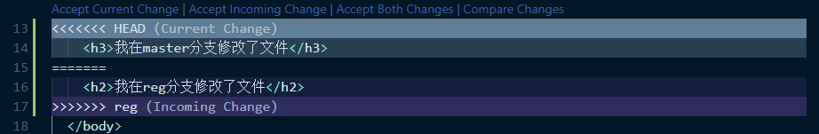

#### 1 Git简介

版本管理是一个老生常谈的问题了，其实这在我们的日常生活中是很常见的

比如我们需要制作一份《doc文档》，最初做了第一个版本，然后发现不满意的地方，需要修改，但是为了保留老版本，就复制了一份文档出来，命名为《doc文档1》，后面又需要修改，于是一样的复制，命名为《doc文档2》，以此类推，命名了doc文档3、4、5...，最终就是一大堆各种版本的文件，看得人眼花缭乱，管理起来是很麻烦的。另一个场景是两个人共同合同编写同一个文档，如何将两人编写的内容合并到一起呢？只能是人工去复制粘贴，也很麻烦，为了解决这些类似的麻烦问题，git诞生了，当然git的功能远不止这点，下面进行详细介绍

版本控制既然是常见的问题，必然有个发展历程，历史上的版本控制系统大概分为三种类型：

- 单机版本控制

  只能在自己的电脑上使用，不适合多人合作的情况

- 集中化版本控制

  基于服务器-客户端的模式，服务器集中管理版本，客户端保存最新版本

  缺点是不支持离线提交，中心服务器一旦崩溃，所有人无法正常合作，版本数据也会丢失

  典型代表是SVN

- 分布式版本控制

  与集中化版本控制相比，分布式版本控制改进了SVN不能离线提交的缺点，分布式版本控制在客户端中也会保存一份服务器端的完整备份，并不仅仅只是最新的版本，这样一来，如果中心服务器崩溃了也不会影响我们的数据恢复
  
  典型代表是Git

git最初是被设计在Linux系统中使用的，项目越大，合作人数越多时，越能体现出git的优势，主要原因有：

1. 直接记录快照，而非进行差异比较

   SVN是基于差异比较的版本控制，它所存储的是基本文件和一组差异，差异比较就是在每次切换版本时都需要去对比每次的差异，优点是节省了磁盘空间，但缺点是随着差异越来越多，每次切换版本需要对比的差异也越来越多，导致版本切换变得耗时、效率低

   Git则是类似于文件备份，从原文件上直接copy了一份新的文件，如果原文件没有发生修改，则不会copy生成新文件，而是生成一个链接指向原文件，优点是版本切换很快，但代价是磁盘空间占用大，不过空间换时间还是很值的，不是吗

2. 几乎所有操作都是在本地执行

   git在断网离线之后依然可以正常管理版本，只需要在联网之后将本地的版本同步到服务器上即可，而SVN是不行的

#### 2 工作流程

使用git进行工作时主要和三个区域打交道，分别是工作区、暂存区、仓库

- 工作区

  当前正在工作的区域，此时对应的文件状态是`modified`，表示文件已发生修改，未被修改的文件依然处于工作区，但不会显示文件状态，git只关注当前被修改的文件

- 暂存区

  暂时存放修改文件的区域，发生修改的文件需要先存放到暂存区，此时对应的文件状态是`staged`，表示修改文件已被暂存

- 仓库

  仓库存放了文件的版本信息，暂存到暂存区的修改文件，最终会被提交到这里，此时对应的文件状态是`committed`，表示修改文件已提交

所以git的工作流程就是，首先在工作区中修改文件，然后将修改文件暂存到暂存区，最后提交暂存区中的修改文件的一份文件复制到仓库中进行存储

#### 3 环境配置

##### 3.1 安装git

想要使用git，需要先安装git，linux和macos系统都包含了unix命令行，而windows使用的命令行工具是cmd，但是cmd和unix终端环境是不一样的，很多命令并不通用，所以在windows上使用git需要安装git的Windows客户端git bash和git gui，可以到[git for windows](https://gitforwindows.org/)下载安装

> 安装完git后，继续安装Windows新推出的powershell，使用powershell也能使用git的命令
>
> 经过版本更新，新版cmd也能使用git命令

##### 3.2 配置用户名和邮箱

使用git前需要配置用户名和邮箱，以告诉git你是谁，这样在多人合作时，别人也能方便地知道是谁写的文件，是谁作的修改，打开git bash，输入如下命令进行配置

- 配置全局用户名和邮箱

  `--global`参数表示这是全局配置，对当前的计算机用户生效

  ```sh
  git config --global user.name "ixcw"
  git config --global user.email "228295392@qq.com"
  ```

  执行完命令后会在用户文件夹下生成一个配置文件，路径如下：

  Linux系统：`~/.gitconfig`

  windows系统：`C:\Users\22829\.gitconfig`

  配置文件内容：

  ```text
  [user]
  	name = ixcw
  	email = 228295392@qq.com
  ```

- 配置当前项目用户名和邮箱

  电脑上往往存在不同的项目，而不同的项目可能用到的用户信息是不一样的，这时就需要为这些项目单独配置用户信息，当前项目用户信息的优先级大于全局用户信息

  在当前项目的根目录下执行如下命令，不加参数或加上`--local`参数表示配置当前项目的用户信息

  ```sh
  git config user.name "wenwen"
  git config user.email "88888888@qq.com"
  ```

  执行完命令后会在项目文件夹的`.git`文件夹下生成一个配置文件，路径为`.git/config`

- 配置系统用户名和邮箱（不常用）

  有时候一台电脑会存在多用户的情况，这时可以给这些用户配置系统级的用户信息，这个优先级是最低的

  ```sh
  git config --system user.name "wenwen"
  git config --system user.email "88888888@qq.com"
  ```

  执行完命令后会在git的安装目录下生成配置文件，路径：`git的安装目录/etc/gitconfig`

配置完成后，如需检测配置是否生效，可以打开相应路径下的配置文件进行检查，也可以使用命令检测：

检测全局配置，命令行显示配置文件的内容

```bash
git config --list --global
```

查看指定的配置项
```bash
git config user.name
git config user.email
```
获取git帮助信息

```bash
git help config  # 在浏览器中打开本地帮助手册
git config -h  # 在终端显示简要帮助信息
```

#### 4 命令

##### 4.1 创建Git仓库

想使用git进行文件版本管理，首先需要创建一个git仓库，可通过两种方式：

1. 本地创建

   在项目根目录下执行如下命令创建git仓库

   ```bash
   git init
   ```

   命令执行完毕后会在当前项目根目录下创建一个名为`.git`的隐藏文件夹，该隐藏文件夹就是当前项目的git仓库，里面包含了一些必要的配置文件

   此时git bash终端的命令行提示会出现`(master)`这样的提示，表明这个项目已被git管理，并且位于主分支master，关于分支，后面介绍

2. 云端克隆，后面介绍

##### 4.2 文件状态

前面我们说到，git管理的项目，主要有三个区域，分别是工作区、暂存区、仓库，平时我们是在工作区进行文件修改的

工作区中的文件有四种状态：

- 未被git管理

  未跟踪状态（Untracked）：未被git管理时的文件，一般是刚刚新建的文件，还未被管理

- 已被git管理

  未修改状态（Unmodified）：未被修改的文件，此时的文件内容与仓库中的文件内容一致

  已修改状态（Modified）：已被修改的文件，此时的文件内容与仓库中的文件内容不一致

  已暂存状态（Staged）：已被修改的文件同时已被存放到暂存区，准备保存到仓库中

我们最终目的是让工作区中的文件与仓库中的文件保持一致，即文件处于未修改状态

使用如下命令查看工作区中的文件的文件状态：

```bash
git status
```

输入命令后git bash会返回一些帮助信息，包括分支信息，文件状态等

如果希望输出结果更简洁一点，可以加`--short`参数，此时命令行输出的未被跟踪状态的文件前面会有红色的`??`符号

```bash
git status --short  # -s也可以
```

刚刚创建的新文件都是处于未被跟踪状态的，这个时候的这些文件还未被git管理，可以使用如下命令将它们添加到git中进行管理

```bash
git add 文件名称
```

命令执行后没有任何输出则表示添加成功，这时再次查看文件状态，输出皆为绿色的提示，表明文件已被git管理

```bash
git status
# new file: index.html
git status -s
# A index.html
```

发现文件index.html已被添加到Git进行管理并被跟踪，同时被放到了暂存区中准备提交，绿色的A表示是新添加到暂存区的文件

如果需要暂存的文件比较多，则可以使用如下命令一次性将所有的新建和修改的文件全部加入暂存区

```sh
git add .
```

##### 4.3 提交更新

文件添加到暂存区后，下一步就可以放入仓库中保管了，使用提交命令将文件放到仓库中进行保存，命令如下：

```bash
git commit -m "新建了index.html文件"
# [master (root-commit) 9544d97] 新建了index.html文件
#  1 file changed, 0 insertions(+), 0 deletions(-)
#  create mode 100644 index.html
```

`-m`表示提交信息，m是message的缩写，再次检查文件状态

```bash
git status
# On branch master
# nothing to commit, working tree clean
```

这表示所有的文件已被git管理且处于未修改状态，一个完整的简单git工作流程至此完成

##### 4.4 再次修改

当我们再次修改已提交更新的文件（已被git管理且处于未修改状态）之后，再次检查文件状态

```bash
git status
# On branch master
# Changes not staged for commit:
#   (use "git add <file>..." to update what will be committed)
#   (use "git checkout -- <file>..." to discard changes in working directory)
#         modified:   index.html
# no changes added to commit (use "git add" and/or "git commit -a")

# 或者
git status -s
# M index.html
```

会发现文件此时处于已修改状态，红色的M表示文件处于已修改状态

##### 4.5 暂存已修改文件

同样地，需要先将已修改文件添加到暂存区域中，才能再次提交更新

```bash
git add index.html
```

> 关于add命令：
>
> 1. 跟踪新文件并添加到暂存区
> 2. 将修改过后的已跟踪文件添加到暂存区
> 3. 将有冲突的文件标记为已解决

再次检查文件状态，发现先前是红色的modified和M已经变成了绿色，表示该文件已被添加到暂存区中

##### 4.6 提交暂存区文件

再次运行提交更新命令即可

```bash
git commit -m "初始化了index.html文件的内容"
# [master 3157683] 初始化了index.html文件的内容
#  1 file changed, 10 insertions(+)
```

再次检查文件状态

```bash
git status
# On branch master
# nothing to commit, working tree clean
```

表示成功提交，所有文件再次处于未修改状态且被git管理

##### 4.7 撤销修改

如果对文件进行了修改，但是后来又不想要这次修改，想要恢复之前的文件状态，那么可以撤销修改，但需要两个前置条件：

1. 文件已提交
2. 文件未添加到暂存区

如果文件已添加到暂存区，可以先取消暂存，再进行操作，运行如下命令，则git会用仓库中之前提交的文件去覆盖修改的文件，对比撤销前后的文件的sha256值，发现并不是同一个文件

> 撤销修改后修改无法找回，请谨慎操作

```bash
git checkout -- index.html
```

##### 4.8 取消暂存

刚刚说到取消暂存，如果想要将已暂存的文件取消暂存，可以重置文件的head

```bash
git reset HEAD index.html
```

##### 4.9 跳过暂存提交

如果想偷懒跳过暂存这一步直接提交，可以在commit的时候添加`-a`参数，这时git会将**已提交过的文件**暂存，然后再进行提交

> 对于新建的文件还是需要手动add

```bash
git commit -a -m "描述消息"
```

##### 4.10 删除文件

通过命令删除文件有两种方式：

1. 将文件从工作区和Git仓库中同时移除，不能删除新建的文件，因为还未被git管理

   ```bash
   git rm -f index.js
   ```

2. 只删除仓库中的文件，保留工作区中的文件

   ```bash
   git rm --cache index.css
   ```

   该操作删除了仓库中的备份文件，因此文件重新变成了未跟踪状态Untracked


##### 4.11 忽略指定文件

不是所有的项目文件都需要用git进行管理的，比如使用node安装的模块，具体原因参见nodejs笔记，具体做法是在项目根目录下新建一个名为`.gitignore`的文件，在文件中列出要需要忽略的文件或文件夹

文件格式：

1. 注释以#开头
2. 以/结尾表示目录
3. 以/开头防止递归
4. 以!开头表示取反
5. 可以以简化的正则表达式匹配文件，即glob模式
   - `*`匹配0或多个字符
   - `?`匹配1个字符
   - `**`匹配中间目录，如 a/**/z 可以匹配 a/b/z 或 a/b/c/z

```sh
# 忽略所有的 .a 文件
*.a
# 虽然忽略了所有的 .a 文件但唯独 lib.a 不被忽略
!lib.a
# 忽略当前文件夹下的TODO文件，但是子目录下的同名文件不被忽略，也就是防止了递归
/TODO
# 忽略所有名为build的文件夹
build/
# 忽略doc文件夹下的.txt文件，但子目录下的不被忽略
doc/*.txt
# 忽略doc文件夹及其子目录下的.pdf文件
doc/**/*.pdf
```

##### 4.12 查看提交历史

使用如下命令查看我们的提交历史记录：

```bash
# 按时间倒序列出所有的提交历史，如果记录太多会显示不完，按enter可继续浏览，按q退出
git log
# 只展示最新的2条提交历史，数字可自定义
git log -2
# 在一行上展示提交历史
git log -2 --pretty=oneline
# 在一行上以自定义的格式展示提交历史
# %h 提交的简写哈希值
# %an 作者名字
# %ar 作者修订日期
# %s 提交说明
git log -2 --pretty=format:"%h | %an | %ar | %s"
```

##### 4.13 版本回退

首先找到要回退的版本的提交ID标识

```bash
git log --pretty=oneline
```

然后利用id进行回退

```bash
git reset --hard id
```

回退完成后再次查看提交历史，就看不到回退之前的提交历史了，只能看到回退之后的提交历史

想查看**全部的提交历史**需要使用新命令，全部的提交历史包含了版本回退的提交

```bash
git reflog --pretty=oneline
```

这时又可以利用指定的ID号回退到任意指定的版本

本地回退完成之后，远程分支并没有完成回退，所以如果不想留下回退版本之后的提交记录，可以强制推送本地的更新

```bash
git push -f
```

##### 4.14 暂存修改

可以将当前的文件修改暂时存储起来，这会把暂存区和工作区的改动都保存起来

什么时候需要用到呢，常见场景是比如我们在某个分支上进行了修改，但此时需要切到另一个分支上，然而不提交修改的话，是切不过去的，这个时候就可以把修改存储起来，切到另一个分支上，而且修改存储可以随时提取出来，不管是在哪一个分支都可以提取

```bash
git stash
# 可以添加save参数说明储藏情况
git stash save "备注"
# 列出当前存储列表
git stash list
# 把最新的存储提取到工作区，并删除最新的存储
git stash pop
# 恢复指定的存储到工作区,并删除指定的存储，id由list命令获得
git stash pop stash@{1}
git stash pop stash@`{1`}  # 在vscode中{}需要转义
```

##### 4.15 拉取某一个文件

如果想从其它分支上拉取某一个文件到当前分支

```bash
git checkout origin/master  /xxx/xxx/xxxx.file
```

##### 4.16 比较分支差异

如果想知道当前分支和别的某一个分支的差异，可使用如下命令

```bash
git diff branch1 branch2 --stat  # 显示大致差异
git diff branch1 branch2  # 显示详细差异
git diff branch1 branch2 文件路径  # 显示具体某一文件的详细差异
```

##### 4.17 合并单一提交

有时需要将其他分支的某个单一提交合并过来，并不需要将其他分支的所有提交都合并过来，这时可以使用如下命令

```sh
git checkout master
git log
```

记录下单一提交的 hash 值，然后切换到要合并的分支

```sh
git checkout branchA
git cherry-pick <hash>
```

可以合并多个提交

```sh
git cherry-pick <hashA> <hashB>
```


#### 5 开源协议

软件一旦开源，意味着任何人都可以来查看和修改源码，但是开源并不意味着完全没有限制，为了限制使用者对软件源码的使用范围和保护软件作者权益，每个开源项目都会选择一个开源协议（Open Source License）

常见的五种开源协议：

1. **GPL（GNU General Public License）**

   具有传染性的开源协议，因为如果使用GPL协议意味着修改后和衍生的代码也必须开源，不允许作为闭源商业软件发布销售

   使用GPL协议的著名项目：Linux

2. **MIT（Massachusetts Institute of Technology）**

   限制最小的协议，在修改代码或发布包中需要包含原作者的许可信息

   使用MIT协议的著名项目：jQuery、Node.js

3. BSD（Berkeley Software Distribution）

4. Apache License 2.0

5. LGPL（GNU Lesser General Public License）

#### 6 开源项目托管平台github

主流的开源项目托管平台有三个，分别是github、gitlab、gitee，github在全球流行，现已被微软收购，但是依然保持开源，gitlab私有支持好，gitee是国内的平台，网络访问快，界面中文，它们都只能托管**用git管理的**代码，这里主要介绍gitHub

github是一个网站，要使用github需要登录注册，登录后可以新建仓库，这些仓库是位于github服务器的远程仓库

##### 6.1 备份到远程仓库

git远程仓库有两种访问方式，分别是https和ssh

- https

  无需配置，但是每次访问时都需要输入GitHub的账号密码，略显繁琐

  1. 首先打开我们在github的git远程仓库，复制远程仓库的https地址

     ```bash
     # https://github.com/用户名/项目名.git
     https://github.com/ixcw/test.git
     ```

  2. 在本地仓库中确保所有需要管理的文件已提交更新，然后在项目根目录下执行如下命令

     ```bash
     # 本地仓库与远程仓库地址建立连接，并将远程仓库命名为origin
     git remote add origin https://github.com/ixcw/test.git
     # 把本地仓库推送到远程仓库的主分支master
     git push -u origin master
     ```

  3. 完成以上初始化操作后，后面如果再次需要推送到远程仓库，只需执行如下命令

     ```bash
     git push
     ```

- ssh

  需配置ssh密钥，配置完成后访问无需输入账号密码，更加推荐这种方式

  SSH Key就相当于是一把钥匙，有了它就能直接访问你的github账号而无需每次输入密码验证，配置完成后可以实现**免登录加密数据传输**，SSH Key由两部分组成，分别是私钥和公钥

  私钥：`id_rsa`，是一个文件，存放于本地电脑

  公钥：`id_rsa.pub`，也是一个文件，存放于github服务器

  1. 检查本地是否已存在密钥文件

     列出用户主目录下是否存在`.ssh`文件夹和里面是否有文件
  
     Windows系统一般是这个路径：`C:\Users\用户名\.ssh`
  
     如果列出了`id_rsa`等文件，证明已经有私钥了，之前已配置过SSH，如果想重新配置，也可以将其删除
  
     ```bash
     ls -al ~/.ssh
     ```
  
  2. 生成密钥文件
  
     ```bash
     ssh-keygen -t ed25519 -C "228295392@qq.com"
     ```
  
     如果电脑太旧不支持ed25519算法，也可以使用如下算法
  
     ```bash
     ssh-keygen -t rsa -b 4096 -C "228295392@qq.com"
     ```
  
     > 参数说明：
     >
     > `-t ed25519` 或者 `-t rsa`：表示使用ed25519或rsa算法
     >
     > `-b 4096`：表示密钥长度为4096bits，默认为2048bits，ed25519算法无需指定
     >
     > `-C`：在公钥文件中添加注释，为公钥文件起别名
     >
     > ed25519算法相比rsa算法的验证性能更高且更安全，目前为github官方推荐使用
     
     如果成功生成，则会在`.ssh`文件夹下生成两个文件，分别是私钥文件`id_ed25519`和公钥文件`id_ed25519.pub`，如果是rsa算法则是`id_rsa`和`id_rsa.pub`
     
  3. 打开生成的公钥文件，复制里面的内容，然后登录到github网站找到账号设置，找到SSH Key设置，添加新的SSH Key，然后把复制的公钥内容粘贴到SSH Key中，标题处填写描述信息，表明这个Key是哪个设备的Key
  
  4. 测试SSH连接，看是否配置成功
  
     ```bash
     # 尝试通过SSH连接到GitHub
     ssh -T git@github.com
     # The authenticity of host 'github.com (20.205.243.166)' can't be established.
     # ECDSA key fingerprint is SHA256:xxxxxx.
     # Are you sure you want to continue connecting (yes/no/[fingerprint])?
     ```
  
     输入yes，出现如下提示表示配置成功，`.ssh`文件夹下会生成一个`known_hosts`文件，记录host记录
  
     ```bash
     # Warning: Permanently added 'github.com,20.205.243.166' (ECDSA) to the list of known hosts.
     # Hi ixcw! You've successfully authenticated, but GitHub does not provide shell access.
     ```
  
  
  配置完成后就可以使用ssh的方式上传本地git仓库到github远程仓库了，和https的方式类似，不过https链接要改为ssh链接
  
  > 如果一个本地仓库之前已经用https的方式上传过代码了，那么再用ssh的方式上传会报错
  >
  > ```bash
  > fatal: remote origin already exists.
  > ```
  >
  > 原因是一个本地仓库对应一个远程仓库，不能再次添加新的连接，如果非要修改的话可以先删除原有的连接关系
  >
  > ```bash
  > git remote rm origin
  > ```
  >
  > 然后再添加就可以了

##### 6.2 从远程仓库克隆

从git远程仓库克隆其代码只需选好要保存的文件夹位置，然后打开git bash执行如下命令

```bash
# git clone 远程仓库地址（可以是SSH或者HTTPS链接）
git clone git@github.com:ixcw/test.git
```

##### 6.3 分支

git中有分支的概念，不同的分支可用于开发不同的功能，最后将这些分支合并到一起，就完成了多功能的开发，有利于多人合作，每个人负责自己的分支，互不干扰

###### 6.3.1 master 主分支

在我们初始化git项目时，git会帮我们建立一个默认分支同时也是主分支master

在实际工作中，master主分支的作用就是保存记录整个项目**已完成功能的代码**，只有已经完成的功能代码可以提交到主分支上面

###### 6.3.2 功能分支

就是用于开发新功能的分支，是临时从master分支上分叉出来的，新功能开发测试完成后需要合并回主分支

###### 6.3.3 查看分支列表

```bash
git branch
# * master
```

由于当前只有master分支，故只列出了master分支，在分支的前面有一个*号，表明当前所处的分支是哪一个

###### 6.3.4 创建新的分支

```bash
# git branch 新分支名称
git branch login

# 再次查看分支列表
git branch
#   login
# * master
```

创建分支的操作是基于当前所处分支创建的，新分支会完全克隆所基于的分支，两者的代码完全一致

创建分支完成后，当前所处分支不会改变，除非手动切换

###### 6.3.5 切换分支

```bash
# git checkout 分支名称
git checkout login
# Switched to branch 'login'
```

出现如上输出表示切换成功，同时发现命令行提示变成了`(login)`，表示当前所处分支是login分支

有时候，如果觉得每次都要执行两条命令有点麻烦，可以将两条命令合并成一条来写，可以立即创建并切换到新分支（果然懒是第一生产力）

```bash
# 先切换回master主分支，建议新建分支都从master分支新建
git checkout master

git checkout -b reg
# Switched to a new branch 'reg'

git branch
#   login
#   master
# * reg
```

###### 6.3.6 合并分支

当新功能开发完毕，需要将其合并到主分支，需要将A分支的代码合并到B分支，则需要先切换到B分支再合并A分支

```bash
# 因为要合并到主分支，所以先切换到主分支
git checkout master
# Switched to branch 'master'
# Your branch is up to date with 'origin/master'.
```

切换回主分支时，会提示分支和主分支更新保持一致了，这时去工作文件夹查看，发现login的功能代码文件不见了，而是变为了主分支的代码文件，因为此时我们已经切换回了主分支，理应工作区中只有主分支的代码文件，下面执行分支合并命令

```bash
git merge login
# Updating 7fd98d8..d190950
# Fast-forward
#  login.css  |  9 +++++++++
#  login.html | 13 +++++++++++++
#  2 files changed, 22 insertions(+)
#  create mode 100644 login.css
#  create mode 100644 login.html
```

显示如上信息表示合并成功，工作区的代码文件也增加了login的代码文件

如果不小心误合并，可以撤销合并

```bash
git merge --abort
```

###### 6.3.7 删除分支

当我们把功能分支的代码合并到主分支上以后，功能分支就失去了它的作用，可以卸磨杀驴了（不是）

```bash
git branch -d login
# Deleted branch login (was d190950).
```

> 注意删除分支时不能处于该分支上

再次检查分支列表，login分支已经消失

```bash
git branch
# * master
#  reg
```

###### 6.3.8 合并冲突分支

在多人合作开发中，难免会遇见不同的人对同一个文件进行了修改的情况，这时Git不知道具体修改了什么内容，就不能合并了，如果强行合并可能导致代码逻辑错乱，这时就产生了合并冲突，这种情况下我们只能选择

**手动解决冲突** 

**手动解决冲突** 

**手动解决冲突**

当我们在reg分支和master分支上都修改了index.html文件之后，在master分支合并reg分支，就会出现如下提示

命令行的提示变成了`(master|MERGING)`，表明出现了冲突，正在合并中，需要先解决冲突再合并分支

```bash
git merge reg
# Auto-merging index.html
# CONFLICT (content): Merge conflict in index.html
# Automatic merge failed; fix conflicts and then commit the result.
```

我们在master分支下手动打开index.html文件，发现vscode已经帮我们贴心地标记出了产生冲突的地方，如下图所示



并且vscode为我们提供了选项，是保留当前修改，还是保留合并分支的修改，还是保留双方的修改，都由我们自己判断选择，甚至为了帮助我们判断，还有比较文件改变的选项，那我们自然要用一用了，点击比较改变，这时编辑器会分裂为2部分，左边显示当前修改，右边显示合并分支的修改，同时标记出不同点，然后我们就根据自己的需要去判断解决冲突

解决完毕冲突之后，执行如下命令告知Git冲突已解决，重新提交更新

```bash
git add .
git commit -m "解决了master分支和reg分支的合并冲突"
```

执行完毕后就成功合并了冲突分支

###### 6.3.9 第一次推送到远程仓库

第一次推送分支，需要执行如下命令

```bash
# git push -u 远程仓库别名 本地分支:远程分支
git push -u origin master:master
# 如果希望远程分支和本地分支命名一致，则可以简化命令
git push -u origin master
```

第二次及以后只需要执行`git push`命令即可

###### 6.3.10 查看远程分支

```bash
# git remote show 远程仓库名称
git remote show origin
# * remote origin
#   Fetch URL: https://github.com/ixcw/test.git
#   Push  URL: https://github.com/ixcw/test.git
#   HEAD branch: master
#   Remote branches:
#     main     new (next fetch will store in remotes/origin)
#     master   tracked
#     register tracked
#   Local branches configured for 'git pull':
#     master merges with remote master
#     reg    merges with remote register
#   Local ref configured for 'git push':
#     master pushes to master (fast-forwardable)
```

###### 6.3.11 跟踪分支

跟踪分支指的是从远程仓库中把远程分支下载到本地仓库中

```bash
# 从远程仓库中下载远程分支到本地仓库，本地分支和远程分支的命名一致
# git checkout 远程分支名称
git checkout register
# Switched to a new branch 'register'
# Branch 'register' set up to track remote branch 'register' from 'origin'.

# 从远程仓库中下载远程分支到本地仓库，本地分支和远程分支的命名不一致
# git checkout -b 本地分支名称 远程仓库名称/远程分支名称
git checkout -b reg origin/register
# Switched to a new branch 'reg'
# Branch 'reg' set up to track remote branch 'register' from 'origin'.
```

远程分支下载后会立即切换到该分支	

###### 6.3.12 拉取远程分支的最新代码

有时候远程分支的代码比本地代码更新，我们需要拉取远程分支的最新代码到本地，使得两者保持一致

```bash
git pull
# remote: Enumerating objects: 9, done.
# remote: Counting objects: 100% (9/9), done.
# remote: Compressing objects: 100% (6/6), done.
# remote: Total 7 (delta 1), reused 0 (delta 0), pack-reused 0
# Unpacking objects: 100% (7/7), done.
# From https://github.com/ixcw/test
#    a3fc6cb..81bd9f7  register   -> origin/register
#  * [new branch]      main       -> origin/main
# Updating a3fc6cb..81bd9f7
# Fast-forward
#  index.js | 1 +
#  1 file changed, 1 insertion(+)
```

###### 6.3.13 删除远程分支

```bash
# git push 远程仓库名称 --delete 远程分支名称
git push origin --delete register
# To https://github.com/ixcw/test.git
#  - [deleted]         register
```

删除本地分支时如果分支代码没有合并到主分支会报错，但是也可以改变参数为大写强行删除，或者合并之后再删除

```bash
git branch -d reg
# error: The branch 'reg' is not fully merged.
# If you are sure you want to delete it, run 'git branch -D reg'.

git branch -D reg
```

###### 6.3.14 推送本地分支到远程分支

```bash
# 前面个dev是本地分支，后面个dev是远程分支，名字相同可简写
git push origin dev:dev
```

##### 6.4 提交命令简化

可以将三条命令简化为一条
```cmd
git add .
git commit -m "message"
git push
```

变为

```cmd
git cmp "message"
```

向`.gitconfig`文件添加了一个别名：

```text
[alias]
    cmp = "!f() { git add -A && git commit -m \"$@\" && git push; }; f"
```

也可以在命令行使用命令更改：

```cmd
git config --global alias.cmp '!f() { git add -A && git commit -m "$@" && git push; }; f'
```

##### 6.5 git加速

###### 6.5.1 使用 ssh 协议

基于众所周知的原因，github的访问速度是非常拉胯的，甚至在代码推送拉取是也会失败，并且报443 time out的错误，但是墙只是墙了https，用ssh协议就不会出现这个问题了，所以在代码拉取时推荐使用ssh的方式，并且在github上配置自己的ssh密钥

https的方式：

```sh
git clone https://github.com/ixcw/note.git
```

ssh的方式：

```sh
git clone git@github.com:ixcw/note.git
```

密钥可以使用git的Windows客户端git gui生成，然后配置到github上

###### 6.5.2 代理加速

如果想直接使用代理软件加速，则需要进行配置，因为一般情况下 git 是不走代理软件的，即使把代理软件设置成全局加速，对于 git 来说也是不生效的

配置 git 代理到本地代理端口，比如我的代理软件的本地代理端口是 10809，则命令为

```sh
git config --global http.proxy http://127.0.0.1:10809
git config --global https.proxy http://127.0.0.1:10809
```

检查一下 git 配置是否正确

```sh
git config --global -l
```

打开 cmd 命令行，刷新一下 dns

```sh
ipconfig/flushdns
```

然后再执行 git 命令，应该就能正常访问 github 了

