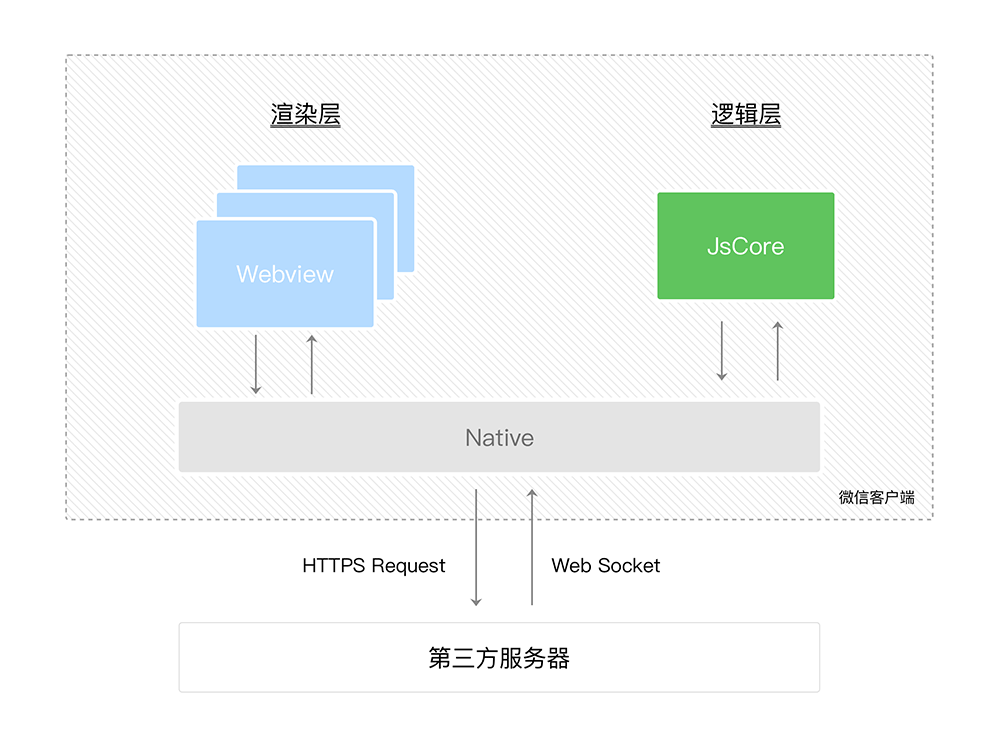
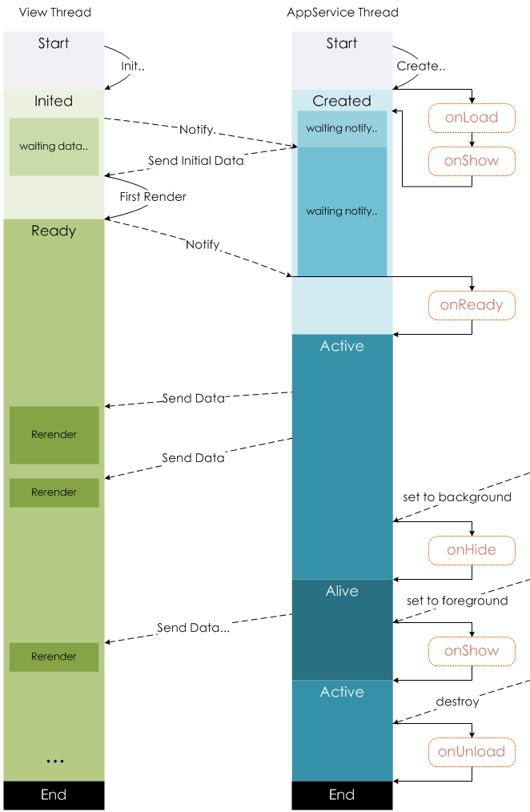

#### 1 官方文档

[微信开发文档](https://developers.weixin.qq.com/miniprogram/dev/framework/)

在微信开发者工具里面，小程序模拟器呈现的初始页面通常默认是首页，修改编译模式可以更改页面为想要调试的页面，这样就不必更改pages的配置文件了

#### 2 项目结构

小程序由多个页面组成，每个页面又由多个组件组成，组件包括内置组件和自定义组件

项目根目录下有三个app文件，与整个项目的配置有关，分别是`app.js`、`app.json`、`app.wxss`

页面叫做page，通常会在根目录下创建一个pages目录用于存放项目的页面，page由四个文件组成，分别是`home.wxml`、`home.wxss`、`home.js`、`home.json`，home是文件名称

#### 3 变量与MVVM

page的js文件必须调用Page方法，传入一个配置对象，在配置对象的data属性中可定义变量，变量值为初始数据

```js
Page({
    data: {
        name: "james"
    }
})
```

MVVM即Model、View、ViewModel，传统的View和Model之间的交流互动需要我们手动去编写逻辑，而框架的诞生就是为了简化这一流程，常见框架比如Vue、小程序的MINA框架，就是担当ViewModel这个角色，将我们手动编写逻辑这一步简化，代替我们去帮助View和Model进行沟通，最典型的就是以往我们为达某些效果常常需要操作dom，而使用框架，其实是一样的操作dom，但是是框架替我们去操作了dom，操作dom这一工作就不必我们去担心了，我们更多的关注点可以放到数据上，简化了操作和逻辑

命令式编程：为达某种效果编写一条条命令去实现效果，比如一步步地操作dom，改变数据

声明式编程：为达某种效果声明一条条语句去实现效果，比如使用框架后，直接更改数据，就能实现效果

#### 4 配置与双线程模型

小程序的开发特性与传统开发不同，传统开发需要一步步的实现具体的组件，然后组合组件到页面上实现功能，而小程序更多的是基于配置开发，常见的功能官方早已开发完成，只需要配置好即可实现

常见的配置文件有：

`app.json`：全局配置

`page.json`：页面的局部配置

`project.config.json`：项目配置，比如项目名称、appid

`sitemap.json`：搜索配置

项目配置和搜索配置一般不需要手动去修改，重点了解全局配置和局部配置

##### 4.1 全局配置

全局配置`app.json`常用配置项：

- pages：

  页面路径配置，数组类型，小程序中的所有page都必须在此进行注册

  > 在创建page时不用手动去一个个的创建，微信开发者工具可以很方便地直接创建页面的四个文件，右键文件夹选择创建page即可，通过这种方式创建的page会自动写入pages配置数组中
  >
  > 或者直接修改pages配置数组，开发者工具也会自动在对应路径下生成page文件，这样也是很方便的

- window：

  用于设置小程序的状态栏、导航条、标题、窗口背景色等

  `navigationBarBackgroundColor`：导航栏背景颜色，仅支持十六进制颜色

  `navigationBarTextStyle`：导航栏标题、状态栏颜色，仅支持 `black` / `white`

  `navigationBarTitleText`：导航栏标题文字

  `backgroundColor`：窗口的背景色，仅支持十六进制颜色

  `enablePullDownRefresh`：全局的下拉刷新，值为boolean，若开启，下拉时可以看见窗口的背景色，一般不会在全局配置中配置此项，而是在局部配置中单独配置

- tabBar：

  `list`：底部的tabBar项目个数，必须大于等于2个

  `color`：tabBar项目未被选中时的默认文字颜色

  `selectedColor`：tabBar项目被选中时的文字颜色
  
- resolveAlias：

  配置绝对路径的别名

```json
{
    "pages": [
        "pages/home/home",
        "pages/about/about",
        "pages/category/category",
        "pages/profile/profile"
    ],
    "window": {
        "navigationBarBackgroundColor": "#f00",
        "navigationBarTextStyle": "black",
        "navigationBarTitleText": "我的小程序",
        "backgroundColor": "#0f0",
        "enablePullDownRefresh": true
    },
    "tabBar": {
        "list": [
            {
                "pagePath": "pages/home/home",
                "text": "首页",
                "iconPath": "assets/tabBar/home.png",
                "selectedIconPath": "assets/tabBar/home-selected.png"
            },
            {
                "pagePath": "pages/about/about",
                "text": "我的",
                "iconPath": "assets/tabBar/about.png",
                "selectedIconPath": "assets/tabBar/about-selected.png"
            }
        ],
        "color": "#515151",
        "selectedColor": "#d81e06"
    },
    "resolveAlias": {
        "@/*": "/*"
    }
}
```

##### 4.2 局部配置

全局配置对所有的页面都生效，但有时某些页面需要个性化的配置，此时可以编辑局部配置，将全局配置中相同的项覆盖掉，比如配置导航栏标题

> 注意在局部配置中不用先写window，而是直接配置

```json
{
    "navigationBarTitleText": "我的"
}
```

更多具体配置可参见官方文档[小程序配置](https://developers.weixin.qq.com/miniprogram/dev/framework/config.html)

##### 4.3 双线程模型

小程序的宿主环境是微信客户端，与普通的浏览器是不一样的，小程序的渲染层和逻辑层分别由2个线程管理

渲染层的界面使用了WebView 进行渲染，一个小程序存在多个界面，所以渲染层存在多个WebView线程

逻辑层采用JsCore线程运行JS脚本



WebView和JSCore之间不能直接交互通信，而是由微信客户端扮演中间角色进行间接交互

小程序里面的view标签并不是真正的dom，首先微信客户端会将view和js转换为虚拟dom，虚拟dom是一个js对象，然后再把虚拟dom转换为真实dom，最后通过WebView呈现真实的dom，这和vue及react等前端框架是类似的

当数据发生改变时，微信框架会监测到这种变化，发生改变后，虚拟dom对象对应的节点也会发生改变，但是部分数据的改变完全没有必要去刷新整个页面，因此只需要对比虚拟dom对象前后的变化，找出发生改变的节点，只更新发生改变的节点所对应的dom即可，这个对比变化的过程采用了diff算法，不同的框架对diff算法的实现略有差异

#### 5 注册App与Page

小程序首次启动时，微信会先下载小程序包，然后启动小程序，首先会加载入口文件`app.json`解析配置，然后执行`app.js`中的Page函数注册App并执行相关的生命周期函数，随后加载注册自定义组件，最后加载页面的配置文件`page.json`，渲染页面，执行页面的Page函数注册页面并执行相关的生命周期函数

注册App：可参考 [框架接口-App](https://developers.weixin.qq.com/miniprogram/dev/reference/api/App.html)

注册Page：可参考 [框架接口-Page](https://developers.weixin.qq.com/miniprogram/dev/reference/api/Page.html)

Page生命周期流程可参考下图



#### 6 常用内置组件

具体参见 [官方文档-组件](https://developers.weixin.qq.com/miniprogram/dev/component/)

##### 6.1 简易双向绑定

input框有简易的双向绑定，可绑定直接定义的值，不支持绑定对象的属性值

```html
<input 
  type="number"
  maxlength="11"
  placeholder="请输入电话"
  model:value="{{telephone}}" />
```

##### 6.2 自定义属性值

获取自定义属性值：

```html
<view
  wx:for="{{radioList}}"
  wx:key="id"
  data-id="{{item.id}}"
  bind:tap="radioTap"
>
  {{item.name}}
</view>
```

可在`radioTap`打印的参数中获取：

```js
radioTap(e) {
  const radioId = e.currentTarget.dataset.id
}
```


#### 7 条件与循环

##### 7.1 条件判断

小程序中控制显示隐藏可以使用`wx:if`，通过条件来判断是否需要渲染组件

若有多重判断，可组合使用`wx:else`、`wx:elif`等一起判断

```html
<view wx:if="{{ showContent }}">内容</view>
<button bindtap="toggle">切换显示内容</button>
```

```js
Page({
    data: {
        showContent: true
    },
    toggle: function () {
        this.setData({ showContent: !this.data.showContent })
    }
})
```

一次性控制多个组件，可以用block包围

block 并不是一个组件，它仅仅是一个包装元素，**不会在页面中做任何渲染**，只接受控制属性

> 使用block而不使用view可提高性能，因为不做渲染

```html
<block wx-if="{{ showText }}">
  <view>
    <text>展示内容1</text>
  </view>
  <view>
    <text>展示内容2</text>
  </view>
</block>
```
利用元素的属性hidden也可以达到隐藏显示的效果，其和`wx:if`的区别如同vue中v-show和v-if的区别一样

- hidden：利用css属性`display: none;`进行控制，元素始终渲染

- `wx:if`：为true时才会渲染组件，false时销毁组件，若初始就为false，则不会进行任何渲染

何时选用：组件显示隐藏切换频率高时选择hidden，没有重复渲染的开销

##### 7.2 循环渲染

如需重复渲染同一个组件，可使用`wx:for`进行重复渲染

该属性绑定一个数组，即可使用数组中各项的数据重复渲染该组件

数组当前项的名称默认为 `item`，索引名默认为 `index`

```html
<view wx:for="{{ [1, 2, 3] }}">{{item}}-{{index}}</view>
// 1-0
// 2-1
// 3-2
```

如果数组是动态变化的，应该加一个`wx:key`，用以提高性能，或保证数组的顺序

#### 8 事件

参见 [事件系统](https://developers.weixin.qq.com/miniprogram/dev/framework/view/wxml/event.html)

常用事件：

`onTabItemTap`：Page事件，在tabbar点击时触发，需要当前页面是tabbar页面才能触发

`wx.vibrateShort`：手机振动

#### 9 自定义组件

##### 9.1 基本使用

可在根目录下创建components目录用于存放自定义组件，右键文件夹选择新建组件即可创建新的组件

新建的组件的json文件会自动声明该页面为组件

```json
{
    "component": true,
    "usingComponents": {}
}
```

js文件亦有不同，不再是Page函数，而是Component函数，且多了一个properties和methods列表

```js
Component({

    /**
     * 组件的属性列表
     */
    properties: {

    },

    /**
     * 组件的初始数据
     */
    data: {

    },

    /**
     * 组件的方法列表
     */
    methods: {

    }
})
```

如何使用自定义组件呢？在需要使用自定义组件的页面的json文件中进行配置即可

```json
{
    "usingComponents": {
        "my-comp": "/components/my-comp/my-comp"
    }
}
```

使用：

```html
<my-comp></my-comp>
```

在自定义组件中也可以使用别的自定义组件，用法与普通页面一样

或者直接将自定义组件注册到`app.json`文件中，这样项目中的所有页面都能使用这个自定义组件了

> 自定义组件之间的样式默认是隔离的，可方便的定义样式类名，不用考虑会影响别的自定义组件或页面的样式

##### 9.2 数据传递

###### 9.2.1 传递数据

组件的数据一般不是写死的，而是动态的，如何向组件传递数据呢，这里就需要用到组件的properties属性了

observer可以检测数据的改变从而做出一些行为

```js
/**
 * 组件的属性列表
 */
properties: {
    title: {
        type: String,
        value: '默认标题',
        observer: function(newValue, oldValue) {
            console.log(newValue, oldValue);
        }
    }
}
```

在组件上通过定义好的属性传值：

如果不传则使用默认值

```js
<my-comp title="传递标题" />
<my-comp />
```

###### 9.2.2 传递样式

如果想传递样式给组件，可以利用`externalClasses`属性，该属性为数组，在自定义组件中定义好该属性

```js
properties: {},
externalClasses: ['titleclass'],
```

组件内部正常使用这个class属性

```html
<view class="titleclass">{{title}}</view>
```

父组件中使用自定义组件时传递这个class属性

```html
<my-comp title="传递标题" titleclass="red" />
```

父组件在`page.wxss`中定义样式

```css
.red {
    background-color: red;
}
```

###### 9.2.3 传递事件

有时候我们希望在子组件上触发事件的时候能够改变父组件中的数据，一般来说子组件是不允许直接修改父组件数据的，这时就需要将事件传递出去，通知父组件去修改父组件自己的数据

在子组件中定义事件，触发框架函数`triggerEvent`传递出一个自定义事件名称，以及如有需要传递出去的数据也可在此进行传递，最后一个参数是选项配置，参见 [触发事件](https://developers.weixin.qq.com/miniprogram/dev/framework/custom-component/events.html#触发事件)

```html
<button size="mini" bind:tap="handleIncrement">+1</button>
```

```js
methods: {
    handleIncrement() {
        this.triggerEvent('increase', { age: 18 }, {})
    }
}
```

在父组件中监听这个自定义事件，并编写自己的事件处理这个自定义事件

在传递过来的event参数的detail属性中可获取子组件传递过来的数据

```html
<view>{{count}}</view>
<my-comp bind:increase="handleIncrease" />
```

```js
data: {
    count: 0
},

handleIncrease(e) {
    console.log(e.detail.age);
    this.setData({
        count: this.data.count + 1
    })
},
```

###### 9.2.4 传递内容

有时候我们需要传递的既不是单纯的数据也不是样式和事件，而是一整块内容时，可以使用插槽slot进行传递

基本的插槽使用很简单，只需要在组件内部定义好slot标签，然后使用组件时传递想传递的内容进去就行，slot标签会被替换为传递的内容

```html
<slot />
```

```html
<my-comp>
    <button>slot button</button>
</my-comp>
<my-comp>
    <view>slot text</view>
</my-comp>
```

假如插槽不止一个，那么我们就需要给插槽取名，否则无法知道要插入到哪一个插槽，通过name属性起名

```html
<slot name="slot1" />
<slot name="slot2" />
<slot name="slot3" />
```

然后需要开启多插槽模式

```js
Component({
    options: {
        multipleSlots: true
    }
})
```

最后在插入内容时，通过slot属性指定想插入到哪一个插槽

```html
<my-comp>
    <button slot="slot2">slot button</button>
</my-comp>
<my-comp>
    <view slot="slot3">slot text</view>
</my-comp>
```

##### 9.3 启用全局样式

自定义组件默认不启用全局样式，需要自行开启，才能使用`app.wxss`中的样式

```js
Component({

  options: {
    addGlobalClass: true
  }
    
})
```

#### 10 网络请求

网络请求一般在`onLoad`生命周期中发起请求，下面是get和post请求的示例

get：

```js
onLoad(options) {
    wx.request({
        url: 'http://httpbin.org/get?name=james&age=18',
        success: function (res) {
            console.log(res);
        }
    })
},
    
// 或者
    
onLoad(options) {
    wx.request({
        url: 'http://httpbin.org/get',
        data: {
            name: 'james',
            age: 18
        },
        success: function (res) {
            console.log(res);
        }
    })
},
```

post：

```js
onLoad(options) {
    wx.request({
        url: 'http://httpbin.org/post',
        method: 'POST',
        data: {
        	name: 'james',
        	age: 18
        },
        success: function (res) {
        	console.log(res);
        }
    })
},
```

一般在开发小程序时，很多页面都需要发起网络请求，这意味着网络请求这个API会被使用很多次，如果我们每次请求都去使用`wx.request`去请求，将会存在如下问题：

1. 如果某一天微信官方团队发癫，把请求方法改了，比如名称改了，回调方式改了，那么此时你为了适配新的请求方法，将不得不修改所有用到了网络请求的地方，这将非常麻烦，网络请求和`wx.request`的耦合度太高
2. `wx.request`的调用方式太过麻烦，需要传入一系列的配置，不够简洁，每次都写的话，也是很麻烦的

官方文档参见 [发起请求](https://developers.weixin.qq.com/miniprogram/dev/api/network/request/wx.request.html)，较为优秀的一个封装参见 [请求封装](https://juejin.cn/post/7172581070796226597)


