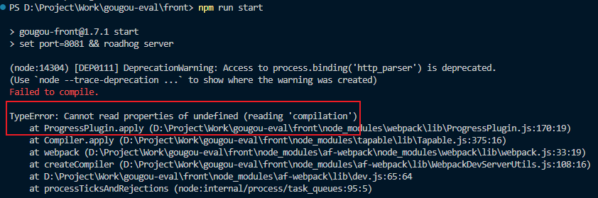

#### 1 简介

JavaScript代码之所以能在浏览器中解析执行是因为浏览器中有JavaScript解析引擎，不同的浏览器的解析引擎内核是不一样的，例如Chrome的是Blink，火狐的是Gecko，苹果是WebKit，V8引擎是Blink内核内置的JS引擎，目前性能是最好的

原生js操作网页元素的API就是浏览器的解析引擎内核提供的，脱离了浏览器环境这些API自然也就不管用了

由于js这门语言的快速发展，大家不满足于只在浏览器里使用js，可不可以在后端也使用js呢？可以，有人就把浏览器里的内核引擎给《搬》出来放到了服务器里，这样即使脱离了浏览器环境，只要有内核能够解析js，js就可以执行，[Node.js](https://nodejs.org/zh-cn/)就是这样一款内核，它是从Chrome浏览器里提取出来的，基于V8引擎，性能不错

浏览器内核有浏览器专用的API，放到服务器上自然就没用了，于是nodejs取消掉了这些API，重新增加了一些给后端专用的API

随着nodejs的发展，围绕其生态的工具和框架也越来越多：

- express框架可以用于构建web应用的后台
- electron框架可以用于构建跨平台的桌面端应用（Windows、Linux、Mac）
- restify框架可以构建API接口

#### 2 安装

##### 2.1 普通安装

官网下载安装包，一般安装LTS长期支持版本，比较稳定，一路next安装即可

打开cmd或powershell，输入命令验证安装，打印出版本号即表示安装成功

```bash
node -v
```

##### 2.2 nvm

node有具体的版本，然而不同的项目依赖的node版本可能是不一样的，这就导致只安装单一个版本的node并不能兼容所有的项目，于是就有人就开发了nvm这款工具用来管理node版本

1. 安装nvm

   可以到github上下载[nvm](https://github.com/coreybutler/nvm-windows/releases)，安装完成后打开终端输入命令验证安装

   ```powershell
   nvm
   ```

2. 使用nvm切换node版本

   ```bash
   # 查看当前安装的node版本
   nvm list
   # 列出可安装的 node 版本
   nvm list available
   # 安装指定的 node 版本
   nvm install 17.9.0
   # 使用指定的 node 版本
   nvm use 17.9.0
   ```

#### 3 解析执行

编写完js代码后，在代码同级目录下打开终端输入如下命令即可使用node去解析执行js代码了

```sh
node hellonode.js  # hello node
```

#### 4 fs文件系统模块

了解完如何使用node执行js代码，接下来就是学习与node相关的API了，先来学习文件系统相关的API

fs模块是node官方提供的用于操作文件的模块，首先在代码文件开头引入该模块

```js
const fs = require('fs')
```

##### 4.1 读取文件内容

语法：

```js
fs.readFile(path [,options], callback)
// path: 文件路径，字符串
// options：以什么编码格式读取
// callback：回调函数，拿到读取结果
```

例子：

```js
const fs = require('fs')
fs.readFile('./files/1.txt', 'utf8', function (err, res) {
  console.log(err)
  console.log(res)
})
// null
// test content
```

可见可以通过判断err的值来确定是否读取成功

```js
fs.readFile('./files/11.txt', 'utf8', function (err, res) {
  if (err) {
    return console.log('读取失败：' + err.message)
    // 读取失败：ENOENT: no such file or directory, open 'D:\**\files\11.txt'
  }
  console.log('读取成功：' + res) // 读取成功：test content
})
```

##### 4.2 写入文件内容

语法：

```js
fs.writeFile(path, data [,options], callback)
// path: 文件路径，字符串
// data：要写入的内容
// options：以什么编码格式写入，默认utf8
// callback：回调函数，拿到写入结果
```

例子：

```js
fs.writeFile('./files/2.txt', 'abc', function (err) {
  console.log(err) // null
})
```

err为null表示写入成功，文件路径如果不存在则会自动新建一个文件写入，判断是否写入成功的方法与读取文件类似

##### 4.3 动态路径拼接

在使用fs模块时，如果提供的文件路径是相对路径，很容易发生路径的拼接错误

原因是代码运行时，文件路径 = node的运行目录 + 相对路径

node运行目录和js文件处于同一目录时没有问题，但目录不同时，拼接的路径就会发生错误

因此我们可以直接提供绝对路径而不提供相对路径，这样无论node在哪里执行，都不会出错，这就解决了问题

```js
fs.readFile(
  'D:\\MEGAsync\\技术\\前端\\NodeJS\\code\\files\\1.txt',
  'utf8',
  function (err, res) {
    if (err) {
      return console.log('读取失败：' + err.message)
    }
    console.log('读取成功：' + res)
  }
)
```

但是只提供绝对路径的话，移植性非常差，不利于维护，原因在于如果代码未来迁移到别的机器，根路径很有可能发生改变，但是绝对路径已经被写死，就会因为路径错误导致读取失败

node官方自然也考虑到了这个问题，于是给我们提供了一个字符串对象`__dirname`，该对象的值表示**当前的代码文件的所在目录**，这个值会根据机器的不同自动变更为对应的绝对路径，这样就**完美**地解决了路径容易拼错的问题

```js
console.log(__dirname) // D:\MEGAsync\技术\前端\NodeJS\code

fs.readFile(__dirname + '/files/1.txt', 'utf8', function (err, res) {
  if (err) {
    return console.log('读取失败：' + err.message)
  }
  console.log('读取成功：' + res) // 读取成功：test content
})
```

#### 5 path模块

path模块是node官方提供的用于处理路径相关的模块

##### 5.1 路径拼接

语法：

```js
path.join([...paths])  // 传入多个路径片段拼接成完整路径
```

虽然直接用字符串相加的方式也能拼接，但是如果路径中不小心加了`.`会导致路径错误，而使用path则不会

```js
const path = require('path')
let pathStr = path.join('/a', '/b/c', '../d', './e')
console.log(pathStr) // \a\b\d\e   ..会抵消一层目录

let pathStr1 = __dirname + './files/1.txt'
let pathStr2 = path.join(__dirname, './files/1.txt')
console.log('pathStr1', pathStr1) // pathStr1 D:\MEGAsync\技术\前端\NodeJS\code./files/1.txt
console.log('pathStr2', pathStr2) // pathStr2 D:\MEGAsync\技术\前端\NodeJS\code\files\1.txt
```

##### 5.2 获取文件名或拓展名

获取文件名

语法：

```js
path.basename(path [,ext])
// ext：文件拓展名，如果提供则返回的文件名会删掉文件拓展名
```

例子：

```js
const path = require('path')
let fpath = '/a/b/c/index.jpg'
let filename = path.basename(fpath)
let filenameNoExt = path.basename(fpath, '.jpg')
console.log('filename', filename) // filename index.jpg
console.log('filenameNoExt', filenameNoExt) // filenameNoExt index
```

获取拓展名

语法：

```js
path.extname(path)
// path：文件路径字符串
```

返回值是文件拓展名

例子：

```js
const path = require('path')
let fpath = '/a/b/c/index.jpg'
let extName = path.extname(fpath)
console.log('extName', extName) // extName .jpg
```

#### 6 http模块

http模块是node官方提供的用于创建网络服务器的模块，调用http模块的创建服务器的方法就可以创建一个服务器对象了

```js
// 1. 导入http模块
const http = require('http')
// 2. 创建服务器对象
const server = http.createServer()
// 3. 为服务器绑定请求事件，监听客户端的请求
server.on('request', function (req, res) {
  console.log('hello guest!')
})
// 4. 启动服务器
server.listen(80, () => {
  console.log('server running at localhost')
})
```

使用node命令执行这个js文件，就启动了服务器，执行了listen方法中的回调函数，终端打印出了`server running at localhost`

##### 6.1 request

request对象包含了与客户端相关的属性和数据

```js
server.on('request', function (req, res) {
  console.log('hello guest!')
  console.log(req.url) // /  
  console.log(req.method) // GET
})
```

##### 6.2 response

response对象包含了与服务器相关的属性和数据

```js
server.on('request', function (req, res) {
  console.log('hello guest!')
  console.log(req.url) // /
  console.log(req.method) // GET
  // end方法是向客户端响应内容，并且结束此次请求处理
  res.end(`your request url is ${req.url}, request method is ${req.method}`)
})
```

在网页上就会看到响应的话

```html
your request url is /, request method is GET
```

end方法直接响应中文会出现乱码，需要先设置内容类型响应头

```js
res.setHeader('Content-Type', 'text/html;charset=utf-8')
res.end(`你的请求路径是${req.url}，请求方法是${req.method}`)
```

##### 6.3 路由响应

不同的url地址对应不同得的路由，根据不同的路由响应对应的内容

首先获取请求的url，然后根据url的不同响应对应的内容

```js
server.on('request', function (req, res) {
  const url = req.url
  let content = '<h1>404 NOT FOUND!</h1>'
  if (url === '/' || url === '/index.html') {
    content = 'index'
  } else if (url === '/about.html') {
    content = 'about'
  }
  res.setHeader('Content-Type', 'text/html;charset=utf-8')
  res.end(content)
})
```

##### 6.4 文件响应

思路：

1. 使用path模块将请求路径和当前路径拼接为访问文件的路径
2. 使用fs模块读取文件
3. 将读取的文件内容响应给客户端

#### 7 模块化

什么是模块化？

模块化就是指在解决复杂的编程问题时，自顶向下地将编程问题分解为若干个模块的过程，各个模块可以继续分解成更小的模块

最终的模块最好是具有单一功能的功能单元模块

编程中的模块化就是按照**一定的规则**将一个大的代码文件拆分成各个小代码文件，这些小代码文件即是模块，模块之间既是独立的，又是可以互相引用的

为什么要模块化？

将复杂的编程问题进行了简化，复杂的问题分解成了各个简单的小问题，从而各个击破

提高了代码复用性，模块的功能是可以到处复用的，一次编写，多处引用

提高了代码可维护性，不用面对一大堆复杂的代码，只需要针对出现问题的模块代码进行局部维护即可，不会影响正常的模块

防止同名变量污染，没有模块化之前，不同的人合作时如果定义了同名变量，将会产生影响，模块化有独立的作用域，避免了这个问题

##### 7.1 模块化规范

模块化规范就是前面提到的《一定的规则》，在模块化过程中需要遵守**一定的规则**

比如如何拆分功能模块到文件中？如何到这些文件中去引用模块？

这些操作都需要一定的操作过程，把这些操作过程提取出来制定成为一个规范，大家都去遵循这个规范操作，这样就非常有利于大家的合作交流，不然你是一种拆分引用方式，我是另一种拆分引用方式，到时候我用我的方式去引用你编写的模块，显然是行不通的

目前已经有了一些由标准化组织制定的规范，比如 CommonJS 模块化规范

node 遵守的就是 CommonJS 模块化规范，该规范规定：

1. 模块需要一个表示，于是在每个模块的内部默认使用 module 对象来表示当前模块
2. module 对象默认使用 exports 属性对象对外导出模块的功能
3. 别的 js 文件使用 require 方法导入模块的功能

##### 7.2 node模块分类

在node中的模块可分为三类：

1. 内置模块

   内置模块就是node官方模块，比如前面介绍的fs模块、path模块、http模块等等

2. 自定义模块

   用户自己编写的模块

3. 三方模块

   第三方开发的模块

##### 7.3 引用模块

根据commonjs规范可知，应该使用require方法去引用导入模块

> 注意：使用require方法加载模块时会执行模块中的代码

```js
const fs = require('fs') // 引用node官方模块，直接填写模块名称
const custom = require('./custom.js') // 加载自定义模块需要指明路径（不然怎么知道模块放在哪儿啦）
const custom = require('./custom') // 省略js后缀名也是可以的
const third = require('third') // 三方模块引用前需要下载（肯定的啦，本地不可能提前下载好所有的三方模块），同引用node官方模块一样，不需要指明路径，具体后面介绍
```

##### 7.4 模块作用域

模块作用域：在模块中定义的变量、方法等只能在当前模块中访问，在模块外部无法访问，也不会干扰其他模块的变量和方法

模块作用域的目的是为了防止全局变量污染，全局变量污染就是不同文件之间的**同名变量**会产生干扰，比如在使用 script 标签引入 js 文件时，不同的 js 文件定义的同名全局变量会被覆盖

既然如此，那岂不是意味着编写模块时需要考虑别人的模块变量命名情况，这显然是不科学的，模块对别人应该是黑箱的，只能看见需要让他看见的东西，工程师们当然想到了这个问题，这也是 commonjs 规范所考虑到的，根据该规范，我们可以利用 module 对象的 exports 属性对象去导出我们想导出去的成员变量，别人可以导入这些导出的成员变量，而其余未被导出的成员变量，则不会对别的模块产生影响

当我们通过 require 方法导入模块时其实得到的返回值就是 module 对象的 **exports 属性对象**

在默认情况下 exports 属性对象是一个 **空对象**：

```js
const m = require('./module')
console.log(m) // {}
```

只有当我们将想要导出去的成员赋值给 exports 对象时，它才会有属性值，这些属性值就是导出去的成员变量

在 module 模块中给 exports 对象添加需要导出的成员：

```js
// module.js

const age = 20
module.exports.age = age
module.exports.username = '张三'
module.exports.sayHello = function () { console.log('hello') }
```

在另一个模块中引入module模块，这时再打印导入的exports对象，就可以发现其有属性值了

```js
const m = require('./module')
console.log(m) // { username: '张三', sayHello: [Function (anonymous)], age: 20 }
```

由于 `module.exports` 写起来比较麻烦，可以忽略 `module` 只写 `exports` 也是可以的，下面的写法也是 ok 的

```js
const age = 20
exports.age = age
exports.username = '张三'
exports.sayHello = function () { console.log('hello') }
```

验证这种写法是否正确

```js
console.log(module.exports) // {}
console.log(exports) // {}
console.log(exports === module.exports) // true，可见指向的是同一个对象
```

#### 8 npm

由于node内置模块的功能有限，仅仅基于这些基础功能开发效率很低，于是许多三方开发者就自己开发封装出了很多实用的三方模块，提供了一些拓展功能，node中三方模块可简称为包，node中的模块包都是免费开源的

为什么要去使用别人分享的包呢？很简单，你不用别人的包那就得自己写，相同的功能，别人已经写好了，为什么不用呢，除非你能写出更好的，不然找不到自己去费时费力手写的理由，这就像你要把钉子砸进墙里，这时别人给你递过来一把锤子，但你说不，我要自己造一把锤子（？）

比方说你需要一个格式化时间的功能，下面是自己手写的过程：

`dateFormat.js`：

```js
/**
 * 格式化时间
 * @param {*} dateStr 时间字符串
 * @returns 格式化后的时间字符串
 */
function dateFormat(dateStr) {
  const dt = new Date(dateStr)
  const y = padZero(dt.getFullYear())
  const m = padZero(dt.getMonth() + 1)
  const d = padZero(dt.getDate())
  const hh = padZero(dt.getHours())
  const mm = padZero(dt.getMinutes())
  const ss = padZero(dt.getSeconds())
  return `${y}-${m}-${d} ${hh}:${mm}:${ss}`
}

/**
 * 补零函数
 * @param {*} n 数字
 * @returns 补零数字
 */
function padZero(n) {
  return n > 9 ? n : '0' + n
}

module.exports = {
  dateFormat
}
```

`dateTest.js`：

```js
const df = require('./dateFormat')
const dt = new Date()
let formattedDate = df.dateFormat(dt)
console.log('formattedDate', formattedDate) // formattedDate 2021-12-23 01:51:44
```

可以发现，自己写模块是可以的，配合commonjs规范，可以正常使用自己编写的时间格式化模块，但是缺点就是需要手写，费时费力

可是node官方并没有提供时间格式化模块，不手写还能怎么样呢？我们当然可以去找找看有没有三方提供这类模块了，如果有，直接拿过来用就行了，正好moment就是这样一款三方提供的时间格式化模块，require引入，然后使用就行，是不是很方便呢

```js
const moment = require('moment')
const dt = moment().format('YYYY-MM-DD HH:mm:ss')
console.log(dt) // 2021-12-23 02:05:12
```

但是正如前面介绍require时所说，直接require引入三方模块是不行的，因为这不是node官方提供的模块，本地是不存在这个模块的，想要引用，得先把模块下载到本地，怎么下载呢？由于大家都是把自己写的模块分享到了一个叫做npm的网站上，所以我们得到这个网站上去下载，npm官方为我们准备好了下载工具，就叫npm

[npm](https://www.npmjs.com/)的全称是Node Package Manager，即node包管理器，npm是node官方为我们内置的包管理器，只要安装了node，就会默认安装npm，使用如下命令下载安装模块：

```sh
npm install 模块名称
```

如果想一次性安装多个模块，空格分开即可

```sh
npm install 模块1 模块2
```

每次都写 install 比较麻烦，install 可简写为 i（懒惰才是生产力）

```sh
npm i 模块1 模块2
```

模块是由三方编写的，我们知道代码是难免会产生bug的，又或者未来需要编写新功能到模块里，这时模块就需要三方去更新维护，而每次更新维护都会给定一个版本号，以区分以前的旧版本

我们直接通过上面的写模块名称的方式去下载，往往下载到的是最新版本，如果想下载的是旧的某一固定版本，可以使用`@`符号去指定版本号，这样就会下载你指定的那个版本的模块了，需要注意的是，新安装的版本会覆盖掉旧的版本

```sh
npm i moment@2.22.2
```

> 关于版本号的含义：
>
> - 第一位数字：大版本更新，比如有较大的改版，较多的功能更新
>
> - 第二位数字：功能更新，更新了新的功能
>
> - 第三位数字：修复更新，修复了原有的bug
>
> 如果前面的数字更新了，则后面的数字需要从零开始更新

模块下载完成后，就可以通过require正常引用模块了

执行完npm安装命令后就会在当前目录下生成一个名为`node_modules`的文件夹，里面存放着我们下载下来的模块

同时也会在当前目录下生成`package.json`和`package-lock.json`这两个文件，这两个文件就是包管理配置文件，下面会进行详细的介绍

##### 8.1 包管理配置文件

刚刚说到，npm在下载模块时会自动生成两个文件，`package.json`和`package-lock.json`

这两个文件有什么用呢？别急，当然是有用的，它们叫做包管理配置文件，可以发现它们是json文件，所以它们主要以json的格式记录了一些包的配置信息以及项目信息，它们是由npm自动生成和维护的，一般我们不用去修改它们，但既然是配置文件，就有可以自定义的配置选项，这个后面再说

那为什么需要有这两个文件呢？

首先，如果我们点开`node_modules`文件夹去查看下载的模块包，我们会发现，这些模块往往包含了大量的文件夹和非常多的细小文件（没办法啦，写好的代码项目文件一般都是这个样子），这里就涉及到一个计算机硬件的问题了，很多人都拷贝过文件，有没有发现在拷贝单一的大文件时，文件传输速率反而是比拷贝很多个小文件时更高的呢，具体的原因就不深究了，反正这是当前计算机的一个硬件瓶颈，所以试想当你将你的项目拷贝给别人合作时，拷贝起来是多么麻烦

其次，因为模块包的大量文件，整个项目的体积也大大增加了，往往会出现一个情况是，项目里我们自己写的代码文件的体积只有上百k，但是模块包的体积却是十几m，模块包的文件数量更是上万个，基本可以说项目90%以上的体积都是模块包，在和别人合作时，别人需要的往往只是你写的代码文件，现在却需要额外拷贝这么多的模块包代码文件，显然是不划算的

有人会说，都什么年代了，还在手动拷贝项目，是github不香了吗，我们说，总有一些情况是特殊的，而且就算用上了git，我们只需要用git管理自己编写的代码即可，于情于理都没有必要用git去维护这成千上万个文件的三方模块

基于上诉原因，大家就在考虑如何解决这个问题，最简单的办法当然是不拷贝、不维护这些模块文件不就完事儿了吗，但是项目代码又依赖于这些模块的功能，不可能不用这些模块，有没有两全其美的办法呢？诶，有

有人想到，这里最大的问题是模块文件的拷贝和维护，只要我在拷贝项目时不拷贝模块文件，或者用git维护项目时不维护模块文件，但是别人又能正常收到这些模块文件就可以了

于是问题就变成了如何不通过拷贝或者git的方式将模块文件传送给别人呢？

办法其实已经有了，模块包文件本来就在npm的共享平台服务器上，大家都可以去下载，别人如果想要模块文件，直接去npm服务器下载不就行了，但是别人怎么知道你用了哪些模块呢，总不可能把所有模块下载下来吧，那要不你微信告诉别人一下？（），这显然是不方便的

现在问题变成了怎么告诉别人你用了哪些模块？

包管理配置文件`package.json`就是用来告诉别人你使用了哪些模块的文件，它记录了你使用的模块包的名称以及版本，这样别人只要有了这个记录文件，就能根据它记录的模块信息从npm服务器上下载到一模一样的模块包，从而解决了模块文件的传输问题，也不必将数量庞大的模块文件纳入git管理了

##### 8.2 快速生成配置文件

在没有下载任何模块的情况下也可以直接使用npm创建包管理配置文件`package.json`
> 项目文件夹名字不能是中文，不能出现空格，否则会报错不能执行

```sh
npm init -y  # -y：对默认选项进行确认，否则需要手动确认
```

生成的默认配置文件内容：

```json
{
  "name": "chinese",
  "version": "1.0.0",
  "description": "",
  "main": "index.js",
  "scripts": {
    "test": "echo \"Error: no test specified\" && exit 1"
  },
  "keywords": [],
  "author": "",
  "license": "ISC"
}
```

在使用npm下载模块时，npm会自动把模块名称和版本号写到配置文件的`dependencies`节点

```json
{
  "name": "chinese",
  "version": "1.0.0",
  "description": "",
  "main": "index.js",
  "scripts": {
    "test": "echo \"Error: no test specified\" && exit 1"
  },
  "keywords": [],
  "author": "",
  "license": "ISC",
  "dependencies": {
    "moment": "^2.29.1"
  }
}
```

这样，别人只需要拿到这个`package.json`文件，在项目目录下通过npm执行如下命令，即可下载安装对应的模块了

```sh
npm install  # npm i
```

有人说你是不是把`package-lock.json`给忘了，这个文件的作用又是什么呢，比`package.json`的名称多了一个lock，没错，这个配置文件也是和模块文件的配置相关的，lock表示的是锁定的意思，锁定版本号

因为`package.json`文件只能锁定最大的版本，也就是版本号的第一位数字，每当我们执行`npm install`去下载模块时都会下载对应大版本下的最新版本，但是为了项目的稳定性考虑我们希望别人拿到的是一模一样的模块文件，也就是模块版本号必须严格一致，所以`package-lock.json`文件的作用就是锁定模块的完全版本号，确保别人在下载模块时下载一致版本号的模块

由于这个锁定文件是npm自动生成维护的，也没有自定义的配置项，所以完全不需要我们去手动更改它

##### 8.3 卸载模块

当我们不再需要某个模块时，直接去删除`node_modules`文件夹下的模块文件是可以的，但是在下次使用`npm install`命令安装模块时被删除的模块依然会被重新下载回来，npm为我们提供了卸载命令，该命令会自动删除模块文件，同时更新包配置文件，确保下次不会再下载回来

```sh
npm uninstall 模块名称
```

##### 8.4 模块分类

模块按照下载位置可以分为项目模块和全局模块

- 项目模块

  被下载到项目里的`node_modules`文件夹下的模块就是项目模块，项目模块只在当前项目内生效

  项目模块可以继续细分为核心模块和开发模块

  1. 核心模块

     核心依赖模块，顾名思义，属于项目的核心，其实项目的核心就是代码，也就是说这部分模块是参与到源代码中了的，源代码中用到了这些模块里的代码，源代码功能依赖于模块功能，最终项目在打包的时候，也会将核心模块的代码打包进去

     核心模块的下载很简单，前面介绍的下载命令就是下载核心模块的

     ```sh
     npm i 模块名称
     ```

     当然也可以添加指定参数`--save`，可简写为`-S`，但是添加参数与不添加参数，效果是一样的，基于懒惰才是生产力的观点，一般不需要加参数

     ```sh
     npm i 模块名称 --save  # 等同于 npm i 模块名称 -S
     ```

     核心模块会被记录到包管理配置文件`package.json`中的`dependencies`节点中

  2. 开发模块

     项目里的某些模块只在开发阶段用到，它们的功能通常与源代码的功能无关，即我们编写的源代码功能不依赖于这些模块，最终打包代码的时候也不会将这些模块中的代码打包进去，比如通常作为打包工具的webpack模块，仅仅是作为最终的工程打包工具，并不涉及源代码功能，又比如unocss模块，用于创建便捷的css类名，虽然其创建的css代码最终会参与到源代码中，但是打包时并不依赖于它的模块代码，所以它也属于开发依赖模块

     开发模块的下载命令与核心模块不同，需要指定参数让npm知道你想将模块归类到开发模块里面

     参数是`--sava-dev`，可简写为`-D`

     ```sh
     npm i 模块名称 --save-dev  # 等同于 npm i 模块名称 -D
     ```

     核心模块会被记录到包管理配置文件`package.json`中的`devDependencies`节点中

- 全局模块

  被下载到电脑的用户文件夹下的模块就是全局模块，全局模块可以在全部项目里生效

  需要注意全局模块不会被记录到包管理配置文件中，但可以通过命令查看已经安装了哪些全局模块，或者直接去安装路径查看，如果是Windows电脑，全局模块一般会下载到如下目录

  `C:\Users\用户名\AppData\Roaming\npm\node_modules`

  容易想到，全局模块和开发模块一样，是不参与到项目的源代码中的，所以全局模块一般都是工具型模块，这类模块在下载安装后一般会提供一些自己的命令，这些命令在所有的项目里面都能使用
  
  比如用于创建vue项目的vue脚手架工具模块`@vue/cli`，下载安装后，就可以在电脑的任何目录下使用如下命令创建vue项目

  ```sh
  vue create 项目名称
  ```
  
  又比如用于更换npm源地址的工具模块`nrm`，安装之后可通过其提供的命令更换npm源地址，具体下面会介绍
  
  如何下载全局模块呢？同样的，需要指定参数，参数为`-g`，意为global全局的意思
  
  ```sh
  npm i @vue/cli -g
  ```
  
  全局模块的卸载也需要添加`-g`参数
  
  ```sh
  npm uninstall 模块名称 -g
  ```
  
  一般在模块的官方说明里面会建议你是否需要将这个模块下载安装为全局模块，遵循官方建议即可

##### 8.5 npm镜像

在我们使用npm下载模块时，有时会发现网速很慢，甚至下载失败，原因是npm服务器在外国，下载速度难免会比较慢

为了解决这个问题，国内热心的淘宝为我们在国内搭建了一个镜像服务器，镜像的意思就是说完全复制了一份npm服务器上的内容，而且每隔一段时间就会自动去同步npm服务器上的内容，用以保持一致，所以我们将下载地址从npm服务器地址改成淘宝的镜像服务器地址，这将大大提高我们的下载速度

可使用如下命令更改源地址

```sh
npm config get registry  # 检查当前源地址
npm config set registry=https://registry.npm.taobao.org/  # 设置为淘宝镜像地址
```

命令执行完成之后会在电脑的用户文件夹`C:\Users\用户名\`下生成一个名为`.npmrc`的配置文件

内容表明源地址目前是淘宝镜像服务器地址，如果我们不用命令而是直接去创建这个文件也是可以的，只不过命令会更方便

```text
registry=https://registry.npm.taobao.org/
```

另一个更为常见的更改的方式是我们下载安装一个名为`nrm`的全局模块，使用这个模块来更改镜像地址

```sh
npm i nrm -g  # 全局安装nrm
```

采用这种方式有几个好处

1. 更方便，只需要安装使用模块就行，模块的命令是更简单的
2. 镜像地址不止只有淘宝的，还有别的，而且是实时更新的，可以测试出延迟最低的地址进行更改
3. 不需要去记镜像地址

```sh
nrm ls  # 列出可用的镜像地址
nrm test  # 测试镜像地址的延迟
nrm use taobao  # 使用淘宝的镜像地址
```

##### 8.6 npm代理

有时候镜像并不能解决安装问题，仍然会有一些老版本的包会请求一些外国地址，如果 npm 没有走代理，就会导致访问失败，从而安装失败，所以需要给 npm 设置代理

在使用 v2ray 的情况下，v2ray 只是自动代理了网页的 http 代理，像 npm 等客户端没有被自动代理，所以尽管开启了 v2ray 代理，但是 npm 仍然没有走代理地址

npm 提供了修改代理地址的命令：

```sh
# 修改 http 代理地址
npm config set proxy http://127.0.0.1:10809
# 修改 https 代理地址
npm config set https-proxy http://127.0.0.1:10809
# 取消 http 代理地址
npm config delete proxy
# 取消 https 代理地址
npm config delete https-proxy
```

> 10809 是 v2ray 本地代理的 http 端口号，10808 是 socks 端口号，可在 v2ray 客户端左下方查看，socks 端口号可在设置中修改

##### 8.7 查看已安装模块

如果想要查看目前项目安装了哪些模块，可以直接去查看包配置文件，也可以通过npm的命令去查看

```sh
npm ls
npm ls --depth 0 # depth：指定查看深度，0是第一层，只列出版本号，效果和不加一样，1会列出下一层模块
npm ls -g # 查看全局模块
```

##### 8.8 分享自己的模块

如果我们有兴趣，也可以将自己觉得编写得满意的，有用的模块分享到npm服务器上，提供给别人下载使用

在npm中分享发布的模块应该遵循如下的文件结构规范：

1. 模块必须是单一的目录

2. 模块的根目录下必须存在`package.json`包管理配置文件

3. 在包管理配置文件中必须指明模块的名称、版本，以及入口文件，分别对应`name`、`version`、`main`这三个属性

   入口文件表示别人在使用require导入模块时，导入的是模块中的哪个文件，因为按照commonjs的模块化规范一次只能引用一个文件，而模块中往往不止一个文件，所以必须指明这个文件是哪个文件，如果这个文件还依赖了模块中的别的文件，它自己会引用别的文件，无需我们关心，我们只需要引用它就行
   
   main属性指明了文件路径，比如moment模块的包管理配置文件的三个配置如下（其余配置已忽略未列出），表明模块名称是`moment`，版本是`2.22.2`，我们引用的文件是`moment.js`这个文件
   
   ```json
   {
       "name": "moment",
       "version": "2.22.2",
       "main": "./moment.js"
   }
   ```

下面就创建一个比较简单的分享模块的例子

1. 首先创建一个项目文件夹，再新建三个文件分别是`index.js`、`package.json`、`README.md`

2. 编写模块功能文件`dateFormat.js`，编写时间格式化功能，利用`module.exports`对外暴露成员函数

3. 在`index.js`中导入该模块功能文件，再次对外暴露这个模块功能

   注意到代码中导入的`dateFormat`对象，想要使用其功能函数需要通过调用函数方法的方式，即`df.dateFormat()`

   如果再直接暴露一次，那别人使用模块功能时，就需要调用两层，假设别人在引入模块时将模块取名为`dateTool`，那么调用方式就是`dateTool.df.dateFormat()`，显然很麻烦，那么这里可以使用拓展运算符将模块功能函数提前解构出来，这样别人就只需调用一层就够了`dateTool.dateFormat()`

   ```js
   const df = require('./dateFormat')
   
   module.exports = { ...df }
   ```

4. 编辑`package.json`，写明配置信息

   ```json
   {
     "name": "my-tools",
     "version": "1.0.0",
     "main": "index.js",
     "description": "提供格式化时间的功能，转义html的功能",
     "keywords": [
       "格式化时间",
       "dateFormat",
       "转义html"
     ],
     "author": "ixcw",
     "license": "ISC"
   }
   ```

5. 编写`README.md`说明文档，相当于模块说明书，帮助别人去理解这个模块，内容一般是模块的安装和使用方法

至此，模块就准备好了，接下来就是到npm服务器上分享发布我们的模块了

1. 先到[npm官网](https://www.npmjs.com/)上注册一个npm账号，然后通过npm命令进行登录

   > 注意需要先将源地址切换回npm官网源地址，用nrm切换即可

   ```sh
   npm login
   ```

2. 登录完成后就可以输入发布模块的npm命令了，这样就把模块发布到npm服务器上了

   > 需要注意模块名称不能和别人的一样（当然）
   
   ```sh
   npm publish
   ```

通过如下命令可以删除发布的模块，可以删除72小时内发布的模块，在删除后的24小时内不允许重新发布

> 尽量不要在npm上发布一些无意义的模块，以维护一个好的模块分享平台，如果是用于练习的模块最好在发布后删掉

   ```sh
   npm unpublish 模块名称 --force
   ```

##### 8.9 模块引用机制

1. 模块在第一次被引用后会被缓存，模块会被优先从缓存中引用，目的是为了提高加载效率，也就是说多次调用require不会导致模块中的代码被执行多次
2. node官方模块的引用优先级是最高的，如果自定义模块和三方模块恰好和内置模块重名，那么node会优先引用node官方模块
3. 自定义模块的引用必须填写相对路径，否则node会错误的认为你想加载node官方模块或三方模块，从而因为找不到对应的模块导致引用失败
4. 在三方模块加载时会逐层查找`node_modules`文件夹，直到找到电脑磁盘的根目录，还找不到就报错
5. 以目录作为模块加载时，会先查找目录下的`package.json`文件，找到main配置项，寻找入口文件，如果没有找不到，就改为查找目录下的`index.js`进行引用，还找不到就报错

#### 9 express模块

express是基于nodejs平台的一款web开发框架，用于创建web服务器，其本质是npm上面的三方模块，它对node的http模块进行了封装，使其更加好用，且功能上更加强大，这就类似于jquery和原生js之间的关系

##### 9.1 下载安装express

```sh
npm i express
```

##### 9.2 创建web服务器

```js
// 1. 导入express模块
const express = require('express')
// 2. 创建web服务器
const app = express()
// 3. 启动服务器
app.listen(80, () => {
  console.log('express is running at localhost')
})
```

##### 9.3 监听请求及响应

1. 监听get请求

   ```js
   // 监听get请求，响应json数据
   app.get('/user', (req, res) => {
     let user = {
       name: 'zs',
       age: 20,
       gender: '男'
     }
     res.send(user)
   })
   ```

2. 监听post请求

   ```js
   app.post('/user', (req, res) => {
     res.send('post请求成功')
   })
   ```

##### 9.4 获取请求参数

通过`req.query`对象获取请求参数

> 通过这种方式获取的请求参数必须是通过**请求字符串**的方式发送的请求参数

```js
app.get('/', (req, res) => {
  console.log(req.query)
  res.send(req.query)
})
```

通过`req.params`对象获取动态参数

```js
// :id 是动态参数，是动态匹配的
app.get('/user/:id', (req, res) => {
  console.log(req.params)
  res.send(req.params)
})
```

请求地址：

`localhost/user/1`

响应内容：

```json
{
    "id": "1"
}
```

> 动态参数可以写多个，比如 `/user/:id/:name`

##### 9.5 托管静态资源

通过`express.static()`可以创建静态资源服务器，参数是存放静态资源文件的目录的相对地址

```js
app.use(express.static('./static'))
```

这样就可以了，然后在访问静态资源时，会以静态资源目录作为根目录进行访问，express模块会自动到静态资源目录下去查找对应的静态文件

比如说如果在静态文件目录下存在一个`index.html`文件，则访问地址是：

`http://localhost/index.html`

假如存在二级目录，比如有一个名为`rar`的文件夹，文件夹下有一个`test.rar`文件，则访问地址是：

`http://localhost/rar/test.rar`

如果希望托管多个静态目录，只需要再次调用这个方法就可以了，express会按照调用的顺序去依次查找静态文件

如果希望在访问静态文件的时候网址里面加上路径，而不是直接访问，可以添加路径参数

```js
app.use('/sta', express.static('./static'))
```

这时只有添加`sta`路径才能访问到静态资源：

`http://localhost/sta/index.html`

##### 9.6 热重启

在前面的开发中我们发现，每次修改代码之后都需要手动去重启服务器，非常麻烦，我们可以安装一个三方模块`nodemon`，它可以帮助我们监听项目文件的变动，自动热重启项目，手动档变自动档，还是更舒服的

```sh
npm i nodemon -g
```

使用时把 node 改为 nodemon 就行

```sh
nodemon app.js
```

##### 9.7 路由

路由可以简单理解为映射关系，在express中则是请求与处理函数间的映射关系，在前面我们已经使用过路由了，路由由请求方法、请求地址和处理函数组成，将路由挂载到app实例上即可

```js
app.post('/user', (req, res) => {
  res.send('post请求成功')
})
```

当客户端发来请求时，express会根据请求方法和请求地址按照路由的顺序进行路由匹配，匹配成功则交给对应的处理函数处理，否则返回不能处理请求的提示

但是直接挂载路由到app上的做法有缺点，一旦路由越来越多，代码也越来越冗余，为了模块化路由，express推荐将路由抽离为单独的模块

`router.js`：

```js
const express = require('express')
// 创建路由对象
const router = express.Router()
// 挂载路由到路由对象上
router.get('/get', (req, res) => res.send('Hello World GET!'))
router.post('/post', (req, res) => res.send('Hello World POST!'))

// 将路由对象导出去
module.exports = router
```

`app.js`：

```js
const express = require('express')
// 导入路由
const router = require('./router')

// 注册路由
const app = express()
app.use(router)
```

这里use函数的作用就是用来注册**全局中间件**，在后面单独讲解

为路由模块添加访问前缀也是和前面一样的方法

```js
app.use('/api', router)
```

##### 9.8 中间件

中间件（Middleware），特指在业务流程中的**中间处理环节**，而中间处理环节必然会有输入输出，因为要对接业务上下流，一次请求可能会接连由多个中间件处理之后才能响应给客户端

中间件本质上是一个function处理函数，在其形参列表中需要包含`next`参数，而路由处理函数中只包含了`req`和`res`参数

```js
app.get('/', function(req, res, next) {
    next()
})
```

`next()`函数是实现多个中间件连续调用的关键，它表示了把流转关系转交给下一个中间件或者路由，也就是中间件的输出

- 定义中间件函数

   在中间件的业务处理完毕后，必须调用next函数，将流转关系交给下一个中间件或路由

   ```js
   const mw = function (req, res, next) {
     console.log('this is a middleware function')
     next()
   }
   ```

   使用use函数可以让创建的中间件变为全局中间件，任何请求都会由这个中间件进行处理

   ```js
   app.use(mw)
   ```
   > 需要注意的是express是按住use的顺序来查找的，所以想要全局中间件生效，全局中间件的use要写在最开始的位置
   
   可以直接将全局中间件写在use函数里面
   ```js
   app.use(function (req, res, next) {
     console.log('this is a middleware function')
     next()
   })
   ```


- 中间件的作用

  多个中间件之间可以共享req和res对象，基于此特性我们可以在上游中间件里给req或res对象添加属性和方法供下游中间件使用

  ```js
  app.use(function (req, res, next) {
    req.time = new Date()
    next()
  })
  
  app.post('/user', (req, res) => {
    res.send('post请求成功' + req.time) // post请求成功Thu Dec 23 2021 23:38:57 GMT+0800 (中国标准时间)
  })
  ```

- 局部生效的中间件

  想要局部生效，就不用将中间件放到use函数里了，而是哪个路由需要用就将中间件作为参数传给它

  ```js
  app.use('/api', middleware, router)
  ```
  如果有不止一个局部中间件，可以依次传入或者以数组形式传入

  ```js
  app.use('/api', middleware, middleware1, middleware2, router)
  // 等价于
  app.use('/api', [middleware, middleware1, middleware2], router)
  ```

- 中间件的分类

  1. 应用级中间件

     绑定到app实例上的中间件都是应用级中间件

  2. 路由级中间件

     绑定到router实例上的中间件都是路由级中间件

  3. 错误级中间件

     错误级中间件用于捕获项目中的错误，防止项目因为异常崩溃，比起普通中间件多了`err`参数

     ```js
     app.get('/err', (req, res) => {
       throw new Error('服务器内部错误！')
       res.send('error page')
     })
     
     app.use((err, req, res, next) => {
       console.log('发生错误：' + err.message)
       res.send('Error: ' + err.message)
     })
     ```

     > 需要注意错误级中间件**只能注册在所有路由之后**，与普通中间件不一样，因为错误捕获是一个后置操作，错误必须先发生，然后才能捕获错误来处理

  4. 内置中间件

     express从4.16.0版本开始新增了三个内置中间件，提高了开发效率

     1. `express.static()`

        托管静态资源，前面介绍过了，这个中间件没有兼容性，express4.16版本之前也能使用

     2. `express.json()`

        解析JSON格式的请求体数据，有兼容性，必须在express4.16+的版本中使用

        ```js
        app.use(express.json())
        ```
        在不使用这个中间件的情况下无法直接获取JSON格式的请求体数据，打印了undefined
        ```js
        app.post('/json', (req, res) => {
          // 可以使用req.body接收请求体数据，默认为undefined
          console.log(req.body) // undefined
          res.send('json')
        })
        ```
        配置之后就能正常解析JSON格式请求体数据了

        ```js
        app.use(express.json())
        
        app.post('/json', (req, res) => {
          // 可以使用req.body接收请求体数据
          console.log(req.body) // { name: 'zs', age: 20 }
          res.send('json')
        })
        ```

     3. `express.urlencoded()`

        解析URL-encoded格式的请求体数据，有兼容性，必须在express4.16+的版本中使用

        ```js
        app.use(express.urlencoded({ extend: false }))
        ```
        在不使用这个中间件的情况下无法直接获取JSON格式的请求体数据，打印了undefined
        
        ```js
        app.post('/urlencoded', (req, res) => {
          console.log(req.body) // undefined
          res.send('urlencoded')
        })
        ```
        
        ds
        
        ```js
        app.use(express.urlencoded({ extend: false }))
        
        app.post('/urlencoded', (req, res) => {
          console.log(req.body) // { bookName: '从零开始的异世界生活', author: '长月达平' }
          res.send('urlencoded')
        })
        ```

  5. 三方中间件

     三方开发的中间件，比如在express4.16之前使用三方中间件body-parser来解析请求体数据

     先安装中间件

     ```sh
     npm i body-parser
     ```

     使用中间件

     ```js
     const parser = require('body-parser')
     app.use(parser.urlencoded({ extend: false }))
     app.post('/user', (req, res) => {})
     ```

     有没有发现使用方法和内置中间件几乎一模一样，因为内置中间件就是基于body-parser封装出来的


##### 9.9 解决跨域问题

跨域资源共享（CORS），全称Cross-Origin Resource Sharing，由一系列HTTP响应头组成，这些响应头决定了浏览器是否会阻止js获取跨域资源，浏览器由于同源安全策略默认会阻止网页获取跨域资源，但是如果服务器配置了CORS相关的HTTP响应头，则浏览器就会解除该限制

###### 9.9.1 三方中间件cors

cors是express的一个三方中间件，用于解决接口跨域问题

1. 安装cors

   ```sh
   npm i cors
   ```

2. 导入并且配置cors

   ```js
   const cors = require('cors')
   app.use(cors())
   
   app.get(...)
   ```

然后接口就能被跨域访问了，可见CORS只需在服务器端配置，客户端无需任何配置就能正常访问接口，CORS有兼容性，不兼容IE10以下版本

###### 9.9.2 响应头字段

- 响应头可以携带`Access-Control-Allow-Origin`字段，指定允许访问该接口的外域URL

  ```js
  res.setHeader('Access-Control-Allow-Origin', 'http://zs.cn')
  ```

  这将只允许域名为`http://zs.cn`的网站访问该接口，如果设置为`*`表示任何网站均可访问

- 响应头可以携带`Access-Control-Allow-Headers`字段，指定请求允许发送的请求头

  默认情况下CORS允许客户端向服务端发送9个请求头，如果需要额外发送请求头，需要指定

  ```js
  res.setHeader('Access-Control-Allow-Headers', 'Content-type, X-Custom-Header')
  ```

- 响应头可以携带`Access-Control-Allow-Methods`字段，指定请求允许使用的请求方法

  默认情况下CORS仅支持GET、POST、HEAD请求，如需额外请求方法，需要指定，如果设置为`*`则表示允许所有的请求方法

  ```js
  res.setHeader('Access-Control-Allow-Methods', 'POST, GET, HEAD, DELETE, PUT')
  ```

###### 9.9.3 CORS请求分类

客户端在请求CORS接口时，根据请求方法和请求头的不同，可分为两类请求

1. 简单请求

   请求方法是GET、POST、HEAD三者之一，以及请求头无自定义字段

2. 预检请求

   与简单请求相反的请求就是预检请求，或者向服务器发送了application/json格式的数据的请求，之所以叫预检请求是因为在浏览器发送真实的请求之前会提发送一个option请求预检，以得知服务器是否允许这次请求，得知服务器允许后才会发送真实请求

###### 9.9.4 jsonp

通过script的src属性来请求数据，服务器返回一个函数的调用，这样的曲线救国的请求方式叫做jsonp，如果项目中已经配置了jsonp接口，那么cors的配置应该放在jsonp接口之后，否则jsonp接口会被当成cors接口处理

```js
app.get('/api/jsonp', (req, res) => {
  // 获取请求参数中的回调函数
  const callback = req.query.callback
  const data = { name: 'zs', age: 20 }
  const scriptStr = `${callback}(${JSON.stringify(data)})`
  res.send(scriptStr)
})
```

#### 10 数据库MySQL

请参考MySQL笔记

#### 11 Express操作数据库

##### 11.1 安装mysql模块

mysql是一个npm上的三方模块，提供了在node项目中连接操作MySQL数据库的能力

```sh
npm i mysql
```

使用mysql模块连接数据库

```js
// 1. 导入mysql模块
const mysql = require('mysql')
// 2. 建立与数据库的连接
const db = mysql.createPool({
  host: '127.0.0.1',
  user: 'james',
  password: 'james',
  database: 'express'
})
// 3. 检测连接是否成功
db.query('SELECT 1', (err, result) => {
  if (err) return console.log(err.message)
  console.log(result) // 打印 [ RowDataPacket { '1': 1 } ] 表示连接成功
})
```

##### 11.2 查询数据

```js
const sqlStr = 'SELECT * FROM user'
db.query(sqlStr, (err, result) => {
  if (err) return console.log(err.message)
  console.log(result)
})
// [
//   RowDataPacket { id: 1, name: 'zs', status: '0' },
//   RowDataPacket { id: 2, name: 'ls', status: '0' },
//   RowDataPacket { id: 3, name: '刘德华', status: '0' }
// ]
```

结果打印出了对象数组，一个对象表示一条记录

##### 11.3 插入数据

```js
const user = { name: '周杰伦', status: 0 }
const sqlStr = 'INSERT INTO user (name, status) VALUES (?, ?)'
db.query(sqlStr, [user.name, user.status], (err, result) => {
  if (err) return console.log(err.message)
  if (result.affectedRows === 1) {
    console.log(result)
  }
})
// OkPacket {
//   fieldCount: 0,
//   affectedRows: 1,
//   insertId: 4,
//   serverStatus: 2,
//   warningCount: 0,
//   message: '',
//   protocol41: true,
//   changedRows: 0
// }
```
插入数据时一一对应的方式虽然直观但是麻烦，尤其属性多的时候，可以更简便地插入数据，如果对象的属性和数据库表的字段是一一对应的，可以直接插入

```js
const user = { name: 'zxy', status: 0 }
const sqlStr = 'INSERT INTO user SET ?'
db.query(sqlStr, user, (err, result) => {
  if (err) return console.log(err.message)
  if (result.affectedRows === 1) {
    console.log('result')
  }
})
```

##### 11.4 更新数据

更新数据与插入数据的写法类似

```js
const user = { id: 5, name: '张学友', status: 1 }
const sqlStr = 'update user set name=?, status=? where id=?'
db.query(sqlStr, [user.name, user.status, user.id], (err, result) => {
  if (err) return console.log(err.message)
  if (result.affectedRows === 1) {
    console.log('result')
  }
})
```

同样的可以简写

```js
const user = { id: 5, name: '张学友', status: 0 }
const sqlStr = 'update user set ? where id=?'
db.query(sqlStr, [user, user.id], (err, result) => {
  if (err) return console.log(err.message)
  if (result.affectedRows === 1) {
    console.log('result')
  }
})
```

##### 11.5 删除数据

```js
const sqlStr = 'delete from user where id=?'
// 参数只有一个时可以不用数组传参
db.query(sqlStr, 2, (err, result) => {
  if (err) return console.log(err.message)
  if (result.affectedRows === 1) {
    console.log('success')
  }
})
```

要注意的是delete是真正的将数据从表中删除，一般我们不这么做，因为删除是一个危险操作，正确做法是设置一个标记字段，来标记记录是否被删除的状态，所以只需要更新删除标记字段的值即可

#### 12 身份认证

##### 12.1 web开发模式

目前web开发模式分为两种，分别是传统的开发模式和前后端分离的开发模式

- 传统开发模式

  服务器发送给客户端的页面是经过服务器的字符串拼接动态生成的，代码耦合严重，客户端不需要额外使用Ajax请求数据

- 前后端分离开发模式

  依赖于Ajax等异步请求技术，前后端分开分别独立开发，前后端通过Ajax进行通信，前端只需要请求后端接口数据，页面的生成由前端完成

##### 12.2 身份认证

身份认证（Authorization）又称身份验证、身份鉴权，是指通过一定手段验证用户身份的手段，对于不同的开发模式推荐使用不同的身份认证方式

传统开发模式推荐使用session认证机制，前后端分离推荐使用JWT认证机制

##### 12.3 HTTP无状态性

HTTP协议的无状态性是指每一次发送的http请求都是互相独立、无联系的，连续多个请求之间没有直接关系，服务器也不会主动去保存HTTP请求的状态

为了突破这个限制，正确识别客户端发来的http请求，产生了身份认证机制的技术

##### 12.4 session

先来看cookie，cookie是存储在客户端的一段不超过4KB的字符串，由键值对组成，还有一系列控制有效期、安全性的可选属性组成，每个域名下的cookie是各自独立的，当客户端发起请求时，会自动把当前域名下的未过期的cookie**全部发送**到服务器

客户端第一次请求服务器的时候，服务器会通过响应头的形式向客户端发送cookie，客户端将cookie保存在浏览器中

正是由于cookie是存储在浏览器中的，所以cookie不具有安全性，容易被伪造，所以重要的隐私数据不要用cookie，session就是在服务器端验证cookie是否有效的手段

在express中使用session需要安装中间件`express-session`

```sh
npm i express-session
```

配置中间件

```js
let session = require('express-session')
app.use(session({
    // 用于加密
    secret: 'any string',
    // 固定写法
    resave: false,
    // 固定写法
    saveUninitialized: true
}))
```

配置完之后就可以获取使用session了，可以向session中存储数据

```js
app.post('/api/login', (req, res) => {
  if (req.body.username !== 'admin' || req.body.password !== '000000') {
    return res.send({ status: 1, msg: '登录失败' })
  }
  req.session.user = req.body
  req.session.isLogin = true
  res.send({ status: 0, msg: '登录成功' })
})
```

也可以从session中获取存储的数据

```js
app.get('/api/username', (req, res) => {
  if (!req.session.isLogin) {
    return res.send({ status: 1, msg: 'fail' })
  }
  res.send({
    status: 0,
    msg: 'success',
    username: req.session.user.username
  })
})
```

当用户退出登录时，可以清除session信息

```js
app.post('/api/logout', (req, res) => {
  req.session.destroy()
  res.send({ status: 0, msg: '退出登录成功' })
})
```

注意不会清除所有的session，只会清除当前对应用户的session

##### 12.1 jwt

由于session认证机制需要配合cookie才能实现，而cookie不支持跨域访问，所以当需要跨域请求时需要很多额外配置，很麻烦，这时候用JWT（JSON Web Token）认证就比较合适了，这是目前最流行的跨域解决方案

jwt的原理是用户第一次验证通过后，服务器将用户信息加密生成一个token字符串，将其发送给客户端保存，客户端下次请求时在请求头中携带token请求，服务器端还原token信息，验证通过

jwt由三部分组成，分别是Header头部，Payload有效负载，Signature签名，中间以点号连接，其中payload才是真正的用户信息，经过加密生成，header和signature是安全加密需要的

一般浏览器会将token存储在localStorage或sessionStorage中，请求时一般推荐以如下格式将其放在请求头字段中

```txt
Authorization: Bearer <token>
```

要在express中使用jwt需要安装相关的包，jsonwebtoken用于生成jwt字符串，express-jwt用于将jwt字符串解析还原为JSON对象

```sh
npm i jsonwebtoken express-jwt
```

导入并使用

```js
const jwt = require('jsonwebtoken')
const expressJWT = require('express-jwt')

// 密钥，越复杂越好
const secretKey = 'dsdfsDSS34EFSFS34452'

// 注册将 JWT 字符串解析还原成 JSON 对象的中间件，unless函数指明哪些接口不需要解析
// 注意：只要配置成功了 express-jwt 这个中间件，就可以把解析出来的用户信息，挂载到 req.user 属性上
app.use(expressJWT({ secret: secretKey }).unless({ path: [/^\/api\//] }))

// 登录接口
app.post('/api/login', function (req, res) {
  const userinfo = req.body
  // 登录失败
  if (userinfo.username !== 'admin' || userinfo.password !== '000000') {
    return res.send({
      status: 400,
      message: '登录失败！',
    })
  }
  // 登录成功
  // TODO_03：在登录成功之后，调用 jwt.sign() 方法生成 JWT 字符串。并通过 token 属性发送给客户端
  // 参数1：用户的信息对象
  // 参数2：加密的秘钥
  // 参数3：配置对象，可以配置当前 token 的有效期
  // 记住：千万不要把密码加密到 token 字符中
  const tokenStr = jwt.sign({ username: userinfo.username }, secretKey, { expiresIn: '30s' })
  res.send({
    status: 200,
    message: '登录成功！',
    token: tokenStr, // 要发送给客户端的 token 字符串
  })
})

// 这是一个有权限的 API 接口
app.get('/admin/getinfo', function (req, res) {
  // 使用 req.user 获取用户信息，并使用 data 属性将用户信息发送给客户端
  console.log(req.user)
  res.send({
    status: 200,
    message: '获取用户信息成功！',
    data: req.user, // 要发送给客户端的用户信息
  })
})
```

如果客户端发送过来的token过期或者无效，可以捕获错误并处理

```js
// 使用全局错误处理中间件，捕获解析 JWT 失败后产生的错误
app.use((err, req, res, next) => {
  // 这次错误是由 token 解析失败导致的
  if (err.name === 'UnauthorizedError') {
    return res.send({
      status: 401,
      message: '无效的token',
    })
  }
  res.send({
    status: 500,
    message: '未知的错误',
  })
})
```

#### 13 项目问题

##### 13.1 node版本过高

运行一个 react16 的项目时，通过 `npm install` 安装完依赖，然后运行脚本 `npm run start` 报错如下：



经过搜索得知可能是 webpack 的版本有问题，大概是 webpack 3.x 的版本升到 4.x 就会报这个错误

然后发现项目下没有 `package-lock.json` 这个文件，于是怀疑是没有这个文件导致的版本问题

向同事咨询后得知其实不需要这个文件也行，只需要 node 版本一致即可，我当前的 node 版本是 20.11.1，而这个项目需要的是 14.14.0（没办法，只能对方告知，项目里的 `package.json` 文件没有对 node 版本进行记录），使用 nvm 降低 node 版本后，问题解决

##### 13.2 cnmp

部分老项目使用的是 cnpm 安装的，使用 npm 安装会出现问题，即使已经换成了 taobao 源也不行，网上说使用 cnpm 会忽略 package-lock 文件，暂时未知原因
